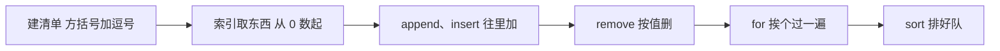

# 第 04 课　列表

前几课里，一个名字只装一个东西：一个数字，或者一段文字。可生活里的东西常常是成堆出现的——购物清单上有五六样要买的，一次考试有全班几十个分数。这节课我们就来认识 Python 里专门"装一堆"的东西：**列表**（list）。

学完这节课，你会亲手写出一个能看、能加、能删的购物清单小程序。先把话说在前头：它还不能"问你话"——让程序和你一来一往地交互，需要第 6 课的判断和循环；能一直问下去的完整菜单系统，留到第 12 课结业项目。一步一步来。

---

## 一、一个变量装不下一张清单

第 1 课说过，变量像一个贴了便签的盒子，一个盒子装一样东西。现在要记 8 个成绩，难道起 8 个名字？`score1` 到 `score8`，找个最高分得把它们挨个比一遍，光想想就累了。

记朋友的电话号码，你也不会一人发一张纸条，而是记在同一本通讯录里。**列表**就是程序里的清单：方括号包起来，中间用逗号隔开。

```python
scores = [88, 92, 75, 63, 90, 81, 59, 77]
shopping = ["牛奶", "面包", "鸡蛋"]
empty = []            # 空清单：先占个位，以后往里加
```

一个列表里全是数字或全是文字最常见，混着装也合法，但新手先别给自己找麻烦。

---

## 二、按编号取东西：索引

清单上的每样东西都有位置。位置的编号叫**索引**（index）。你可以把列表想成一排带编号的储物柜——麻烦在于，Python 数数从 0 开始，0 号柜是第一格：

```python
shopping = ["牛奶", "面包", "鸡蛋", "苹果"]
print(shopping[0])    # 牛奶：编号 0 是第 1 个
print(shopping[3])    # 苹果：编号 3 是第 4 个
print(shopping[-1])   # 还是苹果：负数从末尾往前数，-1 就是最后一个
```

"编号 2"指的是"第 3 个"，头几天会别扭，全世界程序员都这么数，写两天就顺了。

想知道清单上一共有几样，用 `len()`：

```python
print(len(shopping))                  # 4
print(shopping[len(shopping) - 1])    # 最后一个，等价于 shopping[-1]
```

编号不能超过范围。清单上只有 4 样，你偏要 `shopping[10]`，Python 会直接报错：`IndexError: list index out of range`——"你要的那格不存在"。

---

## 三、切片：一次取一段

第 3 课我们用切片取过字符串的一段，列表的写法一模一样：方括号里写"起：止"，**取头不取尾**。

```python
scores = [88, 92, 75, 63, 90, 81, 59, 77]
print(scores[1:4])    # [92, 75, 63]：编号 1、2、3，不含 4
print(scores[:3])     # 前 3 个
print(scores[-3:])    # 最后 3 个
```

切片递给你的是一份新清单，改它不影响原来那张：

```python
front = scores[:3]
front[0] = 0
print(scores[0])      # 88，原清单没动
```

顺带一个冷知识：切片越界不报错，`scores[100:]` 只会给你一份空清单 `[]`——和索引动不动就报错的脾气不一样。

---

## 四、换掉某个位置的东西

```python
shopping = ["牛奶", "面包", "鸡蛋"]
shopping[1] = "全麦面包"
print(shopping)       # ['牛奶', '全麦面包', '鸡蛋']
```

直接给"几号柜"赋值，柜子里就换成新东西了。字符串做不到这一点——你没法把 `"hello"` 里的 `e` 原地换成 `a`，只能造一个新字符串来替换。能原地改，是列表和字符串很不一样的地方。

---

## 五、往清单里加东西：append / insert / extend

把清单想成一条队伍，三种加法各有姿势：

```python
shopping = ["牛奶", "面包"]
shopping.append("鸡蛋")           # 排到队尾：['牛奶', '面包', '鸡蛋']
shopping.insert(0, "纸巾")        # 插队到最前面：['纸巾', '牛奶', '面包', '鸡蛋']
shopping.extend(["酱油", "醋"])   # 另一队全班并入：[..., '酱油', '醋']
```

- `append`：往末尾加一样，最常用
- `insert`：插到指定位置，后面的人整体往后挪，谁也不会被挤掉
- `extend`：把另一张清单里的东西一样一样并进来

顺带认识一个词：像这样跟在列表后面、用点号调用的动作，叫**方法**（method），可以理解成"这类东西自带的操作"。以后你会不断遇到新方法。

有个易错点值得单独说：`append` 一次只加"一样东西"。你要是写 `shopping.append(["酱油", "醋"])`，Python 会把整张清单当成一样东西塞进去，你就得到了清单套清单。想把另一张清单的每一样都并进来，用 `extend`。

---

## 六、从清单里拿掉东西：remove / pop / del

三种删法，各有各的脾气：

```python
shopping = ["牛奶", "面包", "鸡蛋", "面包"]
shopping.remove("面包")   # 按"值"删，只删第一个：['牛奶', '鸡蛋', '面包']
last = shopping.pop()     # 按"位置"删，默认删最后一个，删掉的递给你
del shopping[0]           # 也是按位置删，但拿不回删掉的东西
print(last)               # 面包
```

- 想说"把面包划掉"——用 `remove`，按值找。注意它只删**第一个**匹配的，上面清单里有两个"面包"，删完还剩一个
- 想"从末尾拿走一样，还要看看拿走了什么"——用 `pop`，像发牌时从牌堆顶摸一张，摸走的牌还在你手里（`pop(1)` 也可以指定位置）
- 只想擦掉第几个，不在乎值——用 `del`。它不是方法，是个语句，所以没有括号也没有点

`remove` 一个清单里没有的东西会直接报错（`ValueError`）。现在你只能自己看清楚再删；等第 6 课学了判断，就能先问一句"在不在"再动手。

---

## 七、for：把清单挨个念一遍

到目前为止，想看清单里每一样，只能 `print` 整张清单。想每样单独处理呢——比如一行一样、前面加个横线？该 for 出场了：

```python
shopping = ["牛奶", "面包", "鸡蛋"]
for item in shopping:
    print("- " + item)
```

运行结果：

```
- 牛奶
- 面包
- 鸡蛋
```

读法是："对清单里的每一项，执行下面缩进的那句。" `item` 这个名字随你起，它轮流代表当前这一项——第一轮是"牛奶"，第二轮是"面包"，像老师点名，念到一个名字，这个人站起来答一次"到"，念完为止。这条语句也叫**循环**，因为它把同一件事重复了若干遍，重复正是它的本职。

第一次写 for，容易栽在两个格式细节上：

- for 那一行末尾有个冒号 `:`
- 下面要对"每一项"做的事，统一缩进 4 个空格；缩进一结束，循环也就结束了

> 小提示：一时记不住格式，就记"冒号 + 缩进"这对搭档——Python 全靠它们表示"下面这几行归它管"。

for 是 Python 里最顺手的语法之一，值得今天就养成手感。想拿到"第几个"这种编号？先别急，第 11 课有专门的写法；`range`、`while`、`break` 这些循环的全家福，第 6 课系统讲。

---

## 八、问一句"在不在"：in

```python
shopping = ["牛奶", "面包", "鸡蛋"]
print("牛奶" in shopping)    # True
print("可乐" in shopping)    # False
```

`in` 用来回答"清单上有没有这个"，答话只用两个词：`True`（真）和 `False`（假）——它们是 Python 里的"是/不是"。现在你只能把答案打印出来看看；等第 6 课学了判断，`in` 就能派上大用场，比如"清单上没有才往里加"。另外它是精确匹配：`"牛奶 "`（末尾多个空格）不等于 `"牛奶"`——第 3 课的 `strip` 在这类地方迟早用上。

---

## 九、排序：sort() 和 sorted()

```python
scores = [88, 92, 75, 63]
scores.sort()               # scores 自己变成 [63, 75, 88, 92]
print(scores)

scores2 = [88, 92, 75, 63]
print(sorted(scores2))      # 打印 [63, 75, 88, 92]，scores2 保持原样
```

两个都能排序，区别用一句话说清：`sort()` 是把你手里这叠试卷**当场排好**，还是原来那叠；`sorted()` 是拿去**复印一份**、排好序递给你，你手里那叠一点没动。

- 想保留原始顺序——用 `sorted`
- 确定以后只用排好的——用 `sort`
- 想从高到低排——都加 `reverse=True`

最大的坑在这里：`scores.sort()` 这个动作本身不返回任何东西。你要是画蛇添足写 `scores = scores.sort()`，`scores` 就变成了一个叫 `None` 的"空值"，清单凭空消失。记住分工就不会踩：`sort` 负责"自己变"，`sorted` 负责"给你新的"。

---

## 十、清单里还能装清单

清单的每一格装的不一定是数字或文字，装另一个清单也行：

```python
menu = [["豆浆", "油条"], ["牛肉面", "茶叶蛋"]]
print(menu[0])       # ['豆浆', '油条']
print(menu[0][1])    # 油条：先取第 0 行，再取这一行的第 1 个
```

这叫**嵌套列表**。两层以后取东西要连写两个方括号，容易绕晕，这节课你只需要看懂"套了一层"长什么样。回想第五节那个坑：`append` 一张清单会得到清单套清单——现在你知道了，那不是坏了，是嵌套。

---

## 十一、元组：写死的清单

有些清单天生不该被改：一星期就是七天，一个点的坐标就是横、纵两个数。Python 为这种"写死"的数据准备了**元组**（tuple）——把方括号换成圆括号，索引、切片、`in`、`len` 全都照旧，唯独不能增删改：

```python
week = ("一", "二", "三", "四", "五", "六", "日")
point = (3, 5)
print(week[0])       # 一
print(point[-1])     # 5
week[0] = "八"       # 报错！元组不许改
```

什么时候用哪个？会变的用列表，不该变的用元组。用了元组，Python 替你把关：手滑想改的时候当场报错，总比悄悄改错了、之后才发现强。比如购物清单会越改越长，用列表；一年十二个月的名字永远不会多一个月，就该用元组。

单元素的元组还有个委屈的坑：

```python
t = (5)      # 这不是元组，就是加了括号的数字 5
t = (5,)     # 这才是只有一个元素的元组，那个逗号不能省
```

第 7 课讲函数时你会再碰到它——一个函数想一次交还两个结果，打包用的就是元组。

---

## 十二、课上小程序：购物清单

把今天学的串起来。新建 `shopping_cart.py`，敲进去：

```python
# shopping_cart.py —— 购物清单
# 只用到列表和 for。为什么没有"你输入要加什么"的交互菜单？
# 因为那需要第 6 课的循环和判断——完整的菜单系统是第 12 课结业项目。

shopping = ["牛奶", "面包", "鸡蛋", "苹果"]

print("=== 出门前的购物清单 ===")
for item in shopping:
    print("- " + item)

# 到楼下想起酱油也见底了，添到清单末尾
shopping.append("酱油")

# 开始控糖，面包不买了
# remove 按"值"删，只删第一个匹配的；删列表里没有的值会报错
shopping.remove("面包")

print()
print("=== 更新后的购物清单 ===")
for item in shopping:
    print("- " + item)

print()
print("一共要买", len(shopping), "样东西")
```

在终端里 `python shopping_cart.py` 跑一遍（Mac 用 `python3`），你会看到更新前后的两张清单。几处值得多看一眼的地方：

- `print()` 括号里什么都没有，作用是空一行，让输出好看些
- `print("一共要买", len(shopping), "样东西")` 里用逗号隔开三样东西，`print` 会自动在中间加空格
- 那段打印清单的 for 写了两遍，一模一样。你大概已经觉得"这不重复了吗"——这个直觉非常好，第 7 课学函数，就是把这个念头变成真本事
- `remove` 之前清单里确实有"面包"，所以删得安心；它的脾气（删没有的会报错）第六节讲过

---

## 十三、新手最常踩的坑

**for 那行忘了冒号，或下面的行忘了缩进**

报 `SyntaxError` 或 `IndentationError`。新手前三天最常见的两个错，检查冒号和缩进。

**`remove("可乐")` 但清单里没有可乐**

报 `ValueError`。删之前看清楚清单里有什么；第 6 课学了判断后可以先用 `in` 问一句。

**`shopping[10]` 报 IndexError**

编号越界了。先 `len()` 数数有几样，或者拿最后一个直接用 `shopping[-1]`。

**`scores = scores.sort()` 之后打印出来是 None**

`sort()` 自己变但不返回东西，别接它的"返回值"。要新清单用 `sorted(scores)`。

**`(5)` 被当成了普通数字**

单元素元组要写 `(5,)`，逗号才是元组的标志，括号只是配角。

---



一张清单从出生到干活的全部动作，画出来就是这条线。

---

## 想一想

清单玩熟之前，先把这几个问题在脑子里过一遍：

**1.** 全世界的程序员都从 0 开始数编号，头几天确实别扭。想想它的顺手之处：倒数第一个是 -1，"最后一个"的编号正好是"个数减一"——这样算是不是反而更规整？

**2.** `front = scores[:3]` 切出来的是一份新清单，随便改它都不影响原清单。这更像"复印件"还是"同一张纸换了名字"？说说你的理由。

**3.**（动手试试）建一个三样东西的清单：先 `append("西瓜")` 看看它站到哪个位置；换成 `insert(0, "西瓜")` 再试一次，两次它分别站在哪？

**4.** 清单里有两个"面包"，`remove("面包")` 会删掉几个、删的是哪一个？如果两个都想删掉，说说你的思路（不用真写代码）。

---

## 小结

这节课你有了第一件"装一堆"的家伙什。合格标准三条：会用 `[编号]` 和切片取东西，会 `append` / `remove` 增删，会用 for 把清单挨个念一遍。`sort` 和 `sorted` 的分工、元组的"不能改"，记住口诀就行，用两回自然熟。

下一课我们认识另外两个装东西的容器：**字典**和集合。字典按"名字"取东西，不用背编号——你列表练熟的这套索引功夫，正好用来对比着理解它。

---

## 课后练习

先自己动手，卡住了再打开 `exercises` 文件夹看参考答案。

**练习 1（必做）：成绩统计**

分数列表 `[88, 92, 75, 63, 90, 81, 59, 77]`（换成你自己的成绩更好）。求一共几个成绩、最高分、最低分和平均分，分别打印出来。提示：`max`、`min`、`sum`、`len` 都是现成的，平均分就是总和除以个数。

**练习 2（必做）：名单增删**

初始名单 `["小明", "小红", "小刚", "小丽"]`。把"小华"插到"小红"前面，再把"小刚"移出去，然后一行一个打印最终名单，并打印现在有几个人。提示：`insert` 的编号想清楚是几——编号 1 才是"第 2 个位置"。

**练习 3（必做）：排序取前三**

一组乱序分数 `[72, 95, 88, 60, 83, 91, 78]`，从高到低取前三名打印。提示：`sorted` 加 `reverse=True`，再用切片取前三个。

**练习 4（选做）：合并购物清单**

你和朋友各有一张清单，比如 `["牛奶", "面包", "鸡蛋"]` 和 `["酱油", "牛奶", "醋"]`。用 `+` 把两张合成一张，排序后打印。出现两份"牛奶"也不用管——怎么只留一份，下一课的集合专治这个。

---

参考答案在同目录的 `exercises` 文件夹里。

2026 年 10 月
