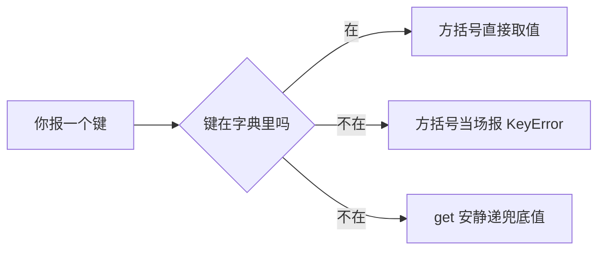

# 第 05 课　字典与集合

上节课的购物清单，是一排按顺序站好的队伍：想拿哪样，报第几个就行。这节课要解决的是另一类更常见的问题——**按名字找东西**。

想想你手机里的通讯录：找张伟的电话，你从来不会去数"他是第几个联系人"，你直接搜名字。Python 里干这件事的工具，叫**字典**（dict）。它大概是你会用到的所有容器里，用得最多的一个。

---

## 一、从通讯录说起：列表靠位置，字典靠名字

列表像一个电影院的排座：每个座位都有编号，你凭"第几排第几号"找人。字典更像酒店前台：你报个名字，前台直接把对应的房卡递给你——名字就是**键**（key），房卡就是**值**（value）。这一对键和值合起来，叫一个键值对。

写成代码长这样：

```python
contacts = {"张伟": "13800001111", "王芳": "13900002222"}
print(contacts["张伟"])
```

花括号 `{}` 里，冒号左边是键，右边是值，几对之间用逗号隔开。取值用的是**方括号**，注意和列表的区别：列表里 `weeks[0]` 方括号里放的是位置数字，字典里放的是键。

### 新手第一大坑：键不存在，直接取会炸

如果你取一个根本不存在的键，程序会当场停下，报一个 `KeyError`：

```python
print(contacts["赵强"])     # KeyError: '赵强'
```

这个坑几乎每个人都会踩——因为名字是你打进去的，多打一个字母、多个空格，Python 就当不认识。所以查通讯录这种"不确定有没有"的场景，都用 `get()`：

```python
print(contacts.get("赵强"))             # None
print(contacts.get("赵强", "没存"))      # 没存
```

`get()` 查得到就返回值；查不到也不吵不闹，把括号里第二个东西（兜底值）递给你。什么都不给就返回 `None`——Python 里专门表示"这儿什么都没有"的词。

一句话记住：**确定有就用方括号，不确定有没有就用 `get()`**。

---

## 二、增、改、删：字典是活的

通讯录不是死的，人要加、号码要改、人也会走。字典这三种操作写起来几乎一样，都是 `字典[键] = 值`：

```python
contacts["陈晨"] = "13600004444"   # 键原来不在 → 新增
contacts["王芳"] = "13811112222"   # 键已经有了 → 改成新号码
```

删除用 `del`，后面跟"字典[键]"：

```python
del contacts["李娜"]
```

数一数存了几个键值对，还是老朋友 `len()`，和数列表长度一个用法：

```python
print(len(contacts))   # 现在是几对
```

还有一个高频动作：**判断某个人在不在**。用上节课见过的 `in`：

```python
"张伟" in contacts          # True
"13800001111" in contacts   # False ！
```

第二个结果很多人没想到——`in` 在字典里**只认键，不认值**。电话号码明明在字典里，它就是返回 `False`，因为它检查的是"名字列表里有没有它"。这正好和字典的本性一致：你是靠名字找东西的，不是靠东西找名字。

> 小提示：键必须是"不会变"的东西——字符串、数字都可以，列表不行（放进去会报 TypeError）。记住"名字是写死的"就够了。

顺带说个好消息：从 Python 3.7 起，字典会记住你放东西进去的先后顺序，遍历时就按这个顺序出来。所以你会看到通讯录打印出来和录入顺序一模一样。

---

## 三、把整本通讯录过一遍：for 与 items()

第 4 课你已经用 `for` 逛过列表了。逛字典有三种逛法，看你需要什么：

```python
for name in contacts:                  # 直接逛，拿到的是键
    print(name)

for phone in contacts.values():        # 只要值
    print(phone)

for name, phone in contacts.items():   # 键和值都要
    print(f"{name} 的电话是 {phone}")
```

`items()` 是最常用的：它把每一对键值打包递出来，`for` 一行接住两个变量，一个是键、一个是值。这个"两个变量接两个东西"的写法以后到处都是，现在混个脸熟。

---

## 四、往卡片里再装东西：嵌套

真实通讯录里，一个人不止有电话，还有城市、邮箱。这时可以让字典的值**还是一个字典**——外面一层是"名字 → 卡片"，卡片自己又是一层"项目 → 内容"：

```python
student = {
    "姓名": "小明",
    "分数": [92, 85, 78],                              # 值可以是列表
    "联系方式": {"电话": "13800001111", "城市": "北京"},  # 也可以还是字典
}

print(student["分数"][0])             # 92：先进外层，再按位置取
print(student["联系方式"]["城市"])     # 北京：先进外层，再进里层
```

嵌套不难，就是一层一层往里走：方括号连着写，先说你要哪张卡片，再说卡片里的哪一项。课上的程序用的就是这个结构。

---

## 五、课上的程序：contacts.py

把这几招串起来，做一个能查、能加、能删的迷你通讯录。新建 `contacts.py`，敲进去：

```python
# contacts.py —— 我的小通讯录
# 外层字典：名字 → 一张"卡片"；卡片本身又是个字典，装着电话和城市

contacts = {
    "张伟": {"电话": "13800001111", "城市": "北京"},
    "王芳": {"电话": "13900002222", "城市": "上海"},
    "李娜": {"电话": "13700003333", "城市": "广州"},
}

print("=== 查电话 ===")
# 用 [] 取不存在的键会当场 KeyError；get() 查不到只会把兜底值递给你
info = contacts.get("王芳", {"电话": "没存", "城市": "没存"})
print("王芳:", info["电话"], "/", info["城市"])

info = contacts.get("赵强", {"电话": "没存", "城市": "没存"})
print("赵强:", info["电话"], "/", info["城市"])   # 根本没这个人，程序也不炸

print()
print("=== 加一个人 ===")
# 键不在就是新增；哪天写重了名字，就成了改他那张卡片
contacts["陈晨"] = {"电话": "13600004444", "城市": "深圳"}
print("现在通讯录里有", len(contacts), "个人")

print()
print("=== 删一个人 ===")
# del 按键删除；删不存在的键会 KeyError，删之前可以用 in 先确认
del contacts["李娜"]
print("李娜已被删除，剩下", len(contacts), "个人")

print()
print("=== 完整通讯录 ===")
for name, info in contacts.items():
    print(f"{name}　{info['电话']}　{info['城市']}")

# 它现在还是"一次性"的：想增删得改代码重跑。
# 第 12 课结业项目里，你会把它升级成真正能交互操作的管理系统。
```

跑起来，输出是这样：

```text
=== 查电话 ===
王芳: 13900002222 / 上海
赵强: 没存 / 没存

=== 加一个人 ===
现在通讯录里有 4 个人

=== 删一个人 ===
李娜已被删除，剩下 3 个人

=== 完整通讯录 ===
张伟　13800001111　北京
王芳　13900002222　上海
陈晨　13600004444　深圳
```

查赵强那里是本课的灵魂：查一个不存在的人，程序照样安安稳稳跑完——这就是 `get()` 兜底的功劳。整个程序没有一句 `while`，因为"问用户要指令、反复执行"要等第 6 课的循环；到时候回头看这个文件，你会知道怎么把它变成真的能操作的通讯录。

---

## 六、集合：只问"有没有"的花名册

再认识一个新工具。想想这种需求：你网购了 `["苹果", "香蕉", "苹果", "橘子", "苹果"]` 四单，想知道**到底买过哪几样**。列表会老老实实把苹果报三遍，而我们想要的是"就这三种"。

**集合**（set）就是干这个的：它像一张花名册，只登记"出现过哪些名字"，写几遍都算一遍，而且不记顺序：

```python
bought = ["苹果", "香蕉", "苹果", "橘子", "苹果"]
unique = set(bought)
print(unique)    # {'橘子', '香蕉', '苹果'}——顺序在你屏幕上可能不同，正常
```

往列表里塞 `set()` 这一下，重复就全没了，这是集合最出名的本事。有个好玩的细节：数字 `5` 和 `5.0` 在集合眼里是同一个东西（值相等就算重复）——

```python
prices = [5.0, 5, 2.5, 8.0, 2.5]
print(set(prices))   # {8.0, 2.5, 5.0}，5 个进去 3 个出来
```

加新东西用 `add()`（注意不是列表的 `append`），判断在不在还是 `in`，集合在这方面天生拿手：

```python
marks = {"苹果", "香蕉"}
marks.add("西瓜")
print("西瓜" in marks)   # True
```

集合最亮眼的时刻是**两组人求关系**，符号全是数学课见过的：

```python
a = {"小明", "小红", "小刚"}    # 你的好友
b = {"小红", "小刚", "小美"}    # 她的好友

print(a & b)   # 交集：两人都有的 {'小刚', '小红'}
print(a | b)   # 并集：合并去重 {'小明', '小美', '小红', '小刚'}
print(a - b)   # 差集：只在 a 里的 {'小明'}
```

`&` 读作"并且"——两个人**都**加过的好友；`|` 读作"或者"——只要有一个人加过就算；`-` 是"我有的你没有"。找共同好友、找重复文件名、找两份名单的差异，都是这三个符号的活儿。

---

## 七、什么时候用哪个

三个容器都认识了，选的时候问自己一个问题：**我靠什么找东西？**

- 靠顺序、位置找（"第 3 个"），东西可能重复——用**列表**
- 靠名字、编号找（"张伟的电话"），一查一个准——用**字典**
- 不关心顺序，只关心"有没有"和"重不重复"——用**集合**

---



查字典之前先问一句"在不在"，这条岔路就是本课第一大坑和第一大解法的分界线。

---

## 想一想

三个容器各有各的脾气，问问自己下面这几件事：

**1.** `in` 在字典里只认键、不认值。想想"你靠名字找东西，不是靠东西找名字"——这个设计为什么反而符合字典的本性？

**2.** `contacts["赵强"]` 当场报错停下，`contacts.get("赵强", "没存")` 安静递兜底值。你觉得什么情况下反而该让它"当场停下"、大声报错？

**3.**（动手试试）把 `[5, 5.0, 3]` 交给 `set()`，数数出来几个元素？5 和 5.0 为什么算同一个？再换 `["苹果", "Apple"]` 试试，它俩合并吗？

**4.** 通讯录、购物清单、网购记录里"买过的种类"——这三样分别用字典、列表、集合哪个最合适？每样给一句理由。

---

## 小结

这节课你收获了两样东西。字典让程序学会了"按名字办事"：创建、`get()` 兜底、增改删、`items()` 遍历、一层层往里走的嵌套，这一套就是以后所有数据管理的地基。集合则教会程序"只看有没有"：去重一下、`add` 一个、`&` 一下找共同。

判断和循环在向你招手了——下节课过后，你的程序就不再是一条道走到黑，而是能看情况办事、能反复干活了。课上那句"想改成真通讯录"的伏笔，也马上能兑现。

---

## 课后练习

先自己动手，卡住了再打开 `exercises` 文件夹看参考答案。

**练习 1（必做）：成绩册**

建一个字典当成绩册，存两三个"名字 → 分数"。然后：加一个新同学的成绩；把其中一个人的分数改成新的；用 `get()` 查一个没录入的同学（给个"还没录入"的兜底）；最后用 `items()` 把整本成绩册一行一行打印出来。

**练习 2（必做）：词频初统计**

给定一个单词列表，比如 `["apple", "banana", "apple", "cat", "apple", "banana"]`，用字典统计每个单词出现了几次。思路：遍历列表，每个单词查一下字典——出现过就把旧次数加 1，没出现过就记 1。提示：`counts.get(word, 0) + 1` 一个表达式就能写完这两件事。数完遍历打印。这是你第一个"统计类"程序，值得多琢磨两分钟。

**练习 3（必做）：共同好友**

建两个集合，分别是你的好友和另一位同学的好友（四五个名字，故意留一两个重复的）。用 `&` 打印共同好友，用 `|` 打印合在一起的全部好友。想想看：如果想知道"我有但他没有的好友"，该用哪个符号？

**练习 4（选做）：反转电话簿**

把课上的通讯录反过来：以电话号码为键、名字为值，造一个新字典。遍历原通讯录，把每对键值"调个个儿"塞进去。做完试试用 `get("13800001111", "陌生人")` 查一下——通过号码反查名字，是不是有点来电显示的意思了？

---

参考答案在同目录的 `exercises` 文件夹里（选做的不提供，先自己试）。

2026 年 10 月
