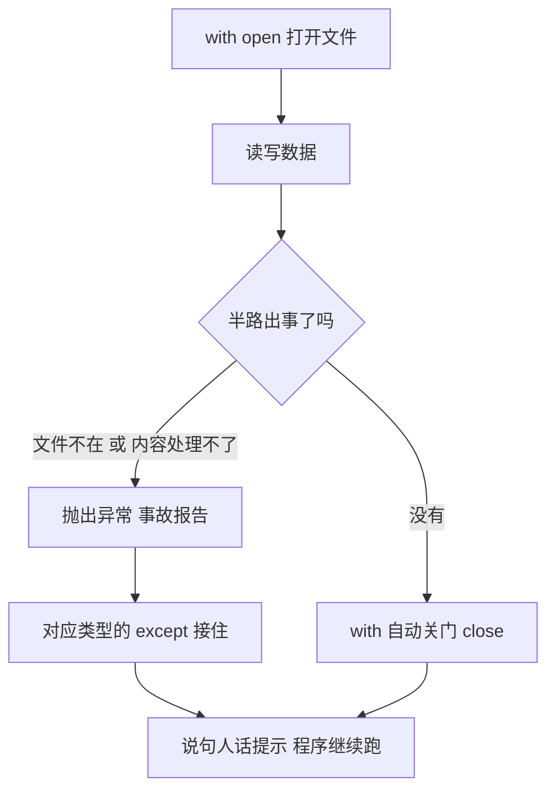

# 第 08 课　文件与异常

前七课，你攒下的所有数据——变量、购物清单、通讯录——其实都住在一个叫**内存**的临时仓库里。程序一关，仓库清空，什么都留不下。

这一课我们解决两件事：把要紧的数据搬进**文件**，关机也丢不了；再学会在程序出错时把它稳稳接住，而不是看着它当场崩掉。最后把两样本事合在一起，做一个真正的记账本：记的账，关掉程序再打开，还在。

---

## 一、内存是个白板，文件才是笔记本

先想明白数据是怎么丢的。

你写 `name = "小明"` 的时候，这行字被放进了内存。内存是电脑临时干活的地方，读写飞快，但有个硬脾气：**里面的东西不属于你，程序一结束就全收回**。它像教室里的白板，写得再满，下课值日生一擦，干净如初。

文件不一样。文件存在硬盘上，像写进笔记本：合上本子字还在，明天翻开接着写。你前面敲的每个 `.py` 文件都是文件——不然哪能今天打开还有昨天写的代码。

所以规矩很简单：**程序跑完还想留着的，就写进文件**。Python 读写文件，只需要记住一个函数：`open`。

---

## 二、open 与三种模式：r、w、a

`open` 负责打开文件，用完要 `close` 归还：

```python
f = open("账本.txt", "a", encoding="utf-8")   # 打开
f.write("买午饭,-25\n")                        # 写一行
f.close()                                      # 用完关上
```

括号里第二个参数是**模式**，决定你是来读的还是来写的：

| 模式 | 全称 | 干什么 | 文件不存在时 |
|------|------|--------|--------------|
| `"r"` | read | 只读，不能写 | 直接报错 |
| `"w"` | write | 写入，**先清空再写** | 自动新建一个 |
| `"a"` | append | 在末尾追加，原有内容不动 | 自动新建一个 |

三个里头最要防的是 `"w"`：它会把原有内容**全部清空**。你用 w 模式打开了一个攒了一年的账本，文件瞬间变成白纸——没有确认框，没有回收站。要往老文件后面添内容，用 `"a"`；只有"推倒重来"才用 `"w"`。

还有个细节：`write` **不会自动换行**。你连写三笔账，它们会挤在同一行。想分行，行尾自己补一个 `\n`（就是"换行"的记号）：

```python
f.write("买午饭,-25\n")
f.write("发工资,8000\n")
```

---

## 三、with：让 Python 替你关门

上面"打开—干活—关闭"的写法能用，但藏着一个坑：**如果 close 之前程序出了错，close 就永远执行不到**。文件被你占着不放，数据可能还没真正写进硬盘——就像住进宿舍不退房卡，房东干着急。

Python 给了个体面的解法，`with`：

```python
with open("账本.txt", "a", encoding="utf-8") as f:
    f.write("买午饭,-25\n")
    f.write("发工资,8000\n")
```

`with` 像一扇弹簧门：你进去，办你的事；不管你是正常走出来还是摔出来的，门都会自动关上，`close` 替你执行得干干净净。以后写文件，一律用 `with`，前面那种 open 加 close 的老写法，见过认得就行。

> 小提示：`as f` 是给打开的文件起个名字，叫 `f` 只是习惯，叫 `book`、`fp` 都行。

---

## 四、把写出去的数据读回来

读文件同样用 `open`，模式换成 `"r"`。读法有三种，按场景挑：

```python
# 读法一：一口气全读进来，得到一个大字符串
with open("账本.txt", "r", encoding="utf-8") as f:
    content = f.read()

# 读法二：按行读成列表，一行占一个元素
with open("账本.txt", "r", encoding="utf-8") as f:
    lines = f.readlines()

# 读法三：一行一行地过，读一行处理一行（文件大也不怕）
with open("账本.txt", "r", encoding="utf-8") as f:
    for line in f:
        print(line.strip())
```

第三种最常用。`for line in f` 会自动一行一行递给你，你只管处理。

注意 `strip()`：每行末尾都挂着看不见的换行符 `\n`，直接 print 会多出空行、做比较也容易失手，`strip()` 把两头这些看不见的空白脱掉。

这里有个特别阴的坑，提前替你踩了：**同一个文件，先 `read()` 再 `readlines()`，后者拿到的是空列表**。因为第一种读法已经把书翻到了最后一页，接着读自然什么都没有。所以一次打开只选一种读法；想换个读法重来，就再 `with open` 一次——重新开书，从头再读。

---

## 五、encoding：中文不乱码的保命参数

你可能注意到了，前面每次 `open` 我都带着 `encoding="utf-8"`，一次都没省。

文件在硬盘上存的其实是一串数字，"怎么把数字翻译回文字"的规则就叫**编码**。全世界通用的规则是 UTF-8，中文英文都能装；但 Windows 好多年里默认用另一套本地规则（简体中文版叫 GBK）。两套规则对不上，中文就成了一屏乱码，或者干脆报错。

好消息是，2026 年 10 月发布的 Python 3.15 已经把 UTF-8 定成了默认编码。坏消息是，你同学的电脑、机房的电脑，很可能还跑着旧版本——它们在中文 Windows 上默认还是老规则。

所以这半行参数，请你养成肌肉记忆：**碰中文，写 `encoding="utf-8"`**。多打二十个字符，换"在谁电脑上都不乱码"，这买卖划算。

---

## 六、异常：程序摔倒了，接住它

先看一次当众摔倒。在对话模式里输入：

```python
>>> int("三块五")
ValueError: invalid literal for int() with base 10: '三块五'
```

`int()` 只认 `"35"` 这种数字长相的文字，`"三块五"` 它翻不了，当场抛出**异常**——你可以理解成程序里的事故报告——整个程序立刻停摆，后面的代码一行都不跑。

真实程序不能这么脆弱。用户就是会往"请输入数字"的框里打"八块"，文件就是会不在。Python 的办法是 `try / except`：把可能出事的部分圈起来，出了事就接住，别摔到观众席上：

```python
try:
    number = int("三块五")        # 明知山有虎
    print("转换成功：", number)
except ValueError:                # 虎来了，接住
    print("这串文字变不成数字，换个写法。")
print("程序还活着，继续往下跑。")   # 这句能正常执行
```

`try` 里放"可能会出错、但出错也不至于天塌"的代码；`except` 后面写清楚接哪种异常。常见的几位，建议混个脸熟：

| 异常 | 什么时候发生 | 人话翻译 |
|------|--------------|----------|
| `FileNotFoundError` | 打开一个不存在的文件（r 模式） | "这文件我没有" |
| `ValueError` | 值的内容不对，比如 `int("三块五")` | "这内容我处理不了" |
| `ZeroDivisionError` | 除数为 0 | "除数是 0，神仙也算不出" |

一种 `except` 只接一种异常，想多接几种就多写几行，Python 从上往下找，命中哪家进哪家：

```python
try:
    a = int(input("被除数："))
    b = int(input("除数："))
    print("结果是", a / b)
except ValueError:
    print("得填数字。")
except ZeroDivisionError:
    print("除数不能是 0。")
```

还有两个低调的搭档，认识即可：

- `else`：写在所有 except 之后，**没出错时才执行**——比如"转换成功，欢迎回来"
- `finally`：**不管出没出错都执行**——适合放"谢谢使用"这类收尾交代

```python
try:
    a = int(input("一个数："))
except ValueError:
    print("这不是数。")
else:
    print("很好，你输的是", a)
finally:
    print("下次再见。")
```

### 特别警告：别写光秃秃的 except

`except` 后面什么都不写，它会**一口吞掉所有错误**：

```python
try:
    total = totla + 1      # 手滑，total 打成了 totla
except:
    print("出错了")
```

程序只说一句"出错了"。可真正的错是变量名拼错（NameError），是 bug，不是意外——被光秃秃的 except 盖住之后，你永远查不到真相。这就像把家里的报警器全拆了，只留一盏"有事发生了"的小红灯：小偷进屋它亮，你自己忘带钥匙它也亮，等于没有情报。

规矩记两条：**接就接具体类型**；没预料到的错，让它大声报出来，那是在给你报信。

---

## 七、合起来：记账本 ledger.py

两样本事凑齐了，写个正经的。目标：程序每次运行，往 `records.txt` 里追加三笔收支（每行一笔，格式是"说明,金额"）；然后把全部账目读回来，算出结余。

先看记账那一段：

```python
def add_records():
    # a 模式追加：文件不存在会自动创建，存在就在末尾接着写
    with open("records.txt", "a", encoding="utf-8") as f:
        f.write("买午饭,-25\n")      # write 不自动换行，行尾要自己补 \n
        f.write("发工资,8000\n")
        f.write("买书,-68\n")
```

再看对账那一段：

```python
def show_balance():
    # 第一次运行时 records.txt 可能还没建出来，所以读取要放进 try 里
    try:
        with open("records.txt", "r", encoding="utf-8") as f:
            records = f.readlines()          # 按行读成列表，一行一笔账
        total = 0
        rows = []
        for record in records:               # 逐条对账
            record = record.strip()          # 脱掉行尾看不见的换行符
            if record == "":
                continue                     # 空行不算账
            note, amount = record.split(",")     # 按逗号拆成说明和金额
            total = total + int(amount)      # 文字金额变数字才能加
            rows.append(note + " " + amount + " 元")
        for row in rows:
            print(row)
        print("—— 以上是全部账目 ——")
        print("当前结余：", total, "元")
    except FileNotFoundError:
        print("账本还不存在，先记一笔吧。")


add_records()    # 第一段：先记账
show_balance()   # 第二段：再对账
```

几个值得停一停的地方：

- `split(",")` 按"说明,金额"里的逗号把一行拆成两半，正好接进两个变量
- 金额读出来是文字，`int()` 转成数字才能做加法——上一节刚摔过的跤
- `try` 那层保险：这个脚本先记账后对账，文件多半已经在。但假如你以后把 `show_balance` 单独拎出来做"只看账"的功能，第一次运行时 `records.txt` 还不存在，`FileNotFoundError` 就会被稳稳接住，提示一句话，而不是糊你一脸红字

在终端里连跑两次 `python ledger.py`：第一次记进 3 笔，结余 7907；第二次再追加 3 笔，变成 6 笔、结余 15814。程序关掉再开，账一直都在——这就是文件的意义。

---

## 八、新手最常踩的坑

**`FileNotFoundError`：明明写了文件，却说找不到**

八成是"位置"不对。`open("records.txt")` 找的是**终端当前站的文件夹**，不是代码文件待的地方。用 `cd` 走到数据文件所在的文件夹再运行；最省心的做法是让 `.py` 和数据文件住同一个文件夹。

**中文打开全是乱码，或者报 UnicodeDecodeError**

`encoding="utf-8"` 漏了。读和写都要带，两边规则一致才对得上。

**文件内容莫名消失了**

用了 `"w"` 模式。它是"清空重来"，追加请用 `"a"`。动重要文件前，先想一秒该用哪个模式。

**`PermissionError`：没权限**

文件正被别的程序占着，比如开着 Excel 或记事本。关掉它们再跑。

**汇总时 `int()` 报 ValueError**

行尾的 `\n` 或空格没 `strip()` 干净，`"8000\n"` 变不成数字。先 strip 再转换。

---



---

## 想一想

1. 用 `"w"` 模式打开一个记了一年的账本，下一秒会发生什么？既然这么危险，它存在的意义是什么——什么场景非它不可？
2. `with` 像一扇弹簧门：正常走出来还是摔出来，门都会自动关上。如果不用 with，open 之后程序恰好报错，会连锁出什么麻烦？
3. `int("八块五")` 和打开一个不存在的文件，各会抛出哪种异常？写 except 时为什么要把类型写具体，而不是光秃秃一个 except？
4. `f.write("买午饭,-25")` 和 `f.write("买午饭,-25\n")` 各是什么效果？为什么 write 从不替你自动换行，这个设计把换行的决定权留给了谁？
5. 轻动手：故意运行 `open("根本不存在的文件.txt", "r")`，看它报什么错；然后套上 try / except 把它接住，让程序只说一句"文件还没有，先建一个吧"。

---

## 小结

这节课真正要带走的是三句话：

1. 要留着的数据写进文件，读写一律 `with open(...)`
2. 碰中文，`encoding="utf-8"` 一次都不能省
3. 会出错的地方套 `try`，`except` 只接具体类型——光秃秃的 except 是吞 bug 的黑洞

下节课我们认识"模块"：把现成的工具搬进自己的代码，还有第一次用 pip 从网上给 Python 装新装备。

---

## 课后练习

先自己动手，卡住了再打开 `exercises` 文件夹看参考答案。

**练习 1（必做）：今天的日记**

写一个程序，连问三句：今天最开心的一件事、今天学到的一个东西、明天想做的事。用 `with` 和追加模式把三个回答写进 `diary.txt`，一行一条。写完多跑几次，看看日记是不是越记越厚。

**练习 2（必做）：摔不坏的除法器**

让用户输入被除数和除数，打印相除结果。用 `try / except` 接住两种事故：输入的不是数字（ValueError）、除数是 0（ZeroDivisionError），分别给人话提示，程序绝不崩。

**练习 3（必做）：念名单**

文件夹里放一个 `names.txt`，一行写一个名字。程序逐行读出来，脱掉换行符，打印"你好，XX"。文件不在时，礼貌提示怎么建这个文件，不许崩。

**练习 4（选做）：行数与字数**

打开任意一个 txt 文件，统计它有几行、一共多少个字。提示：`readlines()` 拿到的列表多长就有几行；把每行 `strip()` 后拼起来，用 `len()` 数字数。

---

参考答案在同目录的 `exercises` 文件夹里。练习 4 是选做，答案留给你自己发挥，思路提示都写在题里了。

2026 年 10 月
