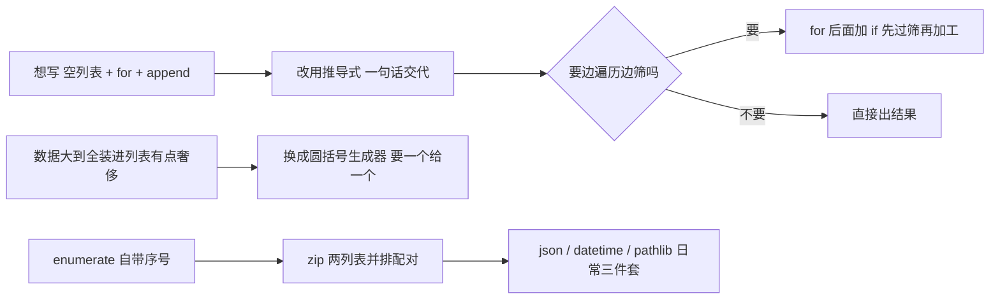

# 第 11 课　地道 Python

走到这一课，你的 Python 已经能干不少事了：变量、循环、函数、类、文件，零件都齐了。但同样一件事，老手写的代码常常比新手短一截、还更清楚——差别不在多学了什么新功能，而在**说话的方式**。

这节课我们学 Python 圈子里最地道的几种写法：推导式、生成器，再把三个特别好用的标准库（json、datetime、pathlib）请进来。学完你会发现，以前要写四五行的活儿，现在一两行就交代清楚了。

---

## 一、列表推导式：把循环压成一句话

先看一个你已经很熟的场景：把一组数字都乘 2，装进新列表。第 6 课的写法是这样的：

```python
nums = [3, 8, 5, 12, 7]
result = []
for x in nums:
    result.append(x * 2)
print(result)   # [6, 16, 10, 24, 14]
```

四行，而且 `result` 这个空列表出现得有点多余——Python 明明知道你要造一个列表，还得你先声明"我要个空盒子"。

**列表推导式**（list comprehension）就是干这事的专门写法，把上面四行压成一行：

```python
nums = [3, 8, 5, 12, 7]
result = [x * 2 for x in nums]
print(result)   # [6, 16, 10, 24, 14]
```

怎么读这行代码？从中间往两边读：`for x in nums` 是"挨个取出每个数"，`x * 2` 是"对取出来的数做这件事"。整句连起来像点菜："这桌每个菜都来一份，但都别放香菜"——一句话交代完，不用一道一道地喊。

以后凡是"从一个列表变出另一个列表"的活儿，都值得试试推导式。判断标准很简单：**你想写 `空列表 + for + append` 时，就该用推导式了。**

### 带筛选的推导式：只要一部分

点菜时还能加条件。在推导式末尾加个 `if`，就只留下符合条件的：

```python
nums = [3, -8, 5, -12, 7, 0]
positives = [x for x in nums if x > 0]
print(positives)   # [3, 5, 7]
```

读法："取出每个数，只留下大于 0 的，对留下的做处理"。注意顺序：`if` 写在 `for` 后面，相当于先过筛子再加工。

### 字典推导式和集合推导式

把方括号换成花括号，同一个思路对字典和集合也成立。这俩点一下就行，遇到了能认出来：

```python
nums = [3, 8, 5]
squares = {x: x * x for x in nums}      # 字典推导式：{3: 9, 8: 64, 5: 25}
lengths = {len(w) for w in ["苹果", "香蕉"]}   # 集合推导式：{2}
```

集合推导式看着像字典推导式（都是花括号），区别是没有冒号——它只要值，不要键值对。

一个提醒：推导式好用，但别炫技。套两三层、一行长到看不懂的推导式，不如老老实实写循环。**地道的标准是"别人一眼能读懂"，不是"行数最少"。**

---

## 二、生成器：要一个给一个，不一次造齐

推导式虽然简洁，但它有个脾气：一次性把所有结果都算出来，装满一个列表。数据少时无所谓，要是数据有一千万个呢？

生活里其实早有答案。你去饺子馆，说"来二十个饺子"，没有人会先把二十个全包好摆成一排等你——而是包一个煮一个给你一个。**生成器**（generator）就是这种"包一个给一个"的写法。

把推导式的方括号换成圆括号，就得到**生成器表达式**：

```python
total = sum(x * x for x in range(1_000_000))
print(total)
```

这行代码对一百万个数求平方和，但**从头到尾没有造出一个一百万长度的列表**——`sum` 每次要一个数，生成器就算一个数给它，算完就忘，内存里永远只有一个数的位置。

用函数写法也一样，关键字从 `return` 换成 `yield`：

```python
def even_numbers(limit):
    n = 0
    while n < limit:
        yield n          # 不是return：交出一个数，然后暂停，等着下回来要
        n += 2

for n in even_numbers(10):
    print(n)   # 0 2 4 6 8
```

`yield` 和 `return` 的区别值得多看一眼：`return` 是"干完了，交结果，下班"；`yield` 是"先交一个，歇会儿，你们要下一个我再接着干"。函数跑到 `yield` 就暂停，下次被要数时从暂停的地方继续。

什么时候用生成器？一个直觉判断：**数据量大到"先全装进列表有点奢侈"的时候**。比如读一个大文件的每一行、处理一长串日志，边读边处理就比先读完全部再处理聪明得多。数据少的时候，直接用列表也没毛病，不用刻意。

---

## 三、enumerate 和 zip：两个遍历神器

### enumerate：遍历时顺便拿到序号

第 4 课做购物清单的时候，你可能有过一个遗憾：想把清单带着编号打印出来，1. 牛奶，2. 面包……当时只能绕圈子。现在补上这个遗憾：

```python
goods = ["牛奶", "面包", "鸡蛋"]
for i, item in enumerate(goods):
    print(f"{i + 1}. {item}")
```

`enumerate` 读作"枚举"，意思是"遍历时顺便发号"。它每次交出一对东西：序号和元素，所以 `for` 后面用两个变量接。注意 Python 的序号从 0 开始，想要从 1 开始显示，可以加个参数：

```python
for i, item in enumerate(goods, start=1):
    print(f"{i}. {item}")
```

顺便说一句，老写法 `for i in range(len(goods))` 再用 `goods[i]` 取元素，Python 圈里公认是绕远路。直接用 `enumerate`，代码意图一目了然。

### zip：两个列表并排一起走

手上有两个平行的列表——商品名一个列表、价格一个列表——想把它们配成对，用 `zip`：

```python
goods = ["牛奶", "面包", "鸡蛋"]
prices = [6.5, 8, 12]
for name, price in zip(goods, prices):
    print(f"{name}　{price} 元")
```

`zip` 这名字取得极好：看一眼衣服上的拉链——左右两排齿，一拉就一对一对咬合。`zip` 就是把两个列表当两排拉链齿，逐位配对。

它还自带一个贴心的保护：两个列表不一样长时，按短的算，多出来的部分直接忽略，不会报错给你看一堆没配上的散件。

---

## 四、标准库精选：三个最值得先会的

Python 自带两百多个标准库，全学没必要。这节课挑三个最常用的，个个都和你的日常直接相关。

### json：程序世界的"通用快递箱"

第 8 课我们用文本文件存过记账本，当时是自己拆字符串拼数据。`json` 是干同样的事的正规军——它是网络上几乎所有接口传数据的标准格式，长得就像 Python 的列表和字典。

```python
import json

data = {"name": "小张", "age": 25, "hobbies": ["跑步", "做饭"]}

# Python 对象 → JSON 字符串
text = json.dumps(data, ensure_ascii=False)
print(text)

# JSON 字符串 → Python 对象
loaded = json.loads(text)
print(loaded["hobbies"])
```

`dumps` 和 `loads` 结尾的 s 是 string（字符串）：在字符串和 Python 对象之间互相变。`ensure_ascii=False` 这句建议养成习惯——不加的话，中文会被转成 `\u5c0f\u5f20` 这样的乱码样，加了就老老实实显示中文。

存文件用的是不带 s 的两个兄弟，正好接上第 8 课学的 `with open`：

```python
with open("data.json", "w", encoding="utf-8") as f:
    json.dump(data, f, ensure_ascii=False, indent=2)

with open("data.json", "r", encoding="utf-8") as f:
    data2 = json.load(f)
```

`indent=2` 是给文件排版用的，人看着舒服。这一套 `dump` / `load` 就是"数据关掉程序还在"的正规做法，第 12 课的结业项目会直接用上。

### datetime：让程序知道现在几点

程序经常需要知道时间：日志打时间戳、报告标生成日期。这些归 `datetime` 管：

```python
from datetime import datetime

now = datetime.now()
print(now)                                    # 2026-10-02 09:30:00.123456
print(now.strftime("%Y年%m月%d日 %H:%M"))      # 2026年10月02日 09:30
```

`strftime` 读作"按格式变成字符串"，后面那串百分号是占位符：`%Y` 四位年份，`%m` 两位月份，`%d` 日期，`%H`、`%M` 是时和分。不用背，用的时候查一眼就行，查多了自然就记住了。

### pathlib：把路径当对象来用

处理文件绕不开"路径"——就是文件在硬盘上的地址，比如 `C:\Users\小张\文档`。标准库里有两种拼路径的办法，旧的是 `os.path.join("文件夹", "文件.txt")`，新的是 `pathlib`，用起来更顺手：

```python
from pathlib import Path

folder = Path("我的笔记")
p = folder / "第11课" / "summary.json"   # 用 / 直接拼路径
print(p)                    # 我的笔记/第11课/summary.json
print(p.exists())           # 这个文件存在吗？
print(folder.exists())      # False——我们并没有真的建这个文件夹

folder.mkdir(exist_ok=True) # 真的建文件夹；exist_ok=True表示已存在也不报错
p.parent                    # 文件所在的文件夹：我的笔记/第11课
p.suffix                    # 后缀名：.json
```

最舒服的就是 `/` 这个拼接符：文件夹 `/` 子文件夹 `/` 文件名，和你平时口头描述一个文件的地址一模一样，Windows 和 Mac 通吃，不用操心斜杠朝哪边的问题。`os` 模块里也有对应的 `os.path.join` 和 `os.path.exists`，老代码里会见到，认识即可——自己写新代码，`pathlib` 更顺手。

---

## 五、课上一起写：月度消费小报告

老规矩，这节课完整写一个程序：`report.py`，做一份月度消费小报告。它要把今天学的东西全用上——

- 消费记录是**列表套字典**（第 10 课购物车的老朋友）
- 用**字典推导式**统计每类花了多少，用**生成器表达式**求总额
- 用**带筛选的推导式**挑出单笔大额消费
- 报告头用 `datetime` 显示生成时间
- 汇总结果用 `json` 存进文件，再读回来核对

```bash
python report.py
```

程序会问你报告是哪个月的（直接回车就用本月），然后打印一份整齐的报告。代码不到 70 行，建议照着讲义里的知识点自己先想框架，再对照文件里的实现——这个程序的每一行，你在前面几节都见过原型了。

---

## 六、新手最常踩的坑

**推导式里把 `if` 写到了 `for` 前面**

`[x for x in nums if x > 0]` 才对。`if` 过滤条件写在 `for` 后面；只有"三元选择"（满足时取 A 不满足取 B）才是另一种写法，新手阶段先记住筛选用后置 `if` 就够。

**生成器用完就空，第二遍遍历啥也没有**

生成器不是列表，交出的数不保存。`for` 循环跑过一遍之后再跑第二遍，它已经"发完了"，什么也不会给。要重复用，要么重新建一个，要么先 `list(...)` 转成列表。

**zip 配对时悄悄丢数据**

两个列表不一样长，zip 按短的算，长出来的部分无声无息地没了。如果两个列表本该等长，最好先检查长度，不然容易出"最后一个人没价格"的悬案。

**json 里的中文变成了 \u5f00\u5934 那样的乱码**

没加 `ensure_ascii=False`。读文件写文件时也别忘了 `encoding="utf-8"`，第 8 课说过的老规矩。

**json.load 读回来的时候类型变了**

JSON 文件里没有"元组"这种类型，元组存进去再读出来会变成列表；字典的键也只能是字符串。这不是 bug，是格式本身的规矩，知道就好。

---



---

## 想一想

1. `[x for x in nums if x > 0]` 要从中间往两边读。`if` 放在 `for` 后面，意味着"先干什么、再干什么"？如果把它挪到 `for` 前面，读起来顺序全乱——试着用自己的话说说为什么。
2. `sum(x * x for x in range(1_000_000))` 全程没造出一百万长度的列表，内存里永远只占一个数的位置。它是怎么做到的？这个生成器要是跑第二遍，会发生什么？
3. `zip` 把两个列表像拉链一样配对，长度不一样时按短的算。这份"贴心"在什么时候会反过来坑你——想想"最后一个人没价格"的悬案。
4. 元组存进 JSON 再读出来会变成列表。平时无感，但哪些场景这个变化会咬你一口？比如拿 `==` 去比较读回来的数据和内存里的原件。
5. 轻动手：存一次 json 故意不加 `ensure_ascii=False`，用记事本打开看看中文变成了什么样；再加上这个参数重存一次，前后对比着看。

---

## 小结

这节课没有新概念的大山要翻，更像给你一套趁手的工具：

- **推导式**：`for + append` 的活儿，一句话说完；带 `if` 能边遍历边筛选
- **生成器**：包一个饺子给一个，不把一整锅先包完；数据大时的省内存写法
- **enumerate**：遍历自带序号，补上第 4 课的遗憾
- **zip**：两个列表像拉链一样并排配对
- **json / datetime / pathlib**：存读数据、取时间、拼路径，三件日常套件

下节课是最后一课：并发初窥，再用一个完整的命令行待办管理器给这门课收尾。你今天学的 json 存取，到时候会是那个项目的地基。

---

## 课后练习

先自己动手，卡住了再打开 `exercises` 文件夹看参考答案。

**练习 1（必做）：推导式热身**

给定一组数 `nums = [3, 8, 5, 12, 7, 6, 1]`，分别用三种推导式：生成所有数的平方列表；筛出其中的偶数；生成"数字: 平方"的字典。打印三个结果。

**练习 2（必做）：并排配对**

商品列表 `["牛奶", "面包", "鸡蛋", "苹果"]` 和价格列表 `[6.5, 8, 12, 5.8]`，先用 `zip` 把它们配成对，再用 `enumerate` 给配好的结果从 1 开始编号打印，做出一张小票的样子。

**练习 3（必做）：JSON 存取**

写一个待办列表（比如四件事），用 `json.dump` 存进文件，再 `json.load` 读回来，逐条编号打印。存哪里都行——想不污染课程文件夹，可以存进系统临时文件夹（参考课上 `report.py` 的做法）。

**练习 4（选做）：省内存的求和**

用生成器表达式配合 `sum`，对 `range(1, 1_000_001)` 求所有数的平方和。算完可以做个小实验：把括号换回方括号再跑一次，体会一下"先造一百万长度的列表"和"要一个给一个"的区别。

---

参考答案在同目录的 `exercises` 文件夹里（练习 4 选做，不给答案，跑通了就算赢）。

2026 年 10 月
