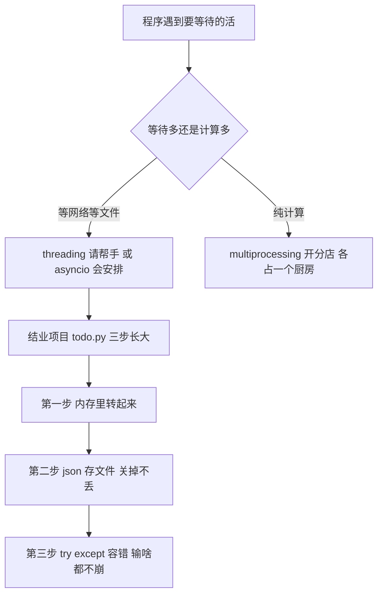

# 第 12 课　并发初窥与结业

这是最后一课。前半节我们聊一个新话题——并发，只建立直觉，不深入；后半节是重头戏：带你从零写出一个完整的命令行待办管理器，把它作为这十二课的结业项目。

写完它你会发现，前面学的每一课，都在这个小程序里派上了用场。

---

## 一、一边烧水，一边切菜

先想想你在厨房里是怎么干活的。水烧上灶之后要等三分钟才开——这三分钟你会站在灶台前干瞪眼吗？不会，你会顺手把菜切了。水开的瞬间再回来下面条，两件事都办完了。

这就是**并发**：不是同时干两件事，而是在一件事"等待"的时候，去干另一件。

程序世界里到处都是这种"等水开"的时刻：向网络要数据要等，读硬盘上的文件要等，用户在键盘上打字也要等。如果程序傻等，那段时间就全浪费了。并发的思路就是：等待的时候，去干点别的。

那你可能会问：为什么不干脆请两个帮手，一人干一件事，真正同时开工？可以，这就是下面要说的 threading。但它有个绕不开的限制，我们一步步来。

---

## 二、请个帮手：threading

Python 里可以启动多段代码"同时往前走"，每一份叫一个**线程**（thread）。你可以把线程想成厨房里的帮手：主厨（主程序）喊一声"你也去干活"，帮手就自己跑起来了。

```python
import threading
import time

def count_animals(name, times):
    for i in range(1, times + 1):
        print(f"{name}: 第 {i} 只")
        time.sleep(0.2)   # 故意慢一点，模拟"要等待"的活

# 注意：target 传函数名，不带括号；带括号就变成立刻调用了
t1 = threading.Thread(target=count_animals, args=("小羊", 5))
t2 = threading.Thread(target=count_animals, args=("小牛", 5))

t1.start()   # 喊一声：开工
t2.start()

t1.join()    # 主程序在这等着，等帮手干完
t2.join()

print("都数完了！")
```

跑一下，输出里"小羊"和"小牛"是混着出现的，不是小羊全部数完才轮到小牛——两个线程真的在交错推进。多跑几次你还会发现顺序每次不太一样：线程什么时候被切换，程序自己说了不算。

`join()` 的意思也好记：主程序走到这儿就"靠边等"，等这两个帮手都收工了才继续往下走。

---

## 三、GIL：一个厨房里只有一把主厨刀

这里必须交代一个 Python 圈的老话题：**GIL**（全局解释器锁）。

用大白话讲：在常规安装的 Python 里，不管你开了多少个线程，**同一时刻只有一个线程在真正执行 Python 代码**。就像厨房里请了五个帮手，但主厨刀只有一把——大家轮流用，一次一个人切菜。

那开多线程还有什么用？大有区别的地方在于"等"：

- 帮手 A 在**等水开**（网络请求、读文件这种等待型任务）——等的时候刀空着，帮手 B 完全可以用刀干活。所以线程适合"等待多、计算少"的活，比如同时下载十个网页
- 但如果活是**纯计算**（比如数一亿次加法），帮手 A 一直占着刀不撒手，五个帮手排队轮一把刀，不但不快，来回换人还添了新开销——所以多线程**加速不了**纯计算

想让纯计算真正跑满多个 CPU 核心，Python 的路子是开**多个进程**（multiprocessing）：请五拨人、给他们五个厨房，各切各的。代价是厨房之间传话麻烦、开销大。这节课不展开，你知道有这条路就行。

**2026 年的现状**：Python 官方做了一个不带 GIL 的版本，叫 free-threaded（自由线程版），3.14 起正式支持。不过到目前为止，它仍是**可选安装**——你从官网下载的默认版本，还是带 GIL 的常规版。作为新手，装官网最新稳定版照常用就行，完全不用碰这些。这里讲它，是为了让你以后在网上看到"GIL""free-threaded"这些词时知道在说什么。

---

## 四、asyncio：会安排的厨师

还有第三种思路。回头想厨房那个场景：等水开的三分钟里，帮手其实什么也没干，只是"站在那儿"。要是他聪明一点——定个闹钟，转身去切菜，闹钟响了再回来——一个帮手就能把所有事安排明白。

这就是 **asyncio** 的玩法：不用请帮手，一个线程，遇到"要等"的地方就主动让出来去干别的，等的事办好了再回来接上。

写法上，函数前面加 `async`，"要等"的地方写 `await`：

```python
import asyncio
import time

async def boil_water():
    print("水放上灶了")
    await asyncio.sleep(3)   # 等 3 秒，这 3 秒让出去干别的
    print("水开了！")

async def cut_vegetables():
    print("开始切菜")
    await asyncio.sleep(2)
    print("菜切好了！")

async def main():
    start = time.perf_counter()
    # gather：把几件事一起交给"排班的厨师长"，谁在等就先安排谁干活
    await asyncio.gather(boil_water(), cut_vegetables())
    cost = time.perf_counter() - start
    print(f"总耗时 {cost:.2f} 秒")

asyncio.run(main())
```

总耗时约 2 秒，不是 3 + 2 = 5 秒——烧水的 3 秒里，切菜早就开工了。`asyncio.sleep` 是故意造出来的"等待"，真实程序里它对应的是等网络、等数据库。

三种方式怎么选？给个粗口径：**等网络等文件多用 threading 或 asyncio；纯计算想跑满 CPU 用多进程；大多数新手程序压根不需要并发**。这节课的目标只是让你见到它们、不犯怵。

---

## 五、结业项目：命令行待办管理器

下面是重头戏。我们要做一个待办管理器：在终端里输入命令，添加待办、查看、打勾、删除，退出后数据还在。最终成品是本课目录里的 `todo.py`，但代码不是一口气写完的——我们让它**分三步长大**，这也是写真实程序的路数：先跑通最小版本，再逐步加东西。

它长这样（`>` 后面是你输入的）：

```
=== 待办管理器 ===
命令：add 内容 / list / done 编号 / delete 编号 / exit
> add 买牛奶
已添加：买牛奶
> add 写作业
已添加：写作业
> list
你的待办（共 2 项）：
  1. [未完成] 买牛奶
  2. [未完成] 写作业
> done 1
干得漂亮：买牛奶
> exit
已保存到 todos.json，再见！
```

### 第一步：先让它在内存里转起来

先不管保存，做一个能增、能看的版本。整个程序就是第 6 课学的套路：`while True` 主循环，读到输入，用 `if / elif` 分派。

每条待办用**字典**存（内容 + 完成状态），一堆字典装进一个**列表**——第 4、5 课的东西。

```python
todos = []   # 每条形如 {"text": "买牛奶", "done": False}

while True:
    line = input("> ").strip()
    parts = line.split(maxsplit=1)   # "add 买牛奶" 拆成 ["add", "买牛奶"]
    cmd = parts[0].lower()

    if cmd == "exit":
        break
    elif cmd == "add":
        todos.append({"text": parts[1], "done": False})
        print(f"已添加：{parts[1]}")
    elif cmd == "list":
        for i, item in enumerate(todos, start=1):
            mark = "已完成" if item["done"] else "未完成"
            print(f"  {i}. [{mark}] {item['text']}")
```

把这段跑起来试试 `add`、`list`、`exit`。它已经是个能用的程序了，只是有个致命伤：一退出，列表就没了。

### 第二步：关掉也不能丢——存进文件

补救办法第 8 课刚学过：持久化。退出前把列表写成 JSON 文件，启动时再读回来。

```python
import json

def load_todos():
    try:
        with open("todos.json", encoding="utf-8") as f:
            return json.load(f)
    except FileNotFoundError:
        return []   # 第一次运行还没有这个文件，不算出错，空手而归

def save_todos(todos):
    with open("todos.json", "w", encoding="utf-8") as f:
        json.dump(todos, f, ensure_ascii=False, indent=2)
```

两个细节。一是 `ensure_ascii=False`：不加它，中文会存成 `\u4e70` 这样的转义符，文件打开没法看。二是 `FileNotFoundError` 的兜底：程序第一次运行时 `todos.json` 根本不存在，读文件必然报错——这不是故障，是正常状态，所以捕获后返回空列表就好。主循环退出后调一句 `save_todos(todos)`，数据就落袋了。

`json.dump` 能直接存列表和字典，存我们这种"字典组成的列表"刚刚好。

### 第三步：容错——用户什么都可能输

程序能用了，但用户一输入 `done abc`（编号不是数字）或 `done 99`（根本没这条），程序当场崩给你看。第 8 课说过：用户输入永远不可信，错误要接住。

编号的转换单独封装成一个函数，两种错都拦下来：

```python
def parse_index(raw, todos):
    """把用户输入的编号转成列表下标；非法输入返回 None 并提示。"""
    try:
        index = int(raw) - 1          # 编号从 1 开始，下标从 0 开始
    except ValueError:                # 输的不是数字
        print("编号得是数字，比如 done 1。")
        return None
    if index < 0 or index >= len(todos):   # 越界了
        print(f"没有 {raw} 号待办，先 list 看看都有几号。")
        return None
    return index
```

另外补一个容易忽略的边角：程序在管道或脚本环境里跑时，输入源可能提前结束，`input()` 会抛 `EOFError`，也接住，当成正常退出处理。

最后，把零散逻辑归拢成函数——这是第 7 课的要求：`load_todos`、`save_todos`、`show_todos`、`parse_index`、`main` 各管一摊，入口写 `main()`，文件末尾用 `if __name__ == "__main__":` 挂上。完整成品就在本课目录的 `todo.py` 里，建议先照着三步自己搭一遍，卡住了再对照。

运行 `python todo.py`，把上面的操作全部走一遍，再退出重进——待办还在，成了。

---

## 六、回头看：十二课都去哪儿了

这个小项目不到一百行，却是整门课的合订本：

| 用到的东西 | 出处 |
|------------|------|
| 列表装一组待办、append、pop | 第 4 课 列表 |
| 字典存每条任务（text / done） | 第 5 课 字典与集合 |
| while True 主循环、if/elif 分派 | 第 6 课 判断与循环 |
| 拆函数、main() 入口 | 第 7 课 函数 |
| json 读写文件、try/except 兜错 | 第 8 课 文件与异常 |
| f-string、enumerate | 第 3、11 课 |
| 管道喂命令、终端操作 | 第 1 课 |

有个东西它没用：第 10 课的类。这不算白学——用 `class Todo` 把"一条待办"包成对象再改写这个程序，是个很好的自测题，试试看你能改到什么程度。

---

## 七、新手最常踩的坑

**`json.dump` 之后文件打开是空的**

忘了文件是要"关"才算写完的。用 `with open(...)` 就没这个问题，退出 with 块自动写盘。

**`done 1` 报错说 list index out of range**

没做越界检查，直接拿用户输入当下标用了。交给 `parse_index` 那样的函数把关，先验证再使用。

**`int("abc")` 崩了**

这就是 `ValueError`，要用 `try / except` 接住，别让它直接砸到用户脸上。

**改了 todo.py 但数据总是旧的**

`todos.json` 和代码在同一个文件夹里，程序启动时会把旧数据读回来。想从零开始测试，把 `todos.json` 删掉即可，程序会自动当空列表处理。

---



---

## 想一想

1. 厨房类比说并发"不是同时干两件事"，那是什么？你烧水时去切菜，是怎么知道"水开了该回来"的？程序里对应的是什么？
2. GIL 说同一时刻只有一个线程真正在跑 Python 代码，像一把主厨刀。为什么纯计算的活开五个帮手反而更慢，而"同时下载十个网页"这种等待型任务却快了？
3. threading 是"请帮手"，asyncio 是"会安排的厨师"——一个要真开帮手，一个单线程就能交错干活。想想它们各自靠什么在"等待"时腾出手来？
4. todo.py 第一次运行时 `todos.json` 根本不存在，读文件必然报错。为什么说这不是故障？代码里是怎么把这个"正常状态"和真错误分开处理的？
5. 轻动手：把课上两个线程的演示程序多跑几次，观察"小羊""小牛"的交错顺序每次都一样吗？想想这说明线程的切换是谁说了算。

---

## 小结

这门课到这儿就结业了 🎓。这十二课你没有背下多少"知识点"，但你亲手做了一堆东西：让程序跟你打招呼、猜数字、记账本，最后写出了有保存、有容错的待办管理器。

并发那部分如果还觉得朦胧，很正常——它本来就不是入门阶段要吃透的东西。你只需要带走一个直觉：**等待的时间不该浪费**，以及三个词的大概长相：threading（请帮手）、asyncio（会安排）、multiprocessing（开分店）。

编程这条路，接下来的提升靠的是继续写：改这个待办管理器、给它加新功能、把它做坏再修好。练习就在下面，从这里继续吧。

---

## 课后练习

先自己动手，卡住了再打开 `exercises` 文件夹看参考答案。

**练习 1（必做）：线程小演示**

用 threading 起两个线程：一个打印"小羊"数到 5，一个打印"小牛"数到 5，各步之间 `time.sleep(0.2)`。主线程 `join` 等它们都结束再打印一句收尾。多跑几次，观察两种输出是怎么交替的、顺序稳不稳定。

**练习 2（必做）：异步小演示**

写两个 `async` 函数，一个 `await asyncio.sleep(2)`，一个 `await asyncio.sleep(1)`，用 `asyncio.gather` 并发跑。用 `time.perf_counter()` 量一下总耗时：应该是约 2 秒而不是 3 秒。再改成一前一后普通调用，对比一下耗时。

**练习 3（必做）：待办加优先级**

写一个独立小脚本：任务字典里加一个 `priority` 字段（数字越小越要紧），把几条任务按优先级 `sort` 后带编号打印出来。这是把课上 `todo.py` 再往前推一步的思路——想想 add 的时候要怎么多存一个字段。

**练习 4（选做）：给待办加截止日期**

给 `todo.py` 加一个 `due` 字段：`add 交报告 due 2026-10-15` 这样的格式，用 `datetime.date.fromisoformat` 把字符串转成日期存进去，`list` 时显示出来。转换失败（日期写错）要友好提示，别让程序崩。这个没有参考答案，全凭你自己查、自己试——结业了，就该自己走路了。

---

参考答案在 `exercises` 文件夹里（必做 3 道）。练习 4 没有答案——不是偷懒，是想看看你离开参考答案能走多远。

2026 年 10 月
