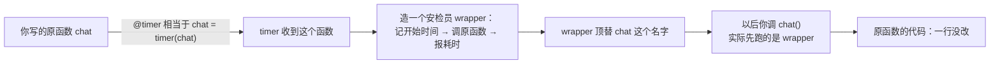
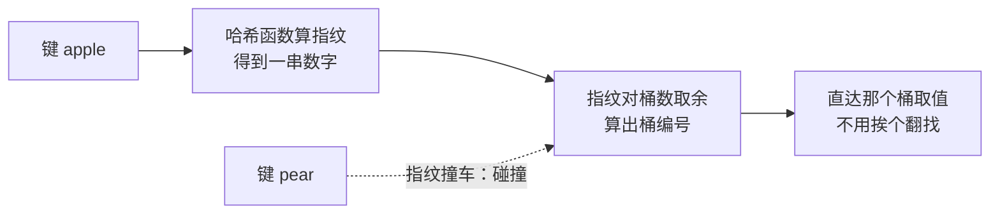

# 加餐课　AI 工程里的 Python

前面九课，我们把"AI 是怎么工作的"讲完了，几乎没写过代码。这节加餐课补上另一头：真正动手做 AI 项目时，Python 工程师手里天天攥着的几样手艺。装饰器重点讲透；异步和生成器第 1 章练过，这里只把结论钉牢；最后附一份"数据结构直觉"，不求会写，只求认得。

本课配了一个演示 `decorator_demo.py`（纯标准库），读到这里可以先把 `python decorator_demo.py` 跑一遍，对着输出看正文。

---

## 一、装饰器：不改动函数，给它套一层"包装盒"

### 先看它解决什么麻烦

假设你写了个函数，负责向大模型发一次提问：

```python
def ask_llm(prompt):
    ...  # 真正干活的代码
```

用着用着你有新想法：每次调用挺贵，记一下花了多久？发现总有人反复问同一个问题，能不能自动缓存？网络偶尔抖，能不能失败自动重试？——这些想法有个共同点：都跟"提问"本身无关，都是额外套上去的动作。

最笨的办法是把它们塞进函数体。塞一个函数还行；等你有了十个这样的函数，每个都要计时、缓存、重试，函数体就熬成了一锅粥，十份几乎一样的代码散落各处。

装饰器就是为这个场景生的：**把额外动作写在壳里，原函数一个字不改。** 生活原型你天天见：给礼物套包装盒，盒子再花哨，里面的礼物没变；进商场先过一道安检，安检不改变你去店里要干的事。装饰器干的就是这个——函数还是那个函数，只是进出门多了一道流程。

### 铺垫一句话：函数在 Python 里是个"东西"

要套壳，先接受一个设定：Python 里函数跟数字、字符串一样是个对象——能赋值给变量、能当参数递给别人、也能被别人递回来。第 1 章你把函数当"技能"用，现在把它当"包裹"看：既然是包裹，就能被人装进更大的盒子再还回来。

### 手写一个计时装饰器

```python
import time
import functools

def timer(func):                      # 收到要包装的函数
    @functools.wraps(func)
    def wrapper(*args, **kwargs):     # 门口新加的"安检员"
        start = time.perf_counter()   # 进门先记时间
        result = func(*args, **kwargs)  # 放行：原函数照常干活
        print(f"[timer] {func.__name__} 耗时 {time.perf_counter() - start:.3f}s")
        return result                 # 结果原样交还
    return wrapper                    # 把安检员送回去，顶替原岗位


@timer
def chat(prompt):
    time.sleep(0.2)                   # 假装等模型回话
    return "好的，收到：" + prompt
```

逐行看门道：

- `timer(func)` 收到的 `func`，就是被套壳的那个函数；
- `wrapper` 是新造的安检员：记时间、放行、报耗时，流程走完结果原样交还；
- `*args, **kwargs` 意思是"来者什么名单都接着"——同一个 `timer` 才能套在任意函数上；
- 最后 `return wrapper`：壳造好了，还回去顶替原函数的岗位。

### @ 那个符号，只是一句赋值的简写

`@timer` 没有任何魔法，它就是下面这句的简写：

```python
chat = timer(chat)   # 把 chat 装进盒子，再把"chat"这个标签贴到盒子上
```

从这行执行完起，你喊 `chat()`，先应门的是 wrapper。原函数代码一行没改，但每次调用前后都多了动作。整个过程画出来：



### 偷梁换柱的代价：functools.wraps

有个细节值得点破：装饰之后，`chat` 这个名字指向的已经是 wrapper。后果很实际——`chat.__name__` 查出来是 `"wrapper"`，编辑器里的函数说明文档也没了。有些资料顺口说装饰器"保持函数签名不变"，准确的版本是：**调用方式不变，但名字和文档默认会丢**，得靠一行 `@functools.wraps(func)` 把原函数的身份信息抄回 wrapper 身上。演示脚本的第二段专门对照了加与不加的差别，跑一下看得清清楚楚。

### 带参数的装饰器：再多套一层

你会见到 `@retry(times=3)` 这种写法。直觉很简单：在包装盒外面又加了一层——最外面先收配置（重试几次），收完配置才轮到收函数。三层嵌套，从外往里数即可，本课不深挖：

```python
def retry(times):                   # 第一层：先收配置
    def decorator(func):            # 第二层：再收函数
        def wrapper(*args, **kwargs):  # 第三层：真正干活
            ...  # 失败就重试，最多 times 次
        return wrapper
    return decorator
```

### AI 工程里，它天天在干嘛

- **计时**：给每个模型调用套上本课的 `timer`，哪个接口慢了一目了然；
- **缓存**：标准库自带 `@functools.cache`，同一个问题问第二遍不再花钱花时间等模型；
- **重试**：网络抖动太常见，`@retry` 类装饰器让"失败了再来一次"不必写进业务代码；
- **注册工具**：第 3 章讲 Function Calling、第 6 章讲 Agent 挑工具时，你会看到框架用 `@tool` 这类装饰器把函数登记进一张工具表——模型说"我要用搜索"，程序就去表里查到对应函数。名字前一个 `@`，背后就是本节这套包装术。

训练框架里的 `@torch.no_grad()` 你以后也会撞见——现在你知道，它跟上面手写的没有本质区别。

---

## 二、异步复习：等待的时候别干坐着

第 1 章已经练过 async/await，这里只钉一句结论：**瓶颈在"等"，才用异步；瓶颈在"算"，别指望它。**

调大模型接口、下载网页、读写文件，时间都花在等对方回话上，CPU 闲着。异步让程序在 A 等网的时候切去干 B 的活，一批等待型任务的总耗时从"排队累加"变成"只等最慢那个"。要同时伺候几十个用户的对话机器人，基本靠它撑着。

反过来，矩阵运算、模型训练这类活，CPU 一刻不停满负荷干，没有等待间隙可塞别的事，硬切反而多付切换成本。判断法就一句：你的任务大部分时间在**等**（网络/IO），还是大部分时间在**算**？

---

## 三、生成器复习：要一个给一个

同样只钉结论：函数里出现 `yield`，它就成了生成器——每要一个给一个，给完暂停，下次从暂停处继续，不必把所有结果先攒进内存。

两个常用姿势记住就行：可以被 `next()` 一个个要，也可以直接丢给 `for` 循环。处理大文件一行一行读、把长文档切成小块喂给模型，都是它的主场——第 4 课讲训练时"数据一批一批喂进去"，背后攒批的就是它。2026 年的今天它依然是标准做法，没有过时一说。

---

## 四、附录：数据结构直觉——知道什么场景背后在用谁

先立个规矩：做 AI 应用不需要你手写这些结构，Python 早就备好了。这一节目标只有一个：**看到某个功能跑得快，大概知道背后是谁撑着。**

评价快慢也不用背大 O 表，就问一个问题：**数据量翻倍时，代价怎么变？** 代价不变（白捡）、代价也翻倍（还行）、代价翻四倍（要命）——直觉上分这三档就够用。

### 三位配角，各一句

- **链表**：像一节节挂钩的火车车厢。中途加挂、摘下一节很省事，不必惊动整列车；但想找第 100 节，只能从头一节节捋过去。
- **二叉搜索树**：像猜数字——每猜一次就被告知"大了/小了"，每下一层把不可能的一半甩掉。一百万条数据，二十步左右锁定目标。
- **堆**：不负责整体排队，只保证一件事——永远能最快拿到最大（或最小）的那个。优先级队列、"从十万条候选里挑最相似的 5 条"（Top-K），背后是它。

### 哈希表：一步到位的查找（重点）

你取快递从不用翻柜子——凭取件码，系统直接算出包裹在哪个柜格，走过去开门就拿。哈希表存取数据正是这个思路，分三步：

1. **算指纹**：哈希函数把任意键（一段文字、一个数字）压成一个数，好比从包裹内容算出取件码；
2. **定位置**：指纹对桶的数量取余，得到该放进哪个桶——桶就是一排编号固定的储物格；
3. **直达**：下次再问"apple 在吗"，同一套算法一步算出桶位，不用挨个翻。



Python 的 `dict` 和 `set` 就架在哈希表上：`dict` 按键取值快、`set` 判断"这个见过没见过"快，都是因为背后直接算位置，而不是逐个比对。你写 AI 代码时大量用 dict 存配置、用 set 去重，享受的就是这份红利。

两个补充，都是点到为止：

- **碰撞**：不同键可能算出同一个柜格。工程上有成熟解法——要么在格子里挂条小链子都装着（链地址法），要么就近换空格（开放寻址，CPython 的 dict 实际用这种）。你只需记住：哈希的"快"是平均意义上的快，不是数学保证。
- **往远处看一句**：第 7、8 章讲向量数据库，核心难题是"从几百万条向量里快速找到最相近的几条"，那里的解法（ANN，近似最近邻检索）跟这里的直觉同源——都不挨个比对，而是利用某种位置规律直接缩小范围。哈希表是这条思路里最简单的版本，后面你会见到用树、用图实现的进阶版。

---

## 想一想

先自己回答，能讲给别人听最好。

1. 不看课文，用 `chat = timer(chat)` 这一句，向同学解释 `@timer` 到底做了什么。
2. 如果 wrapper 里忘了写 `return result`，被装饰的函数调用后会返回什么？原来的返回值去哪了？
3. "同时下载 50 个网页"和"把 1 亿个数从小到大排序"，哪个适合上异步？另一个为什么不适合？
4. （动手）照着 `decorator_demo.py` 里的 `timer`，自己写一个 `counter` 装饰器：每被调用一次就打印"第 N 次调用"。写完想想：N 是怎么在多次调用之间被记住的？

---

## 小结

这节加餐课，带走五句话就够了：

- 装饰器：不改动原函数，在外面套一层壳；`@` 只是 `my_func = decorator(my_func)` 的语法糖；自己写壳，记得 `@functools.wraps` 保住原函数的名字和文档。
- 异步只记判断：瓶颈在"等"（网络/IO）就用 async/await，瓶颈在"算"别指望它。
- 生成器：`yield` 让函数要一个给一个、省内存，天然配 `for` 循环。
- 数据结构不必手写：链表插得快找得慢、树每层砍一半、堆最快拿最值、哈希表算指纹一步到位——`dict` 和 `set` 的地基就是它，也是第 7、8 章向量检索"快速找最近"的第一课直觉。
- 再看到 `@` 开头的行，你应该能心算出"谁被装进了谁的盒子"。

至此本章全部走完：从第 1 课的四词地图出发，经过机器学习、神经网络、训练、Token 与注意力、Transformer，到大模型怎么说话、怎么微调，最后用这节课补上工程手感。原理你有了地图，工具你也摸过了——下一章，我们去看怎么用 Prompt 让模型真正替你干活。

---

2026 年 10 月
