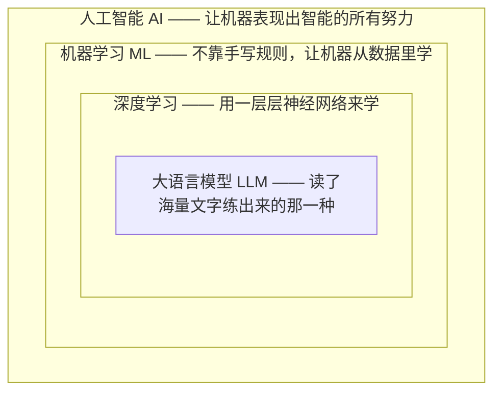
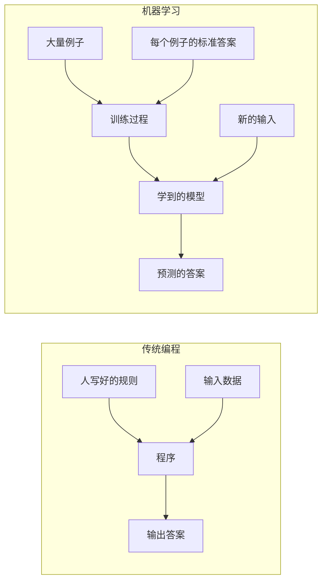

# 第 01 课　AI 到底是什么

先别急着学原理。我们花一节课，把这一整章会反复出现的几个词摆到桌面上，看清楚它们谁是谁、谁包含谁。这张地图建立起来了，后面九节课你才不会迷路。

---

## 一、你其实早就天天在用 AI 了

如果你用过手机里的语音助手、刷到过软件给你推荐的内容、把一段话丢给聊天机器人让它帮你写邮件、或者拍照时手机自动把人脸框出来——那你已经在享受人工智能的成果了。

到 2026 年，这类能听、能看、能写、能和你流畅对话的程序已经相当普遍。国外的 GPT、Claude、Gemini，国内的一批大模型，都聪明得令人吃惊：它们能写代码、能分析合同、能给你讲题，甚至能帮你安排一整趟旅行。

不过，"AI"这个词被用得太泛了。扫地机器人叫 AI，能和你辩论哲学问题的聊天程序也叫 AI，但它们完全不是一个量级的东西。要搞懂背后的原理，我们得先把几个词分清楚。

> 版本号这件事先打个预防针：大模型更新极快，你读到这里时，GPT、Claude 们可能又出了新一代。这不影响我们理解原理——这一章讲的是它们共同的底层逻辑，十年前的雏形和今天最强的模型，骨子里是同一套思路。

---

## 二、四个词，一层套一层

新闻里你会不停听到这四个词：人工智能、机器学习、深度学习、大语言模型。很多人把它们混着用，其实它们是**一层包含一层**的关系。

从外到内说：

**最外面一圈，人工智能（AI）**是最大的概念。凡是想办法让机器干那些"本来需要人的脑子"的事，都算人工智能。这里面既包括今天聪明的大模型，也包括几十年前很笨拙的尝试——比如程序员把一条条规则手写进去，让机器照着执行。它的目标很宏大，但实现手段可以很原始。

**往里一圈，机器学习（ML）**是人工智能的一种实现思路，也是今天 AI 真正起飞的关键。注意它的对立面：传统做法是人把规则一条条写好；机器学习反过来——**人不直接写规则，而是给机器大量的数据，让它自己从数据里把规律"学"出来。** 这个转变是本章的核心，下一节专门展开。

**再往里，深度学习**是机器学习里的一种方法。它用一种叫"神经网络"的结构（灵感来自人脑，但并不是在模拟真的大脑），特点是一层叠一层，能自动从原始数据里提炼出越来越抽象的规律。图片识别、语音识别的突破，靠的都是它。

**最里面，大语言模型（LLM）**就是深度学习的产物之一，也是你最熟悉的那种：它专门读了互联网上海量的文字，学会了人类语言的规律，于是能听懂你说的话、接着你的话往下写。GPT、Claude、Gemini 都是大语言模型。

记住这个包含关系：**大模型属于深度学习，深度学习属于机器学习，机器学习属于人工智能。** 以后再听到这些词，你可以在脑子里给它们对号入座。

---

## 三、最关键的一个转变：从"写规则"到"喂数据"

要理解机器学习新在哪，最好的办法是把它和传统编程摆在一起对比。

### 传统编程：你把规则一条条交代清楚

想象你要让电脑判断一个水果是不是苹果。用传统的办法，你得自己想全所有规则，然后一条条写进程序：

- 如果颜色是红色或青色
- 而且形状接近圆形
- 而且直径在 6 到 12 厘米之间
- 那它就是苹果

听起来还行。但现实很快就会给你找麻烦：有的苹果是黄的，有的品种小得像颗枣，而有些别的果子偏偏又红又圆。你只能不停地打补丁、加规则，规则越来越多，还互相打架。**问题的根源在于：现实世界太复杂、太模糊，靠人把规则一条条列全，是列不完的。** 识别一张照片里有没有猫、判断一封邮件是不是垃圾邮件，都是这种"规则写不尽"的事。

### 机器学习：你给例子和答案，规则让它自己找

换个思路。你不再费尽心机去描述"什么是苹果"，而是准备一大批水果，每个都附上正确答案：这张图是苹果，这张是橘子，这张是梨……然后把这一堆"例子 + 标准答案"交给机器，让它自己去琢磨："原来长成这些样子的，才被叫苹果。"

琢磨的过程就叫**训练**，训练结束后它总结出来的那套规律，就叫**模型**。等你再拿一个它没见过的水果给它，模型就能根据自己总结的经验，判断这大概是个什么。

你没有写任何一条"红的、圆的"规则，规则是机器自己从成百上千个例子里归纳出来的。下面这张图把两种思路并排画了出来：

看清楚箭头方向的区别：传统编程里，规则是你从左边喂进去的；机器学习里，规则（模型）是从右边被"训练"这一步**生产出来的产物**，你喂进去的是数据和答案。

### 一个更贴切的比喻

传统编程像你给一个**只会死记硬背的新人**一本操作手册，手册上没写的情况他就傻眼；机器学习更像带一个**会自己总结经验的学徒**，你不必把每条道理讲透，只要给他看过足够多的病例、案件、图纸和对错反馈，他慢慢就能举一反三，处理你没明确教过的新情况。

"模型"这个词，你就理解成这位学徒肚子里那套**没法一条条写出来、但确实管用的经验**。老医生看一眼片子就觉得"不对"，这背后是几十年的经验沉淀；模型的判断也类似，只是它的经验来自数据，而不是人生。

---

## 四、一个必须诚实面对的事实

机器学习很强，但它不是魔法，有两件事你得从一开始就心里有数，否则以后用大模型会产生不切实际的期待。

第一，**它学到的规律是从数据里"猜"出来的近似规律，不是被证明的真理。** 给它的数据有偏差、不够多，或者它遇到了一个训练时没怎么见过的情况，它就可能给出一个听起来特别自信、其实完全错误的答案。大模型"一本正经地胡说八道"，根子就在这里。后面的课我们会看到它为什么会这样。

第二，**它其实并不"理解"自己在说什么。** 大模型能把话说得无比流畅，很大程度上是因为它极其擅长"根据前面的话，预测接下来最可能出现什么词"。这种能力强大到能解决很多真实问题，但它和人真正的懂得，是不是一回事，至今没有定论。所以聪明的用法是：把它当一个极其博学、偶尔会犯错的助手，重要的事你要自己核实，而不是把它的每句话都当权威。

这两盆冷水不会影响我们欣赏它的强大，但会让你成为一个清醒的使用者——这比会调用几个接口重要得多。

---

## 五、这一章接下来怎么走

现在你手里有了两样东西：一张"四个词谁包含谁"的地图，和一个"从写规则到喂数据"的核心转变。后面的课，其实就是在把"机器学习到底怎么学"这件事一层层剥开：

- 第 02、03 课先看机器学习整体在干什么，以及神经网络这个最常用的工具
- 第 04 课看训练具体是怎么一步步让模型变好的
- 第 05～07 课进入语言模型的核心：文字怎么变成数字、注意力、Transformer
- 第 08、09 课回答大模型怎么生成回答、以及怎么让它更贴合你的需要

等这些都走完，你再回头看今天这张包含关系图，会觉得它简单得理所当然——那就是真正学懂了的标志。

---

## 想一想

先自己回答，能讲给别人听最好。

1. 用"包含"的关系说一说：人工智能、机器学习、深度学习、大语言模型，谁是谁的一种？
2. 传统编程和机器学习，你喂给电脑的东西有什么不同？哪种思路更适合"判断一张照片里是不是猫"，为什么？
3. 有人说"我们给 AI 的数据越多，它就一定越正确"。结合这节课的内容，你觉得这句话哪里可能有问题？
4. （动手感受）随便打开一个你手边的 AI 助手，问它一个有确切答案的问题（比如某个城市到另一个城市的距离），再追问一个需要最新信息、或者很冷门的问题。对比两次回答，想想它在哪种问题上更可靠——带着这节课"它可能自信地出错"的提醒去观察。

---

## 小结

这节课没有公式，只要带走三句话就够了：

- 人工智能是最大的圈，机器学习是其中"让机器自己从数据里学"的那一类，深度学习用层层神经网络实现机器学习，大语言模型是深度学习里读文字练成的一种。
- 机器学习和传统编程最根本的区别：传统编程是人写规则，机器学习是人给数据和答案、让机器自己把规律学出来。
- 模型的能力来自数据里的近似规律，它可能自信地出错，也未必真正"理解"——所以要用，更要核实。

下节课，我们正式走进机器学习，看看"从数据里学规律"这件事具体是怎么发生的。

---

2026 年 10 月
