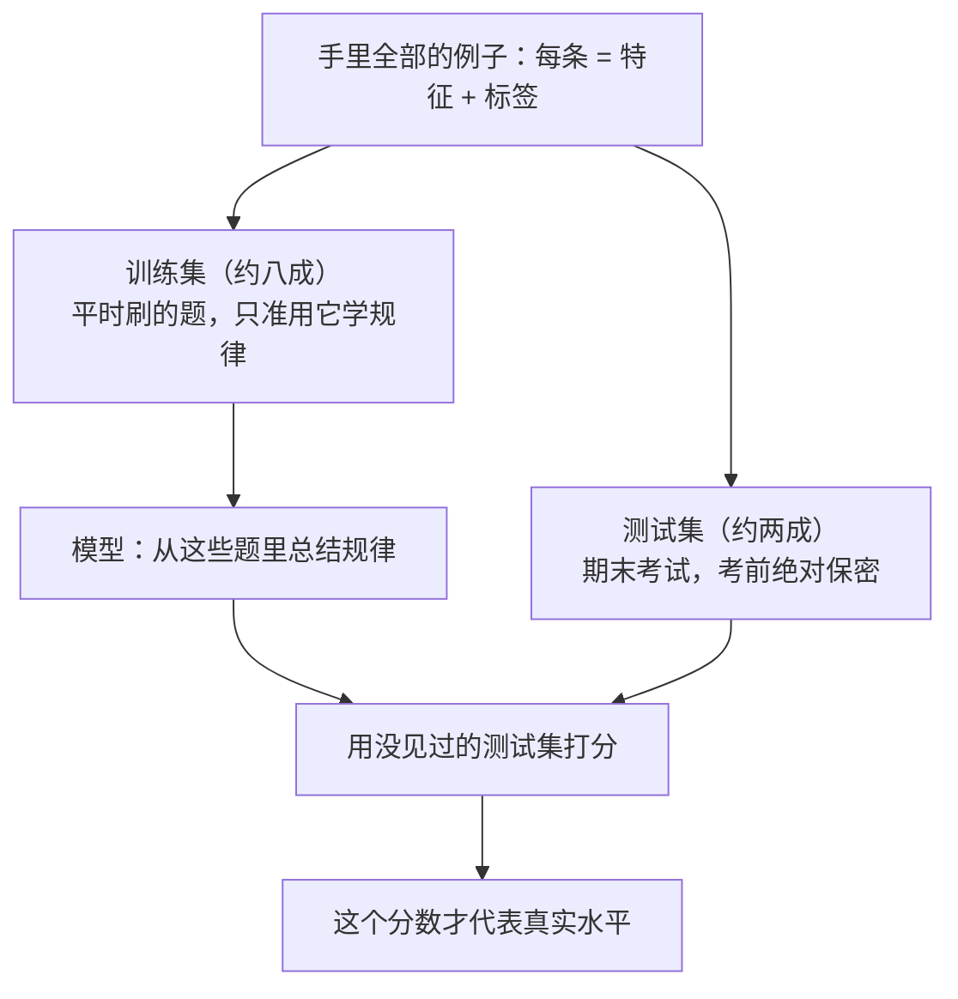
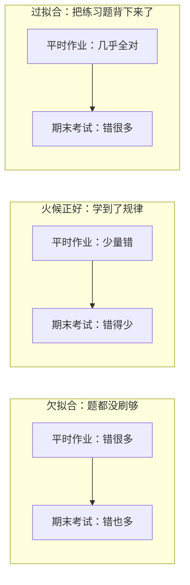

# 第 02 课　机器学习基础

上一课结尾我们留了个悬念：机器学习的核心是"人不写规则，给数据和答案，让机器自己学"。这句话听着很美，但"学"到底是怎么发生的？机器拿到一堆例子，先干什么、后干什么，学完了又怎么知道它学得好不好？这一课就把这条链路完整走一遍。

---

## 一、先把三个词落到实处：样本、特征、标签

"从例子里学"，例子到底长什么样？用个最生活化的场景拆开看：挑西瓜。

夏天买西瓜，你会拍一拍、看纹路、瞧瞧瓜蒂新不新鲜，然后心里判断：这个甜，那个不甜。你的判断依据——声音、纹路、瓜蒂——每一条都叫一个**特征**；你最终要判断的"甜不甜"，就是**标签**；而手里这一个具体的西瓜，连特征带答案打包在一起，就是一个**样本**。一堆样本摞起来，就是数据集。

机器学习做的事，说白了就是：给它看几千个样本，让它自己琢磨出"什么样的特征组合多半是甜瓜"。机器学出来的那套东西，本质上是一套"从特征到标签的对应关系"——以后听到"模型"这个词，你可以先在心里这么翻译。

顺带把两种任务分清楚：标签是"甜 / 不甜"这种类别，任务叫**分类**；标签是"含糖量 11.2%"这种连续的数，任务叫**回归**。一个回答"是哪一类"，一个回答"是多少"，这个区分后面会反复用到。

---

## 二、题不能全拿来做练习：训练集与测试集

数据有了，是不是全喂给机器就完事了？不行。这里藏着新手最容易踩的坑。

你平时刷题（训练集），是为了掌握解题规律；期末考试（测试集）考的是没见过的题，才能检验你到底是"学会了"还是"背熟了"。假设学校把期末考题提前印进练习册让你刷——考出的满分能说明你厉害吗？不能，只能说明你记性好。机器也一样：拿全部数据训练、再拿同一批数据考试，成绩会好得虚假，因为它可能只是把答案记住了。所以每条数据从头到尾只能担任一个角色：

模型在没见过的数据上依然表现出色，这个能力有个专门的名字：**泛化**——"泛"就是"推广到新情况"。我们练模型，练的从来不是"在见过的题上得高分"，而是泛化能力。

---

## 三、没人给答案时怎么办：三种学习方式

挑西瓜的例子里，每个样本都带标准答案，这种学法叫**监督学习**——像有位老师站在旁边逐题批改。它是三种方式里最常用的一种，但不是唯一一种。

### 监督学习：每道题都有标准答案

数据 = 特征 + 标签，两大件就是上面说的分类和回归：判断邮件是不是垃圾邮件、照片里是猫是狗，是分类；预测明天最高气温、这套房子值多少钱，是回归。像跟着师傅学手艺，每干完一件活师傅都告诉你对在哪、错在哪，千百件下来你自然上手了。

### 无监督学习：没人给答案，自己找结构

很多时候标准答案太贵——给一百万张医学影像逐张写诊断，得医生花上多少年？手里只有特征、没有标签时，就得靠**无监督学习**自己找结构，代表玩法有两种：

- **聚类**：把相似的东西自动归堆。比如把一百万张用户照片按"长得像"分成若干组——没人告诉机器每组合适的名字，它只负责"物以类聚"。像你整理一个从不分类的衣柜，把上衣归上衣、裤子归裤子，虽然叫不出"通勤风""运动风"，但分完确实有结构。
- **降维**：信息太多时压缩出主干。像把两百页的讲义浓缩成一页重点，丢掉细枝末节，保住主要骨架，后面处理起来轻得多。

### 强化学习：没人给答案，但给反馈

没有逐题的标准答案、也没有现成结构可找时，还有一招：让机器自己试——试对了给奖励，试错了给惩罚。像训练小狗握手：没人能给它"讲解"每块肌肉怎么动，只能它做对了给零食，做错了没有，多次之后它自己摸索出门道。AlphaGo 下棋、机器人学走路、游戏里的 AI 对手，走的都是这条路。

跟这门课最相关的一句：今天的大模型之所以回答得体、不胡来，背后"按人类反馈打分再改进"的对齐环节，用的正是强化学习。另外它的预训练其实更像"自监督"——把文章里挖掉一个词当题目、拿原文当答案，机器自己出题自己批。这两个词混个脸熟就行，后面的课还会遇到。

---

## 四、学得太死与学得不够：过拟合与欠拟合

路子选对了，还有"火候"问题。机器学习里最核心的一对矛盾，还是用刷题来讲最清楚。

**欠拟合**是题刷得太少（或者脑子实在太简单），连练习册里的基本规律都没掌握：平时作业错一大片，考试成绩自然也差。**过拟合**则是刷题刷歪了——把练习册每道题的答案连数字带顺序背了下来：平时作业满分，期末换个题干就崩溃。它记住的是题，不是规律。

一眼看穿的办法：对比"平时成绩"和"考试成绩"的差距。两者都差是欠拟合；平时好、考试差是过拟合；两者都好才是真学到了。

如果你的统计学朋友在场，他们会说：欠拟合大致对应"高偏差"——枪瞄得就不对，每发都偏向同一边；过拟合大致对应"高方差"——枪本身忽左忽右，时准时不准。记不住这两个词没关系，记住"平时与考试的差距"这个画面就够用了。

怎么让模型落在"刚刚好"？直觉上三招：

1. **更多数据**：见过的题型越多，越难靠死记硬背蒙混——题库一百万道，背是背不完的，只能学规律。
2. **更简单的模型**：给它的"记忆力"越小，越没法逐题记答案，只能抓大放小。判断西瓜甜不甜，用不着背下每个见过西瓜的编号。
3. **留出验证集**：从练习题里再抠一小部分当"模拟考"，训练时不给模型看，专门用来观察"它是不是开始背题了"。真正的期末考（测试集）仍然留到最后，只考一次。

---

## 五、考多少分算好：几个大白话指标

模型考完试总得有个分数。最直观的是**准确率**：答对的占多少。听着够用了？看个反例：垃圾邮件通常只占全部邮件的 1% 左右，一个无脑程序把所有邮件都判成"正常"，准确率高达 99%——但它一封垃圾邮件都没抓住。所以光看准确率，会被"随大流"骗到，还得拆开看：

- **精确率**：你喊"这是垃圾邮件"的时候，有多少次喊对了。衡量报得准不准，像"狼来了"喊话的可靠性。
- **召回率**：所有真正的垃圾邮件里，你抓住了多少。衡量漏得严不严重。
- **F1 分数**：把上面两者拧在一起的综合分，防止偏科。

不同场景在意的错不一样：疾病筛查宁可把健康人误筛出来复查（牺牲精确率），也绝不能漏掉病人（召回率优先）；垃圾邮件过滤器正好相反——误拦老板的重要邮件，比漏掉几封广告严重得多。没有全民通吃的分数，只有"这个场景最怕哪种错"。

---

## 想一想

先自己回答，能讲给别人听最好。

1. 挑西瓜例子里的样本、特征、标签分别是什么？如果把任务改成"预测这个西瓜多少斤"，它属于分类还是回归？
2. 有同学说：他把全部数据都拿去训练，训练准确率 100%，所以模型完美。这个推理哪里出了问题？
3. 把下面三个场景对号入座到三种学习方式：给猫狗照片分类；把新闻自动分成若干话题组；无人机在陌生环境里学会避障。
4. 一个疾病筛查模型准确率 99%，主管却仍然不满意。结合"患病率约 1%"这个背景，猜猜问题可能出在哪？

---

## 小结

- 一个样本 = 特征（判断依据）+ 标签（正确答案）；机器学的就是"从特征到标签的对应关系"，学出来的产物叫模型。
- 数据必须分成训练集与测试集：前者平时刷题，后者期末考试、考前保密；模型在没见过的数据上的表现叫泛化，它是我们唯一在乎的分数。
- 有人逐题批改是监督学习（分类与回归）；没人给答案、自己找结构是无监督学习（聚类与降维）；只有奖惩、靠试错摸索是强化学习。
- 欠拟合是题都没刷够，过拟合是把练习题背下来了；更多数据、更简单的模型、留出验证集，都能把模型拉回"学规律"的正道。
- 准确率之外还要看精确率与召回率：不同场景怕的错不一样，指标要跟着场景选。

下节课，我们打开模型内部，看看那套被训练出来的"对应关系"——神经网络——到底长什么样、怎么运转。

---

2026 年 10 月
