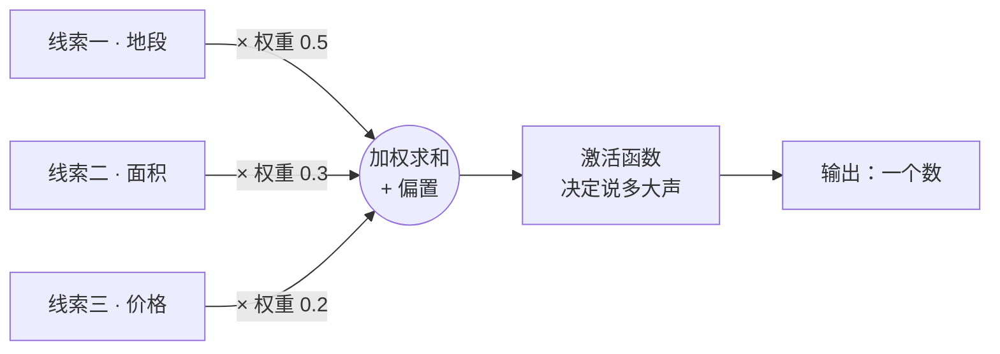
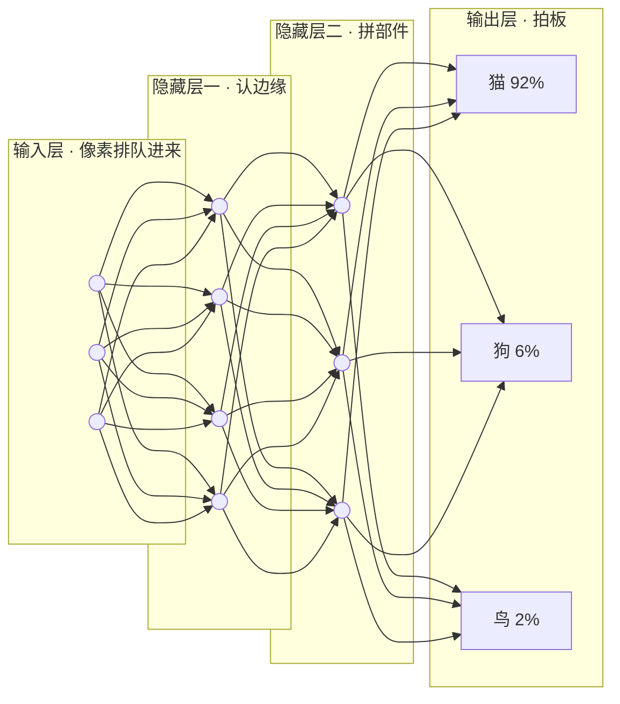

# 第 03 课　神经网络

上一课我们说，机器学习就是"给例子和答案，让机器自己找规律"。这一课我们打开黑盒看一眼：机器到底用什么结构来"找"？答案就是神经网络——几乎所有大模型的地基。放心，今天一整个数学推导都不需要，你只要会"加权打分"就够了。

---

## 一、先把误会说清楚：它不是大脑的复制品

"神经网络"这名字听起来唬人，很多人第一反应是"科学家在电脑里造了一个大脑"。先把这个误会拆掉：

它只是**借用了大脑的名字**。上世纪的科学家受人脑中神经元互相连接的启发，把计算单元也起名叫"神经元"、把连接叫"网络"。但真的大脑有近千亿个神经元，连接方式复杂到今天都没完全弄明白；而人工"神经元"本质上就是**一个小小的算式：收几个数，加权求个和，输出一个数**。它不会思考，也不打算复刻思考。

打个比方：飞机受鸟启发，但飞机不扇翅膀。神经网络和大脑的关系也是"借了灵感，没抄作业"。所以后面再看到"神经元""激活"这些词，别紧张，它们都是平易近人的数学小零件。

---

## 二、一个"神经元"在算什么：一场加权投票

从一个你天天在做的决策说起：买不买一套房？你会看地段、面积、价格三条线索。心里其实有杆秤——地段最要紧（话语权大），面积其次，价格稍逊。综合下来打个分，分数过了你心里的那条线，就心动了。

一个人工神经元干的就是这件事，一字不差：

1. 收进若干条**输入**（x₁、x₂、x₃……相当于三条购房线索的各自打分）
2. 每条线索各乘一个**权重**（w₁、w₂、w₃……就是心里那杆秤：这条线索有多重要）
3. 全部加起来，再补一个**偏置**（b，相当于门槛的松紧：同样的总分，心软的人容易过线，挑剔的人难得过线）
4. 把结果送进**激活函数**，决定这个神经元最终"说多大声"

写成一行就是：

> 输出 = f(w₁x₁ + w₂x₂ + w₃x₃ + b)

别被符号吓到，翻译成大白话：**按重要性加权求和，加上门槛，再过一道开关。** 第四课你会看到，所谓"训练"，练的就是这些权重和偏置——机器自己把那杆秤调准。

---

## 三、没有激活函数，叠再多层也白叠

激活函数就是上面说的那道"开关"：拿到加权总分后，决定输出多少。为什么非要这一道？因为如果神经元只会"加权求和"，那么不管你叠多少层、塞多少个神经元，整个网络从头到尾都还是在做放大版的加权求和——**数学上，一百层等价于一层**，钱花了，能力一点没涨。

类比一下：一个只会沿直线开车的司机，不管连开几段路，走的永远还是一条直线；只有允许他拐弯，才能在地图上绕出任何形状。激活函数给网络的就是这种**"拐弯"的能力**——术语叫非线性。有了它，网络画出的分界线才能弯弯曲曲地贴合现实（现实里"会按时还贷的人"和"不会还贷的人"，从来不是一条直线能切开的）。

两个最常见的开关，看形状就行，不用推导：

- **ReLU**：规则粗暴——正数照抄，负数归零。像一位极简的评委："没有亮点就说没有，绝不硬夸。"正因为简单，它算得飞快，到今天仍是各类网络的常客。
- **Sigmoid**：形状是个 S，把任意大的分数都压进 0 到 1 之间，越大越接近 1。适合回答"把握有多大"这类问题——0.9 就是十拿九稳。

补一句 2026 年的现状：你以后还会反复碰到 GELU 这一族的开关，可以理解成"更顺滑的 ReLU"，这一代大语言模型里几乎都是它在站岗。用法和 ReLU 是一回事，先混个脸熟。

---

## 四、层：从"边缘"到"猫"，一层比一层抽象

单个神经元只会加权打分，本事有限。神经网络的真正威力在于**把成千上万个神经元编成队**，一层层传递：

- **输入层**：接待处，收原始数据，不做加工（一张图就是几百万个像素值，排着队进来）
- **隐藏层**：加工车间，一层叠一层。层数越多，网络越"深"——"深度学习"的"深度"就是从这来的
- **输出层**：发布台，给出最终答案

隐藏层里发生了什么？拿认猫举例（这是直觉说法，真实分工未必这么整齐，但大方向如此）：靠近输入的那层只能认出最简单的东西——横的竖的边缘、明暗交界；下一层把边缘拼起来，认出毛发纹理、圆弧；再下一层把纹理拼成耳朵、胡须、猫脸这些部件；最后输出层综合所有部件，拍板：是猫。

从"边缘"到"部件"再到"猫"，一层比一层抽象。而且没有人教过中间任何一层"什么是耳朵"——这些都是训练时自己长出来的。第 02 课说机器学习"自己找规律"，这里就是最具体的画面：特征是网络自己提炼的，不用人手把手教。

---

## 五、数据走一遍：前向传播与"可能性"的换算

数据从输入层出发，穿过一层层隐藏层，最后从输出层出来得到答案——这一整趟就叫**前向传播**。名字挺唬人，其实就是"流水线走一遍"：每个神经元收到上一层的产出，加权、加门槛、过开关，把结果交给下一层。

到了输出层还有最后一步。网络内部其实给每个候选答案都在打分，比如"猫 8.2 分、狗 3.1 分、鸟 0.4 分"。这种原始分数看着别扭：没有上限，加起来也不等于任何好懂的数。所以最后用 **softmax** 把它们换算成"可能性"：分数高的占的份额大，所有可能性加起来恰好等于 1——就像把几位选手的得分换算成各自的支持率。8.2、3.1、0.4 经它一换，就成了"猫 92%、狗 6%、鸟 2%"。

从此你听到"模型输出了一个概率"，就知道背后是这么回事：**网络先打分，softmax 把分数换算成加起来等于 1 的占比。**

---

## 想一想

先自己回答，能讲给别人听最好。

1. 用"买房打分"的说法，向家人解释一遍权重和偏置各管什么。
2. 把一个网络里所有激活函数都撤掉，这个网络会发生什么？用"直线和拐弯"把它说明白。
3. 认猫的例子里，为什么是浅层认边缘、深层拼部件？"浅层认部件、深层认边缘"说得通吗？
4. 网络给三个类打分：8.2、3.1、0.4。为什么不能直接说"猫的可能性是 8.2"？softmax 换算出来的三个数必须满足什么条件？

---

## 小结

- 神经网络只是借了大脑的名字：人工神经元是个小算式——输入乘权重、加偏置、过激活函数。
- 权重是心里那杆秤（线索有多重要），偏置是门槛松紧；下一课讲的"训练"，练的就是这两样。
- 激活函数给网络"拐弯"（非线性）的能力：没有它，一百层等价一层；ReLU 简单快速，这一代大模型里常见的是更顺滑的 GELU 一族。
- 一层层叠起来，网络自动从边缘、纹理拼出部件、再拼出整体，特征越提越抽象，且不用人教。
- 数据从左到右走一遍叫前向传播；输出层先打分，softmax 把分数换算成加起来等于 1 的可能性。

这些权重和偏置，在网络出生时其实是随机瞎设的。怎么把它们一步步调到"秤准、门当、开关灵"？这就是下一课"训练"要讲的事。

---

2026 年 10 月
