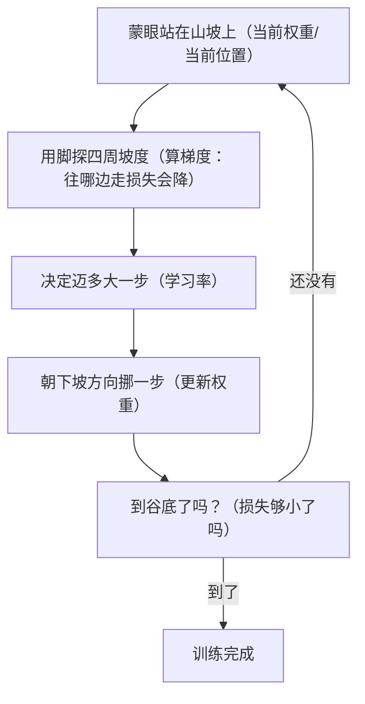

# 第 04 课　深度学习是怎么练出来的

上一课我们看了神经网络长什么样：一层层神经元，靠权重把信号传下去。但有个要命的问题一直没回答——这些权重是哪来的？答案是：一开始全是随机乱设的数字，网络的输出自然一塌糊涂。这一课就讲它怎么从一塌糊涂，一步步练到像模像样。

---

## 一、一开始，网络就是个"乱猜机器"

神经网络刚初始化的时候，里面几百万甚至上亿个权重全是随机数。你给它一张猫的照片，它可能告诉你"这是一辆公交车"——不奇怪，里面的旋钮本来就是乱拧的。

那怎么变好？你可能已经想到了第02课的结论：给它大量例子和标准答案，让它自己调。具体到神经网络，所谓**训练**，就是把这些权重一遍遍小幅调整，让错误越来越小的过程。

这就像调淋浴水温：一开始乱拧，水太烫或太冰，你感受一下差距，往对的方向拧一点，再感受，再拧。神经网络做的事本质相同，只是它要同时拧的"旋钮"有上亿个，而且没人告诉它该拧哪个方向——这得靠它自己摸索。接下来几节，我们就把"摸索"拆开看。

---

## 二、先给"错得有多离谱"打个分：损失函数

要调，得先知道现在错得多离谱。神经网络的做法很直接：拿预测和标准答案一比，算出一个数字，专门衡量"这一轮错得有多厉害"。这个数字就叫**损失**（loss），负责算它的规则就叫**损失函数**。

它像老师改卷：不看过程，就给你一个分数——只不过这里的分数衡量的是"错的程度"，越低越好。预测和答案差得越远，损失越大；预测全对，损失接近零。

于是训练的全部目标变得特别清晰：**让损失变小。** 之前说的"让错误越来越小"，落到实处就是盯着这一个数字往下压。

---

## 三、蒙着眼下山：梯度下降

现在的问题变成：损失这么高，该往哪个方向调权重，损失才会降？

想象你蒙着眼站在一片山坡上，目标是走到谷底。你看不见路，但脚还管用：用脚探一探四周，感觉哪边更陡地往下斜，就朝那边挪一步；站定，再探，再挪。重复足够多次，你总能走到谷底附近。

神经网络干的就是这件事，这套笨办法有个正式名字：**梯度下降**（gradient descent）。"梯度"这个词听起来吓人，直觉上就是"当前位置四周的坡度"——它告诉你哪个方向上坡最陡。上坡的反方向就是下坡，所以每次都朝梯度的反方向挪一点，损失就降一点。

顺带说一句：真实的"损失地形"往往是复杂的高维山谷，可能有好几个坑洼。但"探坡度、往下走"这个核心动作，从来不变。

---

## 四、步子迈多大：学习率

下山还有个关键决定：一步迈多大？这就是**学习率**（learning rate）——训练开始前需要人为拧好的一个旋钮。

- **迈太大**：一步直接跨过谷底，落到对面坡上，而且往往比刚才更高。接下来又在对面跨回来，来回横跳，越蹦越高——训练里叫"发散"，损失不降反升。
- **迈太小**：方向没问题，但每次只挪一毫米，走一万步还在半山腰，训练慢得急人。

好的学习率是让损失稳步下降、步子又不太小的那个中间值。实际训练里它常是首先要调的参数，本课末尾的动手题会让你亲眼看看"迈太大"是什么景象。

---

## 五、错了怪谁：反向传播

前面始终藏着一块硬骨头：网络有上亿个权重，预测错了之后，**每个权重各该改多少、往哪边改？** 总不能挨个试——每试一个都要把整个网络重新跑一遍，上亿个权重试一轮，太阳系都凉了。

深度学习的答案是**反向传播**（backpropagation）。直觉上，它像公司出了事故之后的复盘：从最终结果往回倒推，一层层分摊责任——"这次输出错了，最后一层背三成，倒数第二层背两成……"一直分到最前面。分完之后，每个权重都知道自己"这锅背多少"，也就是知道了自己该往哪个方向、改多少。

这个"从输出层往输入层、逐层把责任往回传"的过程，靠的是微积分里的链式法则。你暂时不需要会推它，只需要记住它的价值：**不用挨个试，一遍从后往前，就能把全部上亿个权重的梯度同时算出来。** 没有它，训练上亿参数的网络只是纸上谈兵。

到此，训练的一个完整循环凑齐了：

这个循环转一圈，权重就整体变好一点点；转上几十万圈，乱猜机器就慢慢变成了像样的模型。你现在再听到"模型训练了三周"，脑子里应该浮现的就是这个圈在嗡嗡地转。

---

## 六、下山的姿势也在进化：优化器

"朝梯度反方向挪一步"只是最基本的走法，学名叫 **SGD**（随机梯度下降）。它朴素管用，但有个毛病：山谷如果是弯的，它容易在谷壁间来回撞，走得磕磕绊绊。

于是有了各种改良走法，统称**优化器**。你可以把它们理解成下山的不同姿势：

- **带动量**：像骑自行车下坡，连续几步都朝同一个方向，就攒点"惯性"，步子迈得更顺更快，不至于被一个小坑卡住。
- **自适应步长**：每个权重按自己的地形自动配一个合适的步幅，陡的地方小心挪，平缓的地方大步走。

其中最出名的是 **Adam**，它的改进版 **AdamW** 在今天依然是大模型训练最常用的默认选择；这几年也有 Muon 等新优化器在部分大模型训练里崭露头角。名字你可能记不全，没关系——它们全都是"探坡度、往下走"这一个母题的变体，区别只在姿势好不好看。

最后补两个你以后一定会撞到的词：

- **batch（批）**：一次拿几道题一起算，取平均损失再调一次权重。一道一道看太抖，全部一起看太慢，折中一次看一批（比如 32 道、256 道）。
- **epoch（轮）**：整套训练题从头到尾刷完一遍，算一个 epoch。训练通常要刷很多遍，就像你复习错题本不会只过一遍。

---

## 七、这就是"自动学特征"的发动机

第02课说过，机器学习的神奇之处是"自动从数据里学规律"，当时你可能觉得这话有点玄。现在你可以把它翻译成大白话了：所谓自动学，就是**损失函数指出错在哪，反向传播分清每个权重该怎么改，梯度下降带着上亿个权重一步步挪向正确**——三个部件咬合在一起的那个循环，就是发动机本身。

下一课我们回到语言模型：文字没法直接塞进这台机器，得先变成数字。怎么变，是第05课的事。

---

## 想一想

先自己回答，能讲给别人听最好。

1. 一开始为什么不直接把权重设成"正确值"，而要从乱设开始慢慢调？（提示：想想上亿个权重，谁能一眼看出每个该是多少？）
2. 蒙眼下山的类比里，"山谷""你站的位置""脚探到的坡度"分别对应训练里的什么？
3. 损失如果越训越大，最该先怀疑哪个旋钮拧错了？为什么？
4. （动手）打开本课目录的 `gradient_descent.py` 跑一遍，看 x 如何一步步逼近 3。然后把 `LEARNING_RATE` 改成 1.0 再跑，观察发生了什么；再改成 1.01，看看"越蹦越高"长什么样。

---

## 小结

- 网络的权重一开始是随机乱设的，训练就是反复微调这些权重、让损失越来越小的过程。
- 损失函数把"错得有多离谱"压成一个数字；梯度告诉你往哪个方向挪、损失会下降；每步挪多大由学习率决定——太大来回蹦，太小慢死人。
- 反向传播从输出层往回逐层分摊责任，一遍算出全部权重的梯度，解决了"上亿权重高效调整"的难题。
- SGD 是朴素下坡，AdamW 这类优化器给下山加了惯性和自适应步长；batch 是一次看几道题，epoch 是整套题刷几遍。
- 这套"前向算损失、反向传梯度、更新权重"的循环，就是深度学习自动从数据里学规律背后真正的发动机。

---

2026 年 10 月
