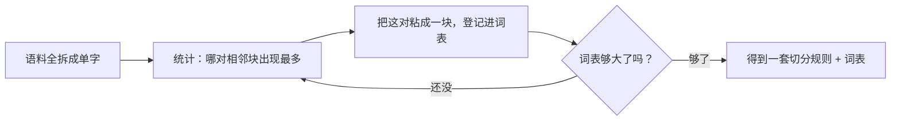

# 第 05 课　文字怎么变成数字：Tokenizer 与 Embedding

到上一课为止，我们已经知道模型是怎么在训练中一点点变好的。但还有一个更基本的问题一直没问过：文字在模型眼里，到底长什么样？

答案简单到有点扫兴：**它看不到字，只看到数字。**你输入"今天天气真好"，模型压根没有读到这几个汉字，它读到的是一串数。这一课就讲清这个翻译过程分几步、每一步在干什么。配套的 `token_demo.py` 可以亲手跑一遍，建议边读边玩。

---

## 一、第一道坎：电脑只认数字

先想清楚为什么非翻译不可。模型的本体是神经网络（第 03 课的主角），它的底层就是成千上万次乘法和加法，而乘法加法只对数字有意义——"猫"乘以 0.3 是没有定义的。

所以不管你输入的是文字、语音还是图片，进门之前都得先变成一串数。这就像跟一位只懂摩尔斯电码的老报务员通信：无论你想说什么，都得先译成滴答滴答的电码，对方才能处理。这一课讲的就是这套"电码本"是怎么设计的。

---

## 二、最朴素的译法：每个词一间小黑屋

最直观的译法笨归笨，值得先看一眼，因为它是理解后面一切的参照物。

假设词表里只有三个词：猫、狗、汽车。那就用三个格子表示它们——轮到谁，谁的格子是 1，其余全是 0：

- 猫 = [1, 0, 0]
- 狗 = [0, 1, 0]
- 汽车 = [0, 0, 1]

这叫 **One-hot 编码**（独热编码：一堆 0 里只有唯一一个"热"的 1）。想法很老实：一个萝卜一个坑。但毛病马上就来。

第一个毛病，**屋子不够分**。真实模型的词表动辄十万起步（这一代大模型普遍在十万上下甚至更多），按这个译法，每个词都得是一个十万格、其中九万九千九百九十九格是 0 的巨型列表。好比盖了一座十万层的楼，每层只住一个词，其余楼层常年空着——空间全浪费了。

第二个毛病更致命，**词和词之间谁也不认识谁**。猫的向量是 [1,0,0]，狗是 [0,1,0]，两串数字重合的地方是 0——用数学的话说，它们互相"垂直"。于是猫和狗的差距，和猫跟汽车的差距，一模一样。这就像给每个词发了一间隔音小黑屋：猫住 3 号房，狗住 4 号房，汽车住 7 号房，房间号本身不携带任何信息，猫不知道狗是自己的同类。可我们明明知道"猫和狗都是宠物，汽车不是"——这份常识在编码里一点都没留下来。

所以我们需要一种新译法：既要省地方，又要让"意思近的词"在数字上看得出来。

---

## 三、先切后编：Token 与词汇表

在换译法之前，还差一步：句子得先切开。

模型拿到"我爱人工智能"，第一步不是编码，而是**切成小块**，每一块叫一个 **token**（词元）：

我爱人工智能 → 我 / 爱 / 人工 / 智能

然后查一张对照表，"我"是 5 号，"爱"是 102 号……把文字换成串编号。这张全模型通用的对照表就叫**词汇表**，你可以把它理解成电码本的正文。

那为什么不干脆按整词切，一步到位？试过就知道不省心：

- 词汇量爆炸：英语里 happy、happier、happiness、unhappiness 各算一个词形，几十万个词形，词表厚得查不动。
- 生词没见过：明天冒出来的网络热词、新品牌、人名，词表里肯定没有，整词切碰到生词只能举白旗。
- 中文还有分词歧义这类老问题，整词切也躲不开。

于是主流做法走**子词**（subword）路线：**常见的词整个存，生僻的词拆零件。**就像玩乐高：常用造型做成整块直接用，没见过的造型就用手头的小零件现场拼。汉语里"共享"天天出现，就整块存；哪天冒出个生僻的"共享员工"，把现成的"共享"和"员工"拼在一起就行。英文同理：un 和 ness 这类零件整存，unhappiness 来了就拆成 un + happi + ness。

拆到最细也不过是单个字符，而字符总量是有限的——所以**任何新词都拼得出来，"不认识的词"从此不存在了**。这是子词思路最漂亮的地方。

---

## 四、BPE：把最常挨在一起的两块粘起来

子词词表是怎么造出来的？用得最多的算法叫 **BPE**（Byte Pair Encoding）。名字唬人，原理一句大白话：**从把所有词拆成单字开始，看哪两块最常挨在一起，就把它们粘成一块、登记进词表；然后再看、再粘，反复到词表够厚为止。**

拿一小把词走两步（演示脚本里就是它）：

- 语料：人工智能、工人、人工费、智能锁、智力
- 第 1 轮数一数："人+工"出现 2 次、"智+能"也出现 2 次，最常见 → 把"人+工"粘成"人工"
- 第 2 轮再看："智+能"出现 2 次最多 → 粘成"智能"
- 现在词表里多了"人工"和"智能"两个块，再来一句"人工智能工程师"，就能拼成：人工 / 智能 / 工 / 程 / 师

你看，token 不是谁拍脑袋定的，是**从大量文本里数出来的**：越常挨在一起出现的字，越有资格粘成一个整块。

> 顺带一句：BPE 本来是上世纪九十年代数据压缩领域的老办法，2016 年被搬进机器翻译后成了分词的标配。今天各家大模型的 tokenizer 大多是它的变体，思想一脉相承：高频合并，宁拆勿猜。

---

## 五、Embedding：给每个 token 一张"语义身份证"

现在回到第二节留下的坑：编号只是门牌号，猫住 3 号狗住 4 号，还是互相不认识。真正让词"住进同一个小区"的，是 **Embedding**（嵌入）。

做法：给词汇表里每个 token 发一**长串小数**，比如：猫 = [0.9, 0.1, 0.3, 0.8]。真实模型里这个长度是几千，我们画不出来，但可以拿地图找感觉：把一个词看成地图上的一个**点**，几万个词撒在同一张图上——意思近的词扎堆住在同一片，"宠物区""交通工具区""水果区"自然成形。真实情况就是把这张地图升到几千维而已。

关键在两点。

第一，**每一格是什么数字，不是人编的，是训练调出来的。**模型读海量文本，用第 04 课讲的训练方法不断微调这串数，目标很朴素：让能互相替换的词，数字越调越近。猫和狗总出现在相似的句子里（会动、会叫、被人养），向量就越来越靠近；汽车出现的语境完全不同，就被调去了别处。教科书上管这叫"分布式表示"，大白话版本就一句：**一个词的意思，由它周围的词决定。**

第二，**数字真的能装下"关系"。**最有名的例子是国王与王后：

国王 − 男人 + 女人 ≈ 王后

把"国王"的向量减去"男人"的向量，再加上"女人"的向量，落点几乎就是"王后"。这串数字里竟然编码出了"性别"这样的抽象概念——就像地图坐标里藏着东西南北，语义空间里藏着性别、大小、年龄段这些维度，只是模型自己学出来的维度，没人给它们起过名字。

至此，一整条流水线就通了：

出门前是文字，进门时已经是一排向量了。词表多大、向量多长，各家模型选择不同（这一代普遍词表十万上下、每词几千维），但流程从 2013 年 Word2Vec 到今天没变过——变的只是这张表做得更大、调得更准。

---

## 六、意思近不近？量一量两支箭头的夹角

词有了向量，新问题来了：怎么用数字回答"猫和狗像不像"？

把每个向量想成一支从原点出发的**箭头**。两支箭头方向越接近（夹角越小），意思越近；互相垂直，就是毫无关系——One-hot 世界里所有词恰恰全都互相垂直，这也正是它丢掉语义的几何解释。衡量这件事的常用工具叫**余弦相似度**，它还有个更朴素的兄弟叫**点积**。你暂时只需要记住直觉：这两个操作都是在问"两支箭头方向有多一致"，公式等用到时再看。

演示脚本里那几个手工向量算出来的结果是：猫和狗的相似度一骑绝尘，猫和汽车居中，猫和苹果垫底——排序和你的直觉一致。

为什么现在就要认识点积？因为下一课的注意力机制——Transformer 的心脏——做的核心动作就是它：**把一句话里每个词的向量，和句中其他词的向量两两做点积，谁和谁关系铁，数字立刻见分晓。**今天种的这颗种子，下节课发芽。

---

## 七、最后一个现实问题：tokenizer 是和模型绑定的

还有一件使用中会撞上的事：**tokenizer 不是通用的字典，它是随模型一起配套训练的。**

每家模型开训之前，先拿自己的语料跑一遍 BPE，造一本自己的词表。所以同一句话喂给不同模型，切出来的 token 往往不一样，编号更是完全对不上。这也解释了两件日常小事：为什么换模型就得连 tokenizer 一起换（旧模型的向量表对新词表的编号毫无意义）；为什么调用 API 按 token 计费——同一段话在不同模型那里的"字符成本"本来就不一样。

想亲眼看真实模型的切法？演示脚本末尾附了一段注释代码，装好 `transformers` 后就能让大模型把你的名字切给你看——多半会被拆成两三块，因为生僻组合都得拆零件。

---

## 想一想

先自己回答，能讲给别人听最好。

1. 用"小黑屋"的说法解释：One-hot 编码丢掉了什么信息？Embedding 是靠什么把这份信息找回来的？
2. 为什么子词比整词更能对付生词？拿一个你想到的新词（网络热词、新品牌都行），说说它会被怎么拆。
3. 两个词的向量夹角很小，可能说明什么？如果夹角接近 90 度呢？为什么说 One-hot 世界里所有词都"互相垂直"？
4. （动手）运行 `token_demo.py`。然后往 WORDS 语料里加两个"工"和"人"连排的词（比如"工人阶级""建筑工人"），再跑一遍——第二轮的合并对象变了吗？提示：出现次数并列时，脚本取先出现的那一对。

---

## 小结

- 模型只认数字：文字进门先切成 token、查词汇表换成编号，再按编号取出 Embedding 向量，这才进入神经网络。
- One-hot 一词一格，又费地方又让词与词互相垂直；Embedding 把词变成一串可训练的小数，意思近的词数字也近。
- token 的切法由 BPE 这类算法从语料里数出来：常见词整存，生僻词拆零件，再新的词也拼得出来。
- 两支箭头夹角越小意思越近，点积和余弦就是量夹角的——下一课注意力机制的核心动作正是它。

下节课我们走进模型内部：这么一排向量进去，模型怎么决定该"关注"哪个词？那就是鼎鼎大名的注意力机制。

---

2026 年 10 月
