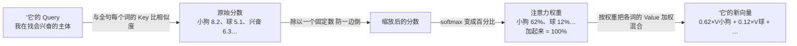
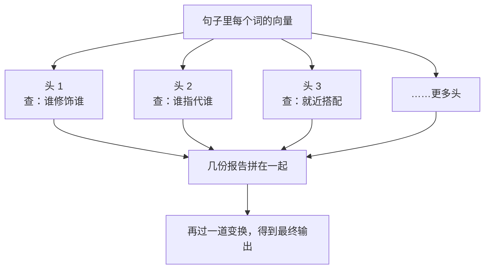

# 第 06 课　注意力机制：机器如何抓住重点

读完这句话，你大概不会觉得"小狗追着球跑，因为它很兴奋"里的"它"是指球。但机器凭什么也知道？再换一句——"小狗追着球跑，因为它滚得飞快"，同一个"它"，指向立刻变成了球。你毫无感觉就完成了这次判断，这一课我们要拆开的，就是让机器也具备这种能力的关键零件：注意力机制。它是理解大模型最重要的一块拼图，我们会把每一步都讲透，但全程不堆数学。

---

## 一、上一课留下的一个坑

上一课我们说过：机器不认识字，它把每个词变成一串数字（词向量），意思相近的词，向量也挨得近。这套做法好用，但有个隐患——**每个词只有一个固定的向量，走到哪儿都带着同一副面孔。**

麻烦立刻就来了。英文里 bank 既有"银行"的意思也有"河岸"的意思，但在旧做法里，bank 不管出现在"我把钱存进银行"还是"我们坐在河岸钓鱼"里，得到的都是同一个向量。中文也一样："它"的向量里只有"这是个代词"这层信息，完全不知道自己在这句话里指的是小狗还是球。

一句话的意思，恰恰藏在词与词的**关系**里：理解"它"，必须回头看"小狗"；理解 bank，必须看看旁边是 money 还是 river。固定的向量装不下这种关系。

## 二、注意力的想法：按相关程度调一份"混合果汁"

注意力给出的解法特别朴素：

> 一个词的新表示，不要只靠自己，而是把全句所有词按"跟我有多相关"的比例混合进来，调一份只属于这句话的混合物。

打个比方，像调一杯果汁：小狗占 60%，球占 12%，其他词分剩下的——"它"在这句话里的新向量，就以小狗为主料，掺一点别的词。"小狗追着球跑，因为它滚得飞快"里，比例就得反过来，球变成主料。**同样的词，语境不同，混合比例不同，最终的表示就不同。**bank 的两种含义，也自然被区分开了。

那么问题只剩一个：这个"相关程度"怎么算？机器需要一个具体流程。

## 三、Q、K、V：去图书馆查一次资料

把每个词想象成图书馆书架上的一本书。现在你（某个词）带着一个问题走进来，想收集资料：

- **Query（查询）**：你心里想找什么——"我在找一个会兴奋的、有生命的主体"；
- **Key（键）**：每本书书脊上的标签，写的是"我能提供什么"——"小狗"的标签是"一种动物、会跑会叫"；"球"的标签是"一种物体、会滚"；
- **Value（值）**：书的实际内容，标签匹配上了，真正拿走的是这部分。

查资料的流程正好就是注意力计算的流程：

1. 拿你的 Query，去和**每一本书的 Key** 对一对，看多匹配，各打一个相似度分；
2. 把这些分数换算成一组百分比——小狗 62%、球 12%、跑 8%……加起来正好 100%。这步的学名叫 **softmax**，你就理解成"把打分变成分账比例"：分高的多分点，分低的少分点，但总和恒为 1；
3. 按百分比把各本书的 Value 混合拿走。62% 拿小狗的内容，12% 拿球的……混出来的结果，就是"它"在这个句子里的新向量。

有个细节值得停一下：为什么要 Key 和 Value 两套，标签和内容不是一回事吗？还真不是。书的标签是"广告"，内容是"货"——广告打得响的，未必是你真正要的东西；一个词"用来匹配的侧面"和"真正提供的内容"，让它们各自独立、各学各的，机器才能学出更灵活的匹配方式。

还有一处容易误会：Q、K、V 不是天上掉下来的三样东西，它们都从**同一个词向量**变换而来——相当于每个词的三副面孔，见人下菜碟。上一课我们说训练就是让机器自己调参数，这里的三套"变换方式"正是靠训练学出来的。当初读到"小狗"的标签、内容是哪副面孔，没有标准答案，全是训练时一点点磨合出来的。

## 四、自注意力：一句话内部互相打招呼

上面的流程里，Query、Key、Value 全都来自**同一句话**的各个词，所以这套操作叫**自注意力（Self-Attention）**——一句话内部，词与词两两打招呼、互相看了一眼。

以"小狗追着球跑，因为它很兴奋"为例，轮到处理"它"时，整个句子都要被看一遍。下面这行权重是编的示意数字（真实的权重由模型算出，我们在这里只要看形状）：

| "它"看向 | 小狗 | 追着 | 球 | 跑 | 因为 | 它 | 很 | 兴奋 |
|---------|------|------|----|----|------|----|----|------|
| 权重    | 0.62 | 0.05 | 0.12 | 0.08 | 0.01 | 0.04 | 0.02 | 0.06 |

"它"把六成多的注意力给了"小狗"——正是这种分配，让"它"的新表示里装进了"小狗"的信息，指代关系就这样被编码进了数字。而每一行的权重加起来都是 1，也就是每个词都会得到一份自己的"全句混合物"。

把整个流程画成图，就是注意力的全部骨架：

这套机制还有个附带的好处。早期的另一种做法（RNN 那类，第 03 课提过的"一条链传到底"）像传话游戏，第 50 个词想了解第 1 个词，消息要经过 49 道手，越传越糊。自注意力里，任何两个词都是**一步直达**——第 50 个词的 Query 直接去比第 1 个词的 Key，中间不经过任何传话人。长句子里隔得再远的词，也能直接建立联系。

## 五、一个小小的除法：防止投票一边倒

流程图里"除以一个固定数"那一步，值得单独说两句，因为它对应的正是大家最常见到的那个公式：

$$\text{Attention}(Q, K, V) = \text{softmax}\left(\frac{QK^\top}{\sqrt{d_k}}\right)V$$

别慌，我们一项项翻译成人话：

- **QKᵀ**：每个词的 Query，去和所有词的 Key 两两比相似度，得到一大片分数；
- **/√d_k**：把每个分数除以一个固定数。为什么？向量的维度一多（几百上千维），比出来的分容易动辄差出几十分——softmax 有个脾气：**分数差距越大，分账越极端**，9 分和 8.9 分它几乎对半分，9 分和 0.1 分它就把前者判成 100%。这就像一场比分悬殊的投票：票几乎全投给第一名，其余人颗粒无收。真到那一步，"混合果汁"就退化成"纯果汁"，其他词的信息一点进不来，机器也失去了细腻区分"相关程度"的能力。除一下，把分数拉回温和的区间，投票才有商有量；
- **softmax**：把分数变成加起来等于 1 的百分比；
- **×V**：按百分比把所有词的内容加权混合。

所以这个看着唬人的公式，说的其实就一句话：**比相似度 → 别让分差太夸张 → 换成百分比 → 按比例混合内容。**

## 六、多头注意力：几个侦探各查一条线

到现在为止，我们默认一句话里只有一种"相关"。但回头看那个例句，"它"和小狗之间是**指代**关系，"追着"和"球"之间是**动作与对象**的关系，"很"和"兴奋"之间是**修饰**关系——好几种完全不同类型的关系，同时藏在同一句话里。

让一个头全包，就像让一个侦探同时查案子的所有线索，容易顾此失彼。实际的做法是**多头注意力（Multi-Head Attention）**：并行摆好几个头，每个头有自己独立的一套 Q、K、V 变换，各查各的线索——可能这个头专盯"谁修饰谁"，那个头专盯"谁指代谁"，还有一个头盯"哪两个词总就近搭配"。最后把几个侦探的结案报告拼在一起，合成最终结果。

今天的主流大模型，每一个注意力层里都并排装着几十上百个这样的头。顺带一提，注意力也不只管文字——图像模型同样在用它，只是"词"换成了图像小块。另外，真实系统里注意力算起来非常费算力，工程上还有专门给它提速的实现（比如 FlashAttention 这类工作），那属于工程优化的故事，这一课我们只要理解原理就够了。

## 七、掩码：考试不许偷看后面的答案

还剩最后一块拼图。第 08 课我们会看到，大模型写回答是一个词一个词往外蹦的：写完"今天"，才根据"今天"决定下一个词，再往下续。**在训练它这种能力时，就得模拟同样的处境**——轮到看第 5 个词时，只许看前 5 个词，后面的词必须当成不存在。

这就是**注意力掩码（Mask）**：把"未来的位置"在打分环节直接封掉。做法简单粗暴——那些位置的相似度分直接记成负无穷，softmax 一算，它们的权重就是 0。好比考试时用一块挡板把卷子后半页遮住，想偷看都看不见。

为什么这么较真？想想看，如果训练时能偷看未来，模型就会学出一身"抄后面答案"的假本事，真到了你一句一句跟它聊天时，后面根本没有答案可抄，它就露馅了。掩码保证了训练和真正使用时的处境一致——记住这个设定，第 08 课讲"大模型怎么说出回答"时，它会正面登场。

---

## 想一想

先自己回答，能讲给别人听最好。

1. "小明把书放进了书包，因为它快满了"和"小明把书放进了书包，因为它太好看了"，两句话里"它"分别指什么？用注意力的语言说说：这两句里"它"的 Query 会给谁的 Key 打高分？这说明注意力学到的匹配是写死的规则，还是随语境变化的？
2. 如果不要 Key，直接拿每个词的内容（Value）去和 Query 比相似度，好像也能算出权重。你觉得损失了什么？（提示：想想"标签"和"内容"的分工。）
3. 假如把"除以 √d_k"这一步去掉，分差变得悬殊，一句十几个词的话里会发生什么？用"投票一边倒"的话描述一下每个词的新表示会变成什么样。
4. （动手感受）找一句带代词歧义的话发给 AI 助手，让它解释代词指谁；再把歧义词换掉重发一次，观察它的解释是否跟着变。结合这一课，想想它内部多半发生了什么。

---

## 小结

- 理解一句话的关键是抓住重点、连起相关词。注意力让每个词的新表示由全句所有词按相关程度加权混合而成，同一个词在不同语境里有了不同的表示。
- 流程记图书馆就够了：Query 是我在找什么，Key 是我能提供什么，Value 是真正给你的内容；比相似度、softmax 换成加和为 1 的百分比、按比例混合 Value。
- 自注意力让句子内部词与词两两一步直达；除以 √d_k 是为了防止 softmax 投票一边倒。
- 多头注意力像几个侦探各查一条线索，指代、修饰、搭配各有头管，最后拼成完整结论。
- 掩码挡住未来，保证模型生成时不偷看还没说出口的词——这是它一个词一个词往外说话的前提。

注意力这台"发动机"我们已经拆完了，但光有发动机还开不了车：它怎么排班、怎么一层层叠加、前后还配了哪些零件？下一课的 Transformer，就把这些组装成当今几乎所有大模型共用的完整骨架。

---

2026 年 10 月
