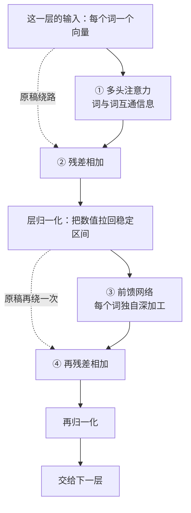
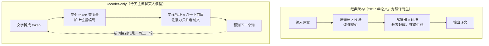

# 第 07 课　Transformer：大模型的骨架

前面几节课，零件已经备齐了：第 05 课把文字变成了一串向量，第 06 课的注意力让每个词学会"重点看谁"。这节课做最后一步装配：把这些零件装成一台完整的机器。它有个正式名字——**Transformer**，今天几乎所有大模型共用的骨架。GPT、Claude、Gemini，还有国内的一批大模型，剥开外壳，里面都是这一个模子刻出来的结构。

> 提前打个招呼：这一课名词有点密。别慌，每个词我们都先看它解决什么麻烦，再叫它的学名。某一节看不懂很正常，做个记号往后走，回头再看常常就通了。

---

## 一、旧骨架卡在哪：一场越传越丢的传话游戏

Transformer 之前，处理文字的主力叫 RNN（循环神经网络，后来升级成 LSTM）。它的思路很朴素：像人读句子一样，从左到右一个词一个词地读，每读到一个词，就把它的信息揉进一个"随身小本本"，再把小本本传给下一步。

麻烦恰恰出在这个"传"字上。

第一，它是一场**传话游戏**。第 1 个人把话悄悄告诉第 2 个人，第 2 个人传给第 3 个人……传到第 50 个人那里，开头那句早就面目全非了。RNN 的小本本也一样：句子一长，开头的信息经过几十轮转手，被冲淡、揉烂。这就是为什么早期模型常常"读了后头忘了前头"。

第二，它必须排队。每个词的计算都依赖上一个词的结果，第 100 个词必须等第 99 个算完才能开工——就像安检口只开一条通道，人手再多也使不上劲。可 GPU 这家伙最擅长的恰恰是"几百件事同时干"，让它跟着 RNN 排队，等于让整个乐团每人轮流独奏。

2017 年，Google 的研究团队发表了一篇论文，标题起得相当狂：Attention Is All You Need（注意力就是你需要的一切）。意思是：既然注意力已经能让任意两个词直接对上话，那还要"排队传话"干什么？把循环整个扔掉，只留注意力。这篇论文（八位作者，如今几乎被引用成了传说）造出来的结构，就叫 Transformer。

---

## 二、底座：让每个词直接看见每个词

第 06 课已经拆过注意力，这里把它接回来当底座。

- **自注意力**：每个词带着"我想找什么"的查询，去和句中所有词的"标签"对暗号，对上了就按比重把对方的内容吸收进来。任意两个词之间都是一步直达，没有中间商——传话游戏里的一层层转手，从此不存在了。
- **多头注意力**：一组注意力只能盯一种关系，所以让好几组（几个"头"）同时开工：有的盯语法搭配，有的盯指代关系，有的盯相邻的词，最后把各家的发现拼到一起——像几位审稿人各看各的角度，再合议定稿。

还有一份隐蔽的大礼：整句话所有词的两两关系可以摆成一张大表格、一次算完，这正好是 GPU 最爱吃的矩阵运算。RNN 求而不得的并行，Transformer 顺手就拿到了。

---

## 三、位置编码：注意力不认识先后，先发票再对号

把循环扔掉之后，立刻露出一个窟窿：**注意力压根不知道词的先后顺序。**

你在第 06 课已经见过，注意力算的是"词和词之间的关系"。它看"猫追狗"和"狗追猫"，看到的都是同一批词、同一批关系，一视同仁——像一副打乱的扑克牌摊在桌上，每张都看得清清楚楚，却没人记得原来的顺序。

解决办法说穿了很简单：**给每个位置额外发一个"我在第几位"的信号**，加到词向量上。好比开会签到，光有发言内容还不够，每人胸牌上还印着座位号，谁先谁后从此写在脸上。这个信号就叫**位置编码**（positional encoding）。

原始论文的给法，是用一串正弦、余弦波浪线给每个位置生成一条独一无二的"条形码"，近处刻度密、远处刻度疏；早期的 BERT、GPT 则干脆把每个位置当成一个词条，像词向量一样直接学出来。到了今天这一代模型，主流开源大模型（Llama、Qwen 这些）大多换成了**旋转位置编码（RoPE）**——大意是把"第几位"变成向量的一次旋转，位置越靠后转得越多，处理长文章更省心。名字先记下，怎么转的不用急，用到再学。

---

## 四、拆开一个块：四步流水线

零件齐了，现在看 Transformer 的标准件——**块（Block）**。每个块内部是一条四步流水线，先看图：

① 多头注意力：刚才说过，这一步负责"开会"，让词与词交换信息。

② 残差 + 归一化：会容易开偏。**残差连接**的直觉像修图：不管怎么改，**原稿始终留着**，所有修改都做在副本上，最后把副本叠回原稿。这样哪怕这一层学砸了、改得乱七八糟，最坏也只是"叠回去没效果"，原文信息不会丢。模型每层只需要学"在这一步之上再加一点什么"，负担轻得多。

吸收完信息，还要**层归一化**收拾一下：把每个词向量的数值统一拉回稳定区间，防止有的词越滚越大、有的越缩越小——就像考完试把分数换算成标准分，大家回到同一条起跑线，下一层才好接着训练。

③ 前馈网络：**前馈网络（FFN）**是每层里参数最多的地方。注意力是"大家开会"，前馈就是"散会后各回各的工位"——每个词的向量独自穿过一个两层的迷你网络，先展开到很宽、再收回来，把刚吸收的信息细细加工，相当于每个词的私人加工车间。原始论文在这里用的是 ReLU 激活，今天这一代模型多换成了更平滑的选择（GELU、SwiGLU 这类），名字混个脸熟即可。

④ 出车间之前，再来一次残差相加和归一化，和第②步一模一样。之后这个块的输出交给下一个块，原样再来一轮。

> 小备注：不同模型里流水线的顺序略有出入（不少现代模型把归一化放在每步之前，用的归一化方法也更轻量），但"注意力 → 残差 → 前馈 → 残差"这四样始终都在。记住这条主线，看哪一代模型都不慌。

---

## 五、总装：从 2017 年的翻译机到今天的聊天大模型

一个块只是标准件，Transformer 的本体是把块一摞一摞往上叠。怎么叠，2017 年的论文和今天的聊天大模型给出了两个不同的答案。

原始论文做的是翻译，所以造的是**编码器-解码器**两栋楼：**编码器**负责把原文整个读懂，产出一份"理解"；**解码器**一边参考这份理解，一边一个词一个词写出译文。一个管读懂，一个管说出口，分工明确。后来这一家子还分出几支：只用编码器的 BERT 擅长理解类任务（分类、检索），编码器加解码器的 T5 这类兼顾读和写。

而今天你天天在用的聊天大模型，基本只保留了**解码器**这栋楼，把它一层层叠上几十层甚至上百层，这就是 **Decoder-only** 架构——GPT 一路就是这么走过来的。它干的事极简：看着前面已有的词，预测下一个词。因为只许看前文（不能偷看后面还没生成的词），里面的注意力加了"掩码"，像考试只许翻看已经答过的题。

分清这两张图很重要：聊 Transformer 的来历，"编码器-解码器"是教科书答案；看今天的大模型，主流是 Decoder-only。两套都是同一块标准件搭出来的，只是搭法不同。

---

## 六、为什么是它撑起了"大力出奇迹"

回头看，这套设计赢在两件朴素的事上。

一是**并行**。整句话所有词同时过注意力、同时过前馈，GPU 的算力终于撒得开——于是可以喂天文数字的语料，训练快得多。二是**长距离直达**。第 1 个词和第 1 万个词之间也是一步连通，不存在传话淡忘，长文章也咬得住。又快又稳，层数就敢往上叠，数据也敢往大喂。后来人们发现：参数越多、数据越多、算力越多，模型就越强——这条"大力出奇迹"的路线叫 **Scaling**，而它之所以走得通，正是因为 Transformer 这副骨架扛得住。

骨架讲完了。但它只是"算出了对下一个词的打分"：怎么从打分里挑出那个词、为什么大模型的回答一个词一个词往外蹦、又为什么会"记不住"太长的话——这些是下一课的主角。

---

## 想一想

先自己回答，能讲给别人听最好。

1. 如果不给位置编码，"猫追狗"和"狗追猫"喂进模型会遇到什么麻烦？用课上的类比说说：为什么每个词必须有"座位号"？
2. 残差连接帮了什么忙？试着用"修图保留原稿"的类比向朋友解释：为什么"每层只学一点点增补"比"每层从零重画"稳妥。
3. 2017 年论文是"编码器读懂 + 解码器生成"，今天的聊天大模型为什么只留解码器也够用？（提示：聊天时，"读懂你说了什么"和"生成回答"是在同一摞块里连续完成的。）
4. （动手感受）随便挑一个开源大模型（如 Llama、Qwen）的技术报告或模型主页，找一找它的层数、注意力头数——你会发现课里"块 × N"的那个 N，在真实模型里动辄几十层起步。

---

## 小结

- RNN 一词一拍排队传话，句子长了前面就淡，还吃不上 GPU 并行的红利；Transformer 把循环整个扔掉，靠自注意力让任意两个词一步直达。
- 注意力不认先后，所以要给每个位置加位置编码，相当于给每个词发座位号；这一代主流模型多用旋转位置编码（RoPE）。
- 每个块是一条四步流水线：多头注意力开会，残差连接留原稿，层归一化稳数值，前馈网络独自深加工，再残差、再归一化。
- 经典架构是"编码器读懂 + 解码器生成"两栋楼；今天主流聊天大模型是 Decoder-only——把带掩码的解码器块叠几十上百层，只干"看前文、猜下一个词"这一件事。
- 又能并行、又咬得住长距离关联，这副骨架扛得起堆数据堆参数的 Scaling 路线，也就扛起了整个大模型时代。

下一课，我们看这台机器的最后一站：一个词一个词往外蹦的背后，打分、挑选和温度是怎么工作的。

---

2026 年 10 月
