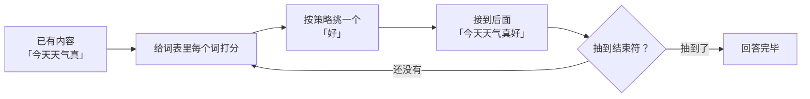
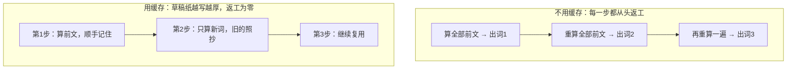

# 第 08 课　大模型怎么"说"出回答

上一课我们看完了 Transformer 这副骨架：文字进去，注意力来回打量，最后对"下一个词是什么"给出打分。可你有没有想过——你问它一个问题，它回你一大段话，这些字是哪儿来的？是它肚子里存好了一篇文章再念出来吗？还真不是。这一课我们就站在"输出"这一端，看大模型怎么一个词一个词把回答"说"出来。

先交代一句：模型会打分，靠的是**预训练**——就是第 04 课那种训练，用互联网上海量的文字喂出来的本事。这一课不谈它怎么练成的，专谈它怎么"答题"。

---

## 一、它不是想好再说，是一个词一个词接龙

你跟朋友玩过成语接龙吧：看上一个词的尾字，接一个新成语，下一位再接着接。大模型说话，骨子里就是这个游戏。

你输入"今天天气真"，模型并不会一次想出"好，我们去公园吧"这整句话。它只做一件事：根据这五个字，给词表里几万个候选词各打一个分。挑出"好"，接到后面，变成"今天天气真好"；然后把这六个字当作新的输入，再打分、再挑、再接……如此循环，直到它认为话说完了（选中一个特殊的"结束符"）。

这种"拿着自己已经说出的内容，预测下一个词"的说话方式，术语叫**自回归**。名字唬人，意思很土：自己的输出，回头又成了自己的输入。

这个机制带来一个直接后果：每个新词都依赖前面所有词，所以它天生快不起来——你说一段话只要几秒，它"接龙"几万个词也得一步一步来。本课后面要讲的 KV Cache，就是在给这场接龙抄近道。

还有个更隐蔽的坑：接龙一环扣一环，第 10 个词建立在"前 9 个词都对"的假设上。前面歪了一点点，后面会顺着歪下去，还越说越理直气壮。第 01 课说的"一本正经地胡说八道"，有一半根子就在这儿。

---

## 二、模型给的不是答案，是支持率

先看清楚"打分"打出来的到底是什么。

假设轮到接"今天天气真"。模型会把词表里**每一个**候选词都过一遍，各给一个原始分数——这种分数有个学名叫 logits，你不用背，理解成"每位候选人的得票基础分"就行。分数不方便直接比较，接下来会用一遍 softmax（这个转换你在第 06 课见过类似的味道：注意力权重也是这么归一的），把所有分数换算成加起来等于 100% 的百分比。

到这一步，模型对"下一个词"的判断，就变成了词表里的一场小型选举：

| 候选词 | 支持率 |
|---|---|
| 好 | 60% |
| 不错 | 20% |
| 冷 | 8% |
| ……其余几万个词 | 分掉剩下的 12% |

注意：模型自己的活儿只干到这里——它交出的是这张支持率表，而不是一个唯一答案。接下来选谁，是另一道工序，也就是下面两节的主角。

---

## 三、温度：厨师敢不敢冒险

对着同一张支持率表，可以有不一样的选法。

想象一位厨师，手里有份客人口味调查：60% 的人爱微辣，20% 爱中辣，剩下的爱清汤。他可以求稳，几乎每次都端上微辣——靠谱，但吃多了腻；也可以胆子大一点，偶尔给爱清汤的客人整个中辣——可能惊艳，也可能翻车。

大模型里管这个"胆子"的旋钮，叫**温度**（temperature）。做法简单粗暴：把 logits 先除以温度，再去做 softmax。除以一个小于 1 的数，分数差距被放大，强者愈强；除以一个大于 1 的数，差距被压平，人人都有机会。

用一组真实数字感受一下。四个候选词的原始分数是 3.0、2.0、1.0、0.0：

| 温度 | 四个词的支持率 | 味道 |
|---|---|---|
| 0.5 | 86% / 12% / 1.6% / 0.2% | 强者通吃，几乎必选第一名 |
| 1.0 | 64% / 24% / 9% / 3% | 标准状态 |
| 2.0 | 46% / 28% / 17% / 10% | 差距拉平，冷门词也敢翻牌 |

（这些数字本课目录里的 sampling_demo.py 会算给你看，还能顺手"抽签"演示。）

低温（趋近 0）时，模型几乎总选把握最大的词——稳定、可控，但容易呆板，问十遍答十遍一模一样。高温（大于 1）时，小概率的词也常被翻出来——有创意、有意思，但跑偏、胡说的概率跟着涨。让它琢磨措辞可以把温度调高些；问代码、问事实就得调低。多数工具的默认温度在 0.7～1.0 之间，日常对话你不用动它。

---

## 四、光拧温度还不够：到底怎么挑词

温度调的是支持率表本身；从表里挑出那"一个"词，还有几种策略，一个比一个聪明。

**贪心**：永远选支持率第一名。最简单，也最容易出事——它没有一点弹性，遇到半生不熟的开头，特别容易陷入车轱辘话："我认为他说的是对的，我认为他说的是对的……"。每一步都局部最优，连起来却可能又倔又呆。

**Top-K**：只在支持率最强的 K 个词里抽。比如 K=50，意味着剩下几万个词直接出局。这一刀砍掉的是什么？是**长尾**。词表几万到十几万个词，单个看着都不起眼，可"剩下所有词"加起来的支持率不容小觑；不设防的话，隔三差五就会抽到一个莫名其妙的词，把句子带进沟里。

**Top-P**（也叫核采样）：换个思路截断——不看固定个数，看累计支持率。从第一名往下加，加到总和刚过 P（比如 90%）就停，只在这一小撮里抽。它比 Top-K 更懂行情：模型有把握时，可能 2 个词就占了 90%；自由发挥时，可能要 20 个词才凑够——两种局面它都能自适应。

**Beam Search** 顺带点名：它不走随机路线，而是同时保留几条候选接龙一路算下去，最后交出"总支持率最高"的一条。听着很美，但费算力、答案千篇一律，如今聊天类大模型基本不用它，它更多出现在机器翻译这类求"最稳"的老任务里。

顺便解释一个日常现象：同一条消息问两遍，聊天模型常给你两个不完全一样的回答——因为它用的是随机采样，每一步都在那一小撮候选里掷骰子。而车轱辘话从哪来？贪心式的一根筋、接龙的错误滚雪球、温度没调好，三者凑齐，复读机就诞生了。

---

## 五、KV Cache：把算过的记在草稿纸上

接龙还有个天然的浪费，值得单独说。

每接一个新词，模型都要"回头看"全部已有内容——这是第 06 课注意力机制的本职工作。笨办法是每一步都把前文从头重算一遍：说到第 500 个词时，前面 499 个词的工作全部返工。你做数学题会这么干吗？草稿纸上明明有前一步的结果，翻回去照用就行。

大模型真有这张草稿纸，叫 **KV Cache**。K 和 V 就是第 06 课里每个词被别人"查阅"时用到的两样东西：Key 用来对上暗号，Value 是被取走的内容。模型把每个词算过的 K、V 存起来，下一步只算新词的，旧的全部直接复用：

一句话总结：**拿内存换时间**——多占一块显存放草稿，省下大把重复计算。但草稿纸会越记越厚：对话越长，存的 K、V 越多，显存吃紧、速度变慢。你早就听过"模型有上下文窗口，话太长它记不住"，现在你知道为什么了：不是它不想记，是草稿纸有实打实的物理成本。

---

## 六、让接龙再快一点

工程界还有一堆给接龙提速的招数，这里混个脸熟就好：批处理（很多客人的菜凑一桌同时炒）、量化（把模型的数字抄粗一点，换更小的体积和更快的速度）、PagedAttention（把 KV Cache 像书本一样分页管理，减少浪费）。它们是第 10 章部署环节的主角，到时候再见。

---

## 想一想

先自己回答，能讲给别人听最好。

1. 把温度从 0.2 拧到 1.5，模型的回答会发生什么变化？如果分别让它写周报和写诗，你各自往哪边拧？
2. 如果没有 KV Cache，生成一个 1000 词的回答要多干多少"从头重算"的活儿？用自己的话说说它到底帮了什么忙。
3. 为什么同一条消息问两遍，回答可能不一样？试着从"支持率表 → 挑词"这两步里，找出让随机性钻进来的那一环。
4. （动手）运行 sampling_demo.py，对比两档温度的命中分布；再把 logits 改成 [3.0, 2.9, 1.0, 0.0]，看看低温下还会不会"一家独大"。

---

## 小结

- 大模型说话是自回归接龙：根据已有内容给下一个词打分、挑一个、接上、再来，直到结束符。
- 模型给的从来不是唯一答案，而是整张支持率表；温度决定挑词时"敢不敢冒险"。
- 贪心易复读，Top-K 和 Top-P 砍掉长尾防跑偏；聊天模型普遍用随机采样，所以每次回答不尽相同。
- KV Cache 把算过的前文记在"草稿纸"上复用，拿内存换时间，也是"上下文越长越慢越占显存"的直接原因。

下一课我们换个身份：不再只当模型的使用者，而是看看怎么用微调，把一个"什么都会一点"的模型教成某一行的行家。

---

2026 年 10 月
