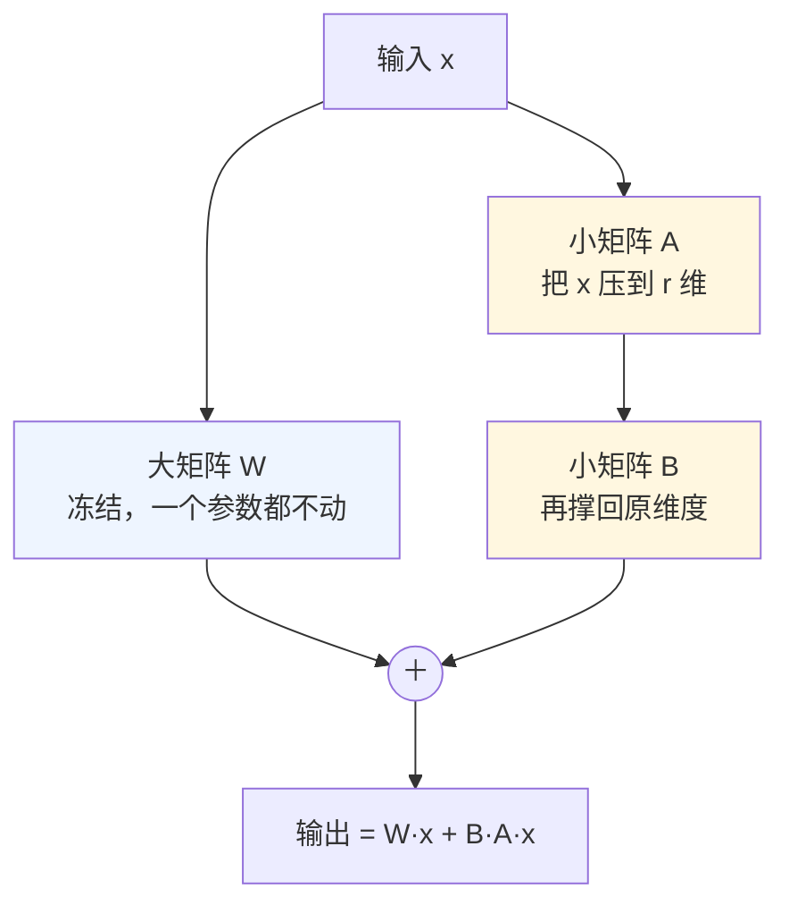

# 第 09 课　模型微调：让聪明模型专精一行

上一课我们看到，大模型是怎么一个词接一个词地把回答"编"出来的。它确实聪明：写代码、改邮件、讲概念都不在话下。可真拿它干活，你很快会撞上另一件事——它聪聪明明，但未必按**你的**规矩来。你让它用你们公司的口吻回客服消息，它字正腔圆，就是不像"你们的人"；你让它按固定格式出报表，它十次里有三次自由发挥。

这一课就讲怎么解决这个问题：**微调（Fine-tuning）**。它也是这一章的最后一课——学完它，我们的原理篇就收尾了。

---

## 一、博览群书，但没上过岗

先把微调这件事的底色摸清楚。预训练模型像一个**博览群书但没上过岗的通才**：底子极好，什么话题都能聊两句，可它没上过你的岗——不知道你们公司的行话、格式、流程和说话的分寸。预训练干的就是"读书"，读书读出来的能力和上岗干活需要的样子，是两回事。

微调，就是拿一批你这行的真实例子，给它做一次**岗前培训**。

注意一个分寸：微调不是从零教一张白纸。底座模型早就博览群书了，微调只是在它已有的本事上做**定向校准**——这也是它便宜的根本原因：大头人家已经学完了，你只补最后那一层。

---

## 二、先分清三件最容易混的事

"微调"是个筐，新手最爱把三件不同的事一股脑装进去。我们摆开：

**预训练（Pre-training）**：从零开始，拿海量文本把模型的底子练出来。这是最贵的一步，百万美元级的花费、数月的算力，只有少数机构玩得起。平时说的"开源底座模型"，指的就是这一步的产物。

**继续预训练 / 领域适配**：底座已经有了，再喂它大量某个领域的资料——医学文献、法律文书、你们内部的技术文档——把行业知识和行业语言补进去。像是让那位毕业生入职后再进修一轮专业课。

**指令微调（SFT）**：注意，它补的不是知识，是**听话办事的能力**。做法是准备一批"指令 → 理想回答"的样例，一条条教模型：用户这么问，你就该这么答、按这个格式答。今天所有对话模型能好好回答问题、规规矩矩按格式输出，主要归功于这一步。

在这之后通常还有一步**对齐**：拿人类的偏好当老师再纠一遍偏——同一个问题的几个回答，人标注哪个更好，模型就往"更像人喜欢的样子"调。你可能听过 RLHF、DPO 这两个词，它们是做这件事的两代主流做法，机制到工程篇再碰，现在记住"按人类偏好纠偏"就够了。


本课的重点是中间两步：领域适配和指令微调。它们才是普通公司真正会动手的部分。

---

## 三、全量微调：给整栋楼重新装修

最直接的想法：不满意就全改。把模型里**所有**参数统统解开，让训练过程每一处都可以动——这叫**全量微调（Full Fine-tuning）**。它像给整栋楼重新装修：效果上限确实最高，想怎么改就怎么改，但装修队得进驻每一面墙。

贵在哪？我们算一笔账。第 04 课讲过，训练就是反复调参数的过程，为此显存里得**同时**装三样东西：

- **权重**：模型当前的"记忆"，7B 模型光存一份就要十几 GB；
- **梯度**：这一步每个参数该往哪边挪、挪多远，规模和权重一样大；
- **优化器状态**：优化器（比如 Adam）给每个参数记的"施工日志"，动量之类的备忘，通常比权重本身还占好几倍。

三样加在一起，7B 模型的全量微调动辄几十 GB 起步、上百 GB 不稀奇，得靠多张专业计算卡。

> 顺带修正一个网上流传很广的说法：不少资料写"7B 全量微调只需 28 GB 显存"。那是只算了权重加梯度的乐观账，把最占地方的优化器状态漏了。记住口径：**训练显存 ≈ 权重 + 梯度 + 优化器状态**，第三样往往是大头。

全量微调还有两个隐性问题。一是**灾难性遗忘**：整栋楼都动了装修，模型原来会的本事可能被改没一部分。二是每个任务都要保存一份改完的完整模型——十个任务就是十份十几 GB，放都放不下。

---

## 四、LoRA：原稿不动，贴几张可撕的便利贴

有没有更省的路？有——**楼不动，只改软装**。这类"冻结原模型、只新增或只训练一小撮参数"的做法，统称**参数高效微调（PEFT，Parameter-Efficient Fine-Tuning）**。到 2026 年，它已经是微调的默认选项，旗下最出名的招式叫 **LoRA**（Low-Rank Adaptation，低秩适配，2021 年提出）。

LoRA 的想法一张图就能说清：模型的原权重像一份画好的图纸——**原稿不动，在旁边贴几张可撕的便利贴做批注**。训练时只改便利贴，图纸一笔都不碰。

具体长什么样？模型里到处是这样的运算：输出 = W·x（大矩阵 W 乘输入 x）。LoRA 不改 W，而是在旁边挂两个**小**矩阵 A 和 B：先用 A 把 x 压到很低维（比如 r 维），再用 B 撑回原维度，把这个窄通道的输出加回原输出：

> 输出 = W·x + B·(A·x)

训练时 W 全程冻结，只有 A、B 在学：



你可能会问：两条小通道，凭什么顶替对整个大矩阵的修改？这背后有个实证发现——微调时权重的"变化量"结构出奇地简单，信息集中在很少的几个方向上。所以用一对瘦长矩阵的乘积去近似它，往往就够了。"低秩"这个名字由此而来，那个通道宽度 r 就叫**秩（rank）**。

r 是一个"省"和"容量"之间的旋钮：r 越小越省、通道越窄能装的东西越少；r 越大表达能力越强、要学要存的也越多。常用值在 8~64 之间，实际操作通常从小往大试，效果不再涨就停手。

LoRA 到底省在哪？对着第三节的账本看就明白了：

- 冻结的 W 不再需要梯度和优化器状态——三样里占地方的两样直接省掉。7B 模型的 LoRA 微调，一张 24GB 的消费级显卡（比如 RTX 4090）就能做。
- **存储**：LoRA 适配器通常只有几十 MB。不用为每个任务存一份十几 GB 的完整模型，一个底座配 N 张"便利贴"，哪个任务用哪张。
- 还能**热插拔**：2026 年的主流推理框架已经支持一个底座同时挂多个 LoRA，按请求切换——客服语气一个适配器、财报摘要一个适配器，同一个底座服务所有业务。

工具现状也交代一句：Hugging Face 的 PEFT 库至今仍是这套玩法的标准工具，社区还有 LLaMA-Factory、Unsloth 这类开箱即用的封装。旧讲义里 LoraConfig、get_peft_model 那套示例代码今天依然能用，只是如今你多半会从这些更省心的工具起步。

---

## 五、QLoRA：先把房子压缩，再贴便利贴

24GB 显卡够 7B 用了，那 8GB、12GB 的普通显卡呢？再往下压一步：先把底座模型**量化**——用更少的比特存每个权重（比如从 16 位压到 4 位），让那份冻结的图纸本身先瘦身几倍；然后在这个压缩底座上照常做 LoRA，LoRA 部分训练时仍保持高精度。这就是 **QLoRA**（Q 是 Quantization，量化），2023 年提出后迅速成了消费级硬件上微调大模型的标准打法：7B 模型的显存需求能压到 10GB 上下，一张 12GB 的显卡就能上手。

量化是把双刃剑——压得太狠会伤质量——它自成一节课的内容，后面讲模型部署与优化的章节会专门展开。这里你先建立连接：**QLoRA = 量化 + LoRA**。

---

## 六、给模型看的"教材"：指令数据长什么样

微调效果好不好，一半取决于数据。指令数据其实非常朴素：一条样例就是"问题 + 理想回答"。比如想教模型用你们客服的口吻说话，一条数据长这样：

```json
{
  "instruction": "你是某云服务的客服，用亲切但不啰嗦的口吻回答用户问题。",
  "input": "我的服务器半夜宕机了，怎么办？",
  "output": "您好，深夜遇到这种情况确实让人着急。请先在控制台查看实例状态，如果显示异常，我可以帮您提交紧急工单，工程师会尽快跟进。方便把实例 ID 发我吗？"
}
```

也有多轮对话版本（一问一答排成列表），格式不同，本质一样：告诉模型"遇到这种情况，理想中你就该这么说"。

经验里最重要的一条：**质量和多样性，比数量关键得多**。几千条干净、覆盖各种问法的样例，往往胜过几十万条粗糙数据。带过徒弟就懂这个道理：师傅自己字迹潦草、偶尔教错，徒弟学得飞快——错得也飞快。数据里的口癖、错误格式、自相矛盾的答案，模型会原样学进去，这就叫"脏数据教坏模型"。

---

## 七、微调、RAG、提示工程，到底选哪个

实际工作里"要不要微调"是个高频争论，而且经常有人选错方向。给你一个够用的判断框架，先说一句大实话：**很多喊着要微调的需求，其实不该微调。**

| 你的需求 | 该用什么 | 生活化理解 |
|---|---|---|
| 一句话能说清的要求（"回答别超过三句"） | **提示工程** | 开会时口头叮嘱一句 |
| 引用你私有的、经常更新的资料来回答 | **RAG（检索增强生成）** | 给他配一个可检索的档案柜，用时现翻 |
| 改变风格、口吻、固定套路、输出格式 | **微调** | 岗前培训，把本事练进脑子里 |

最容易踩的坑，是前两类需求被错送到微调手里：

- 想让模型"记住我们公司的产品文档"就去做微调？知识装进参数里又贵又难更新——文档一改版就得重新训练，模型还可能把知识张冠李戴。这活儿该交给 RAG：资料放外部知识库，回答时现查现引用，后面讲 RAG 的整章会专门展开。
- "回答简短点"这种一句话交代得清的要求，写进提示词就行，动用微调属于高射炮打蚊子。

反过来，如果目标是"让它像我们的人说话""永远按这个格式输出""学会我们这一行的固定套路"——这是行为和风格的改变，微调才是对的家伙什。这个三岔路口的判断，是面试和架构设计里都常考的题。

---

## 八、练完了怎么用：挂着，还是合并

LoRA 训练完，你有两种用法：

- **挂着用**：推理时现算 W·x + B·A·x，便利贴继续贴在图纸旁边。好处是灵活——底座不动，随时换、随时叠加多个适配器，适合多任务共用一套服务。
- **合并**：把 B·A 加进原权重，得到 W' = W + B·A，存成一个和原模型结构完全一样的模型。推理时零额外开销，但便利贴"誊"进了图纸，撕不下来了。

两条路都通向后面的工程篇：挂着用牵扯多适配器的服务架构，合并则衔接模型部署与量化上线。等你在后面的章节遇到它们，会认得这位老朋友。

---

## 想一想

先自己回答，能讲给别人听最好。

1. 同事提议："把公司的全部产品文档拿去微调，让模型记住，回答客户问题就有依据了。"你会怎么建议他？什么情况才真的该微调，而不是"查资料"？
2. LoRA 为什么比全量微调便宜得多？从"训练时显存里要同时放哪三样东西"说起，说清它省掉的到底是哪几样。
3. 把 LoRA 的秩 r 从 16 调到 128，参数量和显存会怎么变？效果一定更好吗？什么信号说明 r 该往上加，什么信号说明不必再加？
4. （动手感受）找一个开源底座模型的"原版"和某个社区微调版（比如代码特调、角色扮演版本），各问同一个问题。对比回答的风格差异，体会一下"几十 MB 的便利贴"能撬动多大的行为改变。

---

## 小结

- 底座模型是博览群书但没上过岗的通才，微调就是拿你这一行的例子做岗前培训。分清三件事：预训练练底子，领域适配补知识，指令微调教听话，最后再按人类偏好做对齐。
- 全量微调是给整栋楼重新装修：效果上限高但极贵，显存要同时装下权重、梯度、优化器状态三样东西，还可能灾难性遗忘。
- LoRA 是原稿不动、贴可撕的便利贴：冻结 W，只训练旁边的小矩阵 A、B，省掉的正是梯度和优化器状态这两样大头；秩 r 是"省"与"容量"之间的旋钮。QLoRA 再把底座量化压缩，消费级显卡也能微调大模型。
- 数据质量比数量重要，脏数据会原样教坏模型。选型口诀：一句话说得清的用提示词，查私有资料用 RAG，改风格和套路才微调。

这一章到这里就收尾了。从"AI 是什么"一路走到"怎么让大模型说你想听的话"，原理的地基打完；接下来的加餐课我们补上工程里顺手的 Python 工具，再往后的章节里，今天认识的这些词——SFT、LoRA、RAG——会反复出现，到时你就是熟面孔了。

---

2026 年 10 月
