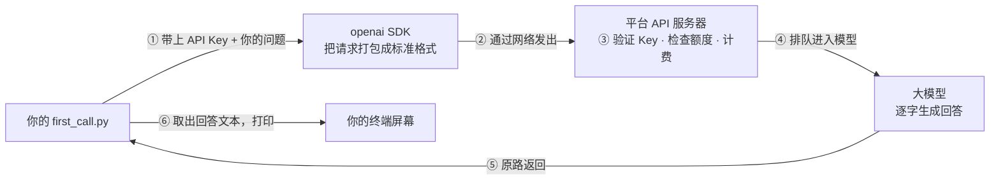

# 第 01 课　动手调用你的第一个大模型

前面两章，你学会了 Python，也搞懂了大模型背后的门道。这一课我们干一件真正让人兴奋的事：让你写的程序，第一次和一个大模型说上话。账号、Key、虚拟环境、第一次请求——这一课是整个工程篇的地基，请务必跟着每一步亲手做，跑通了它，后面三课才有得玩。

---

## 一、网页聊天和 API 调用，是两回事

你大概率已经在网页里用过 ChatGPT、豆包、Kimi 这类聊天产品了。那为什么还要学"API 调用"？它们差在哪？

打个比方：**网页版像坐出租车**——上车报个目的地就走，方便，但去哪、几点走、路上绕不绕，都由司机说了算；**API 调用像拿到车钥匙自己开**——什么时候走、走哪条路、后备箱装什么货，全由你的程序决定。

网页版是别人做好的现成产品，你只能一问一答；API 则是你的程序通过网络向大模型平台"下订单"，把模型的回答当成原材料，加工进你自己的应用里。自动回复客服消息、批量给 1000 篇文章起标题、在自己的软件里加个 AI 助手，靠的都是 API。

还有一个新手最容易栽的坑，先讲清楚：

> **网页版会员 ≠ API 额度。** 你在网页产品里充的会员只能用于网页聊天；API 是另一套独立计费的系统，要在开放平台里单独充值（有的平台送一点新人额度）。就像餐厅的会员卡和超市的购物卡互不通用。很多人网页会员充了半年，第一次跑代码就报"欠费"，原因就在这。

---

## 二、三步准备

### 第 1 步：注册账号，拿到 API Key

1. 选一个平台：国外有 OpenAI 的开放平台（platform.openai.com）；国内有 DeepSeek、月之暗面 Kimi 开放平台、阿里云百炼等。哪家访问顺畅就用哪家——接口思路完全一样，以后随时能换。
2. 注册账号，按平台要求完成实名认证。
3. 找到"充值"或"费用"页面，充一点钱，或先领平台送的新人额度。本课所有示例加起来花不了几毛钱。
4. 进入"API Keys"页面，点"创建"，给 Key 起个名字。

然后是本课最重要的一个动作：

> **Key 只在创建那一刻完整显示一次**，关掉弹窗就再也看不到了，只能删掉重建。所以创建后立刻复制，存到你电脑的记事本里。API Key 就像酒店房卡：丢了只能重新办一张；而捡到你房卡的人，能刷开你的房门、花你的钱。

### 第 2 步：建虚拟环境

为什么需要它？Python 的第三方库默认都装进系统的同一个"仓库"。如果项目 A 要求 2.0 版的库、项目 B 要求 1.5 版，全堆在一起就会打架。虚拟环境就是给每个项目一间独立的小厨房——锅碗瓢盆各放各的，互不串味，不要了还能整个扔掉。

进入你放代码的文件夹，执行（Windows 打开 PowerShell，Mac 打开终端）：

```powershell
# 生成一个 .venv 子文件夹，就是这台"独立厨房"
python -m venv .venv
```

激活它——注意，**每开一个新终端窗口都要重新激活一次**：

```powershell
# Windows PowerShell
.venv\Scripts\Activate.ps1
```

```bash
# Mac / Linux
source .venv/bin/activate
```

激活成功的标志：命令行最前面多出一个 `(.venv)` 前缀。

Windows 用户大概率会在这里撞上第一堵墙：激活时报错"**在此系统上禁止运行脚本**"。这不是坏了，是 PowerShell 默认不允许运行脚本文件，放行一次就好：

```powershell
Set-ExecutionPolicy -ExecutionPolicy RemoteSigned -Scope CurrentUser
# 出现提示输入 Y 回车，然后重新执行上面的激活命令
```

### 第 3 步：安装 openai 库

在**激活状态下**执行：

```powershell
pip install openai
```

国内网络慢的话，用清华镜像源：

```powershell
pip install openai -i https://pypi.tuna.tsinghua.edu.cn/simple
```

装完验证：

```powershell
python -c "import openai; print(openai.__version__)"
```

能打印出版本号就绪了。顺便认识一个词：SDK（软件开发工具包）。openai 这个库就是官方提供的 SDK，"发网络请求、拼数据格式、处理错误"这些脏活累活它都包了，你写几行 Python 就能和模型对话。

---

## 三、Key 放哪才安全：环境变量

先立三条红线：

- 绝不把 Key 写进代码里
- 绝不把 Key 截图发到群里
- 绝不把带 Key 的文件传上 GitHub

原因很简单：代码是要分享、要上传的。GitHub 上每天有爬虫专门搜索泄露的 Key，捡到就能花你的额度。Key 的保密级别 = 银行卡密码。

正确放法是**环境变量**——操作系统层面的"贴身口袋"：程序随时能取，但它不在任何代码文件里。

**临时设置**（只对当前终端窗口有效，关窗就没了，适合先跑通）：

```powershell
# Windows PowerShell（把 sk-xxx 换成你的 Key）
$env:OPENAI_API_KEY="sk-xxx"
```

```bash
# Mac / Linux
export OPENAI_API_KEY="sk-xxx"
```

**永久设置**（一劳永逸）：

- Windows：开始菜单搜"编辑账户的环境变量"→ 新建 → 变量名 `OPENAI_API_KEY`，值填你的 Key。设置完要**重开终端**才生效。
- Mac / Linux：把上面 export 那行写进 `~/.zshrc`（或 `~/.bashrc`）末尾，再执行 `source ~/.zshrc`。

**第三种：.env 文件**（以后项目多了的推荐做法）。在项目根目录建一个名为 `.env` 的文本文件：

```
OPENAI_API_KEY=sk-xxx
```

再装一个小工具 `pip install python-dotenv`，代码里调用 `load_dotenv()` 就会自动把 .env 的内容读进环境变量。它是给程序看的"本地小本本"。

但 .env 绝对不能上传到 Git！在项目根目录建一个 `.gitignore` 文件（Git 上传时会自动跳过列在里面的文件），写入：

```
.venv/
.env
```

第一行顺手把整个虚拟环境文件夹也排除了——它体积大，也不需要上传。

---

## 四、发出你的第一次请求

万事俱备。先看这张图，搞清楚一次调用里发生了什么、Key 在哪一步出场：



Key 在第①步被你带上，第③步被服务器验证——验证不过，后面全免谈。所以报错时第一件事永远是查 Key。

本课的主角 `first_call.py` 完整代码如下（就放在本课目录里）：

```python
# first_call.py —— 发出你的第一次大模型 API 请求，并把回答打印出来
# pip install openai python-dotenv
# 注意：需 API Key，未实跑。运行前先设置环境变量 OPENAI_API_KEY。

import os
import sys

# 若项目根目录有 .env 文件（见讲义），自动加载；没装 python-dotenv 也不影响
try:
    from dotenv import load_dotenv

    load_dotenv()
except ImportError:
    pass

try:
    from openai import OpenAI
except ImportError:
    print("还没安装 openai 库：请先激活虚拟环境，再运行 pip install openai")
    sys.exit(1)

# 常见错误的中文提示，不让用户直面英文 traceback
from openai import (
    APIConnectionError,
    AuthenticationError,
    NotFoundError,
    RateLimitError,
)


def main():
    # Key 一律从环境变量读，绝不写死在代码里
    api_key = os.environ.get("OPENAI_API_KEY")
    if not api_key:
        print("没有找到 API Key。请先设置环境变量 OPENAI_API_KEY，例如：")
        print('  Windows PowerShell:  $env:OPENAI_API_KEY="sk-你的Key"')
        print("  Mac / Linux:         export OPENAI_API_KEY=sk-你的Key")
        print("或在项目根目录建 .env 文件写入 OPENAI_API_KEY=sk-你的Key（记得加进 .gitignore）")
        sys.exit(1)

    client = OpenAI(api_key=api_key)

    prompt = "用一句话向完全没接触过编程的人解释：什么是程序？"
    try:
        # 2026 年主流写法：Responses API。model 只是示例名，可能已更新，
        # 运行前按官网模型列表挑一款"当前便宜够用"的替换
        response = client.responses.create(model="gpt-4o-mini", input=prompt)
    except AuthenticationError:
        print("401 认证失败：Key 不对或没生效。检查是否复制完整、当前终端是否设置过环境变量。")
        sys.exit(1)
    except RateLimitError:
        print("429 请求被拒：多半是额度用完或欠费，去平台确认余额；也可能请求太频繁，稍等再试。")
        sys.exit(1)
    except NotFoundError:
        print("404 模型不存在：model 名写错了，去官网模型列表核对（注意大小写和横杠）。")
        sys.exit(1)
    except APIConnectionError:
        print("网络连不上：检查网络；访问境外平台可能需按其文档配置网络，或改用国内平台。")
        sys.exit(1)

    print("模型回答：")
    print(response.output_text)  # 回答文本就在这个字段
    usage = response.usage
    print(f"本次用量：输入 {usage.input_tokens} token，输出 {usage.output_tokens} token")

    # 老写法 chat.completions 在旧代码、旧教程里大量可见，会读即可：
    # response = client.chat.completions.create(
    #     model="gpt-4o-mini",
    #     messages=[{"role": "user", "content": prompt}],
    # )
    # print(response.choices[0].message.content)


if __name__ == "__main__":
    main()
```

逐段拆开看：

**读 Key。** `os.environ.get("OPENAI_API_KEY")` 从环境变量取 Key，取不到就打印中文提示退出。用 `sys.exit(1)` 优雅退出而不是让程序崩出红字——退出码 1 表示"没干成"，这是好习惯。

**建客户端。** `OpenAI(api_key=...)` 创建一个 client 对象，可以理解为一条"热线电话"，之后所有请求都从它拨出。

**发请求。** `client.responses.create(model=..., input=...)`：model 指定用哪个模型，input 是你说的话。代码里的 `gpt-4o-mini` 只是示例——大模型更新极快，**运行前去官网模型列表挑一款"当前便宜够用"的替换**，具体名字可能已经变了。

**关于 Responses API 和 chat.completions。** 2026 年的新代码推荐用 Responses API；但你以后读别人的项目、看旧教程，会大量见到老写法 `chat.completions.create`——参数换成 `messages=[{"role": "user", "content": 问题}]`，取结果用 `choices[0].message.content`。两者背后是同一个服务，老写法会读即可，first_call.py 里两种都留了样。

**用国内平台怎么改？** DeepSeek、Kimi 开放平台、阿里云百炼等都提供"OpenAI 兼容接口"，代码几乎不变，只需给 client 多传一个 base_url。以 DeepSeek 为例：

```python
client = OpenAI(
    api_key=os.environ.get("DEEPSEEK_API_KEY"),
    base_url="https://api.deepseek.com",
)
```

各平台的 base_url 和模型名，看它们的接入文档照抄即可。

---

## 五、读懂返回：回答藏在哪个字段

模型返回的不只是那句话，而是一个完整的"包裹"（Python 对象），里面装着回答文本、用量、编号等一堆东西。SDK 已经把回答放在最顺手的位置：

- **Responses API**：`response.output_text` 直接就是回答字符串；
- **老写法**：`response.choices[0].message.content`，一层层拆开取。

想看花了多少钱，找 `response.usage`，里面是这次消耗的 token 数。

**token** 是大模型的计费单位，约等于半个到一个汉字（英文约 0.75 个单词），像出租车的计价器，问答越长跳得越多。平台的控制台都有"用量"页面，能看到每天花了多少钱、花在哪次调用上。

还有一个反直觉的事实：**模型是无状态的**——它不记得上一句你说过什么，像一位很聪明但只有金鱼记忆的笔友，每封信都得把前情重新讲一遍。你平时用网页聊天觉得"它记得我"，那是网页产品在背后自动把历史对话塞进了每次请求。以后你做对话应用，"把历史拼进请求"得自己动手，这是后面课程的伏笔。

不用 Key 也能先练眼力：本课目录里有个 `parse_response_demo.py`，它用标准库 json 解析一段写死的模拟返回，帮你离线看清"回答在哪个字段、用量在哪个字段"。跑一遍，再改改试试。

---

## 六、常见报错急救表

第一次跑，报错才是常态。学会看报错比一次成功更重要——把报错里的数字对号入座：

| 报错关键字 | 原因 | 怎么办 |
|---|---|---|
| 401 / AuthenticationError | Key 错、复制不完整、环境变量没生效 | 核对 Key 完整（sk- 开头）；确认**当前终端**设置过环境变量；仍不行就删 Key 重建 |
| 429 / RateLimitError | 额度用完或欠费，也可能请求太频繁 | 去平台查余额和用量页；充值或稍等再试 |
| 404 / NotFoundError 提到 model | 模型名写错 | 去官网模型列表核对名字，注意大小写和横杠 |
| 连接超时 / Connection error | 网络不通；境外平台有访问门槛 | 先确认能打开平台官网；国内网络建议直接用国内平台 |
| ModuleNotFoundError: openai | 忘了装库，或装在了虚拟环境外面 | 确认命令行前有 (.venv) 前缀，再 pip install openai |

---

## 七、花钱意识和 Key 兜底

- **先设用量上限**：多数平台的"限额"页可以设每月硬上限，比如 5 元，花完自动停。新手期强烈建议设上，睡觉都踏实。
- **示例都很小**：本课一次问答只花几百 token，不到一分钱。想先零成本练手，就反复跑 parse_response_demo.py。
- **Key 泄露了怎么办**：立刻去平台删除这个 Key，重建一个新的，再更新环境变量。删除即时生效，泄露的旧 Key 马上作废——房卡丢了补办一张，损失可控。
- **上传前扫一眼**：养成习惯，代码上传前检查有没有 Key 硬编码在里面。

---

## 想一想

1. 你给网页版充了 100 元会员，跑 first_call.py 却报 429 欠费。钱去哪了？这说明了两套什么系统？
2. 为什么"环境变量"比"把 Key 写在代码里"安全？想象你明天要把项目上传 GitHub，两种放法各会发生什么？
3. 你和模型连续聊了好几轮，为什么说"模型是无状态的"？网页版又是怎么做到"它记得你"的？
4. （轻动手）打开 parse_response_demo.py，把模拟返回里的回答文本换成你自己的话，再把 total_tokens 改成 99，跑一遍——如果打印出来的值跟着变了，说明你真的会读字段了。

---

## 小结

- 网页版是现成产品，API 是程序调用模型的通道；网页会员和 API 额度是两套独立的账。
- 三步准备：平台注册拿 Key（只显示一次，立刻保存）→ `python -m venv .venv` 建虚拟环境并激活 → `pip install openai`。
- Key 放环境变量（临时用 `$env:` / `export`，永久走系统设置，项目化用 .env + .gitignore），绝不写进代码。
- 请求经 SDK 发到平台，Key 验证通过才轮到模型干活；回答在 `response.output_text`（老写法 `choices[0].message.content`），用量在 `usage`。
- 401 查 Key，429 查余额，404 查模型名；Key 泄露立即删除重建。

---

2026 年 10 月
