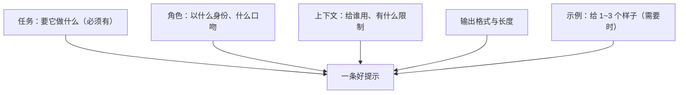
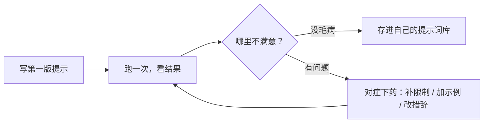

# 第 02 课　Prompt 工程：把话说清楚

上一课你已经能把大模型调起来了。但你很快会发现：同一个模型，有人问出来的回答让人拍案叫绝，有人问出来的回答牛头不对马嘴。差别不在模型，在那句话怎么说。这一课我们就练这个——它是调用大模型最核心的**软技能**，不花一分钱，全靠会说话。

---

## 一、同一句话，两种交代

先想一个生活场景。你给一位**新来的同事**派活。这人很聪明，读过海量的书，什么都懂一点——但他对你的情况一无所知，而且有个怪癖：**不懂也不问你**，你交代成什么样，他就做成什么样。

你说："帮我写个通知。"他愣了一下，凭感觉给你编一个，多半不是你要的。

你说得清楚一点，他立刻就像换了个人：

```
差提示：
帮我写个通知。

好提示：
我们小区下周三上午 9 点到 12 点停水检修。请以物业的名义写一张停水通知：
提醒业主提前储水，语气客气，不超过 100 字，结尾落款"阳光小区物业"。
```

第二版多了什么？**做什么、给谁看、有什么背景、要什么样子**。就这么几个零件，效果天差地别。

后面所有技巧，本质都是在回答一个问题：**怎么跟这位"聪明但不问你"的同事，把话一次说清楚。**

---

## 二、好提示的五个零件

一条好提示，常见的组成是下面这几样。不用每条提示都凑齐，但你得知道每个零件是干什么的，缺了会出什么事。



### 零件一：任务 —— 它到底要做什么

最容易被写糊的就是这个。人说"帮我弄一下这个"，模型只能猜"弄"是什么。

```
反例：帮我处理一下这段文字。
正例：把这段产品介绍改写成适合发朋友圈的短文案，保留卖点，去掉专业术语。
```

动词要具体：**改写、总结、翻译、列举、判断、抽取、解释**，一个准确的动词顶三句形容词。

### 零件二：角色 —— 它用什么身份说话

给角色不是玄学，就是提前定下"口吻和专业度"：

```
反例：解释一下什么是信用卡分期。
正例：你是一位耐心的银行柜台工作人员，用大白话给一位第一次办信用卡的
   客人解释"分期"是什么，多打比方，不说行话。
```

同一个问题，让"小学老师"和"法律顾问"来答，出来的东西当然不一样。你需要哪种，就先把它请上场。

### 零件三：上下文 —— 背景和限制给够

模型不知道你是谁、读者是谁、有什么特殊要求，这些要你喂给它：

```
反例：推荐几个旅游的地方。
正例：我们两个大人带一个 5 岁的孩子，十一假期从上海出发，不想去太远、
   人挤人的地方，预算一万以内。推荐 3 个目的地，各说明为什么适合带娃。
```

差别就在于第二版把"观众是谁、口袋多深、怕什么"都交代了。写提示前先问自己一句：**这件事我知道、它不知道的信息有哪些？** 都补上。

### 零件四：输出格式与长度 —— 要什么样子，说清楚

```
反例：介绍一下 Python 的优点。
正例：用 Markdown 表格列出 Python 的 5 个优点，两列：优点、一句话说明。
   每条不超过 20 字。
```

不给格式，它就自由发挥：这次是三大段，下次是十个要点。你要拿它的输出去做事（贴进文档、喂给程序），格式就更不能放羊。长度同理——"写详细点"没用，"不超过 200 字"才有用。

### 零件五：示例 —— 需要时给它看个样子

有些东西文字很难描述，直接给一两个例子最快，下一节专门讲。

---

## 三、零样本和少样本：给不给例子

**零样本（Zero-shot）**：不给例子，直接下指令。模型的通用能力强，简单任务直接说往往就行：

> 判断这句外卖评价是好评还是差评："送得挺快，但是汤洒了一半。"

**少样本（Few-shot）**：先给 1~3 个"输入 → 你期望的输出"的例子，再让它做。就像带新同事：与其口头描述"我们报表长这样"，不如**甩给他两份前任做好的样板**，他照着葫芦画瓢，风格和格式立刻统一。

```
请把下面的客户留言分类为：售后 / 咨询 / 投诉。

留言：我买的杯子碎了，怎么退？
分类：售后

留言：你们这款保温杯能装开水吗？
分类：咨询

留言：物流太慢了，等了一个星期！
分类：投诉

留言：客服态度挺好了，但发货还是慢。
分类：
```

最后一条是故意放的。**示例要覆盖边界**：如果三个例子都干干净净，模型遇到"一半好一半坏"的留言就容易懵；你给过一个含糊的、混合的例子，它就知道这种情况该怎么办。挑例子时，专门挑一两最容易出错的类型放进去。

零样本够用就零样本，嫌它风格飘、格式乱、边界判断差，再上少样本。例子也不是越多越好——每个例子都占篇幅，两三个挑得准的，胜过十个随手塞的。

---

## 四、让复杂问题更靠谱：引导它慢慢想

简单的活儿直接派。可遇到**多步推理**的问题——算一笔带折扣和运费的账、排查一段代码为什么报错——模型"脱口而出"就容易错。

原因是它生成回答时是一个词一个词往外蹦的，开头一急，后面就顺着错误的路一路滑下去。怎么办？**别让它抢答，让它把中间步骤摊开**：

- "**先一步一步想**，把每步的计算列出来，最后再给答案。"
- "**先列一个计划**，我确认了你再动手。"
- "**写完先自己检查一遍**，确认没有明显错误再给我。"

这套思路有个学名叫**思维链（Chain-of-Thought）**，名字唬人，直觉很简单：就像让学生做大题要写过程——过程摊在纸面上，错在哪一步一目了然；也像让写手"先给我看提纲再动笔"，提纲不对早发现，成稿了才发现就晚了。

> 提醒一句：这些说法是**引导，不是咒语**。不是说念了"一步一步思考"就自动变准——真正起作用的是"把中间过程摊出来"这个要求本身。如果任务确实需要分步，你的提示里就该把"分步"说成明确要求；如果任务很简单，加这句反而啰嗦。

更大的活儿，干脆**拆成几轮对话**：第一轮让它收集资料列清单，第二轮基于清单出方案，第三轮再润色。每一轮目标单一，比一锅炖稳得多。

---

## 五、提示词是改出来的

新手最常见的误会：以为高手写提示是一锤定音。真相是，**第一版提示几乎从来都不对，高手只是改得快**。流程长这样：



跟它对你不满意的地方**逐条补要求**就行：它啰嗦，就加"不超过三条"；它跑题，就把限制提到最前面；它格式乱，就给它一个例子。

改的过程里，有几类坑几乎人人踩过，先认识它们，你就能少绕路：

- **指令互相矛盾**：前面说"详细展开"，结尾又说"一句话概括"。模型左右为难，两头不讨好。写完自己通读一遍，检查有没有打架的要求。
- **一次要求太多**：又改写、又总结、又翻译、又起五个标题……模型容易顾此失彼，丢三落四。要么拆成几轮，要么明确主次："先做 A，再顺带 B"。
- **没说禁止项**：你不告诉它"不要编造数据来源"，它就可能一本正经地给你编一个。重要的事，反着的那面也要说。
- **重要要求埋在长文里**：贴了 2000 字材料，关键指令藏在最后一行——模型注意力有限，重点要求放开头或结尾，别埋在肚子里。

每次改到满意，就把这版提示**存进自己的提示词库**——一个文档也行，按用途分分类。这是你以后最值钱的个人资产，比任何教程都好用。

---

## 六、拿走就能用的几句

最后给几个高频场景的示范，体会一下"说清楚"的手感，可以直接改成你的版本：

**改写**：
> 把下面这段话改写成微信消息语气，礼貌但不要太客气，控制在 3 句以内：……

**总结**：
> 用 3 个要点总结下面的会议记录，每个要点一句话，保留涉及时间和负责人的信息：……

**抽取信息**：
> 从下面的简历文本里抽取：姓名、最高学历、工作年限、技能列表。按"字段：值"一行一个输出，原文没有的写"未提供"，不要猜。

**写代码注释**：
> 给下面的 Python 函数写注释：函数开头用一句话说明用途，参数和返回值各一行，重点解释"为什么这么做"。不要逐行翻译代码。

注意到共同点了吗——**动词明确、背景给够、格式说死、特殊情况有交代**。前四节讲的零件，全在这些句子里。

---

## 想一想

1. 把你这周发给 AI 的一段提示翻出来，对照五个零件检查：缺了哪几个？补上后再跑一次，效果差多少？
2. 想一个你自己的任务，零样本效果不满意。设计两个少样本示例——其中一个故意选"最容易出错的边界情况"，看看模型的判断稳了多少。
3. "请一步一步思考"这句话什么时候有用、什么时候纯属废话？用你自己的话说说它背后的原理。
4. （动手）把本课的"请假消息"好提示再改一版：加上一条禁止项和一条格式要求，跑一次对比。

## 小结

把模型当成一位聪明、但对你的情况一无所知、还不会主动追问的新同事：任务、背景、输出样子，都得你主动交代。好提示的零件就那几样——明确的任务、合适的角色、足够的上下文、说死的格式，必要时给例子；例子能统一风格，还要覆盖边界。复杂问题让它把中间步骤摊开，大任务拆成几轮对话，记住这是引导不是咒语。最后，提示词没有一版成型，都是跑一次、改一次磨出来的——从今天起，把好用的提示攒进你自己的库。话能说清楚了，下一课我们再往前一步：让模型不只是"说"，还能真正"用工具"——Function Calling。

---

2026 年 10 月
