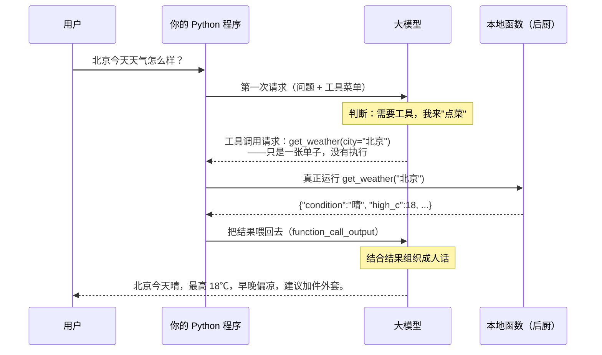

# 第 03 课　Function Calling：让模型会用工具

上一课你学会了把话说清楚。但你很快会撞上一堵墙：提示词写得再好，模型终究只是个"会说的人"——它查不了天气，摸不到你的数据库，连长一点的乘法都可能算错。这一课就解决这件事：给它装上"手"。

只是这双手不是长在它身上的。函数由你写、由你运行，模型只负责说一句标准的话："我想用这个工具，参数是这些"。这节课我们就把这句话拆开，看它怎么说、你怎么接。

---

## 一、模型有嘴，没有手

先摆清楚三件它做不到的事：

- 它不知道实时信息。知识来自训练数据，有个截止日期——今天的天气、现在的汇率、你刚下的订单，它一概不知。
- 它看不到你的东西。你的数据库、内部文档、公司接口，对它完全不可见。
- 它算不精确。它不是在"计算"，而是在一个字一个字地"接龙"最像答案的文字。问你 8237 × 2931，它可能碰对，也可能一本正经地错。

但它有一项了不起的本事：听得懂你的意图，并且会照规矩"提请求"。于是思路就来了——你提前准备好一批函数（查天气、做计算、查订单，什么都行），再用结构化的文字告诉它"这些事你可以请求我做"。模型遇到需要这些事的问题时，不瞎编答案，而是交给你一张"单子"。

> 最容易误解的一点，这里说三遍都不嫌多：**模型不执行代码。** 模型输出的只是"我想调用某函数、参数如下"这样的文字，它运行不了 Python、上不了网、碰不到你的文件。真正执行函数的，是你的程序。

打个比方：模型是坐在前厅点菜的顾客，它不会自己冲进厨房。它看菜单（你给的工具列表），跟服务员说"来一份宫保鸡丁"（一次工具调用请求），后厨（你的程序）真正开火做菜，服务员把菜端回来（把结果喂回给模型），顾客这才写得出"鸡肉滑嫩、花生酥脆"的完整点评（最终回答）。点菜的人，从来不炒菜。

---

## 二、菜单：工具是怎么"告诉"模型的

模型怎么知道有哪些菜可点？靠你写的一份"菜单说明"。它是一段结构化的描述，长这样（后面代码里会用）：

```json
{
  "type": "function",
  "name": "get_weather",
  "description": "查询某城市当日模拟天气。仅当用户问到北京/上海/广州的天气时调用。",
  "parameters": {
    "type": "object",
    "properties": {
      "city": { "type": "string", "description": "中文城市名，例如：北京" }
    },
    "required": ["city"]
  }
}
```

四个部分各管一件事：name 是菜名，description 是菜品介绍——不只说"做什么"，更要说清"什么时候该点"；parameters 逐个说明需要什么材料：名字、类型、是否必填、什么格式。

这份菜单的质量，直接决定模型点菜准不准。写菜单就像给新同事写交接文档：

- 模糊写法："查天气的"。模型不知道你只支持三个城市，用户问"成都天气"它也硬点这道菜，回来只能两手一摊。
- 清楚写法："查询北京/上海/广州的模拟天气，其他话题不要调用"。模型自然知道何时出手、何时闭嘴。

参数说明同理：写"中文城市名，例如：北京"，模型就很少传出"北京市朝阳区望京街道"这种你处理不了的值。菜单写得越具体，后厨返工越少。

---

## 三、完整闭环：一句话是怎么变成一次执行、再变回一句话的

把整件事从头到尾走一遍：

1. 你把用户的问题和工具菜单一起发给模型；
2. 模型判断这个问题需要工具，于是返回一张"点菜单"——工具名加参数，本质是一段 JSON；
3. 你的程序收到单子，检查参数，真正运行本地函数，拿到结果；
4. 你把结果作为一条新消息发回给模型；
5. 模型结合结果，生成最终的自然语言回答。

注意第 2 步和第 3 步之间有一条清晰的分界线：模型只递单，后厨才开火。



整个闭环里，模型只干了两件事：决定调哪个工具、参数填什么；拿到结果后把数字翻译成人话。中间"真跑"的部分全在你手里——这也是为什么你能控制它查什么、不能查什么。

还有一种情况值得知道：一个回答可能要点好几道菜。比如用户问"北京和上海哪个温差大，再算算（128×365+79）÷12 等于多少"，模型可能先点两次 get_weather，再点一次 calculate，你的程序逐一执行、逐一回填，模型最后汇总。所以代码里这个"发请求→接单→执行→回填"要写成循环，而不是只走一遍。

> 你以后还会在网上看到另一种老写法：`chat.completions` 里用 `messages`、`tool_calls`、`role: "tool"` 那一套。它是同一件事的旧表达，大量老项目仍在用，能看懂即可；新代码按本课的 Responses API（`input` + `function_call_output`）写就行。

---

## 四、点菜单不能全信：参数校验与错误回填

模型交上来的单子是"生成"出来的文字，不是从你的数据库里查出来的，所以它可能出各种岔子：

```text
{"city": "北京市朝阳区望京街道SOHO T1座"}   ← 你的函数只认"北京/上海/广州"
{"expression": "1 +"}                        ← 表达式残缺，没法算
{"city": "北京", "unit": "摄氏度"}           ← 多传了你没定义的参数
```

所以你的程序拿到单子后必须校验，千万别直接信任。校验不过怎么办？崩溃是大忌——正确姿势是把错误信息也当成"执行结果"喂回给模型：`{"error": "没有成都的模拟数据，仅支持北京/上海/广州"}`。模型拿到这种说明，通常会换个说法解释，或建议用户换个问法，而不是让你的程序当场挂掉。

还有一个安全点必须单独强调：**永远不要用 eval 去执行模型传来的表达式**。如果计算器写成 `eval("1+1")`，有人诱导模型生成 `__import__('os').system(...)` 这类字符串，eval 会真的替它执行——这等于让模型在你电脑上获得了 shell。本课示例代码用 ast 只放行加减乘除和括号，其他一律拒绝。记住这条："模型的输出是数据，不是代码，除非你亲自验过。"

---

## 五、什么时候该用工具，什么时候别用

工具不是万能开关，先对号入座：

| 场景 | 该不该上工具 |
|------|--------------|
| 实时信息（天气、汇率、股价、新闻） | 该，模型自己只知道截止日期前的旧闻 |
| 内部数据（订单、库存、文档） | 该，模型根本看不到 |
| 需要精确的计算、统计、SQL | 该，算术交给函数，别赌模型接龙 |
| 触发真实动作（发邮件、建工单） | 该，但要加确认机制（见下） |
| 闲聊、写作文、改语气 | 不该，硬调工具又慢又费钱 |

安全上记两条。一是权限最小化：给模型用的工具，能只读就不给写，能查订单就别顺带带个删除功能。二是危险操作留人工确认：凡是花钱、删数据、对外发消息的动作，程序应该先弹给人看一眼，点了头再执行——模型偶尔会"自作主张"，别让它直接摸到不可撤销的按钮。

---

## 六、下一课预告

这一课里，工具的执行结果是以 JSON 字符串喂回给模型的，模型"吐"给你的调用请求也是 JSON。既然机器和模型之间用结构化数据交流这么顺，那能不能更进一步——让模型不用你催，直接按你规定的格式输出答案？比如指定"返回 JSON，包含 summary 和 tags 两个字段"。这就是下一课的主题：结构化输出。

---

## 想一想

1. 为什么不让模型直接执行代码，而要设计成"模型决定、你的程序执行"？提示：想想那些函数跑在谁的电脑上、出了事谁负责。
2. 模型返回了 `{"city": "北京朝阳区望京街道"}`，而你的函数只支持地级市名。你的程序应该怎么接住？错误信息又该怎么喂回去才算"友好"？
3. "帮我算算 128 × 365 + 79"——让模型直接心算，和让它调用 calculate 工具，哪个更可靠？为什么？
4. （轻动手）给 function_calling.py 加一个 now 工具：用标准库 datetime 返回当前时间。不需要 API Key，把它加进离线演示的调用列表里跑一遍即可。

---

## 小结

Function Calling 解决的是"模型只会说、不会做"：你用结构化描述交出一份工具菜单，模型在需要时返回"调用哪个工具、参数是什么"的请求。模型从头到尾不执行任何代码——递单的是它，开火的是你的程序，结果回填后它才给出最终回答。模型给的参数是生成的文字，可能缺、可能错，你的代码要校验、要兜底，错误也要友好地喂回去。工具适合实时信息、内部数据和精确计算，闲聊别硬调；权限最小化、危险操作留人工确认，是永远的安全底线。

---

2026 年 10 月
