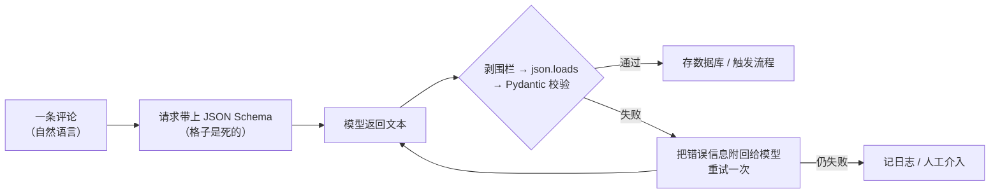

# 第 04 课　结构化输出：让它按格式回答

前三课你一路升级：会调模型了，会把话说清楚了，还让它学会了用工具。现在把镜头拉到真实工作里——老板扔给你一个活儿：网站上有 1000 条用户评论，要自动抽出每条的情感倾向、打几分、提到哪些关键词，存进数据库，差评还要自动推给客服。

模型读懂评论完全没问题，卡住你的是另一件事：它交作业的方式。你问它"这条评论怎么样"，它回你一段流畅的文字，情真意切、头头是道——可你的 Python 程序没法从一段散文里"读出"情感是哪个词、星级是哪个数。人看得懂，代码看不懂。

这一课就解决最后这块拼图：让模型把答案填进你画好的格子里。

## 一、报销单问题：模型为什么不能"随便说"

想象你是财务。员工报销，张三交上来一张纸："我上个月出差去了趟上海，路费加住宿大概八百多，请批准。"李四交上来一段语音留言。你没法入账——钱数是"大概"，科目靠猜，系统录不进去。

所以公司都有一张**统一格式的报销单**：金额一格、日期一格、事由一格，全是必填项。员工往格子里填，财务照着格子录，两边都省心。

模型之前交的就是张三那种"作文"。结构化输出，就是逼它改交报销单：

- 你先画好表：情感一栏、星级一栏、关键词一栏；
- 模型只能往格子里填，不许自由发挥；
- 交上来的是一份机器能直接读的数据（最常用 **JSON** 格式）。

JSON 你在第 1 课的返回结果里见过：一对对"键: 值"，用花括号包起来。它不是给人看的文章，是给程序读的表单。

## 二、先定好目标：我们要的"单子"长什么样

写代码之前，先把表画出来。对一条评论，我们想要的 JSON 是这样：

```json
{
  "sentiment": "negative",
  "rating": 2,
  "keywords": ["电池", "发热"]
}
```

每个字段都是设计出来的，不是随手写的：

- `sentiment`：只允许取 `positive` / `neutral` / `negative` 三个值。为什么不用"情感描述"这样的开放文本？因为下游代码要写 `if result["sentiment"] == "negative": 通知客服`——字段值要是开放的，这句 if 就没法写了。**只给三个选项，程序才好判断。**
- `rating`：1 到 5 的整数。将来可以算平均分、画分布图，前提是它得是数字而不是"大概三星半"。
- `keywords`：字符串数组。一条评论可能提好几样东西，所以是列表；下游好循环处理，比如统计哪个词被提得最多。

看出规律了吗：**每个字段怎么定，取决于下游代码打算怎么用它**。先想清楚"拿到之后我要干嘛"，再定字段，顺序别反。

## 三、三种办法，一个比一个硬

怎么让模型乖乖按格式交表？有三种办法，约束力逐级加强。

### 办法一：口头叮嘱（提示词）

最直接的做法——在提示词里把要求和模板写清楚：

```python
prompt = f"""分析下面这条电商评论，严格按 JSON 返回，不要输出任何别的内容：
{{"sentiment": "positive/neutral/negative", "rating": 1到5的整数, "keywords": ["关键词1", "关键词2"]}}

评论：{comment}
"""
```

给模板、给示例、说"只返回 JSON"，多数时候管用。但它的本质是**口头叮嘱**——就像跟新员工说"记得按格式填报销单"，他大多数时候记得，偶尔赶时间就给你自由发挥了：前面加一句"好的，以下是分析结果"，或者把 JSON 包在一段解释文字里。你的 `json.loads()` 一解析就炸。

### 办法二：让接口强制（response_format 与 JSON Schema）

口头叮嘱不保险，那就换**制度**。主流大模型平台的接口都留了一个专门的参数 `response_format`，意思就是"这次返回必须遵守格式"。最严格的用法是直接给一份 **JSON Schema**——你可以把它理解成"表单说明书"：规定有哪些字段、每个字段是什么类型、哪些必填、取值范围是什么：

```json
{
  "type": "object",
  "properties": {
    "sentiment": { "type": "string", "enum": ["positive", "neutral", "negative"] },
    "rating": { "type": "integer", "minimum": 1, "maximum": 5 },
    "keywords": { "type": "array", "items": { "type": "string" }, "maxItems": 5 }
  },
  "required": ["sentiment", "rating", "keywords"],
  "additionalProperties": false
}
```

这份说明书一眼能读："enum"是枚举（只许三选一），"minimum/maximum"是范围，"required"是必填项，"additionalProperties": false 是"不许多填格子"。把它交给接口，模型就不是"被叮嘱要守格式"，而是**想不守都难**——生成每个词的时候都被这个格式约束着。

2026 年的主流写法是 openai SDK 的 Responses API，本课脚本里就是这么用的：

```python
resp = client.responses.create(
    model="gpt-4o-mini",          # 示例名，以平台当前模型列表为准
    input=prompt,
    text={"format": {"type": "json_schema", "name": "comment_analysis",
                     "strict": True, "schema": COMMENT_SCHEMA}},
)
raw = resp.output_text            # 拿到的就是被 Schema 约束过的 JSON 文本
```

你在不少老项目里还会看到另一种写法 `client.chat.completions.create(..., response_format={...})`——同一个思路的旧接口，仍然广泛可见，能认出来就行，新代码建议按上面的写。

### 办法三：Pydantic 把关（校验）

接口强制已经很硬了，还差最后一道：**财务审核**。单子格式对了，内容也可能有坑——星级填了个 8，关键词塞了 20 个。收单之前再过一遍校验，不合规当场打回。

Python 里干这件事的常用工具是 **Pydantic**（第三方库，装法：`pip install pydantic`）。你用一个类描述"这张表长什么样"：

```python
from pydantic import BaseModel, Field
from typing import Literal

class CommentAnalysis(BaseModel):
    sentiment: Literal["positive", "neutral", "negative"]  # 只能取这三个词
    rating: int = Field(ge=1, le=5)                        # 1~5 的整数
    keywords: list[str] = Field(max_length=5)              # 最多 5 个关键词
    note: str | None = None                                # 可有可无的备注
```

用的时候一行搞定"解析 + 校验"：

```python
data = CommentAnalysis.model_validate_json(raw)   # 不合规会当场报错
data.rating                                       # 直接当 int 用，不再是文本
```

类型不对、缺字段、超出范围，Pydantic 都会发现，而且报错信息会把"哪个字段、期望什么、实际收到什么"说得明明白白。更妙的是，它还能从模型一键生成 JSON Schema——`CommentAnalysis.model_json_schema()`——类写一份，说明书自动有，两头不会对不上。

三种办法怎么选？**不是三选一，是层层叠**：提示词写清楚（模型知道该干嘛）→ 接口上 Schema（格式跑不掉）→ Pydantic 校验（内容有人把关）。正式项目里三道全上。

## 四、解析与兜底：永远不要盲目信任返回

哪怕三道保险都上了，也要记住一个原则：**模型返回的永远是一段文本，落进你程序之前，都要过解析这一关**。就像财务不会收到单子直接入账，总要先核对。

实际中常见的坑有两种。一是模型话多，把 JSON 包在解释里，或者用 Markdown 的代码围栏（三个反引号）包起来；二是返回被截断，JSON 只有一半。稳健的套路是：先剥掉围栏、找出 JSON 片段，再解析，失败就把错误信息告诉模型让它重试一次：

```python
import json

def extract_json(text: str) -> str:
    """从模型返回里抠出 JSON：先剥代码围栏，再取最外层大括号。"""
    text = text.strip()
    if "```" in text:                      # Markdown 围栏：取一对 ``` 之间的内容
        first = text.find("```")
        second = text.find("```", first + 3)
        if second != -1:
            text = text[first + 3:second].strip()
            if "\n" in text:               # 去掉开头可能的语言标记，如 json
                text = text.split("\n", 1)[1].strip()
    start, end = text.find("{"), text.rfind("}")
    if start == -1:
        raise ValueError("返回内容里没有找到 JSON")
    if end == -1 or end < start:
        raise ValueError("JSON 似乎被截断了：有 { 却没有配对的 }")
    return text[start:end + 1]

try:
    data = CommentAnalysis.model_validate_json(extract_json(raw))
except Exception as e:
    # 关键一招：把报错原文告诉模型，让它自己改
    fix_prompt = (f"你上次返回的内容没通过校验，错误是：{e}\n"
                  "请严格按 JSON Schema 重新返回，只返回 JSON，不要任何解释。")
    raw2 = call_model(fix_prompt)
    data = CommentAnalysis.model_validate_json(extract_json(raw2))
```

重试为什么要"带着错误信息"再问？因为模型上次错在哪，说给它听，它大概率就改对了；只说"不对，重来"，它很可能原样再错一遍。这跟辅导人做题一个道理——不是打回重写，是圈出错题。整条流水线画出来是这样的：



本课目录里的 `structured_output.py` 把上面这套完整写了一遍，还附了一个不需要 API Key、纯标准库就能跑的 `parse_demo`——用一段写死的"模型返回"练习剥围栏、解析、打印字段，以及坏 JSON 时的友好报错。跑一遍，比看十遍都清楚。

## 五、常见结构，各是什么直觉

以后你自己设计"单子"，来来去去就这几样零件：

- **枚举**：像 `sentiment` 那样只给几个固定选项。本质是把"开放式问答"变成"选择题"，模型好答，程序好判。凡是取值有限的字段（分类、状态、等级），优先用枚举。
- **数组**：像 `keywords`。一个字段对应多个值时就用列表——多个关键词、多个候选答案、多个步骤。
- **嵌套**：JSON 的值本身又可以是一个对象，一层套一层，像文件夹套文件夹。比如 `"price": {"amount": 129, "currency": "CNY"}`。嵌套让结构清晰，但别套太深——超过两三层，模型容易填错，你读着也累。
- **可选字段**：像 `note`，写 `str | None` 表示"可以没有"。有个细节：在严格的 Schema 模式下，每个字段都必须出现在返回里，所谓"可选"，是允许它填 `null`——表必须整张交回来，但备注栏允许空着。

最后一条设计原则，值得抄在备忘录第一行：**够用就好**。字段越多，模型出错的机会越多，你的校验和解析代码也越长。下游用不上的字段，一个都别要。

## 六、这一章，你搭起了什么

回头看这四章的路：第 01 课你把模型调了起来，第 02 课学会把话说清楚，第 03 课给它装上了工具，这一课让它交回程序能直接处理的格式。四块拼起来，你已经能搭出最基础的自动化了——读一批评论，让模型按 Schema 分析，结果直接进数据库，差评自动触发通知。这条链路里没有一步是魔术，全是你这四章亲手写过的东西。

下一章的 LangChain，做的事情说穿了很朴素：把"拼提示词、调接口、解析、校验、重试"这些每个项目都要写一遍的样板代码，做成现成的零件给你用。零件认得越多越快，但你现在已经有能力徒手把机器搭起来——这比会用任何框架都值钱。

## 想一想

1. 为什么 `sentiment` 要设计成三选一的枚举，而不用"用一句话描述情感"？如果下游代码要写"差评自动通知客服"，两种设计各会发生什么？
2. 办法二和办法一都是"要求模型按格式来"，但一个靠叮嘱、一个靠接口强制。说说它们失败时的表现有什么不同，哪种更容易被你的程序发现？
3. 解析失败后重试时，为什么要把报错信息附回去？只说"格式不对，重新返回"会怎样？
4. （轻动手）案例3演示了"JSON 合法但值不合规"。自己再造一段返回试试：JSON 前面有一句"好的，结果如下："但不套代码围栏——`extract_json` 还能扛住吗？为什么？（提示：想想 `find` 和 `rfind` 分别找的是什么）

## 小结

结构化输出解决的是"模型会说但程序读不了"的问题：先按下游用途定好 JSON 字段，再用提示词、接口层的 JSON Schema、Pydantic 校验三道保险层层约束，最后解析时剥围栏、提取片段、失败带着错误信息重试一次。记住两句话：模型返回的永远是文本，入程序前必过校验；字段设计够用就好，每个字段都要答得出"下游拿它干嘛"。到这里，《LLM 工程基础》的四块基石——调用、提示、工具、结构——你已经全部上手。

---

2026 年 10 月
