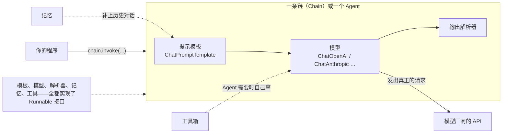

# 第 01 课　LangChain 是什么

第 3 章我们一直用裸 SDK 干活：发请求、拼提示词、挂工具、收结构化结果。你大概也察觉到了，功能越写越复杂，有一批活儿翻来覆去在手写。这一课就来认识一个帮你把这些重复劳动管起来的工具——LangChain。先把话说清楚：**它不是新模型，也不比大模型更聪明，它是一个帮你少写样板、统一接口的框架**。模型还是那些模型，它管的是你的程序和模型之间那堆脏活累活。

---

## 一、先数数第 3 章你亲手写过的样板

回忆几个场景：

- 想"先总结、再翻译"两步走？你得手动取出第一步的返回值，塞进第二步的消息里。
- 想让对话有记忆？你得自己维护一个 messages 列表，每轮把新消息 append 进去，太长了还得自己想办法截断。
- 想换个模型厂商试试？调用代码几乎要重写一遍——函数名、参数、返回结构全不一样。
- 网络抖一下、额度用完了？重试得自己写循环。

每一条都不难，但每一条都要写、要测、要维护。项目里八成的代码在"伺候"模型，真正属于你业务的那两成反而埋在里面。

LangChain 把这些反复出现的活儿做成了**标准零件**：接模型、管提示、存记忆、调工具，全是现成的，而且接口统一。你的精力可以放回业务上。

---

## 二、几个新词，先混个脸熟

### 组件：标准接口的乐高块

LangChain 把大模型应用拆成一个个零件，官方叫它们**组件**（Component）：对话模型、提示模板、输出解析器、记忆、工具、检索器……每个零件都能独立使用。

它们像一套接口统一的乐高：块与块之间能互相咬合，随时可以把一块拆下来换掉，旁边的积木不用动。最典型的例子就是换模型——今天用 OpenAI，明天想试别家，改的只有"模型"那一块零件，提示、解析、记忆统统不碰。

### 链：把零件串成流水线

单个零件干不了完整的活。**链**（Chain）就是把零件按顺序串起来的流水线：提示模板先把问题"定型"，交给模型回答，回答再交给解析器掰开成你要的对象。以后你会常见到这样的写法：

```python
chain = prompt | model | parser
```

那条竖线就是把零件接起来的"水管接口"。流水线还有个妙处：串好的整条链，自己也能当一个零件，再被接进更长的流水线里。

### Runnable：所有零件共用的统一插头

乐高块为什么能互相咬合？因为遵守同一个标准。LangChain 里这个标准叫 **Runnable**（可运行对象）：每个组件、每条链，都会同一套动作，最核心的一个就是 `.invoke`——"给个输入，还你个输出"。

```python
model.invoke("用一句话介绍你自己")      # 模型会这个动作
chain.invoke({"question": "什么是Token"})  # 整条链也会这个动作
```

这正是"换模型只改一块"的底气：新旧零件动作完全一样，插座根本不关心插上来的是台灯还是风扇。除了 invoke，还有流式的 stream、批量的 batch、异步的 ainvoke，下节课展开。

### 还有三个词，先点名

- **LCEL**：刚才 `prompt | model | parser` 用的"搭链表达式语言"，可以理解成 LangChain 的搭积木语法，第 02 课专门讲。
- **Agent**：普通链是固定流水线，一步一步按顺序走；Agent 是拿到工具箱后**自己决定**先查资料还是先算数、什么时候收工的"老师傅"。第 04 课展开。
- **Middleware**：给链或 Agent 统一加的一层处理，比如"每次调模型前自动补历史""调用失败自动重试"。像装在总水管上的统一阀门——所有水流过都先经过它，你不用在每根水管上单独装。第 04 课写 Agent 时会再碰到它。

---

## 三、一张图看懂全貌



看图抓两层：方框（模板、模型、解析器、记忆、工具）是**零件层**，它们全部实现 Runnable 接口；把它们串起来的链和 Agent 是**编排层**，决定零件以什么顺序、什么规则干活。真正"出力气"的只有模型那一格，其余零件都在为这一次调用做准备和收尾。普通链按图上箭头顺序走；换成 Agent，虚线那两根"什么时候用"的开关就交给模型自己按。

### 为什么装个框架要装好几个包

安装时你会发现 LangChain 不是一整个包，而是一家人：

| 包名 | 管什么 | 类比 |
|------|--------|------|
| langchain-core | 地基：Runnable 接口、消息类型、LCEL 语法 | 毛坯房的承重结构 |
| langchain | 主包：Agent、常用零件、通用逻辑 | 精装修 |
| langchain-openai | 接 OpenAI 的模型 | 某个品牌的家电 |
| langchain-anthropic 等集成包 | 接对应厂商的模型 | 其他品牌的家电 |
| langchain-community | 社区贡献的一大堆第三方集成 | 五金杂货铺 |

分包装是刻意的：用哪家模型就装哪个集成包，不必把全世界厂商都拖进依赖里；地基和家电各自独立升级，一个包更新不至于把别的全带崩。要用 OpenAI，就 `pip install langchain langchain-openai`，就这么点事。

---

## 四、装上它，跑通你第一条链

虚拟环境怎么建、API Key 怎么申请，第 3 章首课都讲过，这里只叮嘱一句：**Key 别写进代码**——从环境变量读，或用 python-dotenv 从项目里的 .env 文件读（.env 记得加进 .gitignore，别提交）。

安装三件套：

```bash
pip install langchain langchain-openai python-dotenv
```

本课目录里的 hello_langchain.py 就是你的第一条链，核心就这几行：

```python
from langchain_core.prompts import ChatPromptTemplate
from langchain_openai import ChatOpenAI

prompt = ChatPromptTemplate.from_messages([
    ("system", "你是一个说话简洁的编程老师。"),
    ("human", "用一句话解释什么是{thing}。"),
])
model = ChatOpenAI(model="gpt-5.4")  # 示例名，读到这里可能已更新；跑之前按官网模型列表挑当前便宜够用的

chain = prompt | model
print(chain.invoke({"thing": "LangChain"}).content)
```

对照第 3 章的裸 SDK 写法，你手写过的活儿都有了归宿：

| 第 3 章你手写的 | 现在变成了 |
|----------------|-----------|
| 自己拼 messages 列表、手动塞变量 | ChatPromptTemplate 模板，{thing} 占位自动填 |
| client.chat.completions.create(...) 一大段 | model 一块零件，.invoke 一声令下 |
| prompt 和 model 之间的传话代码 | 一条竖线 `|` 接起来 |
| 换厂商要重写调用 | 换一个模型类，链的其他部分不动 |

跑出来的回答和第 3 章那次"第一次调用"没有本质区别。区别在于形状：今天这几行，明天可以直接长成带记忆、带工具、带解析的完整应用，而不用推倒重来。

---

## 五、对框架，保持一点清醒

工具越顺手，越容易忘了问"我为什么需要它"。给你三条清醒剂：

1. **框架会更新，接口会变。** LangChain 演进很快，旧写法可能过时。跑不通时先怀疑版本，查官方迁移指南，别死磕。
2. **抽象会过度。** 为了"换模型不改代码"这种灵活性，你背上了整套概念。如果需求只是发一次请求拿回结果，裸 SDK 十几行更清爽——杀鸡用牛刀，牛刀还容易夹手。
3. **懂底层，框架才为你所用。** 第 3 章的功底这时候显出价值：链报错时，你能分清是提示的问题、模型的问题还是解析的问题，而不是对着黑盒干瞪眼。

第 07 课我们专门讨论"什么时候不该用框架"。先把工具学会，才谈得上什么时候放下它。

---

## 想一想

1. "换模型只改一块零件"靠的是哪个概念的功劳？如果没有统一接口，换一次模型你要动多少地方？
2. `prompt | model | parser` 串成的整条链，自己算不算一个组件？它会不会 `.invoke`？
3. 举两个你会**不用** LangChain、直接裸写 SDK 的具体场景，说说理由。
4. 如果让你在"每次调模型之前"这个阀门位置统一加一件事（Middleware 的思路），你会加什么？为什么？

## 小结

- LangChain 是帮你少写样板、统一接口的框架，不是新模型；它管的是你的程序和模型之间的重复劳动。
- 组件是标准零件（模型、提示、解析器、记忆、工具），链是把零件串成的流水线，串好的链自己还能当零件。
- Runnable 是所有零件共同遵守的统一接口，`.invoke` 是它的核心动作；零件可换、可串，全靠这个约定。
- 包是分开装的：langchain-core 打地基，langchain 是主包，langchain-openai 等集成包接各家模型。
- 框架不是越用越好——懂底层、按需用，是这一章从头到尾的态度。

---

2026 年 10 月
