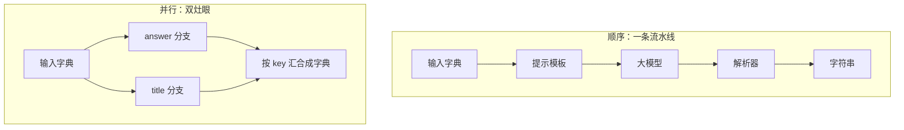

# 第 02 课　LCEL：用管道搭积木

上一课我们把 LangChain 的地图过了一遍，"链"这个词露过面，但没细讲怎么把零件连起来。这一课就讲它的招牌写法——LCEL。学完这课，你写 LangChain 代码的样子基本就定型了：一根竖线接一根竖线，像搭积木一样把程序拼出来。

---

## 一、先看一段"像水管"的代码

```python
from langchain_core.prompts import ChatPromptTemplate
from langchain_core.output_parsers import StrOutputParser
from langchain_openai import ChatOpenAI

model = ChatOpenAI(model="gpt-4o-mini")  # 示例名，可能已更新：按官网模型列表选当前便宜够用的

chain = (
    ChatPromptTemplate.from_template("用一句话给零基础读者解释：{question}")
    | model
    | StrOutputParser()
)

result = chain.invoke({"question": "什么是向量数据库"})
print(result)
```

中间那几个竖线 `|`，就是这节课的主角。它像**厨房流水线**：洗好的菜传给切菜的，切好的传给掌勺的，出锅传给装盘的。每道工序只管接住上一步的产出，你不用端着盘子在灶台之间跑来跑去。

顺着竖线看数据怎么流：输入字典 `{"question": ...}` 先进提示模板，填成一句完整的提示词；交给模型，回来一个消息对象；再交给输出解析器，抽出纯字符串。前一段吐什么，后一段就吃什么，接得严丝合缝。

这套写法的正式名字叫 **LCEL**（LangChain Expression Language，LangChain 表达式语言）。名字听着唬人，其实就是"用竖线把零件接成流水线"的一套约定。

> 顺带修正一个网上常见的说法：有的老教程说 LCEL 是某个新版本才有的实验特性，不对——它早就是官方主推的基础写法，你看到的现代 LangChain 代码，几乎全是这样写的。

## 二、Runnable：所有零件共用同一组按钮

上面代码里，提示模板、模型、解析器，连同拼好的整条 chain，都是 **Runnable**。你可以把它想成**乐高的统一接口**：不管这块积木是轮子还是窗户，凸点规格一模一样，所以随便拼。LangChain 里所有零件都实现了 Runnable 接口，每个零件都装着同一组按钮：

- `.invoke(输入)`：跑一次。最常用的按钮，调试、日常调用都靠它。
- `.batch([输入1, 输入2, ...])`：一批输入一起跑。内部会尽量并行发出去，适合一次处理几十上百条——比如批量评测。
- `.stream(输入)`：边生成边吐字，不做完不出手。适合聊天界面，让用户看着回答一个个字往外蹦。

三个按钮什么时候用哪个，直觉很简单：一次用 invoke，一批用 batch，要实时感用 stream。最妙的是——**这些按钮整条链也有**。你不用关心链里接了几道工序，对着 chain 整体 invoke、batch、stream 都行。学会一个零件，就等于学会了所有零件。

## 三、顺序与并行：串水管，和开双灶

竖线串起来的那条链，类型叫 RunnableSequence（顺序链），好理解：一道工序接一道。

但真实的活儿不总是排队的。比如用户问了一句话，你既想生成回答，又想顺手给这段对话起个标题——两件事互不依赖，没必要等。这时候用 **RunnableParallel**，它像**灶台上的两个灶眼**：一边炖汤一边炒菜，同一个输入同时送进所有分支，跑完按 key 汇合回字典：

```python
from langchain_core.runnables import RunnableParallel

answer_chain = (
    ChatPromptTemplate.from_template("认真回答：{question}") | model | StrOutputParser()
)
title_chain = (
    ChatPromptTemplate.from_template("给问题「{question}」起一个10字以内的标题")
    | model
    | StrOutputParser()
)

parallel = RunnableParallel(answer=answer_chain, title=title_chain)
result = parallel.invoke({"question": "什么是向量数据库"})
print(result["answer"])  # 按分支的 key 取结果
print(result["title"])
```

两件各要三四秒的事，总耗时接近最慢那条分支，而不是两者相加。结果也不会混：answer 回 answer 的 key，title 回 title 的 key。

下面这张图把两种接法画在了一起：



## 四、字段对不上？加个转接头

链一长，就会遇到"上一步吐的东西，下一步咽不下去"的尴尬。比如上一步产出纯字符串，下一步的模板却要吃 `{"text": ...}`。这时候竖线两边得加个**转接头**——就像两截口径不同的水管，中间接个变径。

转接头有两种常用做法：

```python
# 做法一：用小函数把上一步的输出掰成需要的形状
from langchain_core.runnables import RunnableLambda

summary_prompt = ChatPromptTemplate.from_template("把要点整理成3条：{text}")

chain = (
    ChatPromptTemplate.from_template("用一句话介绍 {topic}")
    | model
    | StrOutputParser()                          # 到这里吐出字符串
    | RunnableLambda(lambda text: {"text": text})  # 转接头：字符串变回字典
    | summary_prompt
    | model
    | StrOutputParser()
)
```

```python
# 做法二：字典 + RunnablePassthrough，各分支各取所需
from langchain_core.runnables import RunnablePassthrough

adapted = RunnableParallel(
    context=retrieval_chain,          # 这个分支拿输入里的 question 去检索
    question=RunnablePassthrough(),   # 原样透传，别的问题原封不动留给下一段
)
```

写长链前先在心里过一遍：**每一段吃什么、吐什么**。键名对上了，竖线直接通；对不上，就补一个转接头。排查链报错，十有八九是断在这儿。

## 五、竖线白捡的能力：重试和备用模型

用 LCEL 写，好处不止代码短。因为链是一个结构清晰的管道，框架能替你自动办好很多事：流式输出、异步调用、批量并行，只要你用对应的按钮（stream / ainvoke / batch）就自动生效。还有两件"保命装"值得单独说：

```python
# 网络抖了一下？自动再拨一次，最多重试 3 次
safe_chain = chain.with_retry(stop_after_attempt=3)

# 主模型整体不可用？自动切换备用，活儿不能停
backup = ChatOpenAI(model="另一个便宜模型")  # 示意：真实项目里放备用模型实例
robust = chain.with_fallbacks([backup])
```

`with_retry` 像**没打通就再拨一次电话**——对付偶发的网络抖动、超时，重试一两次往往就过了。`with_fallbacks` 像**主厨请假就让二厨顶上**——主服务商整体故障时，请求自动流向备用模型，用户端几乎无感。前者治"偶尔失败"，后者治"这一家彻底不行"，两个可以叠加挂上，是最实用的组合。

> 给从老教程过来的你提个醒：网上不少资料还在用 `LLMChain(llm=..., prompt=...)` 加 `chain.run(...)` 的写法。这在 LangChain 1.x 里已经淘汰，被挪进了兼容包 langchain-classic。见到认识就行，新代码一律用本课的管道写法。

## 六、从简到繁：三条链试试手

1. **一段式**：`提示 | 模型 | 解析器`。最经典的一条，九成需求的最小可用单元。
2. **并行段**：`RunnableParallel` 里装多条分支，结果按 key 汇合，本课第三节的 answer + title 就是。
3. **复合段**：并行的结果还能续着往下接。关键是键名对上——并行汇合吐出 `{"answer": ..., "title": ...}`，下一段模板的变量也叫 `answer` 和 `title`，竖线直接就通了：

```python
digest_prompt = ChatPromptTemplate.from_template(
    "标题是「{title}」，正文是「{answer}」，判断标题是否贴切，一句话回复。"
)
final_chain = parallel | digest_prompt | model | StrOutputParser()
```

最后一个提醒：链不是越长越帅。一条链超过半屏，先想想能不能拆成几条有名字的短链（就像上面的 answer_chain、title_chain），再组合。半年后的你要是看不懂自己拼的这条"九节鞭"，那就拆早了不如不拆。本课配套的 `lcel_demo.py` 把三条链都写全了，可以直接跑。

---

## 想一想

1. 把 `| StrOutputParser()` 从链里去掉，`chain.invoke(...)` 拿到的还是字符串吗？不是的话，它是什么、你会怎么取出文字？
2. `chain.batch([q1, q2, q3])` 和写个 for 循环挨个 `invoke`，最终结果一样，差别在哪？什么场景下 batch 的优势才真正体现？
3. 并行链的两个分支各要 4 秒，`invoke` 一次的总耗时接近 4 秒还是 8 秒？如果改成串行两条链呢？
4. 动手：打开 `lcel_demo.py`，把离线小链里的大写函数换成"给文本两头加上【】"，跑一次看输出。

## 小结

- LCEL 就是竖线接零件：前一段的产出自动成为后一段的输入，像厨房流水线一样不用你端盘子。
- 所有零件和整条链都是 Runnable，共用 invoke / batch / stream 三个按钮，学会一个就等于学会全部。
- 竖线是顺序（RunnableSequence），RunnableParallel 是并行（双灶眼），结果按 key 汇合。
- 字段对不上就用字典或 RunnableLambda 小函数当转接头；写链前先过一遍每段吃什么、吐什么。
- 管道写法白捡流式、异步、批量，再挂上 with_retry 和 with_fallbacks 两件保命装，链就又稳又快。

---

2026 年 10 月
