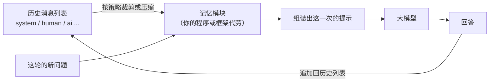

# 第 03 课　Memory：让模型记得前文

上一课我们用 LCEL 把各个环节接成了链。现在试着跟它多聊两句，你大概率会撞上一件尴尬的事：

```
你：我叫小林。
AI：你好，小林！
你：我叫什么？
AI：呃……你还没告诉过我呀。
```

模型不是抬杠，它是真不记得。这一课就把这件事彻底讲明白：为什么默认失忆，所谓"记忆"到底是什么东西，以及 2026 年用 LangChain 该怎么给它装上记性。

---

## 一、先说破一件事：模型根本没有记性

第 03 章你用原生 SDK 调过模型，这里把一个最容易被忽略的事实挑明：模型服务是**无状态**的。你每发起一次调用，它都是"初见"——服务端不替你保存上次聊了什么，请求处理完就翻篇。

打个比方。你有一位笔友，这位笔友像金鱼一样只有七秒记忆，但它文笔极好、有问必答。你每写一封信，它都回得漂亮；可它完全不记得上一封信里你说过什么。想让对话延续，你只有一个办法：**每封信都把之前所有的来往信件复印一份，附在后面**。它每次读到的其实是"完整聊天记录 + 你这封新信"，读完才显得"什么都记得"。

跟大模型对话就是这件事。所谓 AI 记得你，从来不是模型脑子里长了一根记忆神经，而是**你的程序把历史对话一起塞进了这一次的请求**。所以"给模型装记忆"，翻译过来就一句话：帮你自动维护、拼装那份历史列表。LangChain 的 Memory 组件、接下来要讲的 checkpointer，干的都是这个活，区别只在省心程度。

## 二、历史长什么样：一份消息列表

剥开所有封装，"记忆"就是一份消息列表（messages）。每条消息带一个角色和一段内容：

```python
from langchain_core.messages import SystemMessage, HumanMessage, AIMessage

history = [
    SystemMessage(content="你是一个友好的助手。"),   # 定调子的，通常放最前
    HumanMessage(content="我叫小林，最喜欢的数字是 7。"),
    AIMessage(content="你好小林！7 是个幸运数字。"),
    HumanMessage(content="我叫什么名字？"),          # 这轮的新问题
]
```

把这整份列表发给模型，它当然答得出"你叫小林"——答案就明晃晃写在上下文里。上一课 LCEL 里提过的 `MessagesPlaceholder`，就是在提示模板里给这份列表"占座"用的。

记忆模块的全部工作，就是替你维护这份列表：这轮聊完，把新的一问一答追加进去；下一轮开始前，按某种策略决定带哪些进提示。整个过程像下图这条闭环：



看清楚箭头：历史被组装进提示，模型回答，回答又追加回历史。所谓"越聊越有默契"，就是这份列表在悄悄变长。

## 三、三种留历史的策略：全留、只留最近、压缩成纪要

既然历史是你自己附上去的，附多少、怎么附就是一道选择题。三种经典策略，各有各的性格。

### 1. 全都留着：缓冲（Buffer）

原文一条不落全部保留。最忠实，模型能看到每个细节；代价是列表越攒越长——每轮都变长，token 费用跟着涨，涨到某一天直接顶到模型的上下文窗口上限。短对话、原型验证用它最省心。

### 2. 只留最近 K 轮：窗口（Window）

像滑动车窗，窗外的风景只留眼前这一段：列表里只保留最近 K 轮（一轮 = 一问一答），更早的悄悄丢掉。token 花费被钉死在恒定范围，但早前提过的事就真忘了——你第 1 轮说的名字，到第 20 轮它答不上来，不是矫情，是那几条消息真不在提示里。

### 3. 压缩成纪要：摘要（Summary）

像会议纪要：用另一个（更便宜的）模型把旧对话压缩成几句话梗概，再连同最近几轮原文一起带上。长对话也能把 token 控制住，还不至于把开头忘得精光；代价是细节可能丢——纪要里写"讨论了项目排期"，可没记你具体说周五交周报。

三种策略一张表看全：

| 策略 | 怎么留 | 优点 | 代价 | 适合 |
|------|--------|------|------|------|
| 缓冲 Buffer | 原文全留 | 最忠实，零信息损失 | 越攒越长，token 崩 | 短对话 |
| 窗口 Window | 只留最近 K 轮 | 长度恒定，费用可控 | 早前的事会忘 | 聊天为主的长对话 |
| 摘要 Summary | 旧话压成梗概 | 长对话也省，大局不忘 | 多一次 LLM 调用，细节丢 | 几十轮以上的长对话 |

实践中常见的打法是缓冲加摘要混着来：旧的摘要、新的留原文，两头都占一点。

## 四、2026 年的主流做法：checkpointer 加线程号

上面三种策略是理解问题的骨架。但你要注意：老的 LangChain 教程里那批 `ConversationBufferMemory`、`ConversationBufferWindowMemory`、`ConversationSummaryMemory` 类，如今已进入维护模式——它们属于旧范式（v0.x），你会在老文章、老代码里反复见到，得能认出来，但新项目不必再从它们起步。

新范式的思路换了个角度：**记忆不再是一个挂在链上的"组件"，而是"给每段对话一个线程号，把状态随线程存下来"**。具体两件套：

1. **checkpointer（检查点存储器）**：你给链或 Agent 配一个，它负责在每轮对话后把状态（包括全部消息历史）存进指定的地方——内存、SQLite、数据库都行，像游戏存档。
2. **thread_id（线程号）**：每段对话给一个编号。下次带着同一个 thread_id 来，checkpointer 把存档取出来，历史自动回到提示里；换个新编号，就是一段全新对话。

用起来大概长这样：

```python
from langchain.agents import create_agent
from langchain_openai import ChatOpenAI
from langgraph.checkpoint.memory import InMemorySaver

checkpointer = InMemorySaver()  # 存内存里：程序重启就没了
agent = create_agent(
    model=ChatOpenAI(model="gpt-4o-mini"),  # 示例名，跑之前按官网模型列表选个当前便宜够用的
    tools=[],
    system_prompt="你是一个友好的助手。",
    checkpointer=checkpointer,
)

config = {"configurable": {"thread_id": "chat-1"}}  # 同一段对话共用一个编号
agent.invoke({"messages": [{"role": "user", "content": "我叫小林，最喜欢的数字是 7。"}]}, config)
agent.invoke({"messages": [{"role": "user", "content": "我叫什么？最喜欢哪个数字？"}]}, config)
# 第二次调用它答得上——同一个 thread_id，历史被自动装进了提示
```

你没有手动维护任何历史列表，checkpointer 替你做了存与取。至于第 03 课开头那种"全留还是留最近几轮"的策略问题，新范式下照样存在，只是换了地方处理：要么靠模型选型（上下文窗口大的，短对话直接全留），要么在应用层对历史做裁剪或摘要。本课配套的 `memory_demo.py` 里，两种写法（新 checkpointer、旧 Memory 类）都有对照。

还有一条过渡期的路也提一句：`RunnableWithMessageHistory` 配合 `ChatMessageHistory`，用 `session_id` 区分会话——这是 1.x 里纯 LCEL 链挂历史的写法，读别人代码时会碰到，思路和 thread_id 一致。

## 五、存哪儿：从"重启就没"到"换个话题还认得你"

`InMemorySaver` 把存档放在**内存**里：快，零配置，但程序一重启全忘——适合本课这样的练手。

真实项目里，存档通常落进能活过重启的地方：SQLite 一个文件就够小应用用；用户量上来再换 PostgreSQL、Redis 这类专业存储。差别只在 checkpointer 换个实现（比如 `langgraph-checkpoint-sqlite` 包里的 SQLite 版），代码其余部分一模一样。

存哪儿决定了记忆的"保质期"：内存版是单次会话内记得，数据库版是**跨会话**记得——用户三天后回来，换个话题，它还认得你。这也是很多产品"记得我上次问过"的底细：不是模型记性好，是存档存得久。

## 六、记忆不是越多越好

顺着上面的话再说一层：把历史全塞给模型，不一定换来更好的回答。

- **费用与上限**：历史越长，每次请求带的 token 越多，账单按量涨；真涨过上下文窗口，请求直接报错。
- **注意力会被稀释**：上下文塞得太满，模型反而容易"分心"——抓不住这轮真正的重点，或被早已过时的旧信息带偏。第 02 章讲上下文窗口时你见过类似的限制，这里是它在应用层的影子。

所以工程上要做减法：长历史该截断就截断、该摘要就摘要，跟系统提示词一样，进上下文的每一段都该值得占那个位置。

## 七、别忘了隐私这件事

最后说个容易被新手略过、做产品却躲不掉的问题：**对话被保存，意味着用户说的话被留下了**。

用户随口聊的可能是病情、财务状况、家庭住址。这些内容一旦进了历史并持久化，就变成你要保管的数据：存哪儿、存多久、谁能看、怎么删，都得有数。至少做到这几条底线：

- 别把敏感信息原样长期明文存储；能脱敏先脱敏（比如标识符替换成代号）。
- 给用户"删除我的对话记录"的能力，且真能删干净——包括那些存档。
- 别把记忆当成模型的"私有账本"随意转用：用户对 A 话题说的话，不宜悄悄喂给另一个完全不相干的功能。

记住一个朴素的换位：你不会希望跟客服说的每句话被永久留档且四处流转——用户也一样。

---

## 想一想

先自己回答，能讲给别人听最好。

1. 跟模型说"我上一句刚说过什么"，它答不上来。请用"金鱼笔友"的比喻，向朋友解释为什么它答不上来，以及要让它答上来，你的程序得做哪件事？
2. 窗口记忆省 token，摘要记忆保大局。假设你在做一个"客服工单助手"，用户常常第一句话就报订单号，聊到四五十轮还没完——你会选哪种策略？或者怎么组合？
3. 同一个 `thread_id` 传了两次 `invoke`，第二次模型"记得"上一轮。请按"历史 + 新问题 → 组装提示 → 模型"这条链路，说出它"记得"的完整过程。
4. （动手感受）跑一遍本课的 `memory_demo.py`（没配 Key 也能跑离线小练）。观察窗口函数保留最近 2 轮后，"小林"这个名字是不是真的从列表里消失了——用亲眼所见印证"早前提的事会忘"。

---

## 小结

这节课带走四句话就够了：

- 模型本身无状态，所谓"记忆"是你的程序把历史消息列表连同新问题一起发进了这次请求。
- 维护历史有三种基本策略：缓冲全留最忠实但越攒越长，窗口只留最近 K 轮省 token 但忘早事，摘要压缩旧话保大局但丢细节。
- 2026 年的新范式是 checkpointer 加 thread_id：给链或 Agent 配一个存档器，同一线程号自动带出全部历史；老的 `ConversationBufferMemory` 一族进维护模式了，看得懂即可。
- 记忆要选好存哪儿、留多少：内存快但重启就没，数据库能跨会话；历史不是越多越好，还得替用户看紧隐私。

下一课讲 Tools 与 Agent：让模型自己决定一步步调用工具完成任务。你会看到，Agent 多步干活时同样离不开今天这套"存档"机制——不然它做到第几步都记不住。

---

2026 年 10 月
