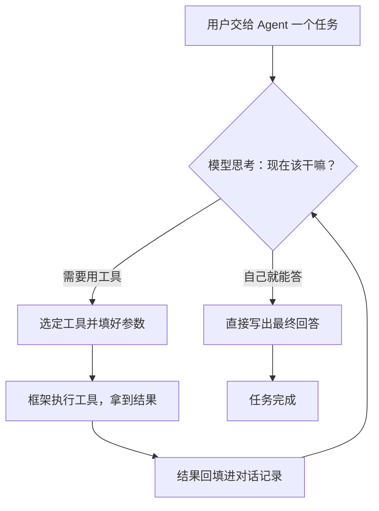

# 第 04 课　Tools 与 Agent

上一课你亲手把 Function Calling 的闭环走了一遍：递单、执行、回填，模型终于"会用工具"了。但你多半也感觉到了——那套代码写起来相当啰嗦：菜单要手工拼 JSON，单子要自己解析，结果要自己回填，模型多点几次菜还得自己写循环。

这一课先看 LangChain 怎么把这些杂活包圆，再聊一个更大的话题：既然模型会点菜了，能不能干脆让它自己当领班——给它工具箱和任务清单，让它自己决定先干哪件、后干哪件？这就是 Agent。

---

## 一、框架替你省了什么

回忆第 3 课的闭环，里面全是体力活：

- 把函数名、参数说明拼成一份 JSON 菜单，随请求发给模型；
- 从模型回复里认出"它想调用哪个函数、参数是什么"；
- 真正执行函数，把结果转成文本回填进对话；
- 模型如果继续点菜，回到第一步再来一轮。

LangChain 把这些封装成两个零件：**Tool** 负责"把你的函数翻译成模型看得懂的菜单"，**Agent** 负责"把递单—执行—回填的循环自动跑起来"。你只写函数本身，翻译和循环都归它管。

> 老规矩，先问"不用框架我要写多少"。上一课的 function_calling.py 已经替你答了：光闭环就五六十行样板。框架没变魔术，它只是把这些替你写好了。

---

## 二、定义工具：@tool 最省事

最常用的方式是 `@tool` 装饰器：普通函数加一行，就变成模型能用的工具。

```python
from langchain_core.tools import tool

@tool
def get_weather(city: str) -> str:
    """查询北京/上海/广州当天的模拟天气。其他城市不要调用，直接告知用户暂不支持。"""
    data = {"北京": "晴，最高 18℃", "上海": "多云，最高 22℃", "广州": "阵雨，27℃"}
    return data.get(city, f"暂无 {city} 的数据")
```

它自动干了三件事，全是从函数身上"读"出来的：

- **docstring 变成工具说明书**。就是给模型看的那段 description，告诉它这工具干什么、什么时候该用；
- **参数类型标注变成参数 schema**。`city: str` 会被翻译成"需要一个字符串参数 city"；
- **函数体变成执行逻辑**，由你的程序在本地真正运行。

所以 docstring 不是写给人看的注释，而是写给模型的说明书——相当于给新同事的交接文档。写得含糊，模型就会瞎点菜：你只支持三个城市，docstring 只写"查天气的"，用户问"成都天气"它照样调，回来只能两手一摊。参数描述同理，"中文城市名，如：北京"比光秃秃的 `city: str` 返工率低得多。

装好后的工具用 `.invoke()` 直接调用，传参用字典：

```python
print(get_weather.invoke({"city": "北京"}))
print(get_weather.args)   # 看看模型看到的参数说明书长什么样
```

---

## 三、需要更多控制时：Tool 与 BaseTool

`@tool` 覆盖九成场景。想要更细的控制，还有两条路：

`Tool` 类适合"函数已经写好了，随手包一下"：

```python
from langchain_core.tools import Tool

calc = Tool(
    name="calculator",
    func=lambda e: str(eval(e)),      # 仅示意，eval 有注入风险，真实代码见本课 demo
    description="计算一个算术表达式",
)
```

`BaseTool` 基类适合复杂工具——参数校验想用 Pydantic 模型、逻辑想写成类、状态想在多次调用间复用：

```python
from langchain_core.tools import BaseTool
from pydantic import BaseModel, Field

class WeatherInput(BaseModel):
    city: str = Field(description="中文城市名，如：北京")

class WeatherTool(BaseTool):
    name: str = "get_weather"
    description: str = "查询北京/上海/广州的模拟天气，其他城市不要调用"
    args_schema: type = WeatherInput

    def _run(self, city: str) -> str:
        return {"北京": "晴 18℃"}.get(city, "暂无数据")
```

顺带一句异步：如果工具本身就是网络请求，把函数写成 `async def`，调用改用 `await tool.ainvoke({...})`，其余一切不变。入门阶段用同步的完全够了。

---

## 四、内置工具，以及出错怎么办

LangChain 社区维护了一批现成工具，不用每个都自己写：

| 工具 | 干什么 | 注意 |
|------|--------|------|
| Wikipedia 查询 | 查百科条目 | 需装 langchain-community |
| Tavily / SerpAPI 搜索 | 搜索引擎 | 需要各自的 API Key |
| Python REPL | 跑 Python 代码 | 高危：等于给模型 shell |
| Shell 工具 | 执行系统命令 | 同上，慎给 |

接入方式都是"包装类套一层 API 包装器"两行代码，用到哪个查哪个的文档即可。真正的重点在于：**工具会出错**——搜索额度用尽、订单号不存在、表达式残缺。这在第 3 课你处理过：错误信息要当"执行结果"喂回去，模型会自己换说法，程序不能当场挂掉。

LangChain 把这个思路做成了开关：工具内部抛 `ToolException`，再告诉框架"错了别炸，回填给模型"：

```python
from langchain_core.tools import StructuredTool, ToolException

def query_order(order_id: str) -> str:
    """按订单号查询订单状态，order_id 形如 SO-2026-0001。"""
    raise ToolException(f"订单 {order_id} 不存在，请确认订单号后重试")

query_order_tool = StructuredTool.from_function(
    func=query_order,
    name="query_order",
    handle_tool_error=True,  # 开关打开：ToolException 转成回复文本，程序不崩
)
```

这样 `query_order_tool.invoke(...)` 拿到的就是那句"订单不存在"，模型看了自然会换说法安抚用户。注意版本差异：v1.x 的 `@tool` 装饰器工厂已经不接收 `handle_tool_error` 这个参数（老代码里 `@tool(handle_tool_error=True)` 现在会直接报 TypeError），开关要开在工具对象上。偷懒一点的做法则是在函数里 try/except 直接返回一句友好的中文说明，效果类似。原则不变：**错误是数据，不是事故**。

---

## 五、Agent：给助理一份工具箱

到这里，"用工具"和"用 Agent"的区别还没登场。差在哪？打个比方：

- **固定链**像景区的观光大巴：先停 A 站再停 B 站，路线是图纸上画死的，你写代码时就定了；
- **Agent** 像一个拿着工具箱的能干助理：你只交代目标——"查查北京和上海今天哪个热，温差多少"——它自己决定先掏哪把工具。可能先查北京、再查上海、最后按个计算器；换个任务，顺序又是另一套。

关键差异就一句话：**链的路径是你预先写死的，Agent 的路径是模型临场决定的**。所以 Agent 的运行核心是一个循环——想一步、做一步、看结果、再想下一步：



这个"思考 → 选工具 → 执行 → 回填 → 再思考"的循环，正是第 3 课你手写的那段 while 循环——Agent 只是把循环里的判断也交给了模型：它觉得信息够了，就不再点菜，直接作答收工。

---

## 六、v1.x 怎么搭一个 Agent

上一版教材里满屏的 `AgentExecutor`、`create_openai_functions_agent`、`initialize_agent`，在 LangChain v1.x 里都已成过去式。现在统一用一个入口：

```python
import os
from langchain.agents import create_agent
from langchain_openai import ChatOpenAI

llm = ChatOpenAI(
    model="gpt-4o-mini",  # 示例名，可能已更新：按官网模型列表选当前便宜够用的
    api_key=os.environ.get("OPENAI_API_KEY"),
)

agent = create_agent(
    model=llm,
    tools=[get_weather, calculator],
    system_prompt="你是助理。只能用提供的工具查天气和做计算，答不了的直说，不要编。",
)

result = agent.invoke({"messages": [{"role": "user", "content": "北京和上海今天哪个更热？温差多少？"}]})
print(result["messages"][-1].content)
```

三样东西喂进去：模型、工具列表、系统提示。返回的 `result["messages"]` 是完整对话记录，最后一条就是答案；前面几条里能看到它点菜的痕迹（调了哪个工具、参数是什么），调试时很有用。

再说说 **Middleware（中间件）**，它是 v1.x 的新机制：像流水线上一个个可插拔的工位，在模型每轮"思考"前后统一插逻辑。第 3 课讲记忆时你自己拼过"历史太长怎么办"，在这里一个现成件就挂上了：

```python
from langchain.agents.middleware import SummarizationMiddleware

agent = create_agent(
    model=llm,
    tools=[get_weather, calculator],
    system_prompt="你是助理。",
    middleware=[
        SummarizationMiddleware(model=llm),  # 对话太长自动摘要，呼应第 03 课的记忆问题
    ],
)
```

护栏、结构化输出（呼应第 01 课的 Runnable 与第 03 课的 Memory）也都有对应中间件，思路一致：能力做成配件，按需往上传。中间件的具体参数随版本演进较快，用时以官方文档为准。

> 老教程对照，会读即可：`AgentExecutor + create_openai_functions_agent`、`initialize_agent`、`AgentType` 枚举，全部被 `create_agent` 取代；新代码不要再抄那些写法。`create_agent` 内部基于 LangGraph 跑循环，循环步数等管理也不再需要你手动配 `max_iterations`。

---

## 七、让 Agent 靠谱的五道保险

Agent 自由，自由也意味着它可能跑偏。几道保险按成本从低到高排：

1. **说明书写清楚**。docstring 里说清用途、边界、参数格式——这是成本最低、收益最大的一道；
2. **系统提示划边界**。"只允许做这几件事，做不到就直说"，压缩它自作主张的空间；
3. **危险工具留确认**。删数据、发邮件、花钱的动作，用人工确认中间件先弹给人点头再执行；
4. **循环步数封顶**。限定最多几轮，防止它在同一个坑里无限打转烧钱；
5. **出错递台阶**。工具错误友好回填，它多半会换个路子重试，而不是一路错到底。

最后一道判断题最重要：**简单固定的流程，别用 Agent**。三步以内、路径确定的活，一条 LCEL 链又快又稳又省钱；Agent 每一步都要模型思考，更贵、更慢、结果还带随机性。它是给"路径无法预知"的任务用的——就像开车的导航，只有路痴才需要，熟的路线直接开就行。

---

## 下一课预告

Agent 的工具箱里，最有分量的一件是"查你自己的资料"：公司文档、课程笔记、产品手册——这些东西模型从没见过，得靠检索喂给它。下一课 Retrievers，就讲怎么把你的文档变成模型能随时翻的资料库。

---

## 想一想

1. `@tool` 装饰器从函数身上自动提取了哪三样东西？如果 docstring 只写"查天气的"，猜猜模型会在什么情况下瞎调用它？
2. "每次都按'先查库存、再查物流、最后汇总'三步走"的流程，该用固定链还是 Agent？"帮用户排查为什么订单还没到"呢？为什么？
3. Agent 卡在同一个工具上反复调用、打转不收敛，可能是哪几个原因（提示：说明书、提示词、错误回填各想想）？分别怎么治？
4. （轻动手）给 tools_agent_demo.py 加一个 now 工具：用标准库 datetime 返回当前时间，挂进离线演示跑一遍。不需要 API Key。

---

## 小结

LangChain 用 `@tool` 把"函数 + docstring + 类型标注"自动翻译成模型看得懂的工具说明书，把第 3 课手写的解析、执行、回填样板全部接管；参数复杂时再上 Tool 类或 BaseTool 基类。工具会出错，错误要当数据回填给模型，而不是让程序崩溃。Agent 则更进一步：给模型一组工具和一个目标，让它自己"思考→选工具→执行→回填→再思考"，路径临场决定——这正是它与固定链的本质区别。v1.x 用 `create_agent` 一个入口搭 Agent，Middleware 把记忆、护栏、结构化输出做成可插拔配件，老的 AgentExecutor 写法已淘汰。最后记住：说明书、边界、确认、步数上限、错误递台阶是 Agent 的五道保险，而路径固定的简单流程，老实用链别用 Agent。

---

2026 年 10 月
