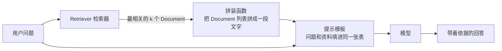

# 第 05 课　Retrievers：接上检索

前四课我们把 LangChain 的骨架搭了起来：第 01 课认零件，第 02 课用竖线把零件串成链，第 03 课让模型记得前文，第 04 课让它会调工具。但你可能隐约觉得缺了点什么——模型再聪明，也只知道它训练时见过的事。你问它"咱们公司的报销流程是什么"，它多半开始一本正经地瞎编，因为它压根没见过你们公司的制度文件。

缺的那块拼图叫**检索**：把相关资料找出来，塞给模型，再让它回答。这一课的主角 Retriever（检索器）就是 LangChain 里专门负责"找资料"的零件，也是下一章 RAG 的正片前菜 🍿。

---

## 一、Document：一块带标签的资料

资料要进 LangChain 的流水线，得先装进统一的信封，这个信封叫 **Document**。它简单得出奇，只有两格：

```python
from langchain_core.documents import Document

doc = Document(
    page_content="LangChain 是一个大模型应用开发框架。",  # 正文
    metadata={"source": "wiki.md", "page": 3},           # 附加信息
)

print(doc.page_content)  # 正文本身
print(doc.metadata)      # {'source': 'wiki.md', 'page': 3}
```

`page_content` 是正文；`metadata` 是随身的标签：来自哪个文件、第几页、什么日期、属于哪个项目——随你放。它像图书馆的**索引卡**：卡面写内容摘要，卡背标书名、页码、分类号。内容是给读者看的，标签是给管理员理账用的。

为什么要费劲统一这个抽象？因为现实中的资料五花八门：PDF、网页、数据库记录、聊天记录。不管来自哪里，切成小块装进 Document 之后，后面所有零件——检索器、向量库、提示模板——都只认这一个格式。信封统一了，邮局才好办事。

## 二、Retriever：会按需取资料的零件

Retriever 是个接口极其简单的零件，核心动作只有一个：

```python
docs = retriever.invoke("检索是怎么工作的？")
# 输入一个字符串（问题），输出一列 Document（最相关的几块资料）
```

输入一个字符串，还你一沓 Document——就这一下，没有别的。它像一位**图书管理员**：你用一句话说出需求，他还你一摞卡片。至于他是去书架翻的、查电子档案的，还是打电话问的分馆，你完全不关心——反正卡片格式一样。

这正是这个接口的价值所在：链条的下游（提示模板、模型）只在乎"给我几段相关资料"，不在乎资料怎么找来的。于是向量库、关键词搜索、甚至你们公司内部的检索接口，都能包成一个 Retriever，插进链里就能用。找资料的手段随便换，接口不动——这跟第 02 课讲 Runnable 统一接口是同一个思路，只不过这次统一的是"取资料"这件事。

## 三、向量检索：找"意思最近"的那几块

最常见的 Retriever 建在向量库上，它的工作过程拆开看只有三步：

1. 你的问题先被嵌入模型变成一个向量——可以想成在一张"意思地图"上标出这个问题的坐标；
2. 去向量库里算距离，找出离这个坐标最近的 k 个资料块——块当初存进去时也标过坐标；
3. 把这 k 块原样包成 Document 还给你。

"意思近"是什么意思？两段文字的向量像两支箭头，夹角越小、方向越一致，意思就越接近。所以"怎么控制成本"和"如何省钱"即使一个共同词都没有，箭头也会指得很近——这是向量检索比关键词搜索聪明的地方。

这个检索器身上有几个常用旋钮：

```python
retriever = store.as_retriever(
    search_kwargs={
        "k": 4,                    # 拿最相关的前 4 块（默认 4）
        # "score_threshold": 0.75, # 相似度低于它的不要（多数向量库支持）
        # "filter": {"source": "wiki.md"},  # 只在指定来源里找
    }
)
```

- **k**：一次带几块资料见模型。太少怕漏，太多费钱还稀释重点，一般 3~8 之间试。
- **score_threshold**：分数及格线。不够相关的块宁可不给，免得模型被带偏。
- **filter**：先按 metadata 过滤再检索。用户在"产品手册"页面提问，就没必要去"招聘信息"里找。

> 顺带修正一个旧教程的常见写法：过去不少材料直接 `from langchain.retrievers import VectorStoreRetriever` 手动实例化，还会在代码里写 `os.environ["OPENAI_API_KEY"] = "your-api-key"`。前者已不是主流——现在向量库自带 `as_retriever()`，一行拿到检索器；后者是坏习惯，Key 只能从环境变量读，永远别写进代码。另外，学概念阶段根本不用装 FAISS、Chroma 这些库，`langchain_core` 自带的 InMemoryVectorStore 就够离线练习（下一节演示文件里就用它）。

## 四、接进链条：检索器就是一个普通 Runnable

Retriever 实现了 Runnable 接口（第 02 课那组按钮它都有），所以它可以直接用竖线接进链里。整条 RAG 链的骨架长这样：



中间那个"拼装函数"是唯一要自己写的胶水——模型不认识 Document 对象，得把它们的正文连成一段：

```python
def format_docs(docs):
    return "\n\n".join(d.page_content for d in docs)
```

然后就是熟悉的双灶眼：问题要同时送给检索器（变成资料）和提示模板（保留原文），最后在字典里汇合——第 02 课的 RunnableParallel 在这里正是主场：

```python
from langchain_core.prompts import ChatPromptTemplate
from langchain_core.runnables import RunnableParallel, RunnablePassthrough

rag_chain = (
    {
        "context": retriever | format_docs,   # 这一灶：问题 → 资料
        "question": RunnablePassthrough(),    # 这一灶：问题原样通过
    }
    | ChatPromptTemplate.from_template(
        "仅根据以下资料回答问题，资料里没有就直说不知道。\n\n资料：{context}\n\n问题：{question}"
    )
    | model
)

rag_chain.invoke("检索是怎么工作的？")
```

顺着竖线读一遍：字典两灶并行跑完，汇成 `{"context": "…资料…", "question": "…问题…"}`，正好喂给模板的两个坑位。检索结果就这样变成了模型能读的上下文——所谓 RAG，提示词层面不过如此。

它和第 03 课的 Memory 分工也清楚了：Memory 管"你刚才跟我说过什么"，Retriever 管"资料库里有什么"，两路上下文最后都拼进同一条提示。

## 五、高级检索器：先记住各自治什么病

社区还有一堆花式检索器，现阶段不必会写，认得症状、知道找谁就行。三个最常见的：

- **MultiQueryRetriever**——治"换个说法才查得到"。你问"怎么省钱"，文档里写的却是"控制成本"，一句话只查一次容易漏网。它让模型把问题改写成三五个不同说法，分别去查再合并去重，撒网捕鱼。
- **ContextualCompressionRetriever**——治"捞上来一大块，有用的只有两句"。检索按块返回，块里常混着废话。它在资料递给模型之前，把每块里真正相关的片段压出来，省 token，也少干扰。
- **ParentDocumentRetriever**——治"切太小块好命中，却缺上下文"。小块容易精确命中，可模型看到一句孤零零的话摸不着头脑。它检索时用小块定位，返回时把小块所属的大块整个给你——找的时候用放大镜，读的时候给你整页。

用不上就别上：每个高级检索器都多一层模型调用或多一层复杂度，先从朴素的向量检索器跑通开始。

## 六、它在版图里的位置

到这里，LangChain 的主要零件你都摸过一遍了。而 Retriever 的特殊之处在于：它是通向下一章的桥。RAG（检索增强生成）这个大话题——怎么切块、怎么选嵌入模型、怎么调检索质量、怎么评估效果——在 LangChain 里的落点就是一个小小的 `retriever` 对象。下一章我们会把它展开成完整系统，你今天学的 `.invoke()` 会出现在每一个 RAG 程序的第一行。

## 想一想

1. Document 的 `page_content` 和 `metadata` 各自是给谁看的？如果把"资料最后由谁生成、什么时间抓取"也塞进 metadata，会在什么场景派上用场？
2. 为什么链条下游只认"字符串进、Document 列表出"这个约定，而不是直接把向量库对象传给链？换个角度想：如果不做这个约定，换一种向量库时要改多少代码？
3. 把 k 从 4 调到 50，回答质量会一直变好吗？提示模板里的资料越来越长，会发生什么？
4. 动手（选做）：跑一遍本课的 retriever_demo.py，把第 1 段的 query_vec 或第 2 段的提问换成你自己的话，观察返回的块和分数怎么变；再往 DOCS 里加一条新资料，看检索结果会不会变。

## 小结

Document 是 LangChain 里统一的一块资料：`page_content` 装正文，`metadata` 装来源标签，所有零件只认这个信封。Retriever 是"找资料"的统一接口——一个字符串进去，一列最相关的 Document 出来，向量库怎么换它都不变。向量检索的三步：问题变向量、找最近的 k 块、包成 Document 返回，k 值、分数阈值、metadata 过滤是三个最常用的旋钮。接进 LCEL 就是普通零件：`retriever | format_docs` 一灶出资料，原问题一灶通过，字典汇合喂给提示模板。MultiQuery、ContextualCompression、ParentDocument 各治一种检索病，先会诊断再考虑开药。

---

2026 年 10 月
