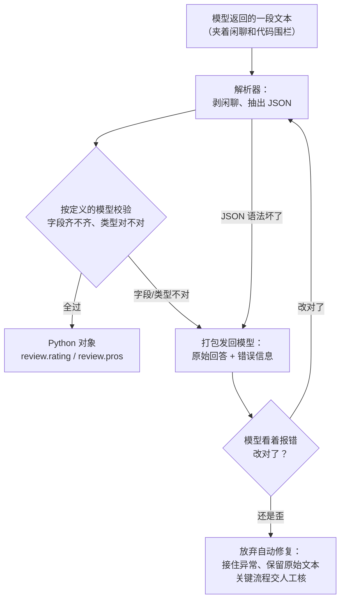

# 第 06 课　输出解析器：把回答变成对象

第 05 课我们让链条接上了外部资料，模型回答得有理有据了。但你要是在电脑前真跑过 `chain.invoke(...)`，多半见过那个尴尬瞬间：print 出来漂漂亮亮一段话，下一行代码却不知道怎么用它——那是个 AIMessage，是一段文本，不是程序能直接吃的对象。这一课就解决"最后一步怎么咽下去"。第 3 章结构化输出那一课，这套活你手写过一遍；今天看 LangChain 怎么把"格式说明 → 解析 → 校验 → 自动修复"做成链上一段标准零件。

---

## 一、模型的话，程序咽不下去

先看问题的原型。你让模型"给《流浪地球2》写个简评"，它回你：

```
好的，这是我的简评：

```json
{"title": "流浪地球2", "rating": 8.5, "pros": ["特效震撼", "多线叙事有格局"]}
```

希望对你有帮助！
```

人读着挺好，可你的程序想要的是三个格子：电影名、评分、优点列表——要填进表格、写进数据库、发到前端。这就像你问同事"那个供应商怎么样"，他给你回了一大段语音，而你手里只有一张固定三列的 Excel。信息都在语音里，但表格不认。

输出解析器（Output Parser）干的就是这个翻译活：**把随口感慨翻译回标准表格**。它管两件事——

- 把模型返回的文本可靠地变成对象：找到 JSON、剥掉闲聊、解析、按你定义的结构逐字段校验；
- 不合法时把错误报清楚：缺哪个字段、哪个类型不对，明明白白抛出来，而不是让你拿着半截字符串 debug 到半夜。

顺带说一句，这个家族你其实早见过成员——第 02 课的 StrOutputParser 就是最简的一位，只干"从消息对象里抽出字符串"。今天认识的是两个更能干的兄弟。

## 二、PydanticOutputParser：先画好表格，再让模型填

思路是先把"表格长什么样"定下来。用 Pydantic 写个类——字段、类型、含义一目了然：

```python
from pydantic import BaseModel, Field

class MovieReview(BaseModel):
    title: str = Field(description="电影名")
    rating: float = Field(description="0 到 10 的评分")
    pros: list[str] = Field(description="优点，2 到 3 条")
```

字段描述不是摆设，解析器会把它们写进给模型的"填表说明"里。接着把模型包成解析器：

```python
from langchain.output_parsers import PydanticOutputParser
# 这个类在包之间挪过几次位置：报 ImportError 就换成 from langchain_core.output_parsers 试试

parser = PydanticOutputParser(pydantic_object=MovieReview)
print(parser.get_format_instructions())
```

`get_format_instructions()` 会吐出一段文本：返回结果该是什么 JSON 结构、每个字段什么意思。把它塞进提示词——像把**填表说明钉在任务单上**，模型照着填，返工率立刻降下来：

```python
prompt = ChatPromptTemplate.from_messages([
    ("system", "你是影评助手，简短直接。\n{format_instructions}"),
    ("human", "给电影《{movie}》写个简评"),
]).partial(format_instructions=parser.get_format_instructions())
```

`.partial(...)` 的意思是"这个变量是固定的，现在就填死，以后 invoke 只管填其他变量"。

于是主线三步定型：**定义模型 → 提示里带格式说明 → 链末解析**：

```python
model = ChatOpenAI(model="gpt-4o-mini")  # 示例名，可能已更新：按官网模型列表选
chain = prompt | model | parser
review = chain.invoke({"movie": "流浪地球2"})

review.rating     # 8.5，是 float，不是字符串
review.pros[0]    # 直接按列表用
```

链的末端换了个零件：以前 StrOutputParser 吐字符串，现在 PydanticOutputParser 吐 MovieReview 实例。模型返回后，解析器自动做三件事：剥掉围栏和闲聊 → 解析 JSON → 按你的模型逐字段校验。评分给成"很高"这种，当场抛异常，错误信息写清哪个字段不合格——问题在你和模型的合同条款上，不在你的取值代码里。

## 三、JsonOutputParser：只要个字典，轻装上阵

如果字段结构经常变，或者你只想要个字典、懒得建类，JsonOutputParser 更轻：

```python
from langchain_core.output_parsers import JsonOutputParser

chain = prompt | model | JsonOutputParser()
data = chain.invoke({"movie": "流浪地球2"})
data["rating"]    # 拿到的是 dict，用方括号取值
```

它保证"返回的东西是合法 JSON"，解析成 dict 就交给你，不做字段类型校验。格式说明它也能生成，只是没有 Pydantic 那套校验兜底。

怎么选，一句话：

- 字段固定、要严格校验、下游想写 `review.rating` → PydanticOutputParser；
- 结构松散常变、拿到 dict 自己再加工 → JsonOutputParser。

另外提醒一句：LangChain 家族里还有 Xml、CSV 等各种解析器，别一个个都请进来。绝大多数场景上面两个就够，真遇到再查文档——零件堆一仓库，不如手头两件称手。

## 四、解析失败了？让它自己改一遍

格式说明贴了、模型也点头了，它还是可能手滑：JSON 里多个逗号、字段名拼错、类型跑偏。这不稀奇——大模型本质上是在"猜下一个字"，不是在执行数据库的写入，走神太正常了。

LangChain 的思路不是让你 try/except 一遍遍手动重跑，而是把"返工"做成零件。像工厂质检：质检员发现零件有毛刺，不是直接扔进废品堆，而是**连零件带检测报告一起退回车间，让车间返一次工**：

```python
from langchain.output_parsers import OutputFixingParser

fix_parser = OutputFixingParser.from_llm(parser=parser, llm=model)
review = fix_parser.invoke(raw_text)  # raw_text：刚才解析失败的那段原始回答
```

OutputFixingParser 包住原解析器：先按原路试一遍，失败就把**原始回答 + 错误信息**一起发给模型，让它看着报错改一次，改完重新解析。RetryOutputParser 是同类零件，区别是它把提示词也带上（`parse_with_prompt`），模型能看到"当初让它干什么"，更适合内容跑偏而不只是格式毛刺的情况。

这能救回多少？说实话——小毛刺救得回：围栏忘剥、逗号多了、字段名小错，模型看着报错改这类问题十拿九稳。但如果模型一开始就理解歪了（字段全错、内容跑题），再让它改，顶多把 JSON 修合法，内容还是不对。所以**自动修复不是保险箱**：它自己也是一次模型调用，会失败、会花钱，第 02 课讲的 with_retry 和 fallbacks 在这里照旧适用，外面仍要 try/except 接住。



## 五、装回链条：检索 + 生成 + 结构化

解析器在 LCEL 里通常就是最后一段。和第 05 课的检索器拼起来，就是一条"查资料 → 生成 → 交结构化结果"的链——比如客服系统查完知识库，要输出"分类 / 严重程度 / 建议回复"三个字段交给工单系统：

```python
from langchain_core.runnables import RunnableParallel, RunnablePassthrough

chain = (
    RunnableParallel(context=retriever, question=RunnablePassthrough())  # retriever 是第 05 课的检索器
    | prompt      # 模板里吃 {question} 和 {context}，末尾带着格式说明
    | model
    | parser
)

ticket = chain.invoke("我的订单三天了还没发货")
ticket.category    # '物流' —— 直接进工单系统
```

输入先分两路：question 原样透传，context 去向量库里捞资料；汇合后填进模板，模型生成，解析器收尾。检索、生成、结构化三件事，竖线一串就齐了。

## 六、说点实话：解析器不是万能的

- 模型偏得离谱时，修复也救不回来。关键流程在解析之前留一份原始文本，出了问题能对账，也能喂给下一次修复当参考；
- 要不要人工核，看场景。给内部报表填字段，错了顶多重跑一次；给客户算退款金额，过了模型和解析器之后还得有人看一眼；
- 还有一条 2026 年的路值得知道：新一代模型支持"原生结构化输出"，LangChain 里 `model.with_structured_output(MovieReview)` 一行，模型在接口层直接吐结构化数据，连格式说明都不用拼。它够用时优先用它；要兼容老模型，或要做超出类型校验的自定义检查时，今天讲的解析器路线仍然趁手。

下一课是本章的综合实战：把 LCEL、记忆、工具、检索和今天的解析器串成一个完整小应用——解析器会以"链末收尾"的身份出场，你会发现这课的写法原封不动就能用上。

## 想一想

1. 格式说明为什么要提前塞进提示词，而不是等模型返回后用正则去"抠"？提前说和事后抠，各自赌的是什么？
2. 做"每日新闻摘要"，字段天天变；另一个项目做"退款审批"，字段固定且金额错一分都不行。两个各选哪个解析器，为什么？
3. OutputFixingParser 修复一次也是一次模型调用。如果修复后仍然失败，你的程序接下来该做哪几件事？
4. 模型把评分返回成汉字"很高"，Pydantic 校验会怎么报？你觉得修复解析器能把"很高"改成 8.5 吗——它凭什么能改对？

## 小结

- 模型吐的是文本，程序要的是对象。解析器负责把文本可靠地变成对象，不合法就把错误报清楚。
- PydanticOutputParser 的主线三步：定义模型 → get_format_instructions() 塞进提示 → 链末解析校验。
- 只要轻量字典用 JsonOutputParser；解析器不必堆砌，够用就好。
- 解析失败可以交给 OutputFixingParser / RetryOutputParser 带错重试一次，但它也是一次模型调用，外面仍要兜底、留原始文本。
- 解析器是链上最后一段，接上检索器就是"检索 + 生成 + 结构化"；新一代模型的原生结构化输出是另一条可选路线。

---

2026 年 10 月
