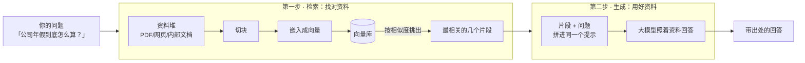
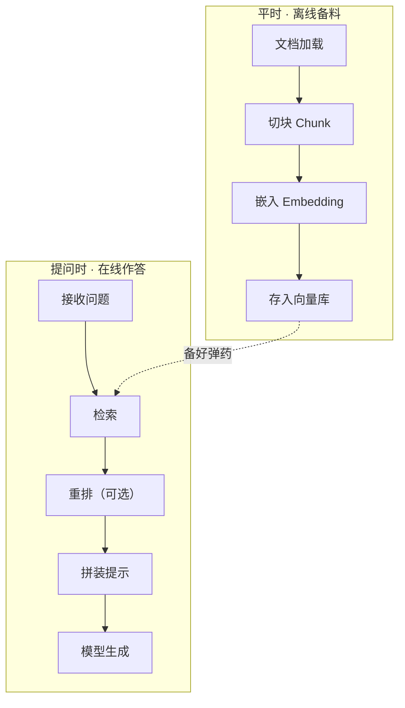

# 第 01 课　RAG 全景：先翻资料再回答

第 03 章里你已经能熟练地调用大模型了：给它一句话，它回你一段流畅的文字，写邮件、改代码、做总结都不在话下。但只要你多问几个"自己人"的问题，它就会露馅——问它"我们公司今年年假有几天"，它会一本正经地报一个数字，而这个数字大概率是编的。

这一章我们学 RAG，一套让大模型"先翻资料再回答"的做法。这节课不写代码，先把全景看明白：它到底解决什么问题、靠什么思路、由哪些零件组成。地图画好了，后面五节课才不会迷路。

## 一、大模型的"三堵墙"

先说清楚我们到底卡在哪。把大模型想象成一位刚毕业的高材生：脑子极好，什么都能聊，但他有三个天生的限制，像三堵墙一样挡在你和他之间。

**第一堵墙：他的知识停在"毕业"那天。** 模型的知识来自训练时读过的资料，而训练总有个截止日期。毕业之后世界上发生的事——新产品发布、政策更新、你上周才写的文档——他一概不知。你问他"昨天发布会讲了什么"，他要么答不上，要么拿旧知识硬凑。

**第二堵墙：他没读过你的资料。** 公司的制度文件、产品的技术手册、你积累了几年的笔记，这些私有资料从没进过他的训练数据。不是他笨，是他压根没见过。

**第三堵墙：他张口就来，你无法核实。** 遇到不知道的事，他不会老实说"我不知道"，而是顺着语言的惯性编一个听起来很合理的答案——这就是常说的**幻觉**。更麻烦的是，就算他答对了，你也无从查证：他说"年假 15 天"，出处是哪一页文件？不知道。想采纳，得自己再翻一遍文件确认，那还不如一开始就自己翻。

> 三堵墙记个简称：知识过时、不知你事、开口就编。后面你会看到，RAG 的每一步设计，几乎都是在拆这三堵墙。

## 二、核心直觉：把闭卷考试改成开卷考试

我们平时用大模型，用的是"闭卷考试"模式：只靠它脑子里的记忆答题。三堵墙都源于此——记忆会过时、没背过你的资料、记不清了就现编。

**RAG 把它改成开卷考试。** 规则一变，一切都变了：答题前，先允许他去你的资料堆里翻一翻，把相关的那几页找出来摆在桌上，然后**照着资料**作答。

还是那个高材生，现在你给他配了个资料员，效果立竿见影：

- 资料是最新的 → 第一堵墙（知识过时）拆了
- 资料是你给的 → 第二堵墙（私有资料）拆了
- 答案能指回某段原文 → 第三堵墙（无法核实）拆了

这套做法还有个特别实惠的好处：**想更新他的知识，更新资料就行，不用重新训练模型。** 就像给员工发一份新文件，他看完就能按新规矩办事；而不是把他送回学校重新读个学位。

这套"先检索、后生成"的做法，术语叫 **RAG（Retrieval-Augmented Generation，检索增强生成）**。名字唬人，拆开看就两件事：检索（Retrieval）= 先翻资料；增强生成（Augmented Generation）= 把翻到的资料"喂"给模型，增强它的回答。就这么朴素。

顺带一句历史：这套思路 2020 年由 Facebook AI Research 提出，当时的形态很简陋——检索结果直接拼进提示词了事。到 2026 年，它已经长成一整套包含混合检索、重排、语义缓存、GraphRAG 的系统工程，我们这一章学的是这条主干。

## 三、两步地图：先找对资料，再用好资料

RAG 系统跑起来就两步，先看全景图：

图里的新词先混个脸熟，每个词后面都有专课：

- **切块（Chunk）**：长文档没法整本塞给模型，先剪成一段一段的小块
- **嵌入（Embedding）**：把每段文字变成一串数字（向量），意思越接近，数字越接近——"找相似"就变成了"算距离"
- **向量库**：专门存这些向量、支持"按意思查找"的仓库（向量库的专题深挖在第 7、8 章展开，这里先知道它是干什么的就行）

**第一步，检索：找对资料。** 就像你写论文前先去图书馆查文献：不是把整个书架搬回家，而是按主题检索出最相关的三五篇。这一步只有一个目标——把"和问题最相关的那几段"从资料堆里捞出来。注意图里从资料堆到向量库那条线是**提前修好的**：平时就把资料切块、嵌入、入库；问题来了，只做一次相似度比对。

**第二步，生成：用好资料。** 把捞出来的片段和你的问题一起拼进提示，明确告诉模型："下面是参考资料，请据此回答，不要自己编。"模型本来就很擅长读材料写作文，给它对的材料，它就能给出靠谱的答案；我们还可以要求它注明引用了哪段资料，方便你回去核对。

两步缺一不可，而且**检索往往更关键**：资料找错了，后面的模型再聪明，也是对着错误的材料写作文。

## 四、RAG、微调、塞长提示：三张药方治不同的病

不翻资料也能让模型"知道"你的事，常见还有两条路，三种做法放在一起比才看得清：

| | 塞长提示 | RAG | 微调 |
|---|---|---|---|
| 一句话 | 临时抱佛脚 | 开卷考试 | 把知识背下来 |
| 适合 | 资料少、一次性问题 | 知识/事实/要出处 | 风格与能力的固化 |
| 知识更新 | 改提示即可 | 改资料即可 | 要重新训练 |
| 天花板 | 受上下文长度所限 | 取决于检索准不准 | 训练贵、周期长 |

**塞长提示**：资料不多时，干脆把资料全文直接粘进提示里一起发过去，简单粗暴且完全可行。但模型一次能"看"的篇幅有上限（即上下文长度），资料一多就装不下，而且每问一次都要为全部资料付一遍 token 费。

**微调**：把你的资料混进训练数据重新训练，知识就"长"进了模型参数里。用它固化一种风格、一种能力很合适（比如让模型永远按你们团队的行文习惯写周报）；但用它存事实知识很亏——资料一更新就得重训，又贵又慢。

**RAG**：知识放在模型外面，每次只取相关的几段，资料随时增删改，模型本身不动。

三者不是单选题，完全可以组合：微调过的模型同样可以配 RAG 用——能力靠微调，知识靠检索。

## 五、一台 RAG 机器的零件清单

把全景图放大，一台完整的 RAG 机器由这些零件组成，每个先用一句话交代，后面各有专课展开：

1. **文档加载**：把 PDF、网页、Word、数据库里的内容读成程序能处理的文本（第 04 课）
2. **切块（Chunk）**：把长文档剪成大小合适的小块——剪太大检索不准，剪太碎丢上下文（第 02 课）
3. **嵌入（Embedding）**：把每块文字变成向量，让"意思相近"变成可计算的量（第 03 课）
4. **向量库**：存向量、支持快速"按意思查找"的仓库，常见如 FAISS、Chroma、Milvus（第 04 课）
5. **检索**：问题来了，从库里捞出最相关的几个块；进阶还有关键词 + 向量的混合检索（第 05 课）
6. **重排（Rerank，可选）**：粗筛之后再精排一遍，把真正最对的块排到最前（第 06 课）
7. **拼装与生成**：块 + 问题拼成提示，交给模型，输出带出处的回答（第 04 课）

注意图里上下两条线的时间差：备料是**平时**做的，作答是**提问时**做的。很多初学者把两件事混在一起，看教程容易晕——记住"先备料、后作答"就清楚了。

## 六、先把预期摆正：RAG 不是银弹

讲了这么多好处，得泼一盆冷水。RAG 只是换了答题方式，它治不了所有病：

- 资料本身是错的、过时的，RAG 会认真地、带着出处地把错误传播出去
- 检索没找到对的段落，模型照样只能靠记忆现编——垃圾进，垃圾出
- 模型没照着资料答、自作主张发挥，回答照样跑偏

所以一个 RAG 系统的效果，取决于三件事：资料质量、检索准不准、生成时管得严不严。这也是本章要花六节课的原因：第 02 课从"切块"这个最容易被低估的环节讲起，第 03 课讲嵌入与相似度，第 04 课把整条流水线亲手跑通，第 05、06 课再上优化手段。每个零件都调好了，答案才靠得住。

## 想一想

1. 你问模型"我们公司差旅报销的上限是多少"，它流利地报出一个数字，但公司根本没这条规定。这撞了三堵墙里的哪几堵？
2. 公司的产品说明书每周更新一版，你想让客服机器人始终按最新版回答——选 RAG 还是微调？说出理由。
3. 手头只有 3 份短文档，直接把全文粘进提示行不行？换成 3 万份呢？这道题比较的其实是哪两种做法的边界？
4. 一个 RAG 系统给出了错误答案，可能是哪个环节出了问题？提示：从资料、检索、生成三个环节各排查一遍。

## 小结

- 大模型有三堵墙：知识停在训练截止日、没读过你的私有资料、会编造且给不出依据。
- RAG 的思路是把闭卷考试改成开卷考试：先去资料堆检索出相关片段，连同问题一起交给模型，让它照着资料回答。
- 两步地图：检索负责"找对资料"（切块 → 嵌入 → 向量库 → 相似度查找），生成负责"用好资料"（拼进提示 → 模型 → 带出处的回答）。
- RAG、微调、长提示治不同的病：RAG 治知识更新与出处，微调固化风格与能力，长提示受上下文长度所限；三者可组合。
- RAG 不是银弹：资料错、检索歪，答案就错——这正是接下来五节课逐个打磨零件的原因。

---

2026 年 10 月
