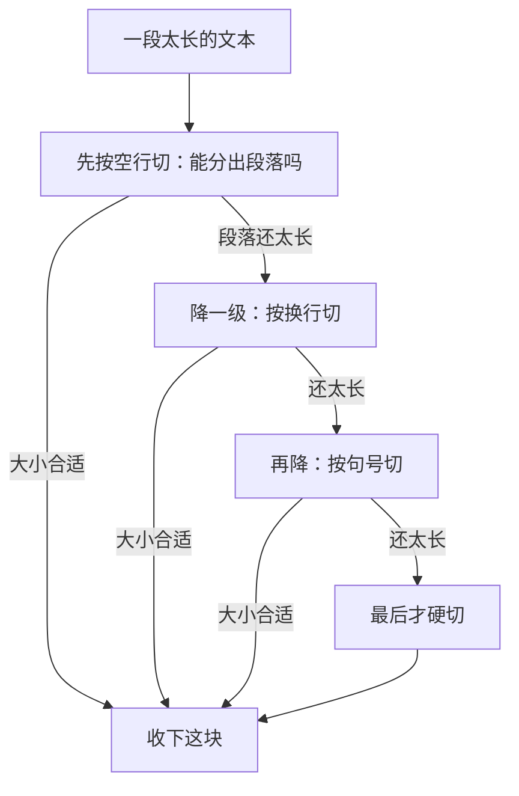
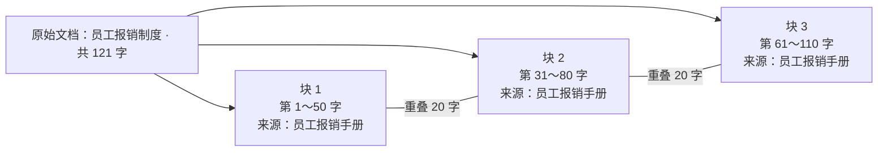

# 第 02 课　Chunk：文档怎么切块

上一课我们看了 RAG 的全景：先去资料堆里翻出相关内容，再让模型结合着资料回答。听起来顺理成章，但"翻资料"这三个字里，藏着动手的第一道工序——文档得先切成合适的小块，检索才有的翻。这一课就来解决这个看起来朴素、实际上决定成败的问题：文档怎么切。

---

## 一、为什么不把整本书直接塞给模型

有同学可能会想：2026 年的主流模型，上下文动辄几十万 token（token 可以先理解成模型眼里的"字词碎片"，一个汉字差不多一到两个 token），为什么不把整本资料一次塞进去，让它自己找？

想法很美好，账却算不过来，至少有三笔：

- **找不到。** 就算塞得下，让模型在几十万字里翻一个细节，就像把一仓库的纸箱全倒在桌上让你找一颗螺丝——东西确实都在，但"大海捞针"式的长上下文查找又慢又容易漏，埋在中间的内容经常被忽略。
- **费钱。** 模型按 token 计费。每问一个问题都拖着全书跑一遍，成本是"只带相关几段"的成百上千倍。
- **没法检索。** RAG 的检索，是拿"你的问题"和"资料"算相似度，挑最相关的几段。一整本书作为一份资料只有一个相似度，等于告诉你"整本书都和这个问题有关"——这跟什么都没说一样。

所以要先切块。一个很贴切的类比：**把厚书拆成一张张资料卡，每张卡只装一个主题的几段话；提问时只翻出最相关的几张给模型看。** 这些"资料卡"，RAG 里叫 **Chunk（块）**，切这个动作叫分块（Chunking）。

> 一句话抓住本质：切块，是在"模型上下文有限、检索要准、成本要省"这三件事之间，给文档定一个合适的颗粒度。

## 二、切多大？一笔"不太大也不太小"的账

卡做多大合适？两个极端都不好。

切得太大：一张卡上混了三四个主题。查"工资制度"时，检索可能捞回一张"工资 + 报销 + 考勤"的大杂烩卡——真正相关的内容被无关内容冲淡，相似度算出来就不那么"专"了；而且卡越大，塞进模型的 token 越多，钱也跟着涨。

切得太小：一句话一张卡，看着精准，但语义被切碎了。比如"住宿费按城市分档，一线城市每晚不超过六百元"被从中间切开，检索只命中前半句，模型看到"住宿费按城市分档，一线城市"，限额数字在后半句，而那半句躺在另一张没被捞回来的卡里——答案就残了。

| 切得太大 | 切得太小 |
|---------|---------|
| 主题被冲淡，混进无关内容 | 语义被切碎，缺上下文 |
| 相似度不聚焦，检索不准 | 命中了也只有半句话 |
| 费 token，成本高 | 块数量暴涨，存储检索开销大 |

方向于是清楚了：块要不太大也不太小，并且尽量沿着内容的自然边界下刀——在段落、句子这些"话说到哪儿算一段"的地方切，而不是在句子中间闭眼硬切。

## 三、三种切法：从"闭眼切"到"看懂了再切"

### 1. 固定大小切块：最省事，也最粗暴

规则一句话：每数满 N 个字符（或 token）切一刀，不看内容。像蒙着眼撕纸，每 300 字撕一刀——实现最简单、速度最快，代价是句子经常被拦腰斩断。

适合：格式规整、句子偏短、需要快速搭出第一版的场景。

### 2. 递归切块：顺着折痕撕（工程里的默认选择）

改进思路很直观：硬切之前，先沿文本自带的"折痕"撕。优先按空行切段落；段落还太长，再按换行切；还不行，按句号切句子；连句子都超长，最后才硬切。这就是**递归分块**（Recursive Chunking）。

就像撕一张大纸：先找它本身的折痕，顺着撕整齐；实在没有折痕，才勉强硬撕。



这是工程里最常用的默认做法（比如 LangChain 的 RecursiveCharacterTextSplitter），因为绝大多数文档都有段落、句子这些天然边界。特别提醒：框架默认的分隔符列表多是按英文设计的（空行 → 换行 → 空格 → 硬切），中文文档没有空格边界，分隔符要换成中文标点（句号、问号、分号、逗号），否则"递归"根本切不动——这是中文场景的高频坑。

### 3. 语义分块：按"话题拐弯"来切

前两种只看形式（字数、标点），不看内容。语义分块（Semantic Chunking）更进一步：先用嵌入模型（下一课的主角）把每个句子变成向量，比较相邻句子的相似度，发现话题"拐弯"了才下刀，按意思是否相近来分。

它切得最贴合人的理解，代价也明显：每句话都要过一遍嵌入模型，更慢、更贵、工程更复杂。适合话题跳跃多的长文档，或者对检索质量要求高、预算充足的场景。

选型一句话：常规任务先用递归切块，够用就别折腾；切块真成了瓶颈，再考虑语义分块。

## 四、重叠：给切块上的一道保险

就算按边界切，固定切块总会碰上"句子正好横跨两块"的时刻。比如块大小 50 字，第 2 句话从第 32 个字排到第 53 个字，必然横跨第 50 字那一刀。

**重叠（overlap）**就是补救办法：相邻两块之间故意保留一小段重复，像两张便签粘贴时叠上的那一条。加上 20 字重叠后，第二块从第 31 字覆盖到第 80 字，整句话完整地落在里面——检索时总有一块能"接住"它。



好处：边界处的关键信息不容易丢，断口处的句子至少完整地出现在一侧。代价也要心里有数：文本总量变大（每块都带着邻居的开头），存储和 token 成本上升；重叠开得太大，相邻块大量雷同，检索时容易把"同一句话的几个版本"都捞回来，区分度反而下降。

经验起步值：重叠取块大小的 10%～20%，比如 500 字的块配 50～100 字重叠，然后拿你自己的真实问题实测调整。没有放之四海皆准的标准值。

## 五、几张拿来就能用的经验

- 数量级先有个感觉：常见块大小从几百字符到上千 token 都有，不同框架默认值也不同。起步可以从几百字（或三四百 token）的量级试起，再逐步调。这是经验值不是标准答案，最好的块大小是用你自己的文档和问题试出来的。
- 中文和英文不一样：英文按词分（有空格），中文按字数切；同样"500"的块大小，中文 500 字和英文 500 词信息量差好几倍，英文教程的参数别直接照抄。分隔符同理，上一节刚提过。
- 每块都带上元数据：来源文件名、页码、章节标题这些**元数据**要跟着块走。命中的块能告诉你"出自《员工报销手册》第 3 页"，答案有出处可查，检索时还能按来源过滤。上面图里每块标的"来源"就是这个意思。
- 切块质量卡住检索的上限：上一课说 RAG 回答好不好，第一步看"检索准不准"。文档切坏了——半截句子、跨主题大杂烩——后面嵌入模型再好、检索算法再精也救不回来。它是整条流水线的第一道工序，也是性价比最高的一道。

## 六、动手：写一个最小的切块器

光看不动手，等于没学。本课目录里的 chunk_demo.py 纯标准库实现（不用装任何库），用 5 句话的报销制度做素材，跑三组对照实验：固定切块不重叠 → 加重叠 → 递归切块，每组数一数"完整句子还剩几句"。运行方式：

```
python chunk_demo.py
```

你会看到：不重叠时两句话被拦腰斩断；加上重叠后被切断的句子在相邻块里"接"了回来；递归切块则让每块都落在句子边界上。块只是文本，计算机怎么判断"哪块和你的问题意思相近"？下一课的 Embedding（给文字配上语义坐标）就来回答这个问题。

## 想一想

1. 一份 500 页的产品手册，每个功能单独成章。你会优先考虑哪种切块方式？"一章切一块"这种按文档结构切的思路，和本课三种切法是什么关系？
2. 把块大小从 200 字调到 2000 字，"检索精准度"和"上下文完整性"各往哪边走？如果你发现检索回来的块总是"只有一半沾边"，该往哪个方向调？
3. 重叠开到块大小的一半（100 字的块重叠 50 字）会怎样？从存储成本和检索区分度两个角度想想。
4. 轻动手：打开 chunk_demo.py，把 CHUNK_SIZE 改成 10（比一句话还短）、OVERLAP 改成 5，跑一遍。句子还能完整吗？由此想想，重叠能"接住"断句的前提条件是什么？

## 小结

- 切块是在"上下文有限、检索要准、成本要省"之间给文档定颗粒度：把厚书拆成资料卡，提问时只翻最相关的几张。
- 块太大主题被冲淡、费 token；太小语义被切碎、缺上下文。方向是不太大也不太小、尽量沿内容边界切。
- 三种切法：固定大小最快最糙；递归分块沿段落、句子逐级下刀，是工程默认；语义分块按话题拐弯切，效果最好但更贵更复杂。
- 重叠是保险：相邻块保留一小段重复，被切断的句子至少完整地落在一侧；经验上从块大小的 10%～20% 起步。
- 块上记得带来源、页码等元数据。切块质量决定检索的上限，是整条流水线性价比最高的工序。

---

2026 年 10 月
