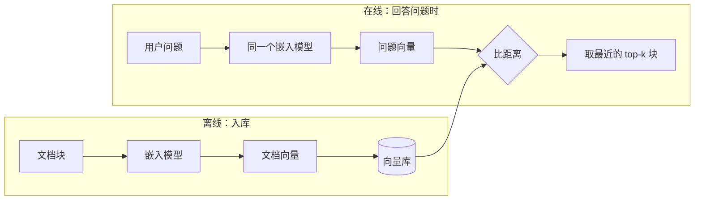

# 第 03 课　Embedding：给文字配上"语义坐标"

上一课我们把文档切成了块。但问题马上就来了：用户的问题和文档块长得完全不一样，电脑怎么知道哪一块和问题"说的是一回事"？答案就是今天的主角——嵌入模型。它给每段文字发一张写满坐标的"语义身份证"，意思相近的文字，就住在隔壁。

---

## 一、先把第 02 章的老朋友请回来

在第 02 章学 Token 和 Embedding 的时候，我们说过：嵌入模型把一段文字变成一串数字，这串数字叫**向量**。当时你大概觉得这有点抽象——没关系，今天我们从"检索资料"这个具体用途重新看它，你会发现这串数字好用得惊人。

先建立一个直观印象：**嵌入模型就像户籍管理员，给每个词、每句话发一张写满坐标的身份证，而且按"意思"安排住所——意思像的，被安排住在隔壁。**

"小猫在沙发上睡觉"和"小狗趴在垫子上打盹"，用词几乎不重叠，但它们说的是同一类事（宠物 + 休息），所以它们的坐标会挨得很近；而"今晚吃火锅还是烤肉"就会住在另一个街区。更妙的是，"语义"能穿透不同的说法："天气很好"和"今天阳光明媚"，即使一个字都不一样，也会被安排成邻居。

这就是检索的地基：**只要"意思"变成了"位置"，找相似内容就变成了找邻居。**

## 二、相似度怎么衡量：比方向，不比距离

两串数字摆在一起，怎么算"像不像"？最常用的尺子叫**余弦相似度**。

先说直觉：想象两个向量都是从原点出发的箭头，余弦相似度量的是**这两个箭头夹角的余弦**。两个箭头指向几乎一致，说明它们说的"是同一方向的事"，分数接近 1；互相垂直（毫无关系）接近 0；指向相反接近 -1。就像判断两个人是否顺路，你看他们前进的**方向**是否一致，而不是各自走了多远。

公式长这样，配上一句大白话就够了：

```text
cosine(A, B) = A·B / (|A| × |B|)
             = （对应分量相乘再求和）/（两个向量各自长度相乘）
```

分母把长度除掉了，所以余弦相似度**只看方向、不看长短**。嵌入模型输出的向量分量基本是正数，所以实际分数落在 0 到 1 之间——**越接近 1 越像**，这一条你记住就够用了。

不过它是"最常用"，不是"唯一"。另外两把尺子你也该混个脸熟：

- **点积**：对应分量相乘再求和，是余弦公式里的分子。它算得飞快。而且有个漂亮的事实：如果向量事先**归一化**（缩放成长度为 1），点积就直接等于余弦相似度。很多向量库正是靠这招省掉整个除法环节。
- **L2 距离**：两个点在空间里的直线距离，像用直尺量两点离多远。距离越小越像。归一化之后，它的排名和余弦一致。

所以三把尺子在"归一化"这个前提下排名是一致的，不必纠结——理解了余弦，其他两个都通了。

## 三、检索的本质：把问题也变成向量

现在可以回答开头的问题了。RAG 检索的完整动作是：

1. 文档切块后，每块都过一遍嵌入模型，变成一个向量，存进向量库；
2. 用户的问题来了，**同一个嵌入模型**把问题也变成一个向量；
3. 拿问题向量去库里逐一比相似度，取最近的 top-k 块，交给后面的步骤。



注意图里那句"同一个嵌入模型"——它是本课最重要的伏笔，第四节回来收拾它。

## 四、这些坐标是哪来的

你可能会问：每段话的坐标是谁定的？答案是模型**训练**出来的。

嵌入模型的主体是一个编码器（第 02 章的 Transformer 在这里上岗）：文字进去，经过编码和池化，出来一个固定长度的向量。而训练的方法很符合直觉——给它看海量文本对：意思相近的句子对（正样本）和不相干的句子对（负样本），要求它把前者的向量拉近、后者的推远。这一类训练思路叫**对比学习**。

这就像人读得多了一自然会形成"语感"：知道哪些说法能互相替换。模型没有被明确教过任何一条规则，它是在几百万次"这两句该靠近 / 这两句该离远"的练习里，自己摸索出了语义空间的布局。这也是为什么"沙发睡觉"和"垫子打盹"会被安排到隔壁——它们在训练语料里本来就常干一样的事。

训练数学我们不展开，知道"靠近相似的、推远不相关的"这一句，就足够支撑后面所有内容。

## 五、怎么选嵌入模型：先问四个实际问题

选型这事，先把术语放一边，问四个实在问题：

**1. 维度多高合适？** 维度就是那张身份证上坐标的个数。维度高，能表达的语义细节多，但每个向量占的存储更多、算相似度也更慢；维度低则又快又省，但细节可能损失。常见模型从几百维到几千维都有，没有免费午餐，按你的数据量和预算权衡。

**2. 中文还是多语言？** 如果你的资料和用户提问都是中文，专门的中文模型往往更准；如果中英混杂，就选多语言模型。错配的代价很实在：用只懂英文的模型嵌中文，出来的坐标基本是噪声。

**3. 模型多大、跑多快？** 几十万份文档要嵌入时，模型大小直接决定这是几分钟还是一晚上的活。嵌入是一次性的"入库成本"，但重建索引时你得再付一次。

**4. 本地跑还是调 API？** 本地开源模型免费、数据不出门，但要自己管机器和版本；API 省心、按量付费，数据要发给服务商。和第 03 章用大模型 API 的权衡是同一道题。

落到 2026 年的"示例类型"上：开源阵营有 BGE 系列这一类（如 BGE-M3，多语言、对中文友好），商业阵营各家大模型厂商都提供嵌入 API（如 OpenAI 的 text-embedding-3-small 这一档）。**注意这些名字只是示例，型号更新很快**，选型时去 MTEB 这类公开榜单按你的场景（中文检索？多语言？）筛，再回到官网确认当前版本——榜单名次会变，"按场景选型"的思路不变。

## 六、三个常见坑

**坑一：问题和文档用了不同的嵌入模型。** 每个模型训练出来的语义空间都是私有的——就像不同城市的坐标系，经纬度数字看着类似，指的完全是两个地方。问题用模型 A 嵌、文档用模型 B 嵌，两组向量根本不在同一个空间里，相似度算出来全是垃圾。**问答两端必须用同一个模型**，这条没有商量余地。要是换了模型怎么办？全部文档重新嵌一遍，别存侥幸。

**坑二：忘了归一化这回事。** 归一化把向量缩放成长度为 1。做了它，点积、余弦、L2 三把尺子排名一致，很多向量库还能借机提速；不做也不算错，但不同库的默认行为不同，返回结果对不上时，先检查双方有没有归一化，能省你半天排查。

**坑三：以为嵌入"什么都懂"。** 嵌入只负责"语义像"，它不懂事实的对错和数字的精确。"公司 2025 年营收 3.2 亿"和"公司 2024 年营收 2.9 亿"，语义上几乎是同一句话，向量会非常接近——但在财务问答里这是天差地别的两条数据。型号、编号、人名这类需要**精确匹配**的内容，语义检索会给你"长得像的"而不是"就是这个的"。

所以工程上的标配是：语义检索打底，必要时配上关键词检索兜底。两条腿走路怎么配合，第 05 课讲混合检索时展开，这里先埋个伏笔。

## 七、它在 RAG 流水线里的位置

把全景课的地图调出来，嵌入模型站在"切块"和"向量库"中间：

- **离线入库**：加载文档 → 切块（第 02 课）→ **逐块嵌入（本课）** → 向量连同原文存进向量库；
- **在线问答**：问题嵌入 → 去库里取 top-k → 拼进提示词 → 模型生成回答。

下一课我们把这些零件串成一条能跑的完整流水线——到时候你会发现，最难的部分今天已经讲完了。

---

## 想一想

1. "天气很好"和"今天阳光明媚"没有共同关键词，为什么嵌入后向量会挨得很近？
2. 你的向量库用模型 A 建的，半年后想把文档换成模型 B——只把**新问题**用 B 嵌入库中查询，行不行？为什么？
3. 向量已经归一化时，点积和余弦相似度相等。为什么向量库偏爱用点积来做检索？
4. 要检索"订单号 ORD-88492 的物流状态"，纯语义检索可能出什么问题？你打算怎么办？

## 小结

嵌入模型把文字变成一串数字（向量），意思相近的文字在语义空间里位置相近，"找相似"由此变成了"找邻居"。衡量相似最常用余弦相似度：比方向不比长短，越接近 1 越像；归一化后点积与它等价。向量坐标是模型在海量"拉近相似、推远不相关"的对比训练里学出来的。选型先问维度、语种、大小速度、本地还是 API 这四个实际问题，再按榜单和官网确认型号。最后记住两条铁律：问题和文档必须用同一个嵌入模型，嵌入只懂语义相似、不懂事实精确。

---

2026 年 10 月
