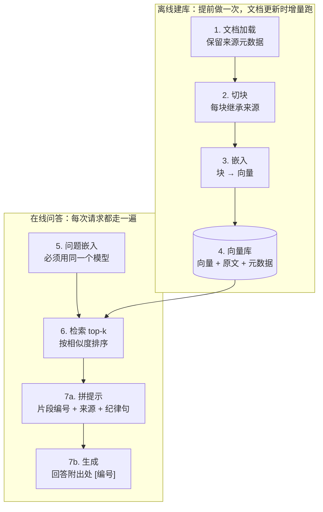

# 第 04 课　RAG Pipeline：搭一条完整流水线

前三课你手里已经攒齐了零件：第 01 课画了全景——RAG 就是"先翻资料再回答"；第 02 课学会了把长文档切块；第 03 课弄懂了嵌入——怎么把文字变成可以比距离的向量。但零件不等于机器。这节课我们动手把它们装配起来，跑通你人生中第一个真正意义上的 RAG 系统。

放心，这台机器很小，但它五脏俱全，而且是真跑——不需要任何第三方库就能跑通主干。

## 一张图看懂整条流水线

先看全景，一共七步。注意看它分成两个部分：上面四步是**提前做好的**（离线建库），下面四步是**每次有人提问都要发生的**（在线问答）。



打个比方：这就像开一家小餐馆。**离线建库是打烊后的备菜**——洗菜、切配、分装进冰箱，客人来之前就做完，而且只做一次（新菜谱来了再补）。**在线问答是客人点单后的现炒**——按单子从冰箱取料、配菜装盘、下锅出菜。备菜越充分，点单时就越快；但如果备菜环节切错了块，客人吃到的每道菜都会不对味。

还有一点值得现在就记住：整条流水线里，真正"智能"的只有最后一步调模型。前面六步全是规规矩矩的工程活——而工程活，就是你能调试、能改进的部分。

## 离线建库：提前做好的四步

**第 1 步，加载。** 把文档读进来，通常是 PDF、网页、数据库记录。这一步最容易被轻视，却埋着一个大坑：**加载时就要保住"这份资料是从哪来的"**，也就是元数据（文件名、页码、网址）。为什么？因为最后模型回答"报销期限是 10 天"时，用户得能追问"你哪来的这个说法"。没有元数据，回答就成了无头案。这就像图书馆编目：只把书堆上架不算完，每本书都得有索引卡片。

**第 2 步，切块。** 沿用第 02 课的思路，把长文档切成小块，而且**每一块要继承来源元数据**——块是检索的最小单位，来源是跟着块走的。本课为了让你看清流程，用最朴素的"按句切块"：遇到句号就切一刀。真实项目里换成第 02 课讲的递归分块，骨架不变。

**第 3 步，嵌入。** 把每个块交给嵌入模型，变成一个向量。这步在第 03 课已经讲透，这里只强调一个贯穿全局的纪律：**记录下你用的是哪个嵌入模型**，后面马上要用到。

**第 4 步，入库。** 把"向量 + 原文 + 元数据"三件套一起存进向量库。三样缺一不可：只存向量，检索到了也没法读；只存原文，就得每次提问现算全部向量，太慢；不存元数据，回答没法给出处。本课用一个 Python 列表当内存版向量库——概念上和 FAISS、Chroma 没有区别，只是规模不同。

这些活为什么放离线？因为它们贵、慢、但结果可以反复用。一次建库，千万次提问受益。文档有更新怎么办？增量处理新来的、删除失效的，不用全部重来。

## 在线问答：每次请求的四步

**第 5 步，问题嵌入。** 用户的问题也要变成向量，才能去库里比相似度。这里有一条本课最重要的纪律：**问题必须用和建库时同一个嵌入模型**。

类比一下：两支探险队要在同一张地图上会合，必须用同一套坐标系；一支用经纬度、一支用街道门牌，永远碰不上头。嵌入模型就是坐标系——用 A 模型给文档建的库，用 B 模型给问题算向量，两组数根本不在一个空间里，算出来的相似度是一堆噪声。这是新手最容易踩、又最难察觉的坑。

**第 6 步，检索 top-k。** 拿问题向量去库里算相似度（余弦相似度，第 03 课讲过），取分数最高的 k 块。k 取多大是门手艺：太小（比如 1）容易漏掉关键信息，太大（比如 20）会把不相关的块也塞进去，既稀释重点又烧钱。所以实践中常常再配一个**相似度阈值**：分数太低的块宁可不要——与其塞进干扰项，不如让模型老实说"资料里没有"。

**第 7a 步，拼提示。** 这是整条流水线里最考验细心的环节。把检索到的块拼成上下文时，做三件事：

- **编号**：每条资料前标上 [1]、[2]，方便模型引用；
- **带来源**：把元数据一起写进去；
- **立规矩**：明确告诉模型"只依据下面的资料回答，资料不足就直说'资料里没有'，不要猜"。

最后这句纪律句不是客套。模型天生热情，你不拦着它，它就会拿训练时背下的泛泛之谈来补空，幻觉就是这么混进来的。把模型的发挥空间约束在"你给的这几条资料"里，是 RAG 治幻觉的核心手段。

**第 7b 步，生成。** 拼好的提示发给大模型，要求回答末尾用 [编号] 标明用了哪条资料。这样用户看到答案，顺手就能核对出处——一份能自查的答案，才是一份可信的答案。

## 亲手跑通：mini_rag.py

讲了这么多，现在上真机。课程目录里的 `mini_rag.py` 把七步全部实现了，而且离线主干**纯标准库、零依赖**，直接运行：

```bash
python mini_rag.py
```

它的思路很直白，你对照着读代码：

1. **写死 4 条中文小文档**（报销、考勤、密码、团建各一条），每条带来源文件名当元数据；
2. **按句切块**——正则一刀切在句号上，和上面讲的第 2 步一一对应；
3. **手工向量代替嵌入模型**：数一数每块里"报销、发票、请假、审批……"这几个关键词各出现几次，凑成一个 6 维向量。别小看这个土办法——嵌入模型干的本质上是同一件事（把文字变成一组有语义的数），只是它用几千个维度、用神经网络学出来的语义，比数关键词精细得多；
4. **cosine 检索 top-2 + 阈值 0.05**：先按余弦相似度排个序，分数太低的直接丢弃；
5. **拼出最终提示并打印**：片段编号、来源、"只依据资料"的纪律句，一个不少；
6. **生成段**：从环境变量读 `OPENAI_API_KEY`，用 openai SDK 调模型。**这一步需要 API Key，本课未实跑**；没配 Key 时脚本会打印中文提示优雅跳过，不会报错，更不会伪造一段假回答。

配置了 Key 的同学跑完整版：`pip install openai python-dotenv`，设好环境变量再运行即可。代码用的是 openai SDK 的 Responses API（`client.responses.create`）；你以后会在网上大量见到旧写法 `chat.completions.create`，它们共存了很多年，会读旧代码就够了。

跑起来后你会看到四段输出：建库切成了哪几块、问题向量长什么样、每块相似度多少分谁被丢弃、最终拼出的提示全文。重点看最后那段提示——那就是发给模型的原话，"资料不足就说没有"的纪律句清清楚楚写在开头。

## 调试 RAG 的头号武器：把中间结果打出来

这节课最想让你带走的，除了流水线本身，还有一套排查方法。

RAG 出了问题，最先要分清的是：**是"没检索到"，还是"检索到了但没答好"？** 这是两种完全不同的病，药方也不同。区分的办法就是把流水线拆开，逐段看现场：

- 切块结果——文档被切成了几块？关键词那句话有没有被切散？
- 检索结果——命中了哪几块？相似度分别是多少分？是被阈值拦了，还是压根排不进前 k？
- 最终提示——拼出来的上下文里，到底有没有包含答案的那一块？

就像水管不出水，得逐段测压：拧开每一节看水到没到，堵在哪一节一目了然。事实上，上面 mini_rag.py 打印的四段输出，本身就是一份现成的"测压报告"——以后你自己写 RAG，也请养成每一步都留下现场的习惯。生产系统里，这套打印会升级成日志和追踪工具，但思想一脉相承。

## 检索不准怎么办？

跑完你可能会发现：检索这步挺容易失手的——问题换个说法就搜不到，或者搜回来的块不贴题。这很正常，基础流水线本来就有天花板。后续两课专门对症下药：

- **第 05 课（高级主题）**：查询重写（把口语化的问题改写成利于检索的样子）、混合检索（关键词检索 + 向量检索双路并行）、语义缓存等；
- **第 06 课（Rerank）**：先粗筛再精排的两阶段检索，让"排进前 k"的块更靠谱。

先把手头这条最小流水线跑稳、跑懂，再按真实问题对症加招——顺序别反。

## 想一想

1. 对照七步流水线，说说离线建库包含哪几步、在线问答包含哪几步。为什么"重活"要尽量放在离线做？
2. 建库用了 A 嵌入模型，提问时手滑用了 B 嵌入模型，检索会发生什么？用"坐标系"的类比解释一下。
3. 把 TOP_K 从 2 调到 5，可能出现什么新问题？提示：想想相似度很低的块被拼进提示后，模型会怎么表现。
4. （动手）把 `mini_rag.py` 里的 QUESTION 换成"团建要自己花钱吗？"，运行后观察各块相似度分数和命中结果，再看拼出的提示是否合理。

## 小结

七步流水线分两段：离线建库（加载→切块→嵌入→入库）提前做好、增量维护，在线问答（嵌入问题→检索→拼装→生成）每次请求都走一遍。加载保元数据、入库存"向量+原文+元数据"三件套、问题嵌入必须与建库同模型、拼提示要编号带来源并立下"只依据资料"的规矩、回答附出处。检索不准时先用"打印中间结果"分清是没检索到还是没答好，再对症下药——查询重写、混合检索、重排这些进阶招式，后面两课见。

2026 年 10 月
