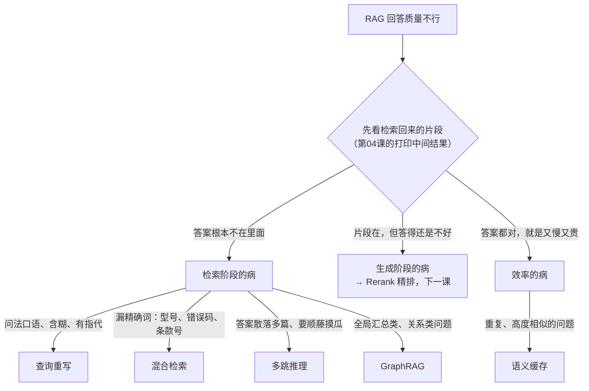

# 第 05 课　RAG 高级主题：先诊断，再开药

上一课结尾留了个伏笔：基础流水线有天花板。如果你真上手玩过 mini_rag.py，多半已经撞过墙——同一个问题换个说法就查不到；或者查回来一堆结果，相关的那条被淹没在噪声里；又或者发现同一个问题被问了八百遍，每次都老老实实重新检索、重新生成，看着账单心疼。

这一课就是药房，货架上摆着五味药：查询重写、混合检索、语义缓存、多跳推理、GraphRAG。但在发药之前，我们先学一件更重要的事：看化验单。RAG 效果不好就把所有优化招式全招呼上，是新手最常见的路径——结果系统更大、更慢、更贵，指标原地踏步。正确的顺序永远是：**先诊断，再开药**。🩺

## 看化验单：RAG 病在哪里

把病根分成三类，你拿着一个不满意的回答去"问诊"，只可能落进其中一类：

- **检索阶段的病**——答案压根不在检索回来的片段里。又分两种：*什么都没查到*（问法太口语、指代不明，或者精确词漏了），*答案散落多处、单次检索凑不齐*；
- **生成阶段的病**——片段里明明有答案，模型却没用好：被噪声带偏、重点被稀释。这类的专用药是下一课的 Rerank，本课只点名；
- **效率的病**——答案没错，就是又慢又贵，同类问题反复来。

怎么判断是哪类？用第 04 课的头号武器：打印中间结果。先看检索回来的片段——答案根本不在里面，是检索的病；在里面但答得还是不对，是生成的病；都对但大家嫌慢嫌贵，是效率的病。

把这套诊断逻辑画成一张图，贴在手边，出问题先对号入座：

有了这张地图，本课剩下的事就是照着标签一味一味认药。每一节都回答同一个问题：它到底治哪种病。

## 查询重写：把"人话"翻译成"检索语言"

设想同事递来一张纸条："那个事，上次那个怎么没批？"你是不是想抓住他问清楚：哪个事？哪次？检索系统比你更死板——它不会反问，只会拿原话去和文档逐字碰。

**查询重写（Query Rewrite）**就是在检索之前，先把用户的问题重新组织一遍。它主要治两种病：

- **换个说法才查得到。** 用户问得口语、含糊，还爱说"它""那家公司""上一版"——可文档里没有上下文，代词无从对号。这时用 LLM 把问题改写成一句自含的、利于检索的话："上次那个事" → "Q4 市场预算审批流程"。多轮对话里把代词替换成上文实体，是查询重写最高频的用法。
- **一个问题藏多个意思。** "对比方案 A 和方案 B"，一句话里其实装着两个问题。带着整句去检索，很可能两边都查不全。重写阶段可以把它拆成两个子问题，分别检索，最后合并。

还有个路子叫 **HyDE**：不重写问题，而是让 LLM 先编一段"假想答案"，再拿这段编出来的话去检索。听着离谱，道理不假——"答案"的用词天然比"问题"更接近"文档"的用词。知道有这招，实践中重写不奏效时可以试试。

代价也说一句：重写本身就是一次 LLM 调用，延迟和成本都涨，而且改写偶尔会偏离原意。所以上不上它，得靠评测说话（本课最后一节）。

## 混合检索：一个懂意思，一个认字

第 03 课学的向量检索有个天生短板：它懂"意思相近"，不认"字面相同"。你问"笔记本坏了怎么办"，它能找到"笔记本电脑故障排查"——很好；但你问的是型号"XR-200"、错误码"0x80070005"，它可能擦肩而过：在嵌入模型眼里，"XR-200"和"XR-300"这两个向量的距离，未必比两个毫不相干的词远多少。向量检索像个**听大意**的图书管理员，专有名词、型号、条款号这些精确串，恰恰是他抓瞎的地方。

档案馆里的另一位老师傅——**关键词检索**——正好相反。代表算法叫 **BM25**，本质是升级版 Ctrl+F：你搜"XR-200"，含这个词的文档一抓一个准；但你搜"笔记本"，它绝不会把只写"膝上型电脑"的文档递给你——它不懂同义。

**混合检索（Hybrid Search）**就是让这两位并行去查，再把两份结果合并。一个懂"你什么意思"，一个认"你写的什么字"，互相补盲区。它治的是"向量检索漏掉精确词"。

合并环节只给你一个词：如今的主流默认是 **RRF（倒数排名融合）**——不看两家的分数，只看名次：在两份榜单里都靠前的文档，合并后更靠前。主流向量库和搜索引擎现在基本都内置了混合检索，多数情况下你不用操心融合细节。旧资料里常见的另一路——把两家的分数归一化再加权求和——也能用，但权重靠调，两套分数的量纲还不同；看到旧代码认识就行。

## 语义缓存：记住"老熟人的老三样"

前面三招都在让检索更准，这一招不求更准，求又快又省。

早餐店老板对熟客只需要一句："老样子？"——因为这单他见过太多遍。**语义缓存（Semantic Cache）**干的就是这事：把问过的问题和答案存起来，新问题进来，先算它和缓存里哪些问题"意思接近"，够近（比如相似度超过 0.95 这样的阈值）就直接返回旧答案——检索不用做，生成也不用做。它治"重复、高频相似的问题又慢又烧钱"。客服、FAQ 这类场景是它的主场：用户的问法翻来覆去就那几十种。

但这味药有副作用，必须说透，不然生产环境要栽跟头：

- **答案过期。** 知识库更新了，报销政策从 10 天改成 15 天，缓存里还存着"10 天"，用户拿到的全是旧答案。就像后厨早换了菜单，老板还在喊"老三样照旧"。所以真上语义缓存，必须配**TTL**（缓存过段时间自动失效）或者**知识库一更新就主动清缓存**——前者是兜底，后者才是纪律。
- **阈值太松。** 相似度门槛设太低，"请假政策是什么"和"加班政策是什么"可能命中同一条缓存。缓存怕的不是不命中，是命中错的。

给语义缓存定个位：它是"工程红利"而非"准确率红利"——它不把答案变好，只把已经做对的答案变便宜、变快。等你指标达标、流量上来，再请它出场。

## 多跳推理：侦探不会一步破案

最后一种检索的病，最难缠。

来试试这个问题："我们前项目负责人所在的公司，供应商在哪个城市？"一次检索不可能出答案，因为没有任何一份文档同时写全这些。你得多问几轮：先查项目负责人是谁 → 结果说他待过 X 公司 → 再查 X 公司的供应商是谁 → 结果说供应商在苏州。每一跳的"检索词"，都得从上一跳的结果里来。

**多跳推理（Multi-hop）**就是把这套"破案过程"自动化：检索 → 从结果提炼中间结论 → 据此生成新的查询 → 再检索 → 循环，直到链条凑齐再作答。它治"单次检索找不全链条"——链条后半段的关键词，根本不在用户的原始问题里。

从机制上看，这已经是"让模型把检索当成多轮任务来跑"了，和第 06 章讲 Agent 时的循环是近亲。代价也明摆着：一个问题要 N 次检索、N 次生成，而且每一跳都可能出错，误差还会层层累加。所以别把多跳当默认配置——看到问题再判断它是不是"链条型"，评测里这类题占比高，再考虑上它。

## GraphRAG：不只有资料卡，还有关系网

再想一个问题："这家公司现在一共有哪些在跑的项目，各由谁负责？"

怪了——每个项目都有文档，检索也总能捞回来几条，但"全部列出来 + 和人对上号"是个全局汇总问题，基础 RAG 经常挂一漏万。还有一类更明显的："谁同时和 A、B 两个项目有关？"这种关系题，任何单张资料卡上都找不到答案。

**GraphRAG** 的思路是：建库的时候，顺手用 LLM 从文档里抽取实体和关系，画成一张**知识图谱**——"张三—负责—项目X""项目X—采购—数据库Y"。你的知识库从"一摞资料卡"升级成"资料卡 + 一张关系网"。前面那两类问题，顺着网走就能答；或者把走图找到的关系路径连同原文一起喂给模型，答案更有依据。

边界也要说清：画这张网本身要花大量 LLM 调用，建得贵、更新也贵。当关系本身就是答案（组织架构、供应链、审批流）时它才划算；普通的一问一答，基础 RAG 加上前面的招通常够用。GraphRAG 现在有成熟的开源实现（如微软的 GraphRAG），知道它适用什么、不适用什么就够了，真遇到再深挖——本课到此为止。

## 落地建议：一招一招加，用数据说话

把五味药放回病根图上：查询重写真对"问法不好"、混合检索对"漏精确词"、多跳对"链条长"、GraphRAG 对"全局与关系题"、语义缓存对"慢和贵"，生成阶段的"噪声淹没重点"留给下一课的 Rerank。

落地建议就一句话：**一招一招加，别一次摆全神坛。**

1. 先把第 04 课的基础流水线跑稳，用打印中间结果定位真瓶颈在哪一段；
2. 攒一个自己的小评测集——几十道带标准答案的问题就够，完整方法论在第 11 章——先跑出一个基线分；
3. 加一招，重跑评测，分数真涨了才留下；同时算它的代价（查询重写多一次 LLM 调用、语义缓存有陈旧风险、多跳成本翻倍）；
4. 硬要排个顺序的话：混合检索性价比最高、风险最低，多数团队第一个加它；查询重写其次；多跳和 GraphRAG 看你的问题分布再定。

"诊断 → 加一招 → 重跑评测"这个节奏记牢，你就已经比大多数"一次全上"的部署专业了。

## 想一想

1. 用户问"上次那个事怎么样了？"，基础 RAG 最可能犯哪类病？本课哪一味药对症？要把这味药用对，除了改写，还需要把什么东西一并带给检索？（提示："上次那个"的指代藏在哪里？）
2. "请假政策是什么"和"加班政策是什么"被语义缓存返回了同一个答案。至少想出两个修法（提示：从阈值下手一个，从问题本身下手一个）。
3. "列出文档里提到的所有供应商及其合作项目"——用自己的话说说，为什么基础 RAG 答不好它？本课哪两味药能帮上忙、分别帮在哪一步？
4. （动手）把你 mini_rag.py 的问题换成 5 个自己编的，运行后逐条手记：检索到了吗？检索对了吗？然后对照病根图给它归类，看看你最该先加哪味药。

## 小结

RAG 效果不好，先用打印中间结果把病根分成三类：没检索好、检索到了没用好、又慢又贵。查询重写把"人话"翻译成"检索语言"，治问法含糊和一问多意；混合检索让向量与 BM25 双路并行、RRF 融合，治"向量检索漏掉精确词"；语义缓存记住老熟人的老三样，治重复问题又慢又贵，但必须防答案过期；多跳推理像侦探破案，一次检索喂出下一次，治链条型问题；GraphRAG 把资料卡升级成关系网，答全局与关系题。落地心法：先诊断再开药，一招一招加，每加一招都重跑评测用数字说话——生成阶段的病和 Rerank 那味药，下一课见。

2026 年 10 月
