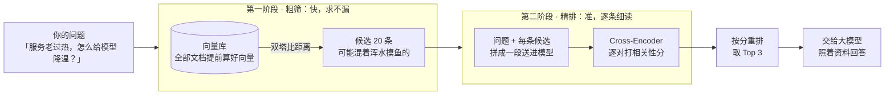

# 第 06 课　Rerank：给检索结果再排一次序

上一课我们给 RAG 加了不少外挂：查询重写让问题更清楚，混合检索让召回更全。把流水线跑起来，你大概率还是会遇到这样一个瞬间：明明库里就躺着那条正确答案，检索回来的 top 结果里它却排在第 8 名，第 1 名反倒是一段看起来"挺像那么回事"的废话。资料翻了，钱花了，答案还是不对——问题出在**排序**。这节课补上这块拼图：Rerank（重排序）。

## 一、向量检索的软肋：问题和文档从头到尾没见过面

先回头看一眼我们一直在用的向量检索。它像一位效率极高但有点敷衍的图书管理员：问题来了，他把问题压缩成一张"摘要卡"；库里几百万块文档，每块也都提前压缩成了一张卡；然后拿两张卡对着看，像就排前面。

这个思路有个名字，叫 **Bi-Encoder（双编码器）**，俗称"双塔"：问题和文档站在两座塔里，各自编码，直到最后算距离那一步才碰头。

双塔的优点和缺点是同一件事：**两边从头到尾没有真正见面**。好处是文档向量可以提前算好存进库，查询时只编码一次问题，几十毫秒扫完全库——这是向量检索能做大的原因。坏处也在这：因为不见面，比较只能比"两张摘要卡"的整体相似度，词与词之间的细关系全被压没了。"服务过热怎么降温"和"把 temperature 参数调低"，在摘要卡层面看还真挺像——都沾着"温度"的边——但它们说的是两码事。

于是 top 结果里就会混进这种"词面像、其实答非所问"的片段。它们占了坑，真正有用的资料就被挤出去了。

## 二、两阶段检索：先海选，再面试

怎么既保住双塔的速度，又把排序做准？成熟的答案是两阶段检索：

用招人来类比最好懂。第一阶段像 HR 海选：几千份简历，用关键词快速捞出 20 份——不求准，只求**别漏**，真正的候选人必须留在名单里。第二阶段像资深面试官：拿着岗位要求，把这 20 份一份一份细看、对照打分、排出名次——求**准**，但一份一份来很慢，所以只细看海选捞出来的那一小撮。

对应到 RAG：第一阶段用双塔从全库快速捞出二三十条候选（比如 top 20）；第二阶段用一个更准也更慢的模型，把"问题和每条候选"逐对细读打分、重新排序，最后只把最前面的几条交给大模型。快而粗的负责扫全库，慢而准的负责精读，分工明确，谁都别越界。

## 三、Cross-Encoder 凭什么更准

第二阶段那个"更准也更慢"的模型，主流形态叫 **Cross-Encoder（交叉编码器）**。它和双塔的区别一句话就能说清：**双塔是问题和文档各写各的摘要再比卡；Cross-Encoder 是把问题和文档拼成一段话，从头到尾一起读**。

一起读意味着模型里的每个词都能"看到"对方段落里的每个词——注意力是交叉的。"降温"这个词会直接和候选里的"空调""散热"对上眼；同样重要的是，它也会发现候选里的"温度"后面跟的是"参数"而不是"机房"——哦，这段在讲输出随机度，答非所问。这种词与词的细粒度对照，正是被压扁在摘要卡里丢掉的信息。

天下没有免费的午餐：Cross-Encoder 没法把文档提前算好——每来一个问题，每条候选都要"问题 + 文档"完整算一遍。候选 100 条就是 100 次完整计算；库里 100 万块文档就是 100 万次，谁也扛不住。所以它只出现在第二阶段，服务那一小撮候选。

顺带认识一条中间路线：**ColBERT**。文档提前按"词"编码存好（保住双塔的快），查询来了再做词级别的细致对照（逼近交叉的准），术语叫"延迟交互（Late Interaction）"。知道有这么一条介于两者之间的路线就够了，动手阶段先掌握两阶段的主流做法。

## 四、两个旋钮：捞多少、留几条

两阶段检索有两个要你自己拿主意的参数，先建立直觉：

- **粗筛捞多少条**：捞太少（比如 5 条），真答案没进候选，精排再准也是无米之炊——**精排救不回没进候选的文档**；捞太多（比如 300 条），精排的计算量成倍涨，延迟和费用跟着涨。常见取几十到一百，按你能接受的延迟调。
- **精排留几条**：不是越多越好。塞 20 段进上下文，噪音多、token 费用高，模型还容易跑偏。常见取 top 3 到 top 5。

开销账很好算：精排的计算量大致和候选数成正比——一条候选算一次。候选从 100 砍到 50，精排开销直接减半。所以"粗筛宽一点还是紧一点"，本质上是在花多少钱买"别漏"的保险。

## 五、reranker 怎么选

重排用的是**专门的 reranker 模型**，和嵌入模型是两个工种：嵌入模型管"快速算相似"，reranker 管"细读打相关分"，别拿嵌入模型当 reranker 用。

开源里一类代表是 BGE Reranker 系列（北京智源 BAAI 开源，多语言场景常用 bge-reranker-v2-m3 这类型号）；商用 API 有 Cohere Rerank、Jina Reranker 等。这个赛道迭代很快，不写死哪个最强：选型时看 MTEB / C-MTEB 榜单的 Reranking 板块，结合你的语言、部署方式和延迟预算挑两三个，再拿到**自己的数据**上评测——榜单分高，不等于在你的业务语料上好使。

## 六、收束：你的 RAG 调优工具箱齐了

到这节课，本章六课走完了：全景 → 切块 → 嵌入 → 流水线 → 高级主题 → 重排。回头看，我们已经凑齐一套对症下药的调优工具箱：

| 病症 | 典型表现 | 该用哪招 |
|------|----------|----------|
| 检索不到 | 好答案压根没进 top | 查询重写、混合检索（第 05 课） |
| 检索不准 | 好答案进了 top 但排得很后 | Rerank（本课） |
| 重复回答、响应慢 | 同样的问题反复算 | 语义缓存（第 05 课） |

Rerank 属于"把检索到的排得更准"这一招，和第 05 课的查询重写、混合检索正好互补：一个管捞得全，一个管排得准。最后送你一条本章最重要的纪律：**先评测定位，再对症加招**——先用评测集看清自己的 RAG 病根在哪，缺哪招补哪招。别一上来把所有优化全堆上，那只会让系统又慢又贵，还难排查。

## 想一想

1. 为什么双塔模型能把几百万文档的向量提前算好存进库，Cross-Encoder 却不行？（提示：两种模型里，问题和文档分别在什么时候才"见面"？）
2. 粗筛候选数取 5 会冒什么风险？取 500 呢？这两个极端分别牺牲了"快"还是"准"？
3. 有同学说："我干脆把向量检索的 top 20 全塞给大模型，不就代替 rerank 了？"这句话什么时候成立，什么时候不划算？（提示：上下文窗口、噪音、token 费用）
4. 轻动手：打开本课的 rerank_demo.py，往 TOPIC_WORDS 词表里加一个关键词（或删掉 TRAP_MARKS 里的一个词）再跑一遍——观察粗筛分数纹丝不动、精排名次却变了：想想这两个阶段各自到底"读"了什么。

## 小结

向量检索是"问题、文档各自编码、再比距离"，快但粗，top 里难免混进词面像、答非所问的片段。两阶段检索的分工是：双塔从全库快速粗筛出一小批候选，求不漏；Cross-Encoder 把问题和候选拼在一起逐对细读打分，求准。Cross-Encoder 准的根源是词与词的交叉对照，这也决定了它不能预计算、只配服务小批量候选。粗筛捞多少、精排留几条是两个按延迟与效果调的旋钮，精排开销大致正比于候选数。RAG 调优的顺序永远是先评测定位、再对症加招——至此，本章的工具箱集齐了。

---

2026 年 10 月
