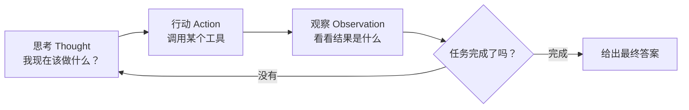

# 第 01 课　Agent 是什么

从这一章起，我们开始学整个课程最激动人心的东西：Agent（智能体）。先说清楚它和我们已经熟悉的东西差在哪，再动手写一个最小的 Agent 骨架——全程不用调 API，你的电脑就能跑。

---

## 一、从"流水线"到"实习生"

前面几章你写的程序，基本都是流水线：你规定好第一步做什么、第二步做什么，程序照着走。第 4 章的链（Chain）就是这样——`提示词 | 模型 | 解析器`，像一份菜谱，食材固定、步骤固定、出锅的样子也固定。

菜谱式的好处是可控，坏处也在这：**只要任务没有现成菜谱，它就傻眼。**

你对它说"帮我规划一次三天的杭州旅行"，它没法回答——查天气、订酒店、排行程，这些步骤该先做哪个、结果不满意怎么办，没有人事先写好。

Agent 是另一种思路。你不给它菜谱，你给它一个**目标**和**一套工具**，然后让它自己想办法：先查天气，发现下雨就把户外行程换掉，再看看预算，再一步步把事办成。像一个**聪明的实习生**：你交代"把这单客户搞定"，不用教他每一步，他自己会查资料、打电话、汇报结果。

一句话记住区别：**链的步骤是人写死的，Agent 的步骤是它自己边干边决定的。**

---

## 二、核心循环：思考 → 行动 → 观察

Agent 靠什么"自己决定"？靠一个非常简单的循环，几乎所有 Agent 都是它的变体：



这个循环有个专门的名字叫 **ReAct**（Reasoning + Acting，推理加行动）。走一遍你就懂了：

> 任务：北京今天穿什么合适？
>
> 思考：我得先知道北京今天的天气——调天气工具。
> 行动：查天气("北京")
> 观察：晴，25°C
> 思考：25 度不算冷，但要判断"穿什么"还得算一下穿衣建议——调用建议工具。
> 行动：穿衣建议(25)
> 观察：短袖就行
> 思考：信息齐了。**最终答案：晴，25°C，短袖就行。**

注意"思考"这个环节的价值：它不是废话，而是**把上一步的观察消化掉，再决定下一步**。普通链之所以僵硬，就因为它没有这个"回头看"的动作。

---

## 三、动手：60 行写一个最简 Agent

配套脚本 `agent_intro.py`（纯标准库，离线可跑），三段式：

**第 1 段：工具箱。** Agent 能"动手"的本钱就是几个函数。关键习惯是**登记造册**——用字典把名字和函数绑在一起：

```python
TOOLS = {"get_weather": get_weather, "get_clothes_advice": get_clothes_advice}
```

为什么这么绕一下？因为"大脑"只应该报名字（`get_weather`），"手"负责按名字找到函数去执行。解耦之后，换工具、加工具都不用动大脑的代码——这个思路后面第 07 课讲工具系统时还会反复出现。

**第 2 段：大脑。** 真实 Agent 里，"思考"是把任务、工具清单、历史记录一起发给大模型，让它输出"下一步做什么"。我们的离线版用几条 `if` 规则扮演模型：

```python
def think(memory):
    # 看一眼已有的观察，决定下一步：返回 (动作名, 参数) 或 ('finish', 答案)
```

注意它的输入只有 `memory`——过去的观察记录。**决策永远基于已有信息**，这正是真实 Agent 的样子。

**第 3 段：循环本体**，就是上面那张图的代码版：

```python
for step in range(1, MAX_STEPS + 1):
    action, arg = think(memory)        # 思考
    if action == "finish":
        ...                            # 任务完成，交答案
    observation = TOOLS[action](arg)   # 行动：按名字执行工具
    memory.append((action, observation))  # 观察：记下结果
```

跑一下 `python agent_intro.py`，你会看到普通链和 Agent 的现场对比：普通链的第二步"短袖就行"是写死的（哪怕天气是零下它也这么说）；Agent 的每一步都是看着上一步结果走出来的。

---

## 四、一个不能省的细节：安全阀

循环最怕的就是停不下来——模型可能反复调同一个工具、绕圈子。所以骨架里必须有一道 `MAX_STEPS = 5` 这样的保险：到步数就强制停。真实框架里这叫**递归上限（recursion_limit）**，第 04 课的 LangGraph 里你会再见到它。

现在你可以体会为什么说 Agent "会把大模型从会聊天变成会办事"了：聊天只输出文字，Agent 的每个"行动"都能真的执行——查数据、写文件、发邮件。

而**能真的执行，恰恰是危险的开始**。循环里那个不起眼的 `memory=[]` 列表，就是它"记性"的全部来源——下一课我们就把它升级成真正的记忆系统：怎么记、记多久、怎么跨会话认得老用户。

---

## 想一想

1. 用自己的话说出链和 Agent 的一个本质区别：如果把"思考"这一步从循环里删掉，Agent 会退化成什么？
2. `agent_intro.py` 里，如果把 `think()` 换成真实的大模型调用，你猜需要把哪些信息发给模型？（提示：光发任务够吗？）
3. `MAX_STEPS` 设成 1 会发生什么？设成 1000 又有什么代价？
4. 轻动手：给 `TOOLS` 加一个你自己的工具（比如返回固定笑话的 `tell_joke`），再改 `think()`，让 Agent 在"查完天气"后先讲个笑话再给答案。

## 小结

Agent 与链的本质区别：步骤不由人写死，而是"思考-行动-观察"循环里自己决定。思考消化观察、决定下一步；行动调工具真做事；观察把结果带回循环。工具登记造册、大脑只报名字，是写 Agent 的第一个好习惯。循环必须配安全阀，防止无限打转。

---

2026 年 10 月
