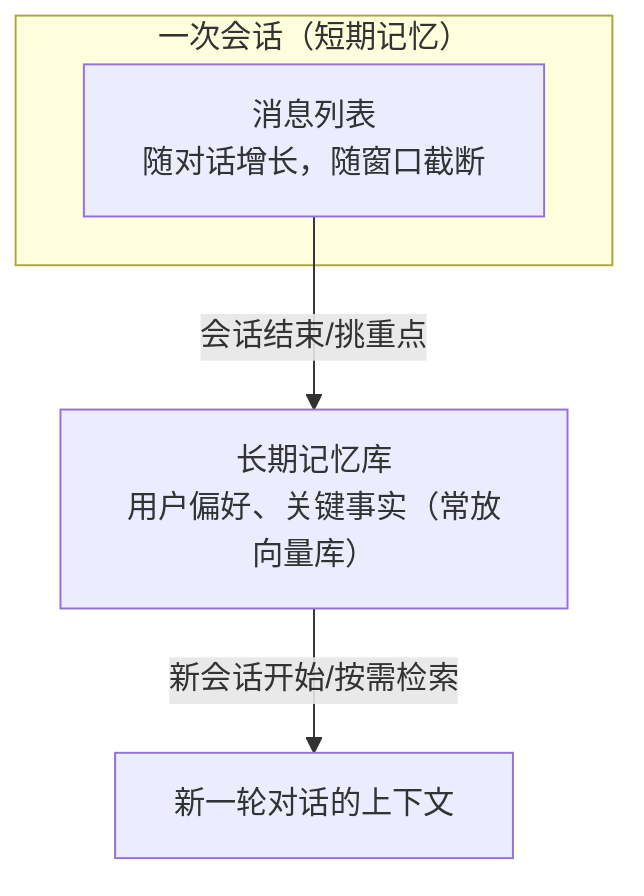

# 第 02 课　Agent 的记忆

上一课我们写了个能自己走循环的小 Agent，但你可能已经发现它的尴尬：`memory` 只是个列表，换个对话、重启程序，它就把你忘得一干二净。这节课我们把"记性"这件事彻底讲清楚。

---

## 一、模型本身是条金鱼

先泼一盆冷水：**大模型自己是没有记忆的。** 你今天和它聊了一小时，明天再打开新对话，它对你一无所知——不是它小气，而是它的本质就是"给一段文字，接下一段文字"，每次调用都是独立的。

类比一下：模型像个**每天早上都会失忆的聪明同事**。脑子极好，但每天清零。那你怎么和他长期共事？很简单——**每天给他看工作笔记本**：昨天聊了什么、你交代过什么、你的偏好是什么。他看完笔记本，就能接着昨天的进度干活。

Agent 的记忆系统，本质就是在造和维护这个笔记本。

---

## 二、短期记忆：聊天记录就是笔记本

最简单的记忆，就是把每一轮对话都追加到一个列表里，每次调用模型时**把完整历史一起发过去**：

```python
msgs = []                                # 这就是短期记忆
msgs.append({"role": "user", "content": "我叫小明，在杭州做程序员"})
msgs.append({"role": "assistant", "content": "你好，小明！"})
msgs.append({"role": "user", "content": "我叫什么？"})   # 模型能答上，因为名字在历史里
```

"模型记得我叫小明"这句话是不准确的——**历史里有，它就"记得"；历史里没有，它就"不知道"**。记忆不在模型脑子里，在你发过去的上下文里。这个认知很重要，它意味着记忆是可以被你完全掌控的。

配套脚本 `agent_memory.py` 的实验 4 做了个对照：只把最后一条消息发给"模型"，它立刻答不出你的名字——**记忆不在模型里，全在历史里**。

### 窗口与失忆

历史不可能无限长：模型一次能"看"的文字量有上限（**上下文窗口**），而且历史越长，调用越贵。所以常见的做法是滑动窗口——只带最近 N 条：

```python
sent = msgs[-window:]    # 只发最近 window 条
```

`agent_memory.py` 实验 3 演示了后果：只发最近 2 条时，Agent 又"失忆"了。所以工程上不能光靠窗口硬截，还得配合**摘要**（把旧对话压缩成几句话放进历史）和**长期记忆**。

---

## 三、长期记忆：跨会话认得老用户

短期记忆跟着会话走，会话一关就没了。但真实的助手应该记得"这位用户上周说过他胃不好，别推荐辣的"。这就是**长期记忆**：把重要信息存到会话之外（数据库、文件、向量库），下次会话再捞回来。



细心的你会发现"按需检索"这三个字眼熟——把用户的话变成向量去记忆库里搜相似内容，这正是第 5 章 RAG 干的事。**长期记忆≈对"关于这个用户的事实"做 RAG**，学到这里你应该有种打通的感觉。

### 2026 年的主流写法

旧教程会教你用 `ConversationBufferMemory` 之类的记忆类，这套已进入维护状态。现在的范式统一成三件套：

```python
agent = create_agent(
    "openai:gpt-4.1-mini",        # 示例模型名，请按官网当前列表替换
    tools=[...],
    checkpointer=InMemorySaver(), # 记忆保管员：替你存每一步的状态
)
config = {"configurable": {"thread_id": "user-001"}}   # 同一 id = 同一份记忆
agent.invoke({"messages": [...]}, config)
```

理解三个词就够：**checkpointer** 是替你保管笔记本的档案员；**thread_id** 是笔记本的编号——同一个编号的对话自动共享历史；换一个编号，就是开一本新本子，互不干扰（这就是"跨会话隔离"的实现方式）。`agent_memory.py` 第 2 部分就是这套写法的可运行示例——需要安装库和 API Key 才能跑，属于"需 Key，未实跑"段落，但离线部分已把原理完整演示了。

---

## 四、该记什么，不该记什么

新手最常见的错误是把记忆当仓库，什么都往里塞。其实笔记本越厚，翻找越慢、干扰越多（模型也会被无关历史带偏）。实用原则：**短期记忆保完整，长期记忆挑重点**——用户主动说的偏好、重要决定、关键事实才值得沉淀；寒暄和过程性废话放掉。

另外提醒一句：记忆里存的是用户隐私。存什么、存多久、用户能不能要求删除，这些不只是技术问题——下一课我们就要正面撞上这类风险。

---

## 想一想

1. 用"每天失忆的聪明同事"这个类比，向朋友解释：为什么把历史发给模型，它就"记得"了？
2. `agent_memory.py` 实验 3 里，窗口设成 2 条 Agent 就失忆了。你能想到哪两种办法既省 token 又不丢关键信息？
3. 换一个 `thread_id` 为什么就能实现会话隔离？这种机制对"多用户客服系统"意味着什么？
4. 轻动手：把 `chat()` 函数里的 `send_history=True` 改成只发送"包含'我叫'的消息"，观察模型还能不能记住名字，体会"挑重点记忆"的难度。

## 小结

模型本身无记忆，每次调用独立；"记得"只是历史在上下文里。短期记忆=消息列表，受窗口和成本约束，超了就截断或摘要。长期记忆把重点沉淀到会话之外，按需检索，本质是对用户事实做 RAG。2026 范式记住三件套：create_agent、checkpointer、同一 thread_id。记忆不是仓库，挑重点记才是好习惯。

---

2026 年 10 月
