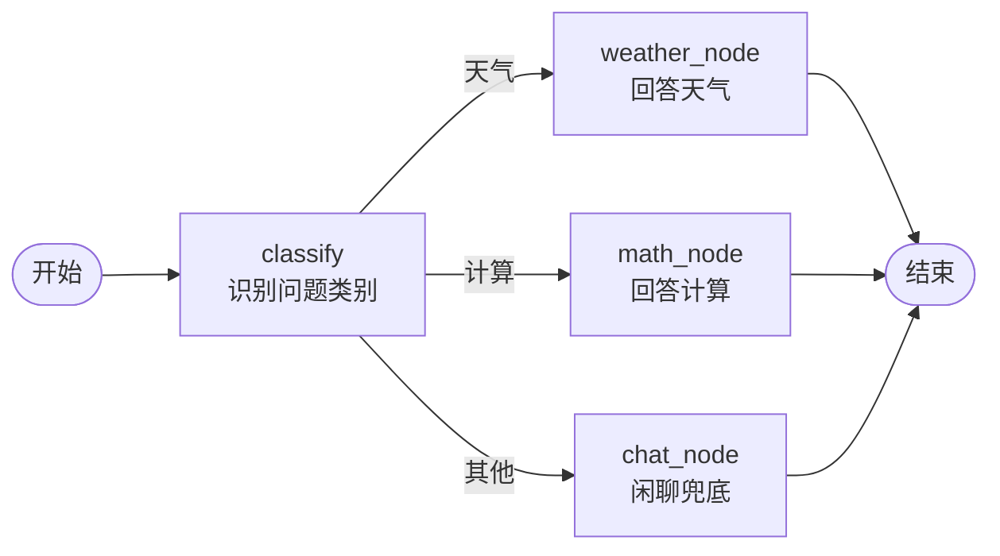

# 第 04 课　LangGraph：给 Agent 画流程图

> 【LangGraph 30 秒补课】三个词建立直觉：**节点**＝一个步骤（一个函数干一件事）；**边**＝步骤之间的走向（先谁后谁、条件满足走哪条）；**状态**＝在节点之间传递的数据包（每个节点读它、改它、传给下一个）。LangGraph 就是让你"画"出这张流程图，框架负责按图执行。三句话到位，正文不慌。

---

## 一、手写循环的天花板

第 01 课我们手写了"思考-行动-观察"循环，还配了 `MAX_STEPS` 安全阀。任务简单时这样够用，但真实业务一复杂，手写循环就开始失控：

- 想**分支**：先判断用户问的是天气还是算数，分头处理——`if` 开始套 `if`；
- 想**循环**：第一步结果不满意就回到重试节点——`while` 里藏 `while`；
- 想**中途暂停**：卡在需要人工审批的节点，明天接着跑——你得自己保存中间状态。

把这些全塞进一个函数，一星期后你自己都看不懂它。更靠谱的做法，是像公司管理流程那样：**把流程画成图，各环节只管自己的事，流转规则明明白白。** 你在公司报销时见过这种图：节点是"提交申请""主管审批""财务打款"，箭头决定先谁后谁，金额不同走不同分支，被驳回就回退重走。

LangGraph 就是把这种"画图"能力给 Agent 的框架：它是 LangChain 家族里专门负责**流程编排**的库，用"节点＋边＋状态"把复杂、可循环、可分支的流程可靠地管起来。

---

## 二、把上一课的客服画成图

我们做一个最小但完整的例子：一个客服 Agent，先识别用户问题类别，再分流到对应的回答节点。



对照着记三个词：`classify`、`weather_node` 这些方框是**节点**；从 `classify` 出发的三条箭头是**条件边**（走哪条由一个路由函数看状态决定）；从"开始"流到"结束"、每个节点都在改的那个字典，是**状态**。

配套脚本 `langgraph_demo.py` 里，状态就是这样一个字典：

```python
{"query": "北京今天天气怎么样？", "category": "", "answer": ""}
```

每个节点函数都长一个样：**接收状态，返回改过的状态**。`classify` 填 `category`，路由函数看 `category` 决定走哪条边，回答节点填 `answer`——数据包从开始流到结束，任务就完成了。

---

## 三、先手工造一遍，再用真库

`langgraph_demo.py` 分两部分，这个安排是故意的。

**第 1 部分（离线可跑）：用纯标准库手写一个 20 行的 MiniGraph。** 它把 LangGraph 的核心玩法压缩到最小：`add_node` 登记节点、`add_conditional_edges` 挂路由函数、`invoke` 从入口节点开始走图——节点处理数据包，路由函数指出下一站，走到没有出边就结束。跑一下你会看到三个问题各自走出不同的路径。**框架不是魔法，就是把这套循环做健壮**：真实产品里换成真正的 StateGraph，你写的东西一个字都不用变。

**第 2 部分（需装库）：用真正的 LangGraph 重新搭同一张图。** 写法几乎一一对应：`StateGraph(State)` 建图、`add_node` 加节点、`add_conditional_edges` 挂条件边、`add_edge(name, END)` 接到终点，最后 `compile()` 编译再 `invoke`。没装库的话脚本会打印中文提示优雅跳过；想装就 `pip install langgraph`（这一部分**不需要 API Key**）。

```python
builder = StateGraph(State)
builder.add_node("classify", classify)
builder.add_conditional_edges("classify", route)   # 条件边：看状态决定走向
graph = builder.compile()                          # 画完要"编译"才能跑
result = graph.invoke({"query": "北京今天天气怎么样？", "category": "", "answer": ""})
```

用真库图什么呢？四个字：**省心的基础设施**。第 02 课的 checkpointer 接上 LangGraph，每走一步状态自动存档，随时暂停恢复（人工审批节点就靠它）；循环防失控的递归上限、失败重试、把整张图可视化打印出来，全是现成的。你自己写，每一项都是坑。

---

## 四、两个容易踩的坑

**节点别贪大。** 一个节点干一件事，分支和重试靠边来表达。把十件事塞进一个节点，图就白画了。

**别忘了安全阀。** 带环的图必须有递归上限，不然一次死循环就是真金白银的 API 账单——第 01 课的 `MAX_STEPS` 在这里换了个名字继续站岗。防线 4（工具白名单）的功课也别丢：节点里调工具前，权限检查要跟上。

到这里，单个 Agent 的编排你已经拿下了。但节点里调用的工具，每一家都得单独写对接代码——全世界这么多工具和数据源，能不能有一套**统一的插座标准**，工具做一次，所有 Agent 都能用？这正是下一课的主角：MCP（模型上下文协议）。

---

## 想一想

1. 用"报销流程图"类比向朋友解释：节点、边、状态分别对应公司流程里的什么？
2. 第 01 课手写的循环，和今天 MiniGraph 的 `invoke`，本质差别是什么？真库又比 MiniGraph 多给了什么？
3. "人工审批"节点在图里该怎么表达？（提示：走到这个节点停住，checkpointer 存档，批准后从这继续。）
4. 轻动手：给 MiniGraph 加一个 `vip_node`，让路由函数对包含"VIP"的提问走这条路，体会条件边的扩展成本有多低。

## 小结

手写循环撑不起复杂流程：分支嵌套、循环重试、中途暂停都会失控。LangGraph 用三件套解决——节点干一件事、边定走向、状态当数据包在图里流。先手写 MiniGraph 看透本质，再用真库享受存档、递归上限、可视化的现成基础设施。节点要小、权限要查、带环必设安全阀。下一课我们去看工具的统一接入标准：MCP。

---

2026 年 10 月
