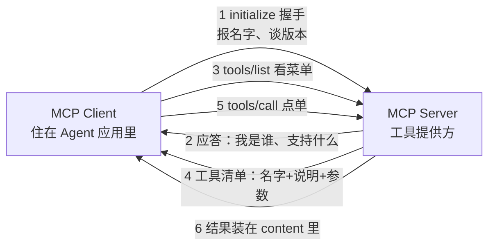

# 第 05 课　MCP：模型上下文协议

> 上一课结尾留了个问题：每接一个工具都要单独写对接代码，能不能有一套"统一插座"？这一课的主角 MCP（Model Context Protocol，模型上下文协议），就是给 Agent 世界定下的插座标准。

## 一、插头与插座：为什么需要一套标准

想象你家里每台电器都用一种专用插头：台灯圆脚、电饭煲方脚、风扇三角脚……每买一件电器就得改一次墙上的插座。早期给 Agent 接工具就是这个处境：天气 API 一套写法、数据库一套写法、公司内部系统再来一套——3 个 Agent 配 5 个工具，最坏要写 15 份对接代码。更难受的是换：今天用 A 家模型，明天换 B 家，对接代码几乎全部重来。

MCP 的思路是把"专用插头"统一成"USB-C"：工具方（天气服务、数据库、你的内部系统）把能力包装成一个 MCP 服务器（Server）；Agent 应用（各类助手、IDE 插件）内置 MCP 客户端（Client）。两边按同一套规矩说话——**工具做一次，所有支持 MCP 的 Agent 都能用。**

## 二、协议怎么说话：握手、菜单、点单

MCP 的消息基于 JSON-RPC 2.0——名字唬人，其实就是"每条消息都是一个固定格式的 JSON"。Client 和 Server 的配合分三步：



**握手（initialize）**：像初次见面交换名片。Client 报自己的名字和能听懂的协议版本，Server 回报"我是谁、支持哪个版本"；谈拢后 Client 再发一条"初始化完成"，连接才算就绪。**看菜单（tools/list）**：Client 问"你这儿有什么工具？"，Server 返回清单，每个工具带名字、一句说明、参数格式——说明写得越清楚，Agent 越"点"得准，这个道理第 07 课细讲。**点单（tools/call）**：指名道姓调用某个工具并传参数，Server 干完活把结果端回来；点了不存在的菜，Server 也不装死，返回一条带错误码的 JSON。

一个值得注意的小细节：握手完成的那条"初始化完成"消息**没有 id，也不需要应答**——这叫通知（notification），像广播"我到齐了"。正经请求都带 id，Server 应答时原样带回，像餐厅取号小票，凭号对上哪单是哪单的答复。

## 三、离线跑一遍：亲眼看消息长什么样

配套脚本 `mcp_demo.py` 用纯标准库搭了迷你 Server 和 Client，**不装任何库、离线真跑**。它把每条请求和应答原样打印，你重点看三样：

- 请求的形状：`{"jsonrpc": "2.0", "id": 3, "method": "tools/call", "params": {...}}`；
- 应答怎么对上号：结果装在 `result`，`id` 与请求一一对应；
- 出错怎么表达：错误装在 `error`，带错误码和一句人话。

跑完你会看到完整一轮：握手 → 看菜单 → 点一份天气 → 做一次加法 → 故意点一道"菜单上没有的菜"，看 Server 怎么礼貌拒绝。

## 四、装上真库：从模拟到真实

真实开发不必自己搭协议轮子。开源的 `mcp` 库（`pip install mcp`）提供 FastMCP，定义一个工具只要一个装饰器：

```python
from mcp.server.fastmcp import FastMCP

mcp = FastMCP("我的工具箱")

@mcp.tool()
def add(a: int, b: int) -> int:
    """两数相加"""
    return a + b

mcp.run()   # 以 stdio 模式启动，等 MCP 客户端来连
```

`mcp_demo.py` 第二段会尝试导入这个库：装了就演示定义方式，没装就打印一句中文提示优雅跳过（这一段**未实跑**，你装好库后可以自己跑通）。顺带交代现状：MCP 在 2025 年进入 2.0 阶段，补了远程服务的 OAuth 登录、流式返回这些能力，但"握手、菜单、点单"的主骨架没变——学协议学的是骨架，不是某个版本的边角。

## 五、协议只管连接，安全还得自己把关

泼一盆冷水收尾：MCP 解决"怎么连上"，不解决"该不该连"。来路不明的 Server，工具描述写着"查天气"，背后干别的怎么办？第 03 课的防线在这里照样站岗：接新 Server 先看清工具清单，删除、转账这类不可逆操作该确认还得确认。插座统一了，电器质量还得自己挑。

到这里，单个工具已经能通过标准协议"即插即用"。但真实任务要的常常不是单个工具，而是一整套配合好的动作——把这种成套能力打包起来、要用才装，就是下一课的主角：Agent Skills（技能系统）。

## 想一想

1. 用"USB-C 统一插座"向朋友解释 MCP：Client、Server 各对应什么？"工具做一次、处处能用"省掉的是谁的工作量？
2. 应答里的 `id` 像餐厅取号小票——如果 Server 同时处理 3 个请求而没有 id，会发生什么？
3. `tools/list` 返回的"一句说明"为什么重要？（提示：Agent 就靠这句话决定点不点这道菜。）
4. 轻动手：给 `mcp_demo.py` 的迷你 Server 加一个 `echo(text)` 工具，重跑一遍，观察 `tools/list` 菜单和调用结果的变化。

## 小结

没有标准时，N 个 Agent 配 M 个工具最坏要写 N×M 份对接代码，换一家就重写一遍。MCP 把连接统一成 USB-C：三步走——initialize 握手、tools/list 看菜单、tools/call 点单；消息是带 id 的 JSON-RPC，通知不带 id，出错返回 error 而不是装死。真库 FastMCP 让定义工具变成一个装饰器的事。协议只管连接，第 03 课的安全防线仍要自己守。

---

2026 年 10 月
