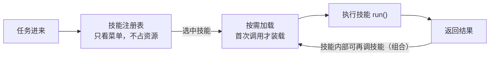

# 第 06 课　Agent Skills：把能力打包成技能

> 上一课用 MCP 把工具接进了 Agent。但"接上"只是开始——用户要的往往是一整个结果，而不是一串零件。这一课讲怎么把成套能力打包成"技能"，让 Agent 按需取用。

## 一、扳手再多，不如一套好用的套餐

你让 Agent"整理这周的会议录音，出一份要点纪要"。它实际要做四件事：转写音频、抽取要点、按模板排版、存档。如果全靠单个工具，Agent 每次都得现场"想"一遍这四步怎么衔接——今天想对了，明天可能就漏一步。

两个类比帮你定位概念：**工具像单个扳手、螺丝刀**，一件只干一个动作；**技能像手机里的 App**——你点开"记账 App"，输入、分类、统计、图表它内部都安排好了，你不必每次重新设计流程。技能（Skill）就是把这组配合好的动作连同流程知识，打包成一个自包含的能力单元：自包含、可复用、可组合、按需加载。

和工具划清界限：工具是细粒度动作（"发一封邮件"），技能是粗粒度能力（"处理邮件"，内含分类、起草、归档）；工具通常无状态，技能可以自带状态和内部流程。

## 二、技能系统三个关键动作：注册、按需加载、组合

**注册**：每个技能登记名字和一句说明，进注册表。Agent 看"菜单"决定用谁，所以说明要写清"我擅长什么"。**按需加载**：像 App 点开才启动——注册表里躺着几十个技能也不占资源，首次调用才真正装载，之后复用已加载的实例。Agent 的上下文窗口是稀缺资源，"要用才装"就是在给上下文省钱（回忆第 02 课）。**组合**：技能内部可以调用别的技能，小技能拼成大能力——"早间简报"= 报时 + 天气 + 排版。

## 三、离线跑一遍 skills_demo.py

纯标准库、零依赖、直接跑。脚本里有一个 `SkillRegistry` 和四个技能：报时、查天气（离线演示表）、四则运算，外加一个组合技能"早间简报"。重点看三处：

1. 列菜单时打印了一排技能名，但**没有一个被真正装载**——菜单只是登记；
2. 首次调用"报时"时打印 `[按需加载]`，再调一次就不打印了——装载一次，反复使用；
3. "早间简报"内部连调报时和天气——这就是组合。最后故意调用不存在的技能、给天气技能喂一个表里没有的城市，看两道兜底提示怎么接住。

## 四、自己写技能的三条军规

1. **单一职责**：一个技能只说清一件擅长的事，别做"万能包"——菜单描述越诚实，Agent 选得越准。
2. **说明即菜单**：description 写"什么时候用我、输入输出是什么"，它是 Agent 的选人依据，不是装饰。
3. **状态自己管**：需要记中间结果的技能，把状态收在自己实例里，别散落全局——第 02 课的记忆思路在这里同样适用。

技能是"成套的料"，通常塞进第 04 课流程图的节点里跑：技能管"料"，LangGraph 管"序"，配合着用。不过再好的技能也由一个个工具动作组成——单个工具怎么写描述、怎么调度、出错怎么恢复，这些工程细节值得单独抠一课。下一课：Tool Use，把工具用得靠谱。

## 想一想

1. 用"App vs 单个功能"给同学讲技能和工具的区别，各举一个例子。
2. "按需加载"省的是什么？（提示：上下文窗口和内存都算钱。）
3. 组合技能"早间简报"依赖天气技能——如果天气技能坏了，简报该怎么办？说出你的兜底方案。
4. 轻动手：给 `skills_demo.py` 加一个"字数统计技能"（数一段文字的字数），先调 `available()` 看菜单再调用，体会"注册→加载→执行"三步。

## 小结

工具是细粒度动作，技能是打包了成套能力与流程知识的自包含单元。技能系统三个关键动作：注册（名字加说明进菜单）、按需加载（首次调用才装载，省上下文）、组合（小技能拼大能力）。写技能守三条军规：单一职责、说明即菜单、状态自己管。技能管"料"，第 04 课的编排管"序"。

---

2026 年 10 月
