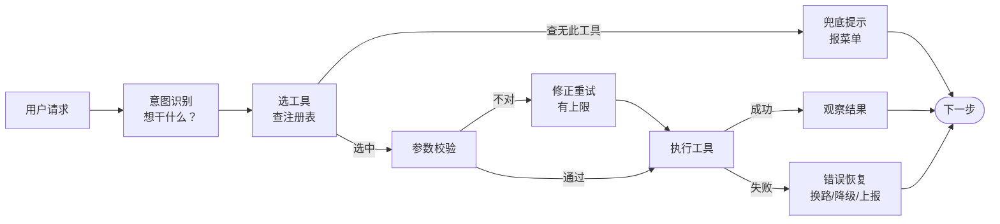

# 第 07 课　Tool Use：把工具用得靠谱

> 上一课我们把成套能力打包成了技能。但拆开任何一个技能，里面干活的还是一个个工具。工具是 Agent 的手脚——手脚不靠谱，脑子再好也白搭。这一课抠工程细节：怎么设计工具、怎么写描述、怎么调度、出错怎么办。

## 一、好工具是设计出来的

先看设计。给 Agent 配工具，像给新员工分派岗位：**一个岗位一件事**。把"查天气、发邮件、写文件"塞进一个叫 `do_task` 的万能工具，模型每次都要猜你到底想干啥——猜错率自然高。拆成三个单一职责的工具，选择就变成了明确的三选一。

第二条设计原则：**能撤销的动作要留后路，不能撤销的要设闸门**。查询类工具随便调，错一百次也没损失；删除、转账这类动作，设计时就要想好"调错了怎么补救"，没有补救办法的就该挡在权限后面——第 03 课的防线，落实到工具上就是这一步。

## 二、描述是写给模型看的"岗位说明书"

工具描述不是写给人看的注释，而是模型选工具的唯一依据。回忆第 03 章的 Function Calling：模型看不到工具的实现代码，只看得到 name、description、parameters 这三样——说明书含糊，选错工具、传错参数就是必然结果。

```json
{
  "name": "get_weather",
  "description": "查询指定城市当前天气。输入城市名，返回温度区间与天气状况。",
  "parameters": {"city": "字符串，如'北京'"}
}
```

写描述有个笨但有效的检验法：**把说明书给同事看，只凭文字回答"什么场景该用它、要传什么"，答不上来就重写**。"查数据"算不上描述，"查询指定城市的当前温度与天气状况，城市需用中文全名"才是一份能用的说明书。

## 三、调度：从"用户一句话"到"工具跑起来"

一次完整的工具调用长这样：



选工具这步有个 Python 小技巧：用 `dict.get` 而不是先 `if name in tools` 再取——`TOOL_REGISTRY.get(name)` 查不到时返回 `None`，顺手就能走兜底分支，一行代码把"菜单上没有"接住。**重试必须带上限**：参数错了修正一次再试可以，无限重试只会烧 token 也烧钱——`MAX_STEPS` 安全阀在这里换了个马甲继续站岗。

## 四、错误恢复：出错了不等于完蛋

工具会坏、参数会错、网络会断，把失败当正常输入来设计，才是工程做法。失败后先分类，再选恢复策略：

- **参数错**（比如少传了城市）：修正参数重试一次；
- **工具内部出错**（除零、查无此城市）：别傻重试，换条路——换个工具、用离线数据兜底，或老老实实告诉用户"我查不到"；
- **权限不足**：停下来上报用户，绝不自作主张绕过。

配套的 `tool_use_demo.py` 把这三幕全演了一遍：先调一个不存在的工具看 `get` 兜底怎么报菜单；再给计算器喂一个除零看"不重试、换策略"；最后看缺参数时"修正一次再试、最多两回"。跑一遍你就懂了：错误恢复的每一步，都是第 01 课"观察"环节在做功。

## 五、离线跑 tool_use_demo.py

纯标准库、零依赖。注册表里三个工具（计算器、离线天气、字符串统计），脚本按"尝试→失败原因→恢复动作→结果"打印每一次调度。看完这张日志，回头再看任何 Agent 框架的源码，核心都是这几行字。

工具的活儿干细了，还有最后一个天花板：**再能干的员工也有独自扛不动的活**。把多个 Agent 组队分工、互相交接，就是下一课的主题，也是全章的最后一课——Multi-Agent 协作。

## 想一想

1. 用"岗位说明书"给同学解释：工具描述里哪一句最影响模型选对工具？为什么？
2. `dict.get` 的兜底和"先判断再取值"效果一样，你更喜欢哪种写法？说说理由。
3. 除零错误为什么不该"修正参数再重试"，而该换策略？什么错误才值得重试？
4. 轻动手：给 `tool_use_demo.py` 的注册表加一个"字符串长度"工具，然后故意少传参数，观察"修正重试"环节怎么接住它。

## 小结

工具设计守两条：一个工具一件事，危险动作设闸门。描述是写给模型的岗位说明书，含糊必被选错。调度链路是：意图识别→查注册表（`get` 兜底）→参数校验→执行；重试必须带上限。错误恢复先分类再出手：参数错可修正重试，工具坏了换路或降级，权限不足上报用户。

---

2026 年 10 月
