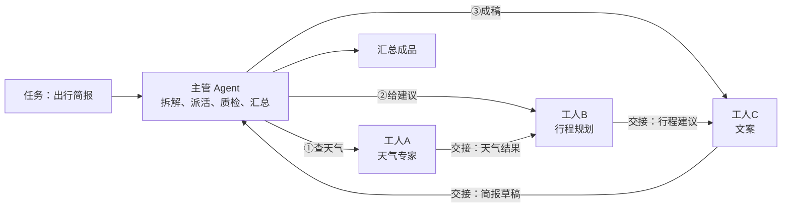

# 第 08 课　Multi-Agent：多个智能体协作

> 上一课我们把工具的活儿干细了。但再能干的员工也有独自扛不动的活——这一课讲怎么让 Agent 组队分工，也是全章的最后一课：学完协作模式，我们再手写一遍核心循环，把整章收进口袋。

## 一、一个人的公司：单 Agent 的天花板

你一个人开公司，谈客户、做方案、写代码、记账全自己来。单子少时运转得还行；单子一多就露馅：脑子（上下文窗口）被塞满、样样都会但样样不精、活儿只能一件件排队干。单 Agent 就是这家"一个人的公司"——任务一复杂，要么上下文装不下，要么一个环节出错全线返工。

解法和现实里一样：**招人，成立团队**。这就是 Multi-Agent（多智能体）系统：把复杂任务拆开，分给各有专长的 Agent，再把结果汇拢。

## 二、主管-工人模式：项目组里最常用的编队

Multi-Agent 有好几种队形，最常用也最好懂的是**主管-工人（Supervisor-Worker）**，像软件公司的项目组：主管不亲自写代码，负责拆任务、派活、盯进度、质检、汇总；工人各守一门手艺，做完交"成品 + 一句交接说明"。



两个关键词值得单独记：**分工**是按专长切活儿——谁擅长什么就干什么，工人 A 只管天气，绝不去写文案；**交接（handoff）**是上下一个 Agent 接力——上一棒把成品和"注意事项"递给下一棒，像医院转科时附带的病历。配套脚本 `multi_agent_demo.py` 把这套流程离线演了一遍：主管拆任务、按专长派活、工人串成一条链；天气员失手时主管换备用数据源重派，两路都失败就如实上报，最后汇总成品。

## 三、框架选型：套路学会了，工具随你挑

知道你会问：真项目里总不能全手写，现成框架怎么挑？截至 2026 年，主流的几款各有定位：

| 框架 | 一句话定位 | 什么时候用它 |
|------|-----------|-------------|
| LangChain v1.x | 组件最全的通用框架，`create_agent` 一行建 Agent | 通用首选，生态资料最多 |
| LangGraph | 画流程图做编排（第 04 课的主角） | 流程复杂、要分支/暂停/恢复 |
| OpenAI Agents SDK | OpenAI 官方轻量框架 | 全家桶用户、快速起步 |
| CrewAI | 角色扮演式团队协作 | 就是冲着主管-工人来的 |
| AutoGPT | 目标驱动、高度自主 | 自动化长任务 |
| MetaGPT | 模拟软件公司分工 | 软件开发类任务 |

选型逻辑三句话：流程复杂先上 **LangGraph**；要多 Agent 组队看 **CrewAI**；都不确定就从 **LangChain** 起步——它的 Agent 入口在 v1.x 已统一为 `create_agent`，你可能在旧代码里见到的 `AgentExecutor` 已被移入 classic 包，会认就行。另有一条 2025 年后的新脉络：框架之外协议在统一——MCP 管"连工具"，Google 推的 A2A 协议管"连 Agent"，学了这些，框架再怎么换你都不慌。框架只是你手写循环的"精装修版"，**套路才是自己的**。

## 四、全章收束：再手写一遍核心循环

第 01 课你手写过"思考-行动-观察"。走完这一章，我们带着新家底再写一遍——这次的循环，每一行都有这一章的影子：

```python
TOOLS = {                      # 第 07 课：工具注册表 + 描述
    "天气": lambda city: f"{city}晴，22℃",
    "加法": lambda a, b: a + b,
}

def run(goal, max_steps=5):
    history = []                                   # 第 02 课：记忆
    for _ in range(max_steps):                     # 第 01 课：安全阀
        move = decide(goal, history)               # 思考：由模型来干
        if move is None:                           # 想完了，收工
            return history
        name, kwargs = move
        try:
            history.append(TOOLS[name](**kwargs))  # 行动+观察
        except (KeyError, TypeError) as e:         # 第 07 课：错误恢复
            history.append(f"出错了：{e}，换条路")
    return history
```

`decide` 是模型干活的位置——真实项目里它调一次 LLM；离线练习可以手写一个"查表替代模型"。对照第 01 课的 `agent.py`：骨架没变，变的是你**知道每一行通向哪里**——`TOOLS` 可以来自 MCP（第 05 课）或打包成技能（第 06 课），循环复杂到失控就画成图（第 04 课），一个人忙不过来就开分店（本课）。核心循环还是那个核心循环，你已经能把它从 20 行玩具撑到真实系统。

这一章到这儿就齐了。Agent 越能干，要记、要查的东西就越多——几十万条知识往哪放、怎么一秒捞出来？下一章我们走进向量数据库，给 Agent 建一座随取随用的图书馆。

## 想一想

1. 用"项目组"类比向朋友解释主管-工人模式：主管、工人、交接说明各对应什么？
2. 为什么说"框架只是手写循环的精装修版"？哪一课的内容对应框架里的"编排""记忆"？
3. 交接（handoff）时"成品 + 一句交接说明"缺了说明会怎样？联想到第 07 课的什么原则？
4. 轻动手：给第 01 课的 `agent.py` 加上本课的两样家底——`TOOLS` 注册表和 try/except 兜底，重跑一遍，体会循环的"进化"。

## 小结

单 Agent 像一个人的公司：上下文装不下、样样不精、串行慢。主管-工人模式让主管专管拆解派活汇总，工人各守一门手艺，靠交接把成品递下去。框架选型先问需求：要编排找 LangGraph，要组队看 CrewAI，通用起步用 LangChain 的 `create_agent`；协议层 MCP 连工具、A2A 连 Agent。最后手写一遍核心循环收束全章——骨架不变，每一行你都知道通向哪里。

---

2026 年 10 月
