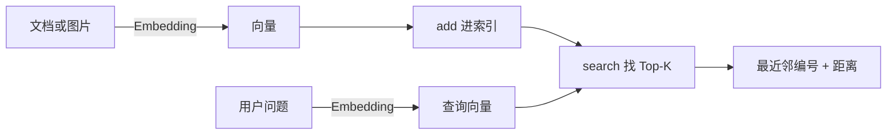

# 第 01 课　向量检索与第一个 FAISS 索引

上一章做 RAG 检索时，我们把文档变成向量，挨个算距离、挑最像的几条。当时库里最多几十上百条，暴力算一遍毫无压力。可真实的知识库动不动几十万条——每来一个问题就把全部向量算一遍？这一课我们正式面对这个问题：**海量向量里，怎么又快又准地找到"最像的那几个"**。

我们用的工具叫 FAISS，Meta（Facebook）开源的向量相似度搜索库。注意它是个**库**，不是数据库服务——装好就能用，最适合先把"向量索引"的直觉建立起来。

## 先逛一条美食街

想象你在美食街找"最像你昨晚梦到的那碗面"的摊位。最老实的办法：从头走到尾，每家都尝一口，记下最像的那家。

- 摊位少时，这办法又准又省心；
- 摊位多到几千家，你一天都吃不完——**准，但撑不住**。

这就是**暴力搜索**：所有向量挨个算一遍距离。它永远给出精确答案，时间却和数据量成正比，数据翻倍、时间翻倍。

## 暴力到底有多慢

算笔账：一条 128 维向量算一次 L2 距离要做 128 次乘加；100 万条向量就是 1.28 亿次乘加——这还只是**一次查询**。一天 10 万次查询？服务器先罢工了。

更麻烦的是"维度诅咒"：维度一高，点与点之间的距离都长得差不多，你连"哪边更近"都越来越难判断。所以高维检索这事，光靠"算得快"救不了，得换思路。

## 三种相似度：先说人话

**L2 距离（欧氏距离）**：两点连线的长度，越小越像。公式看着唬人，其实就是勾股定理的推广：每个维度相减、平方、加起来、开根号。适合"坐标位置接近才算像"的场景。

**内积（Inner Product）**：对应位置相乘再求和，越大越像。它既看方向又看"强度"，推荐系统爱用它——用户有多喜欢，这份热度也该算数。

**余弦相似度**：只看两个向量的夹角，不管长短。比如两个人聊球：一个是天天刷比赛的热情球迷，一个偶尔看看新闻——聊的**方向**一样，热度差很远。余弦说"像"，L2 可能说"不像"。

还有个关键换算：把向量**归一化**（长度缩放成 1）之后，内积就等于余弦。所以很多系统干脆"存之前先归一化 + 用内积"，两把尺子合成一把。

## ANN：抄近道的艺术

想在全城找"最像你的人"，不必面试 800 万人：先按城区筛、再按小区筛，最后小范围精挑。答案**未必**是全城唯一最像的，但快了几百倍，而且"够像"。

这个思路叫**近似最近邻**（ANN，Approximate Nearest Neighbor）：**用一点点准确率，换几十上百倍的速度**。FAISS 的 Flat 索引是不抄近道的精确版；下一课的 IVF、HNSW、PQ，全是不同风格的"抄近道"。

## 第一个索引：亲手查一次



对应 faiss_intro.py 里的核心三步（完整代码见配套文件）：

```python
import faiss, numpy as np

index = faiss.IndexFlatL2(dim)   # 建 L2 距离的 Flat 索引，参数是维度
index.add(xb)                    # xb：n 行 dim 列的 float32 矩阵，一行一个向量
D, I = index.search(xq, k)       # 每个查询返回 k 个：D 是距离，I 是编号
```

三个新手最容易栽的坑：

1. **向量必须是 float32**。用 `np.array(data, dtype="float32")` 转好再喂，忘了这步 FAISS 直接报类型错误；
2. `search` 返回的 `I` 是**位号**（第几个加进来的），不是你的业务 ID——怎么对上，下一课专门讲；
3. Flat 是**精确**搜索，量小先用它；后面所有"抄近道"的索引，都拿它当标尺来测准不准。

## 动手跑 🛠️

```bash
python faiss_intro.py
```

前半段是纯标准库手写的暴力最近邻（不装任何东西就能跑）：用"甜度、冰量"两个维度描述几杯饮品，亲手算距离找最近邻——你会看到"很甜但不加冰"的查询，L2 和余弦把不同的杯子排第一。后半段是真实 FAISS 的 Flat 索引；没装 faiss-cpu 也没关系，会中文提示优雅跳过。

## 想一想

1. 10 万条向量、每次查询全量算距离，一天要响应 10 万次查询——暴力搜索撑得住吗？按"每秒能算多少次距离"粗略估一下。
2. 把所有向量都归一化后，用 L2 排出的 Top-K 和用余弦排出的 Top-K 还会不一样吗？提示：想想"长度"还剩多少话语权。
3. 做推荐系统时，什么情况下你更该用内积而不是 L2？（提示：喜欢程度=方向+强度，你想让"强度"算不算数？）
4. 轻动手：把 faiss_intro.py 零依赖段里的查询向量改一改，让"热可可"变成 L2 最近邻——你调出了一杯什么口味的？

## 小结

- 暴力搜索永远精确，但时间随数据量线性涨，海量数据撑不住。
- 三把相似度尺子：L2 看位置、内积看方向加强度、余弦只看方向；归一化后内积=余弦。
- ANN 的思路：牺牲一点点准确率，换几十上百倍的速度。
- Flat 就是 FAISS 替你写好的暴力搜索：量小先用它，它还是衡量其他索引准不准的标尺。
- 记住两个坑：向量转 float32；返回的 I 是位号不是业务 ID。

Flat 虽准，百万级数据就是马拉松。下一课我们看三种"抄近道"的索引——先分堆、跳着找、压着存——它们分别叫 IVF、HNSW、PQ，该怎么选、旋钮怎么拧？

2026 年 10 月
