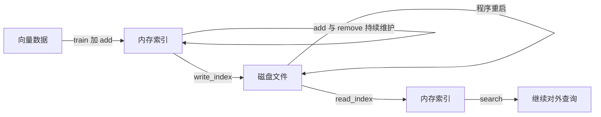

# 第 03 课　工程实践：增改、存盘与性能

前两课把索引建起来、查起来，像个新仓库开张。可过日子的问题马上就来：新货不断进、旧货要下架、晚上仓库还要锁门（程序重启）——第二天开门，货还在吗？这一课全是"过日子"的工程实践。

## 增量添加：随时上新

向量不是一次性到齐的。文档库今天新增 50 篇、明天下架 3 篇，索引得跟着变。

好消息：`index.add()` 随时能调，加完立刻能查。两个细节要注意：

1. **IVF 类索引必须先 train 再 add**。train 是让它看一批数据学出"堆心"，堆心没学，它不知道往哪堆放——Flat 和 HNSW 没这一步，拿来就加；
2. **攒批加比一条条加快**。一次 add 一万条，比一万次各加一条快得多——每次调用都有固定开销，跟批发和零售一个道理。

## 按 ID 管理：FAISS 不认识你的业务 ID

默认情况下，FAISS 只给向量编"货架位号"：第 0 个、第 1 个……search 返回的也是位号。可你的业务里每条向量有文档 ID、商品 ID，怎么对上？

两种办法：

- **自己对账**：拿一个列表存"位号 → 业务 ID"，查到位号后翻译一次。简单，但删数据时对账表要自己维护；
- **让 FAISS 记 ID**：用 `IndexIDMap` 把索引包一层，`add_with_ids(vec, [1001])` 直接存业务 ID，search 返回的也是它，还能 `remove_ids` 按 ID 删除。

打个比方：快递柜。位号是"第 3 排第 5 格"，快递单号是你的业务 ID——有的柜子只报格子号，`IndexIDMap` 相当于给柜子装上了"扫码取件"。

## 存盘与加载：关机不丢

内存里的索引，程序一退就没了。重建一次？百万级数据 train 加 add 又要等半天。FAISS 的应对就两句：

```python
faiss.write_index(index, "my_index.faiss")   # 存盘
index = faiss.read_index("my_index.faiss")   # 读回，train/add 的成果全在
```

**IVF 的堆心、HNSW 的图、PQ 的码本全都跟着走**——读回来直接能查，不用重 train。这也是"训练成果要存盘"的原因：建索引贵的不是加数据，是那一趟 train。



## 数据量大时的几个实用直觉

- **分片**：单个索引太大，就拆成多个文件、多个索引，查询时分头查再合并结果——可以按数量切，也可以按业务切；
- **先粗筛后精排**：用近似索引（IVF / PQ）召回 Top-50，再用 Flat 对这 50 条精算距离排座次——快和准各取所长，RAG 里非常常见；
- **批量查询**：search 一次传一批查询向量，比一问一答省；
- **定期体检**：拿 Flat 当标尺测召回率。改了参数、换了索引之后必测，不靠感觉；
- **内存真的不够**：FAISS 还有把部分数据放磁盘的进阶方案，本书不展开，知道有这条路即可。

注意这些**没有写死的数字**：多少条该分片、Top-K 取多大，都跟你的内存预算和延迟要求有关。这里给的是直觉，数字要拿自己的数据测。

## 动手跑 🛠️

```bash
python faiss_practice.py
```

零依赖段用纯标准库模拟一个"向量仓库"：加向量、按 ID 删、搜最近邻，然后**存盘到临时文件、读回来验证数据一条不少**——这一课的核心动作整个走一遍。真实 FAISS 段（没装库会中文提示跳过）用 IndexIDMap 演示 add_with_ids、remove_ids 和 write_index / read_index。

## 想一想

1. 程序重启后 Flat 索引还在内存里吗？让它"复活"的最省事办法是什么？
2. 你用自己的对账字典管业务 ID，现在删掉位号 5 的向量——后面的位号会往前挪吗？这对对账字典意味着什么？（跑跑 faiss_practice.py 验证你的猜想）
3. 每隔 5 分钟进来 1 万条新向量，一条条 add 还是攒一批？各自的损失在哪？
4. 轻动手：给 faiss_practice.py 的仓库加一个 update(id, vec) 方法——底层用"先删后加"实现，想想这对对账表有什么影响。

## 小结

- 增量添加随时可做，IVF 类要先 train；攒批加远快于逐条加。
- FAISS 默认只有位号：业务 ID 要么自己对账，要么用 IndexIDMap 的 add_with_ids。
- write_index / read_index 让训练成果关机不丢，读回即用。
- 大数据的四板斧：分片、粗筛加精排、批量查询、定期测召回。
- FAISS 是把快刀，但持久化、增删改查服务、并发访问都得自己搭。

到这里，FAISS 你已经会用也会保养了。但它终究是个**库**：服务、持久化、多程序同时访问，全要自己搭。当你需要"起个服务就能查"的完整向量数据库时——下一章（第 8 章）我们**从库走向数据库服务**。

2026 年 10 月
