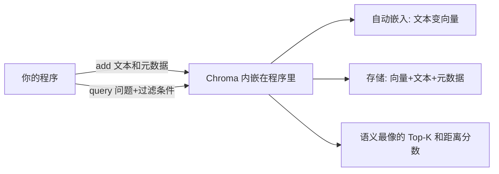

# 第 01 课　Chroma 最友好入门

上一章的 FAISS 是一把快刀：检索快、算法全，但它只是个**库**——索引活在程序内存里，程序一关数据就没了；想按"分类、来源"筛选？得自己写代码。这一章我们升级：走进完整的**数据库**。第一个登场的是出了名好上手的 Chroma。

如果 FAISS 是一套专业刀具，得自己掌握火候；Chroma 更像一台电饭煲——米放进去、按下按钮，饭就好。它是"嵌入式"数据库：不另起服务进程，直接嵌在你的 Python 程序里运行，就像手机的内置电池，不用外接电源也能跑。

## 三个核心名词，一张图看懂

Chroma 的世界只有三层，用 Excel 就能类比：

- **集合（Collection）**≈ 一张工作表：比如"菜谱"集合、"法律条文"集合。
- **文档（Document）**≈ 表里的一行：一段文本。
- **元数据（Metadata）**≈ 行尾的标签列：{"分类": "美食", "来源": "妈妈的手抄"}——专治"只要美食类"这种过滤需求。

最舒服的是**自动嵌入**：你只给文本，Chroma 内置的嵌入模型自动把文字变成向量（第 2 章第 05 课讲过的 Embedding，这里直接用现成的），不用先算好再喂。



## 增删改查：和 Excel 一样直观

真实代码长这样（需 pip install chromadb）：

```python
import chromadb
client = chromadb.PersistentClient(path="./chroma_db")   # 指定目录 = 数据落盘
col = client.get_or_create_collection("recipes")          # 拿集合，没有就建
col.add(ids=["1"], documents=["红烧肉要先焯水再炖"], metadatas=[{"category": "美食"}])
res = col.query(query_texts=["怎么炖肉"], n_results=2, where={"category": "美食"})
col.update(ids=["1"], documents=["红烧肉要小火炖九十分钟"])   # 改
col.delete(ids=["1"])                                       # 删
print(col.count())                                          # 数数
```

注意 `where={"category": "美食"}`——先按元数据缩小范围，再在里面找语义最近的。这正是上一章 FAISS 要自己造轮子的"元数据过滤"，Chroma 直接送你。

## 持久化：程序关了，数据还在

`PersistentClient(path=...)` 是本课最重要的一行。第 7 章 FAISS 的索引，程序退出即蒸发；Chroma 指定一个目录，数据自动写进硬盘，下次启动接着用。**"库"与"数据库"的分水岭就在这里：数据有没有独立于程序的生命周期。**

## 动手跑 🛠️

```bash
python chroma_demo.py
```

前半段是纯标准库：我们亲手造一个"迷你 Chroma"——集合、增删改查、元数据过滤、JSON 落盘重启读回，你会发现数据库的核心骨架小得惊人。后半段是真实 Chroma 段（没装库会中文提示跳过；为了离线可跑，演示时直接传向量，不走需联网下载的默认嵌入模型）。

## 本课的边界

Chroma 管的是"单机、嵌入式"这一档：一个人、几万条数据，非常称职。可当数据到千万级、要很多人同时读写、机器宕机还不能丢数据时，就需要真正"为大规模而生"的数据库了——下一位选手已经在热身。

## 想一想

1. FAISS 和 Chroma 都能做相似检索，"关机后数据还在"这个能力差在哪一步？
2. 给"图书馆管理系统"设计元数据字段，你会存哪几个标签？它们分别怎么帮你过滤？
3. 迷你版查询时"先过滤、再算相似度"，如果过滤后只剩 3 条，直接算是不是反而更快？什么情况下先过滤反而亏？
4. 轻动手：把 chroma_demo.py 的 where 条件改成只看"编程"类，结果和不过滤相比有什么不同？

## 小结

- Chroma 是嵌入式向量数据库：不另起服务，pip 装完就用。
- 集合≈表、文档≈行、元数据≈标签列；查询支持 where 过滤。
- 自动嵌入：只给文本，向量它自己算。
- PersistentClient 让数据落盘重启不丢——这是"数据库"的入场券。

## 下一课预告

Chroma 是舒适的家庭厨房，可数据涨到十亿条、几百人同时读写怎么办？下一课 Milvus——为大规模而生。

2026 年 10 月
