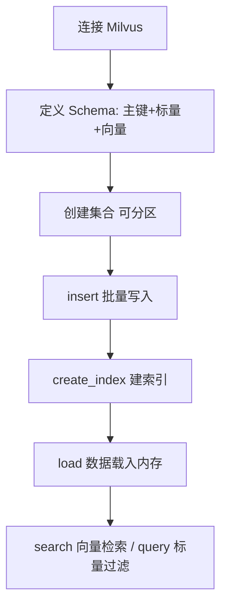

# 第 02 课　Milvus 为大规模而生

Chroma 舒服，但它是个"家庭厨房"：单进程、单机、你自己用。当向量到了千万、十亿级，要几百个人同时查、机器坏了不能丢数据——这就需要"中央工厂"。Milvus 就是这座工厂，专为大规模向量检索而生。

先记住它的三种形态，像同一家酒店的三种住法：

- **Milvus Lite**：pip 装完直接用，数据就是一个本地文件——和 Chroma 一样的嵌入式玩法，适合学习与原型。
- **Standalone**：一台服务器跑一个完整数据库，Docker 一行命令起服务，适合中小生产。
- **Distributed**：几十台机器组成的集群，分片加副本，十亿级向量也扛得住。

三者的 Python 代码几乎一样，差别只在连接地址：本地文件、服务器 IP、或云端 URL——学一次，三种规模都会用。

## 和 Chroma 最大的不同：先画图纸，再放数据

Chroma 随性：add 时想塞什么塞什么。Milvus 严谨：**建集合前先定义 Schema（图纸）**——每一列叫什么、什么类型、向量多少维，事先全部定死。就像中央工厂收货前必须先登记：几号仓、什么规格。看似麻烦，实则是海量数据不乱的根基。

字段通常三类：**主键**（唯一身份证）、**标量字段**（文本、数字、标签——负责过滤）、**向量字段**（负责语义检索）。



## 分区：把大仓库分成小车间

百万条数据里只想搜"美食类"？Milvus 让你**按规则把集合分成多个分区（Partition）**，查询时直接指定分区，不用扫全库——像图书馆按楼层分大类，找烹饪书直奔三层，文学区看都不看。写入时按类别分仓，查询时按需进仓，两边都省力。

## 服务化的代价与回报

Milvus 是独立的**服务**：你的程序通过网络连它，它管存储、索引、并发、备份。代价是"要安装、要运维"；回报是"多人同时读写、宕机有副本、数据量随便涨"。上一课说的分水岭，在这里变成了一堵高墙大院。

还有个小规矩：插入的新数据要等 `load()` 载入内存后才能搜——服务化数据库的"入库"和"上架"是两步。

## 动手跑 🛠️

```bash
python milvus_demo.py
```

纯标准库段：给迷你库加上三样 Milvus 特质——先定 Schema 再写入（字段不齐拒收）、按类别分区检索、不 load 就不让搜，亲眼体会服务化数据库的规矩。真实段用 Milvus Lite（需 pip install pymilvus，本地文件即服务，无需部署）；没装库会中文提示跳过，不影响主线。

## 本课的边界

有同学要问了：不想装新数据库，公司现成的 PostgreSQL 能不能查向量？能——下一课 PGVector，顺便用五分钟补一条 SQL 生存线。

## 想一想

1. Schema 先行 vs 随手 add：小项目你可能喜欢哪个？数据到一亿条时呢？
2. 分区和上一章 IVF 的"分堆"有什么本质不同？（提示：一个是存的时候就分开，一个是查的时候才分组）
3. Milvus Lite 和 Distributed 代码几乎一样，这个设计对你的学习路径有什么好处？
4. 轻动手：把 milvus_demo.py 的数据按两个分区存，比较"指定分区查"和"全库查"的搜索范围差多少。

## 小结

- Milvus 三形态：Lite 嵌入式、Standalone 单机服务、Distributed 集群。
- Schema 先行：主键+标量+向量字段，先图纸后数据。
- 分区按规则分仓，查询指定分区少扫数据；新数据要 load 后才能搜。
- 它是服务不是库：要部署运维，换来并发、副本与水平扩展。

## 下一课预告

不装新数据库、让 PostgreSQL 自己学会查向量——下一课 PGVector，外加五分钟 SQL 生存包。

2026 年 10 月
