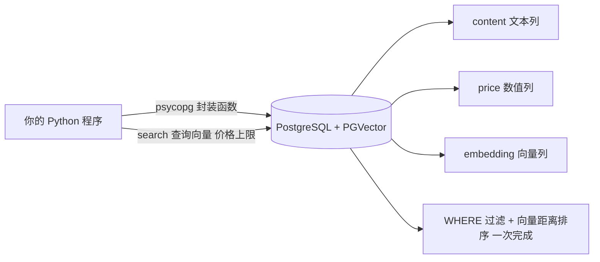

# 第 03 课　PGVector：在 PostgreSQL 里检索向量

前两课我们都在"新装数据库"。但现实里很多公司已经跑着 PostgreSQL（一款老牌开源关系数据库），再养一套专用向量库？运维多半摇头。PGVector 的思路是：**给老房子加装新功能**——给 PostgreSQL 装个扩展插件，让老表格也能存向量、搜向量。

对学习者它还有个隐藏好处：你会顺便见到 **SQL**——数据库世界的通用语。别慌，五条语句够本课用一辈子。

## 【SQL 最小速成】五分钟生存包

SQL 就是"你对数据库提要求的句子"，逐句看：

```sql
-- 1. 建表：定义有哪些列（embedding vector(4) 就是 PGVector 新增的向量列）
CREATE TABLE dishes (id serial PRIMARY KEY, content text, price numeric, embedding vector(4));

-- 2. 查询：SELECT 列 FROM 表 WHERE 条件
SELECT content, price FROM dishes WHERE price <= 50;

-- 3. 模糊匹配：ILIKE 不区分大小写地"包含某词"
SELECT content FROM dishes WHERE content ILIKE '%红烧%';

-- 4. 向量排序：<=> 算余弦距离，取最近的前 2 条
SELECT content FROM dishes ORDER BY embedding <=> '[0.1,0.2,0.3,0.4]' LIMIT 2;
```

`<=>`、`<->`、`<#>` 三个距离运算符分别对应余弦距离、欧氏距离、内积（取负方便排序）——第 2 章讲过的三种"像不像"，在 SQL 里变成了符号。更妙的是**混合查询**：`WHERE price <= 50 ... ORDER BY embedding <=> ...`——价格过滤和语义排序在同一条 SQL 里完成，这是很多专用向量库都要努力追的能力。

## 懒人福音：psycopg 零 SQL 用法

"我不想写 SQL！"——可以。Python 的 PostgreSQL 驱动 **psycopg**（2026 年主流是 psycopg 3，旧代码里 psycopg2 会认即可）配合 pgvector 官方适配包，能把 SQL 全藏进函数里：建表、插入、搜索都调封装好的方法，向量直接传 Python 列表，参数用 `%s` 占位防注入，一行 SQL 不用写。本课代码就是这么干的——上面的速成包只需"看得懂"，不需"天天写"。



## 动手跑 🛠️

```bash
python pgvector_demo.py
```

纯标准库段：模拟"一张表 + 结构化过滤 + 向量排序"。同一个需求走两条路——先看它等价的 SQL 长什么样，再用零 SQL 封装函数直接出结果，你会发现自己确实一行 SQL 都没写。真实段（需 pip install "psycopg[binary]" pgvector 和本机 PostgreSQL，连接串从环境变量 PG_DSN 读）连不上会中文提示优雅跳过，主线不受影响。

## 本课的边界

Chroma、Milvus、PGVector 三位都摸过了。你有没有注意到，它们的菜单上都写着 IVF、HNSW 这些名字？同一种原理为什么每个库都在用？下一课我们把向量索引算法一次讲透。

## 想一想

1. "价格 ≤ 50 且语义最近"一条 SQL 搞定——回看第 01 课 Chroma 的 where 过滤，它能做到完全等价吗？
2. 你公司 PostgreSQL 用了十年、同事都熟 SQL，新项目要加语义搜索，选 PGVector 还是再装 Chroma？给出两条理由。
3. psycopg 传参用 `%s` 占位符而不是把数值直接拼进字符串，防的是什么安全问题？
4. 轻动手：在 pgvector_demo.py 的封装函数里加一个"关键词过滤"参数，它对应 SQL 速成包里的哪一句？

## 小结

- PGVector = PostgreSQL 的向量扩展：老数据库，新能力，数据不搬家。
- SQL 生存四句：CREATE TABLE / SELECT / WHERE / ORDER BY ... LIMIT；ILIKE 管模糊匹配。
- `<=>`、`<->`、`<#>` 对应余弦、欧氏、内积三种距离。
- psycopg 封装可零 SQL 开发，但看得懂 SQL 才不慌。

## 下一课预告

三个库的索引菜单都写着 IVF、HNSW——下一课离开 FAISS，看这些算法如何成为所有数据库的通用操作系统。

2026 年 10 月
