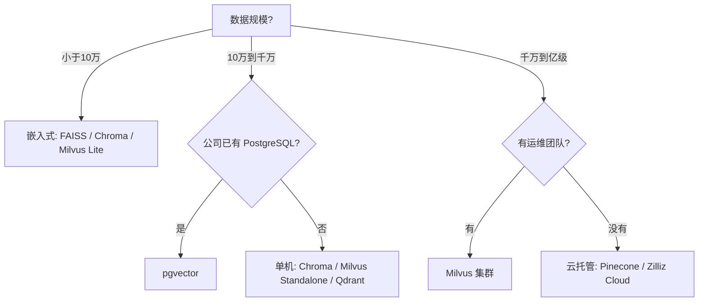

# 第 05 课　向量数据库选型

五课下来，工具箱里躺着一排家伙：FAISS、Chroma、Milvus、PGVector，外加满墙的索引算法。真到接项目那天，问题从来不是"哪个最强"，而是"**哪个和我的处境最合拍**"。这课给你一套"提问-打分"的决策法——像去租车：先想清楚拉货还是载客、跑山路还是高速、有没有司机执照，再谈车型。

## 五个问题，问完就有答案

1. **数据多大规模？**——千条级谁都行；十万级嵌入式够了；千万级要单机服务；亿级往上才真需要分布式集群。
2. **运维能力有多少？**——没有 DBA 就别碰自建集群；嵌入式或托管服务优先。这一条经常一票否决。
3. **已有家底是什么？**——公司 PostgreSQL 用了十年？pgvector 一步到位，数据不用搬家。
4. **功能要哪些？**——元数据过滤、混合查询、事务、多租户，各家长短板不同。
5. **预算怎么算？**——开源免费但要养机器养人；托管省心但按量付钱。

## 一张决策地图

主流玩家按形态分四类：**嵌入式**（FAISS、Chroma、Milvus Lite，随应用走）、**单机服务**（Milvus Standalone、Qdrant）、**分布式集群**（Milvus 集群）、**云托管**（Pinecone、Zilliz Cloud）。规模升一档，形态换一类——自由度递减、省心度递增，钱和人力花在哪儿也跟着变。



这张地图是起点不是终点：同一格里的候选，再按运维、家底、功能、预算四问逐一筛选，剩下的就是你的答案。

## 动手跑 🛠️

```bash
python vector_db_selection.py
```

纯标准库决策器：把五个问题变成打分项，内置六位候选（FAISS / Chroma / pgvector / Milvus Lite / Milvus 集群 / 云托管），跑三个真实场景——个人 RAG 玩具、已有 PG 的中型知识库、亿级推荐系统——看赢家和理由怎么随处境变化。改改场景参数，让它替你的项目出主意。

## 本课的边界与一条回头路

选型不是终点。真项目里，**向量库里装什么、向量从哪来**，往往比"用哪个库"更影响效果：回头看你第 5 章 mini_rag 切的 chunk、选的 embedding，再想想第 9 章讲的数据清洗——原料的干净程度决定检索的上限，数据库只是个好厨房。学完本章，不妨把当时那个小项目升级成"真数据库版"，亲手验证一遍今天的选型逻辑。

## 想一想

1. 五个问题里，哪两个在你当前的处境下最优先？为什么？
2. "开源免费但要养人" vs "托管付钱但省心"——团队 3 个人和 30 个人，答案会怎么变？
3. 已有 PostgreSQL 的团队选 pgvector，除了省一套数据库，还有什么隐藏收益？（提示：业务数据和向量住在同一个"小镇"上， join 起来方便）
4. 轻动手：给 vector_db_selection.py 加第四个场景——"初创团队、50 万条数据、无人运维"，看决策器推荐谁、为什么。

## 小结

- 选型问五件事：规模、运维、家底、功能、预算；规模先行，运维可一票否决。
- 四类形态：嵌入式、单机、集群、托管，规模升档形态跟着换。
- 算法通用、形态有别：你实际选的是"自由度与省心度"的配比。
- 库是好厨房，原料才是菜：数据质量决定检索上限。

## 下一站预告

库选好了，下一件大事是往库里装什么——向量从哪来、原料怎么洗净，正是第 9 章数据处理的主题；回头翻翻第 5 章的 mini_rag，你会看得更懂。

2026 年 10 月
