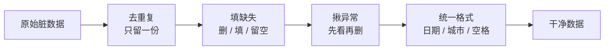

# 第 01 课　数据清洗与预处理

先说一个做菜的常识：一桌好菜，最花时间的往往不是下锅那几分钟，而是前面洗菜、择菜、切菜的功夫。买回来的青菜带着泥，鱼要刮鳞去内脏，肉要焯水去腥——这些活又脏又琐碎，但不做，再好的厨子也救不了这锅汤。

数据和这一模一样。从各种系统、表格、网页里扒出来的原始数据，十有八九是"带泥"的：有空格、有错字、有重复、有离谱的数字。直接喂给模型，出来的结果就是一锅怪味汤。这节课我们学的，就是 AI 行业里最古老、最枯燥、也最躲不开的手艺——**数据清洗**。

## 一、垃圾进，垃圾出

AI 圈有句老话：**Garbage in, garbage out**——垃圾进，垃圾出。模型本身没有"分辨是非"的能力，它只会老老实实照着你喂的数据总结规律。你喂它 1000 条评论里混着 200 条重复的差评，它就真的以为"差评占了五分之一"。

> 数据圈流传很广的一个说法：做数据的人，八成时间花在清洗上，两成才花在建模上。数字不必较真，但方向是真的——清洗就是大头。

所以清洗的目标很朴素：**让每一条数据都靠谱、唯一、格式统一**，模型才不会被带偏。行话也把这类活叫"预处理"——下锅前的全部备菜工序。

## 二、四类最常见的"脏"

我们拿一份用户登记表当例子（就是配套 `cleaning_demo.py` 里那份"故意弄脏"的小表），看看脏都藏在哪：

**1. 缺失值**——该填的格子空着。就像收作业，总有几个人没交：年龄是空的、城市是空的。处理思路有三条：缺得不多就整行删掉；删不得就"填"——数字列用平均数，类别列填"未知"；实在没辙就留着空，让模型自己知道这格是空的。

**2. 重复值**——同一条记录出现了两次。张三的信息一模一样存了两份，统计活跃用户时他就被数成两个人。处理最简单：只留一份。

**3. 异常值**——明显不对劲的数。有人 28 岁，有人 999 岁。像体检单上有人身高填了 3 米 8，第一反应是"笔误吧"。但要留个心眼：绝大多数是错的，可偶尔也有真实存在的极端情况（比如真有月消费十万的大客户），所以揪出来之后要**先看再删**，不能一刀切。

**4. 格式不统一**——同一个东西有好几种写法。北京被写成"北京"、"beijing"、"BJ "；日期一会儿"2026-01-05"，一会儿"2026/01/06"，一会儿"05-01-2026"。就像同一个人在你的手机通讯录里被存成三个名字，找人时永远对不上。处理：定一个标准格式，全部归一。

四类问题的处理顺序，一张图看清：

顺序不是死的，但去重放在前面，后面的活能少算很多重复行，一般划算。

## 三、动手：四板斧洗一遍

配套的 `cleaning_demo.py` 用纯 Python 标准库（不用装任何东西）把上面四步各写了一遍，每一步都先打印"洗之前"、再打印"洗之后"。你跑一遍，重点看三处：

1. 去重用的是"整行内容做指纹"的思路——把一行的所有字段拼成一个元组当钥匙，第二次见到同一个钥匙就扔；
2. 填缺失用的平均数，是**只用没缺、又不离谱的行算出来的**——缺的行不能参与计算，999 这种笔误混进去，平均数会被从 28 带到 270；
3. 揪异常用的是最朴素的"常识区间"判断：年龄超出 0～120 就算异常。真项目里常用更讲究的统计方法（比如 IQR 四分位距），但道理一样——先划个合理范围，再逐条过目。

文件后半段还有一段 pandas 的对照写法（`pip install pandas` 装好后才能跑）：同样这四件事，pandas 用 `drop_duplicates()`、`fillna()` 一行顶我们十行。工具会进化，思路不会变——这就是先手写一遍的意义。

## 四、清洗的三条行规

老手都守这几条，你从第一行代码就照做，以后不吃亏：

- **先备份原始数据**。清洗动作全部落在副本上，原始数据永远不动。万一某一步洗坏了，随时能退回来重来。
- **每一步都留痕**。删了几行、填了几个空、抓到几个异常，都打印或记下来。别小看这个习惯——出了问题时，它是你唯一的"行车记录仪"。
- **别追求一次洗到位**。先粗洗（明显的重复、空值、格式），看一眼数据长什么样，再决定要不要细洗。边洗边看，比憋一个大而全的脚本靠谱得多。

## 想一想

1. 一列年龄有 5% 的格子是空的：整行删除和用平均数填，各适合什么情况？（提示：想想这列对结果有多重要、删除会不会把别的有用信息也丢掉）
2. 异常值一定是错的吗？举一个"你舍不得删"的异常值场景。
3. 为什么"先备份原始数据"是铁律？想象你把一整列出生日期误填成了平均数、又没有备份——接下来会发生什么？
4. 轻动手：往 `cleaning_demo.py` 的脏表里加一行 `{"name": "周八", "age": -5, "city": "北京", "signup": "2026-01-09"}`，再跑一遍，看看揪异常那一步能不能把它抓出来。

## 小结

- 垃圾进，垃圾出：数据质量决定模型效果的上限，清洗是最花时间、最躲不开的一环。
- 四类最常见的脏：缺失、重复、异常、格式不统一，各有各的处理套路。
- 异常值先看再删，别一刀切；缺失值要填的话，填充值必须用"没缺的数据"算出来。
- 先备份、留痕迹、边洗边看，是清洗的三条行规。
- 清洗完的数据只是"能用的原料"——下一课，我们把它加工成模型真正爱吃的"饲料"。

---

2026 年 10 月
