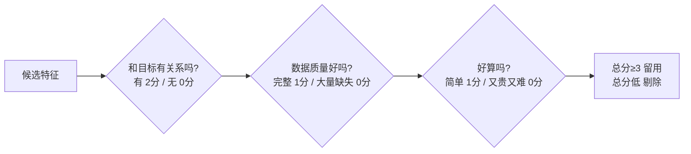

# 第 02 课　特征提取与选择

上一课我们把数据洗成了"干净的原料"。但原料还不能直接下锅——模型吃的是一种叫"特征"的东西。这节课就讲两件事：怎么把原始信息**变**成特征（提取），以及特征太多时怎么**挑**出真正有用的那几个（选择）。

## 一、什么是特征：模型眼里的"体检指标"

去医院体检，医生不会看你这个人本身，而是看一张化验单：身高、体重、血压、血糖……每一项都是把你这个人"压缩"成的一个数字。模型也一样——它看不懂一个活生生的用户，只看得懂一串数字，而**每一个数字，就叫一个特征（Feature）**。

所以特征提取，就是回答一个问题："**要描述这个东西，我该量它哪几个指标？**"量错了指标，再聪明的医生（模型）也会误诊。

> 顺带说一句：到了大语言模型时代，Embedding 接过了"把原始东西变成一串数字"的活儿（第 2 章第 05 课讲过 Token 与 Embedding 的直觉）。但今天这一课的手艺没有过时——它教的是"该量哪些指标"的判断力，这件事 LLM 替不了你。

## 二、提取：把一段原始信息"拧"出指标来

举例最直观。一行原始数据是 `"2026-01-08 14:32, 用户在上海下单了3单"`，模型没法直接吃。我们把它拧成几个数字：

- 注册年数：`1`（2026 减 2025）
- 订单数：`3`
- 收货城市：`上海` → 拆成 `city_上海=1, city_北京=0`（类别变数值，行话叫"编码"）

原本一段没法下咽的文本，变成了 `[1, 3, 1, 0]` 四个干净的数字。这就是特征提取：**从原始信息里造出对"预测目标"有帮助的指标**。

选指标的诀窍只有一个：先想清楚你要预测什么。预测"会不会流失"，下单频率、最近一次登录天数就是好指标；预测"会不会买母婴产品"，家里有没有小孩这种指标就金贵。指标跟着目标走，不是越多越好。

## 三、选择：指标太多也是病

有人会想：那我多量几百个指标，总有一个有用吧？恰恰相反。特征太多，就像让医生参照一张 500 项的化验单看病——里面塞着大量无关项（鞋码、发际线），医生反而被带偏。这在行话里叫**过拟合**的一种来源：模型记住了无关特征的巧合，而不是真规律。

所以要做"特征选择"：把没用、甚至添乱的特征请出去。最朴素的一招是**手工打分**——给每个特征问三个问题，逐个打分：

三个问题分别对应行话里的三件事：**相关性**（它和目标有关吗）、**可用性**（数据本身靠谱吗）、**成本**（拿到它划不划算）。配套 `feature_demo.py` 就是这么干的：给每个特征打分，把"用户ID、手机尾号"这类和流失毫无关系的添乱列剔出去。真项目里还有自动的统计方法（行话叫过滤法/包装法/嵌入法，各自靠谱程度不同），但第一反应永远应该是先用脑子筛一遍——很多垃圾特征根本用不着跑算法，看一眼名字就知道。

## 四、动手与两条提醒

`feature_demo.py` 用纯标准库（零安装）演示了完整流程：一份"用户流失"小表 → 手工打分 → 剔除添乱列 → 打印留下哪些特征；后面还有一段 pandas 对照（`pip install pandas` 才能跑）。

两条容易踩的坑，提前给你：

- **打分标准要在看数据之前定好**。如果先看了结果再定标准，就等于"先判案再找证据"，打分会不自觉地向结论倾斜。
- **别急着删"暂时没用"的特征**。有些特征单独看没相关性，和别的特征组合起来才有用（比如"性别"单独没用，"性别×最近购买品类"可能很有用）。拿不准就先留着，等模型表现说话。

## 想一想

1. 预测"这单外卖会不会超时"，你会量哪些指标？至少想 4 个，并说明每个和"超时"的关系。
2. "用户手机号"为什么几乎总是要剔除的特征？（提示：想想它和任何目标都无关，还几乎每行都不同）
3. 某特征 80% 的格子是空的，但剩下的 20% 和目标强相关——留还是删？你的依据是什么？
4. 轻动手：给 `feature_demo.py` 的候选特征表加一行"注册渠道"，按打分三问给它打分，看它值不值得留。

## 小结

- 特征就是把现实事物压缩成模型能吃的指标；提取=造指标，选择=挑指标。
- 提取的诀窍：指标跟着预测目标走，先想目标再定指标。
- 特征不是越多越好，无关特征会把模型带向过拟合。
- 手工打分三问（相关吗/数据好吗/好算吗）是第一道也是最便宜的筛子。
- 有了干净又挑好的数据，还是嫌少怎么办？下一课讲"合理地变出更多数据"。

---

2026 年 10 月
