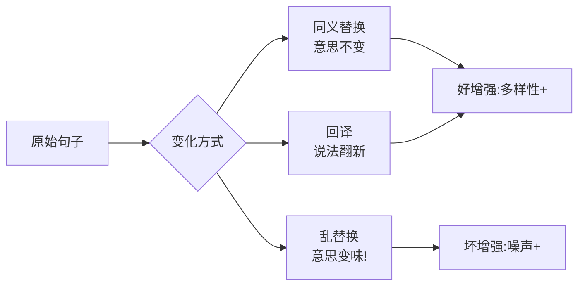

# 第 03 课　数据增强技术

洗好的数据、挑好的特征，摆在一起一看：就 100 条。模型这么"贪"，100 条哪够喂？买新数据又贵又慢。这节课讲一个变通办法：**数据不够，就合理地"变"出更多**——行话叫**数据增强**。

## 一、增强的直觉：同一件事，换个说法

先看一个生活里的场景。你教小孩认"狗"这个字：给他看一张卡片不够，你会换不同姿势、不同花色的狗，卡片字体一会儿打印体一会儿手写体。孩子因此学到的是"狗"的本质，而不是死记那一张卡片。

数据增强干的就是这件事：**在手头数据上做"不改变含义的小变化"，让模型见过更多世面，从而学到本质而不是背答案**。变化后的每条数据，对模型来说都算一条新样本——数据量就这么"无中生有"了。

图片领域这套玩得最熟：照片转个身、翻个面、调亮调暗，狗还是狗。我们最关心的文本，常用招数是这几个：

| 手法 | 做法 | 一句话点评 |
|------|------|-----------|
| 同义词替换 | "很好"→"不错" | 最简单，本课就实操这个 |
| 回译 | 中文→英文→再翻回中文 | 表达变丰富的常用招，但要靠翻译工具 |
| 随机删词/换序 | 偶尔去掉个把词、调个语序 | 轻度提鲁棒性，下手必须轻 |

## 二、动手：一个小词典替换增强

配套 `augment_demo.py` 用纯标准库（零安装）搭了一个迷你增强器：一份小同义词词典（"很好→不错""今天→今日""高兴→开心"……），扫描句子里命中的词就替换，增强前、后各打印一遍。跑一遍你会看到："我今天很高兴" 变成了 "我今日很开心"——意思没变，说法变了。

但同一个脚本里，我还故意藏了一个**反例**：不看语境的"乱替换"会把句子改坏。比如"这个客服服务不好"里的"好"被词典替换成"优"还算走运，可要是把"这家店价格不高"里的"高"换掉、或把否定词附近的结构替换乱，句子意思就完全反了。**增强是把双刃剑：换得好是加多样性，换得差是造噪声**——这正是大纲反复强调的边界。

## 三、增强的三条边界

把"什么时候能增强"钉死，比记手法更重要：

- **语义不能变**。增强后的句子必须还是原来那个意思、原来的标签。情感标注是"好评"的句子，增强完必须还是好评。
- **下手要轻**。一句 20 字的话替换五六个词，就快不成句子了。通常一篇里换一两处意思最稳的词就够了。
- **抽检**。增强是程序在批量干活，人必须抽着看。程序自己说"替换成功"不算数，你得亲眼确认没改坏。

还有个常见误区提前排雷：增强变出来的样本和原样本高度相似，**它们只能进训练集**。要是原句和增强句一个在训练集一个在测试集，那测试成绩就是作弊得来的——模型等于提前见过考卷。

## 想一想

1. 情感分类任务里，"这个手机太差了"被替换成"这个手机太糟了"，标签不变；但如果把"不"字替换掉了，会发生什么？
2. 回译为什么能变出新表达？（提示：想想"中文→英文→中文"两趟翻译，每趟都会"走样"一点）它可能带来什么副作用？
3. 数据从 100 条增强到 10000 条，模型效果会一直涨吗？什么时候该停？
4. 轻动手：往 `augment_demo.py` 的词典里加一组你自己的同义词，并构造一个"会被它改坏"的句子，验证程序的反例检测。

## 小结

- 数据增强=在不改变含义的前提下做小变化，让模型见多识广不背题。
- 文本常用三招：同义替换（最简单）、回译（最出花样）、轻删轻换（最要小心）。
- 三条边界：语义不变、下手轻、人工抽检；乱增强=往训练集里倒垃圾。
- 增强样本只能进训练集，混进测试集就是作弊。
- 手工增强的产能终归有限——下一课，我们把"造数据"这件事交给大模型，产能直接上一个量级。

---

2026 年 10 月
