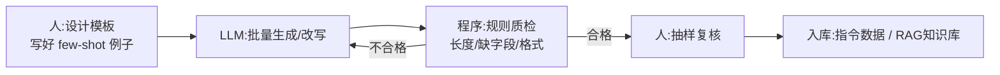

# 第 04 课　LLM 数据工程

前三课我们把"手工时代"的数据手艺过了一遍：清洗、挑特征、做增强。但手工造数据有个天花板——一天撑死几百条，而微调一个模型动辄要几千上万条。这节课，我们把产能问题交给大模型本身：**让 LLM 批量造数据、改数据、查数据**。这也是 2026 年做 AI 的日常工作方式。

## 一、LLM 造数据的正确姿势：流水线，不是许愿

新手最容易犯的错，是打开聊天窗口说"帮我生成 1000 条客服数据"——出来的是一千条长得一模一样的水货。行家的做法是把 LLM 嵌进一条**流水线**：人定好模板和规则，LLM 负责批量填肉，程序负责质检，人最后抽检。一句大白话概括分工：

> **LLM 干批量脏活，人定规则、做抽检。**

三个角色缺一不可：没有模板，生成内容天马行空；没有程序质检，错误会批量复制；没有人工抽检，"看起来对、实际错"的数据会静静躺在库里毒害模型。

## 二、造什么：指令数据和 RAG 数据

大模型时代要造的数据主要有两大类，我们分别看：

**第一类：指令数据（Instruction Data）**。微调用的"题库"。每条长这样：`{"instruction": "把这句客服话术改得更友好", "input": "已经说三遍了，自己看说明书", "output": "好的，我一步步带您看～"}`——指令说要干什么、输入是什么、期望输出长什么样。你在第 2 章第 09 课（模型微调）见过它的用途：**微调就是拿这批"题目+标准答案"去调教模型**。造法通常是"人写 10 条种子例子 → LLM 照着批量扩写到几千条 → 质检去重 → 人抽检"。种子例子的质量决定扩写质量，这就是为什么模板和 few-shot 由人写。

**第二类：RAG 知识数据**。给知识库"喂饭"。流程你不会陌生：文档加载 → 切块（chunking）→ 向量化入库——这正是第 5 章 RAG 那一课搭过的 Pipeline。LLM 在这里能干什么？三件事：把扫描版文档里的乱码整理成干净文本；给每一块**生成摘要和标题**（检索时更准）；从文档里**反出练习题**（一鱼两吃，既当指令数据又当检索测试题）。

**一个常被忽略的常识**：这两类数据的质检标准不同。指令数据怕"答案错"（要人抽检语义）；RAG 数据怕"切块烂"（要检查块长、断句、字段完整），后者程序能自动查得多——这正好接上一课"质检交给规则"的思路。

## 三、动手：离线版流水线

配套 `llm_data_demo.py` 用纯标准库模拟了一条最小流水线：**批量模板生成**（种子模板 × 多个槽位值，程序化造出指令数据）+ **规则质检**（长度超没超、关键字段缺没缺、输出是不是空转），不合格的当场拦下打印原因。这段零依赖、本机真跑——你把其中的"模板生成器"想象成 LLM 调用，就是真实流水线的形状。

真实调用 LLM 的批量段也在文件后半部分（需 `pip install openai` 和 API Key，本讲义未实跑）：结构一模一样，只是"生成"这一步从模板换成了 `client.responses.create(...)`。Key 一律从环境变量读，程序里没有任何硬编码密钥。三条经验写在注释里，这里先剧透：控制好并发别打爆限额；温度调低一点输出更稳定；每条都让程序先过质检再落盘，**绝不盲目信任 LLM 的输出**。

## 四、数据闭环：本章的收束点

四课连起来看，是一条完整的食物链：

- 第 01 课清洗，保证原料干净；
- 第 02 课挑特征，保证模型吃得对症；
- 第 03 课增强，不够时合理加量；
- 本课用 LLM 放大产能，批量造出指令数据和 RAG 数据。

而造好的数据有两个去处：**指令数据回流到第 2 章的模型微调**，去调教模型的行为；**RAG 知识库回流到第 5 章的 RAG 系统**，去支撑检索问答。数据造得越好，那两个系统表现就越强——垃圾进垃圾出的另一面，就是**好数据进，好结果出**。这一章没有酷炫的模型，但它是模型能酷炫的前提。

## 想一想

1. 用 LLM 批量生成指令数据时，为什么要先人工写 10 条种子例子，而不是直接说"随机生成 1000 条"？
2. 程序规则质检能查出"输出太短""缺字段"，但查不出"输出事实性错误"。这道防线该怎么补？
3. 同一批文档，既想当 RAG 知识库又想出指令数据——哪些工序可以共用，哪些必须分开做？
4. 轻动手：往 `llm_data_demo.py` 的质检规则里加一条"output 必须以句号或感叹号结尾"，再跑一遍，看看哪几条会被拦下。

## 小结

- LLM 造数据的分工：人定模板和规则，LLM 批量填肉，程序质检，人抽检。
- 指令数据（instruction/input/output）喂微调，RAG 数据喂知识库；造法不同，质检标准也不同。
- 永远不盲目信任 LLM 输出：程序规则先拦一道，人工抽检收最后一道关。
- 造好的数据回流到第 2 章微调与第 5 章 RAG，完成数据闭环。
- 数据这条线到此收束：下一章，我们把训练好的模型真正跑起来、优化它——模型部署与推理优化见。

---

2026 年 10 月
