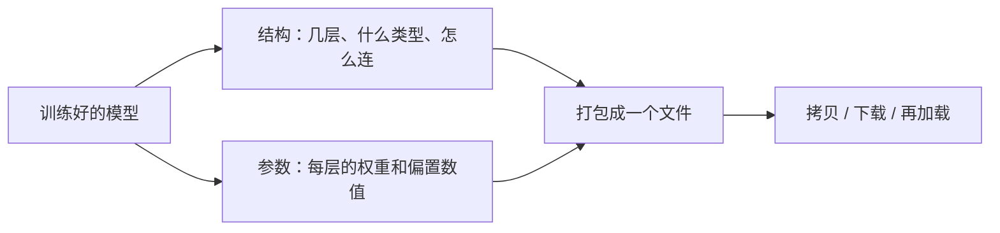
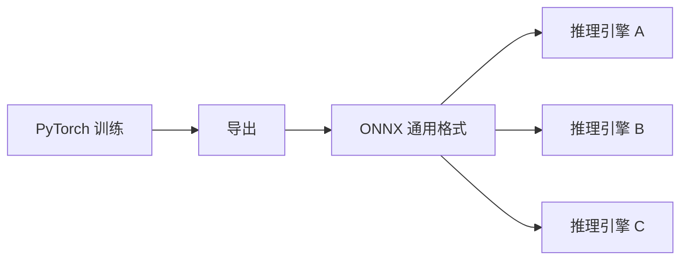

# 第 01 课　模型导出与格式转换

上一章收尾时，我们的模型刚刚训练完，还热乎地躺在实验室那台有显卡的电脑上。接下来的问题很现实：怎么把它搬到真正要用它的地方去？这一课我们不训练任何东西，专门讲"搬家"——模型文件里到底装了什么、为什么直接把代码发过去不行、部署时常见的几种格式是怎么回事。

---

## 一、拆开模型文件看看，里面装的是什么

先建立直觉。一个训练好的模型，拆开看其实只有两样东西。

**第一样是结构。** 这个网络有几层、每层是什么类型、数据从哪层流向哪层。它像一张装修图纸：墙砌在哪、门开在哪边，写得清清楚楚。

**第二样是参数。** 图纸上每个部件的"具体数值"。我们前几章反复打交道的权重和偏置，本质上就是几百万到几千亿个普普通通的数字——训练，就是把这些数字一点点调到合适。

PyTorch 里有个词叫 **state_dict**，你可以把它理解成模型的"行李清单"：一行一个部件名字，后面跟着这个部件的全部数值。保存模型，本质就是把这份清单写进硬盘；加载模型，就是照着清单把数字原样填回去。配套的 `model_export_demo.py` 第 1 段就用纯标准库模拟了这件事：把一个"模拟权重矩阵"存成 json 再读回，你会发现读回来的数字和原来一模一样，前向计算的结果也一模一样——这就是所有模型文件格式的共同骨架。

## 二、为什么不直接把训练代码发过去

你可能会想：模型不就在我的训练脚本里吗？把 .py 文件发给对方不就行了？

问题在于，训练脚本离开你的电脑就"水土不服"：对方得装一模一样的框架和版本、有一样的目录结构、甚至差不多的硬件环境。这就像你想请朋友尝你做的菜，结果把整个厨房连人带灶台搬过去——太重了。正确做法是**把菜做熟打包**：只交付"结构 + 参数"这个结果，谁来吃，只需要一个能加热的微波炉（推理环境）。

还有一层原因：部署现场常常根本不是 Python。手机 App、网页浏览器、嵌入式设备、C++ 写的后端服务……训练框架自带的保存格式是给训练流程用的，未必方便这些环境读取。

## 三、导出与转换：给模型办一本"通用护照"

于是就有了"导出"和"格式转换"这一步。最有代表性的通用格式叫 **ONNX**（Open Neural Network Exchange，开放神经网络交换格式）：把模型的结构和参数翻译成一套各家都认的通用写法，任何支持它的推理引擎都能加载运行。

它的角色很像旅行用的万能转换插头：你带去的电器（模型）是固定制式的，但配上转换头（ONNX），不同国家的插座（各家推理引擎、不同硬件）都能插。

为什么要多这一道手续？因为换来的是实打实的好处：

- **部署灵活**：一份通用格式，服务器、边缘设备、不同框架都能接。
- **速度提升**：专用推理引擎（下一课登场）会针对通用格式做深度优化，往往比直接用训练框架跑快不少。
- **成本下降**：跑得快、占用少，同一台机器就能服务更多请求。

当然，交换不是白来的：转换要花一次功夫，个别特殊算子可能转换失败要绕路，个别转换路径还可能带来微小的精度差异。记住这条主线，它将贯穿我们整章——**每一次优化，都是在"速度、显存、精度、成本"这四样东西之间做交换。**

顺手认识三个常见格式（名字不重要，骨架都一样）：

- `.pt` / `.pth`：PyTorch 自带的"行李清单"格式，训练圈最常见；
- `.safetensors`：只存参数、加载更安全省事的新格式，如今很多开源模型用它发布；
- `.onnx`：上面说的通用护照，跨框架部署的常客。

## 四、配套演示怎么跑

`model_export_demo.py` 分三段，建议按顺序跑：

1. **纯标准库段**：把模拟权重存成 json 再读回，并做前向计算验证"文件里的数字能原样复活"。零依赖，直接 `python model_export_demo.py` 就能跑。
2. **torch 段**：真用 PyTorch 保存和加载 state_dict。需要 `pip install torch`；没装也没关系，程序会打印一句中文提示并跳过。
3. **onnx 段**：把一个小模型导出成 ONNX 并读回检查。需要 `pip install torch onnx`，同样缺库优雅跳过。

重点看第 1 段的输出：导出的文件多大、里面有什么字段、读回后输出是否一致。torch 的 .pt 和 ONNX 的 .onnx，无非是这套骨架的工业级版本。

## 想一想

1. 模型文件里如果只有参数、没有结构，加载时会发生什么？反过来只有结构、没有参数呢？
2. state_dict 这个名字里的 "state"（状态），你觉得指的是模型的哪样东西？训练到一半和训练完的模型，state 有什么不同？
3. 假设你要把模型交给手机 App 团队，ONNX 这类通用格式帮上了什么忙？如果不转换、直接发 .pt 文件，会有什么麻烦？
4. 轻动手：运行 `model_export_demo.py`，打开导出的 json（或打印前几行），找到结构部分和参数部分各在哪个字段，数一数一共有多少个参数。

## 小结

模型文件 = 结构 + 参数：训练是把参数调好，部署是把这两样东西完整搬家。
直接发训练代码等于"连人带厨房搬过去"，环境和依赖会把对方卡死。
导出与格式转换（如 ONNX）给模型办了本通用护照，换来部署灵活与后续加速的空间。
但每一步优化都是交换：这次用一点转换成本，换灵活性和速度的下限保障。
文件是搬走了，可它太胖了——下一课教它"减肥"。

2026 年 10 月
