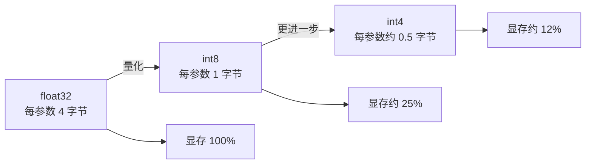

# 第 02 课　模型量化技术

上一课我们把模型搬进了部署环境，文件是落地了，可它实在太胖：动辄几个 GB 的参数全用高精度小数存着。这一课讲部署圈最常用的减肥术——量化。核心问题只有一个：**把每个数字的存储精度降低，到底换来什么、又付出什么？**

---

## 一、先看数字是怎么被"存贵"的

训练时，模型参数默认用 **float32** 存：每个数用 32 个比特（4 个字节）表示，精度很高。一个 70 亿参数的模型，光参数就要 70 亿 × 4 字节 ≈ 28 GB 显存——还没算推理时的其他开销，普通显卡根本放不下。

但注意一个反直觉的事实：训练时需要高精度，是因为参数要**一点点微调**，差之毫厘谬以千里；可推理时参数已经定死了，每个数只要"大致对"就行。就像绘画：打草稿时你需要精确的坐标纸，成稿之后别人隔着一步距离看，从 1600 万色压到 256 色的图片，肉眼几乎看不出差别。

量化干的就是这件事：**用更少的比特来存每个参数。**

位数砍到 1/4、1/8，显存跟着降到约 1/4、1/8；数据更小，搬运更快，计算也更便宜——**这就是量化的收益侧。**

## 二、手算一遍：float 是怎么变 int8 的

量化映射本身不神秘，一条小学算术就能算完。以对称量化为例，三步：

1. 找出这组参数里绝对值最大的那个，记作 max（比如 1.0）；
2. int8 能表示的整数范围是 -127 ~ 127，于是算出**缩放比例 scale = max / 127**；
3. 每个参数除以 scale 再四舍五入，就得到 int8 整数。

反量化（用的时候变回去）更简单：整数 × scale，就还原出一个近似的 float。因为四舍五入时丢掉了一点小数，还原回来的数和原数**不会完全相等**——这个差，就是量化的"代价"，术语叫量化误差。

配套的 `quantization_demo.py` 第 1 段（纯标准库）会带你把这套手算完整跑一遍：打印缩放比例、每个参数的量化前后对照、以及整体误差统计。你会亲眼看到：误差确实存在，但都很小；换成 int4（只用 -7~7 共 15 个整数格子）后，误差明显变大——**位宽越低越省，但误差越大，这就是本章主线的又一次交换。**

类比一下：int8 像一把只有厘米刻度的尺子，int4 像只有"半米一格"的尺子。量身高时厘米刻度够用，量戒指内径就会出问题——**选位宽，就是按用途选尺子的刻度。**

## 三、训练后量化：不动训练流程的减肥术

上面这套"拿到训练好的模型 → 直接降精度"，术语叫 **PTQ**（Post-Training Quantization，训练后量化）。它最受欢迎的原因是：完全不用重新训练，拿着别人发布的模型就能做，几分钟见效。

代价是模型自己没"适应过"变矮的刻度，位宽压得太低时效果会掉。更讲究的做法叫 QAT（量化感知训练）：训练时就故意让模型体验量化误差，练出"抗压缩体质"，效果好但成本高。本课聚焦 PTQ——它便宜、通用，是你最先该会的。

关于 2026 年的常见位宽，给你一张实用地图：

| 位宽 | 每参数字节 | 典型用途 |
|------|-----------|---------|
| float32 | 4 | 训练、精度基准 |
| float16 / bfloat16 | 2 | 半精度训练与推理的标配起点 |
| int8 | 1 | 通用部署量化，速度显存双收益 |
| int4 及更低 | 约 0.5 | 显存极度吃紧时，配合专门算法 |

注意这个趋势：业界一路从 32 位走向 16 位、8 位、4 位，新格式还在不断出现。**记住"更少比特 = 更省更快 = 误差风险更高"这条规律即可，具体格式名会一直变。**

## 四、配套演示怎么跑

`quantization_demo.py` 两段：

1. **纯标准库段**：手算 int8 量化 + 反量化 + 误差打印，再对比 int4，量化前后都做一次"推理"看输出差别。零依赖直接跑。
2. **torch 段**：真用 PyTorch 把一个层转成 int8 量化版本并跑推理对比。需要 `pip install torch`，没装会打印中文提示跳过。

重点看第 1 段输出的误差表：int8 的最大误差大概是多少、int4 掉到什么程度、整句输出有没有明显走样。以后你调量化参数时，判断依据就是眼前这张表。

## 想一想

1. 一张 40 GB 显存的卡，装 float32 的 70 亿参数模型很勉强；换 int8 后大约占多少？能不能腾出空间服务更多并发请求？
2. 量化误差在"权重数值分布很集中"和"数值有大有小差异悬殊"两种模型里，哪种更难办？提示：想一想 scale 是按最大绝对值算的。
3. 什么场景你会坚决不用 int4？请用"速度、显存、精度、成本"四个词组织你的理由。
4. 轻动手：运行 `quantization_demo.py`，把第 1 段里 scale 的计算改成"取次大值"或故意放大 2 倍，观察误差表怎么变化，想明白 scale 选大了和选小了各会发生什么。

## 小结

量化 = 用更少的比特存每个参数，float32 → int8 显存降到约四分之一，推理更快更省。
映射只有三步：找最大值、算 scale、除后取整；反量化乘回 scale，误差来自四舍五入。
PTQ 不用重新训练、拿来就能做，是部署首选的减肥术；位宽越低收益越大、误差风险也越大。
每一次降位宽都是一次交换：用一点精度，换显存、速度和成本。
模型瘦下来了，可让它跑得快的办法不止这一种——下一课看推理引擎在底层还藏了哪些加速招式。

2026 年 10 月
